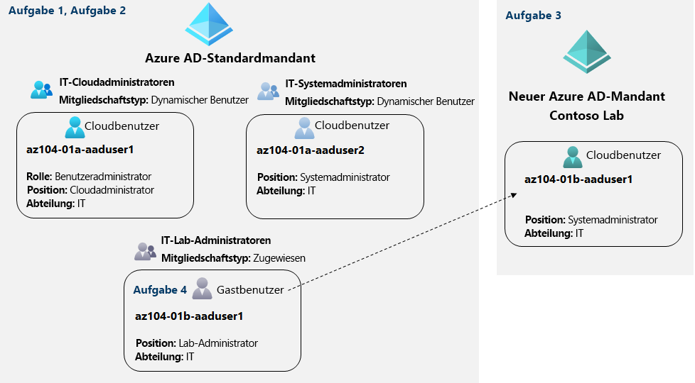

---
lab:
  title: 01 – Verwalten von Azure Directory-Identitäten
  module: Module 01 - Identity
ms.openlocfilehash: de59a0e8c7634ee756fc66301b90f73233a9cf8a
ms.sourcegitcommit: d3c9789a6f4761a9c69901b8aefdabb39769235c
ms.translationtype: HT
ms.contentlocale: de-DE
ms.lasthandoff: 05/10/2022
ms.locfileid: "144844252"
---
# Lab 01 – Verwalten von Azure Directory-Identitäten

# Lab-Handbuch für Kursteilnehmer

## Labszenario

Um Contoso-Benutzern die Authentifizierung mit Azure AD zu ermöglichen, wurden Sie mit der Bereitstellung von Benutzer- und Gruppenkonten beauftragt. Die Mitgliedschaft in den Gruppen soll automatisch auf Grundlage der Tätigkeitsbezeichnungen der Benutzer aktualisiert werden. Sie müssen außerdem einen Azure AD-Testmandanten mit einem Testbenutzerkonto erstellen und diesem Konto eingeschränkte Berechtigungen für Ressourcen im Contoso-Azure-Abonnement gewähren.

## Ziele

Dieses Lab deckt Folgendes ab:

+ Aufgabe 1: Erstellen und Konfigurieren von Azure AD-Benutzern
+ Aufgabe 2: Erstellen von Azure AD-Gruppen mit zugewiesener und dynamischer Mitgliedschaft
+ Aufgabe 3: Erstellen eines Azure Active Directory-Mandanten (Azure AD)
+ Aufgabe 4: Verwalten von Azure AD-Gastbenutzern 

## Geschätzte Zeit: 30 Minuten

## Architekturdiagramm

## Anweisungen

### Übung 1

#### Aufgabe 1: Erstellen und Konfigurieren von Azure AD-Benutzern

In dieser Aufgabe erstellen und konfigurieren Sie Azure AD-Benutzer.

>**Hinweis**: Wenn Sie zuvor die Testlizenz für Azure AD Premium auf diesem Azure AD-Mandanten verwendet haben, benötigen Sie einen neuen Azure AD-Mandanten und führen die Aufgabe 2 nach Aufgabe 3 in diesem neuen Azure AD-Mandanten aus.

1. Melden Sie sich beim [Azure-Portal](https://portal.azure.com) an.

1. Suchen Sie im Azure-Portal nach **Azure Active Directory**, und wählen Sie es aus.

1. Scrollen Sie auf dem Blatt „Azure Active Directory“ nach unten zum Abschnitt **Verwalten**, klicken Sie auf **Benutzereinstellungen**, und überprüfen Sie die verfügbaren Konfigurationsoptionen.

1. Klicken Sie auf dem Blatt „Azure Active Directory“ im Abschnitt **Verwalten** auf **Benutzer** und dann auf Ihr Benutzerkonto, um die Einstellungen für das zugehörige **Profil** anzuzeigen. 

1. Klicken Sie auf **Bearbeiten**, und legen Sie im Abschnitt **Einstellungen** den **Nutzungsstandort** auf **USA** fest. Klicken Sie dann auf **Speichern**, um die Änderung zu übernehmen.

    >**Hinweis**: Diese Änderung ist erforderlich, um Ihrem Benutzerkonto später in dieser Übung eine Azure AD Premium P2-Lizenz zuzuweisen.

1. Navigieren Sie zurück zum Blatt **Benutzer – Alle Benutzer**, und klicken Sie dann auf **+ Neuer Benutzer**.

1. Erstellen Sie einen neuen Benutzer mit den folgenden Einstellungen (übernehmen Sie für andere Einstellungen die Standardwerte):

    | Einstellung | Wert |
    | --- | --- |
    | Benutzername | **az104-01a-aaduser1** |
    | Name | **az104-01a-aaduser1** |
    | Kennwort selbst erstellen | enabled |
    | Erstes Kennwort | **Bereitstellen eines sicheren Kennworts** |
    | Verwendungsstandort | **USA** |
    | Berufsbezeichnung | **Cloudadministrator** |
    | Department | **IT** |

    >**Hinweis**: Kopieren Sie den vollständigen **Benutzerprinzipalnamen** (Benutzername plus Domäne) über **In Zwischenablage kopieren** in die Zwischenablage. Sie benötigen ihn später in dieser Aufgabe.

1. Klicken Sie in der Liste der Benutzer auf das neu erstellte Benutzerkonto, um das zugehörige Blatt anzuzeigen.

1. Überprüfen Sie die im Abschnitt **Verwalten** verfügbaren Optionen. Beachten Sie, dass Sie die dem Benutzerkonto zugewiesenen Azure AD-Rollen sowie die Berechtigungen des Benutzerkontos für Azure-Ressourcen identifizieren können.

1. Klicken Sie im Abschnitt **Verwalten** auf **Zugewiesene Rollen** und dann auf die Schaltfläche **+ Zuweisung hinzufügen**. Weisen Sie **az104-01a-aaduser1** die Rolle **Benutzeradministrator** zu.

    >**Hinweis**: Sie können Azure AD-Rollen auch bei der Bereitstellung eines neuen Benutzers zuweisen.

1. Öffnen Sie ein **InPrivate**-Browserfenster, und melden Sie sich beim [Azure-Portal](https://portal.azure.com) mit dem neu erstellten Benutzerkonto an. Wenn Sie aufgefordert werden, das Kennwort zu aktualisieren, ändern Sie es in ein sicheres Kennwort Ihrer Wahl. 

    >**Hinweis**: Anstatt den Benutzernamen (einschließlich des Domänennamens) einzugeben, können Sie den Inhalt der Zwischenablage einfügen.

1. Klicken Sie im Azure-Portal im **InPrivate**-Browserfenster auf **Azure Active Directory**.

    >**Hinweis**: Dieses Benutzerkonto kann zwar auf den Azure Active Directory-Mandanten zugreifen, hat aber keinen Zugriff auf Azure-Ressourcen. Dies ist das erwartete Verhalten, da ein solcher Zugriff mithilfe der rollenbasierten Azure-Zugriffssteuerung (Role-Based Access Control, RBAC) explizit gewährt werden muss. 

1. Scrollen Sie im **InPrivate**-Browserfenster auf dem Azure AD-Blatt nach unten zum Abschnitt **Verwalten**, und klicken Sie auf **Benutzereinstellungen**. Beachten Sie, dass Sie über keinerlei Berechtigungen zum Ändern von Konfigurationsoptionen verfügen.

1. Scrollen Sie im **InPrivate**-Browserfenster auf dem Azure AD-Blatt nach unten zum Abschnitt **Verwalten**, klicken Sie auf **Benutzer** und dann auf **+Neuer Benutzer**.

1. Erstellen Sie einen neuen Benutzer mit den folgenden Einstellungen (übernehmen Sie für andere Einstellungen die Standardwerte):

    | Einstellung | Wert |
    | --- | --- |
    | Benutzername | **az104-01a-aaduser2** |
    | Name | **az104-01a-aaduser2** |
    | Kennwort selbst erstellen | enabled |
    | Erstes Kennwort | **Bereitstellen eines sicheren Kennworts** |
    | Verwendungsstandort | **USA** |
    | Berufsbezeichnung | **Systemadministrator** |
    | Department | **IT** |

1. Melden Sie sich als Benutzer „az104-01a-aaduser1“ über das Azure-Portal an, und schließen Sie das InPrivate-Browserfenster.

#### Aufgabe 2: Erstellen von Azure AD-Gruppen mit zugewiesener und dynamischer Mitgliedschaft

In dieser Aufgabe erstellen Sie Azure Active Directory-Gruppen mit zugewiesener und dynamischer Mitgliedschaft.

1. Navigieren Sie im Azure-Portal, in dem Sie mit Ihrem **Benutzerkonto** angemeldet sind, zurück zum Blatt **Übersicht** für den Azure AD-Mandanten. Klicken Sie dann im Abschnitt **Verwalten** auf **Lizenzen**.

    >**Hinweis**: Für die Implementierung dynamischer Gruppen werden Azure AD Premium P1- oder P2-Lizenzen benötigt.

1. Klicken Sie im Bereich **Verwalten** auf **Alle Produkte**.

1. Klicken Sie auf **+ Testen/Kaufen**, und aktivieren Sie die kostenlose Testversion von Azure AD Premium P2.

1. Aktualisieren Sie das Browserfenster, um zu überprüfen, ob die Aktivierung erfolgreich war. 

 >**Hinweis:** Es kann bis zu 10 Minuten dauern, bis die Lizenzen aktiviert werden. Aktualisieren Sie die Seite weiter, bis sie angezeigt wird. Fahren Sie erst fort, nachdem die Lizenzen aktiviert wurden.

1. Wählen Sie auf dem Blatt **Lizenzen – Alle Produkte** den Eintrag **Azure Active Directory Premium P2**, und weisen Sie Ihrem Benutzerkonto und den beiden neu erstellten Benutzerkonten alle Lizenzoptionen von Azure AD Premium P2 zu.

1. Navigieren Sie im Azure-Portal zurück zum Blatt des Azure AD-Mandanten, und klicken Sie auf **Gruppen**.

1. Verwenden Sie die Schaltfläche **+ Neue Gruppe**, um eine neue Gruppe mit den folgenden Einstellungen zu erstellen:

    | Einstellung | Wert |
    | --- | --- |
    | Gruppentyp | **Sicherheit** |
    | Gruppenname | **IT-Cloudadministratoren** |
    | Gruppenbeschreibung | **IT-Cloudadministratoren von Contoso** |
    | Mitgliedschaftstyp | **Dynamischer Benutzer** |

    >**Hinweis**: Wenn die Dropdownliste **Mitgliedschaftstyp** abgeblendet dargestellt wird, warten Sie einige Minuten, und aktualisieren Sie die Browserseite.

1. Klicken Sie auf **Dynamische Abfrage hinzufügen**.

1. Erstellen Sie auf der Registerkarte **Regeln konfigurieren** des Blatts **Regeln für dynamische Mitgliedschaft** eine neue Regel mit den folgenden Einstellungen:

    | Einstellung | Wert |
    | --- | --- |
    | Eigenschaft | **jobTitle** |
    | Betreiber | **Ist gleich** |
    | Wert | **Cloudadministrator** |

1. Speichern Sie die Regel, indem Sie auf **+ Ausdruck hinzufügen** und anschließend auf **Speichern** klicken. Klicken Sie zurück auf dem Blatt **Neue Gruppe** auf **Erstellen**. 

1. Klicken Sie zurück auf dem Blatt **Gruppen – Alle Gruppen** des Azure AD-Mandanten auf die Schaltfläche **+ Neue Gruppe**, und erstellen Sie eine neue Gruppe mit den folgenden Einstellungen:

    | Einstellung | Wert |
    | --- | --- |
    | Gruppentyp | **Sicherheit** |
    | Gruppenname | **IT-Systemadministratoren** |
    | Gruppenbeschreibung | **IT-Systemadministratoren von Contoso** |
    | Mitgliedschaftstyp | **Dynamischer Benutzer** |

1. Klicken Sie auf **Dynamische Abfrage hinzufügen**.

1. Erstellen Sie auf der Registerkarte **Regeln konfigurieren** des Blatts **Regeln für dynamische Mitgliedschaft** eine neue Regel mit den folgenden Einstellungen:

    | Einstellung | Wert |
    | --- | --- |
    | Eigenschaft | **jobTitle** |
    | Betreiber | **Ist gleich** |
    | Wert | **Systemadministrator** |

1. Speichern Sie die Regel, indem Sie auf **+ Ausdruck hinzufügen** und anschließend auf **Speichern** klicken. Klicken Sie zurück auf dem Blatt **Neue Gruppe** auf **Erstellen**. 

1. Klicken Sie zurück auf dem Blatt **Gruppen – Alle Gruppen** des Azure AD-Mandanten auf die Schaltfläche **+ Neue Gruppe**, und erstellen Sie eine neue Gruppe mit den folgenden Einstellungen:

    | Einstellung | Wert |
    | --- | --- |
    | Gruppentyp | **Sicherheit** |
    | Gruppenname | **IT-Lab-Administratoren** |
    | Gruppenbeschreibung | **IT-Lab-Administratoren von Contoso** |
    | Mitgliedschaftstyp | **Zugewiesen** |
    
1. Klicken Sie auf **Keine Mitglieder ausgewählt**.

1. Suchen Sie auf dem Blatt **Mitglieder hinzufügen** die Gruppen **IT-Cloudadministratoren** und **IT-Systemadministratoren**, und klicken Sie dann auf dem Blatt **Neue Gruppe** auf **Erstellen**.

1. Klicken Sie zurück auf dem Blatt **Gruppen – Alle Gruppen** auf den Eintrag für die Gruppe **IT-Cloudadministratoren**, und zeigen Sie dann das zugehörige Blatt **Mitglieder** an. Überprüfen Sie, ob der Benutzer **az104-01a-aaduser1** in der Liste der Mitglieder angezeigt wird.

    >**Hinweis**: Es kann zu Verzögerungen bei der Aktualisierung der dynamischen Gruppenmitgliedschaften kommen. Um die Aktualisierung zu beschleunigen, navigieren Sie zum Blatt für die Gruppe und zeigen das Blatt **Dynamische Mitgliedschaftsregeln** an. **Bearbeiten** Sie dann die im Textfeld **Regelsyntax** aufgeführte Regel, indem Sie ein Leerzeichen am Ende hinzufügen, und **Speichern** Sie die Änderung.

1. Navigieren Sie zurück zum Blatt **Gruppen – Alle Gruppen**, klicken Sie auf den Eintrag für die Gruppe **IT-Systemadministratoren**, und zeigen Sie dann das zugehörige Blatt **Mitglieder** an. Überprüfen Sie, ob der Benutzer **az104-01a-aaduser2** in der Liste der Mitglieder angezeigt wird.

#### Aufgabe 3: Erstellen eines Azure Active Directory-Mandanten (Azure AD)

In dieser Aufgabe erstellen Sie einen neuen Azure AD-Mandanten.

1. Suchen Sie im Azure-Portal nach **Azure Active Directory**, und wählen Sie es aus.

1. Klicken Sie auf **Mandanten verwalten**, dann im nächsten Bildschirm auf **+ Erstellen**, und geben Sie die folgende Einstellung an:

    | Einstellung | Wert |
    | --- | --- |
    | Verzeichnistyp | **Azure Active Directory** |
    
1. Klicken Sie auf **Weiter: Konfiguration**.

    | Einstellung | Wert |
    | --- | --- |
    | Name der Organisation | **Contoso-Lab** |
    | Name der Anfangsdomäne | Ein beliebiger gültiger DNS-Name, der aus Kleinbuchstaben und Ziffern besteht und mit einem Buchstaben beginnt. | 
    | Land/Region | **USA** |

   > **Hinweis**: Der **Name der Anfangsdomäne** darf kein offizieller Name sein, der möglicherweise von Ihrer oder einer anderen Organisation verwendet wird. Das grüne Häkchen im Textfeld **Name der Anfangsdomäne** gibt an, dass der eingegebene Domänenname gültig und eindeutig ist.

1. Klicken Sie auf **Überprüfen + erstellen** und dann auf **Erstellen**.

1. Zeigen Sie das Blatt des neu erstellten Azure AD-Mandanten an, indem Sie auf den Link **Klicken Sie hier, um zu Ihrem neuen Mandanten zu navigieren: Contoso-Lab** oder auf die Schaltfläche **Verzeichnis + Abonnement** (direkt rechts neben der Schaltfläche „Cloud Shell“) in der Symbolleiste des Azure-Portals klicken.

#### Aufgabe 4: Verwalten von Azure AD-Gastbenutzern

In dieser Aufgabe erstellen Sie Azure AD-Gastbenutzer und gewähren ihnen Zugriff auf Ressourcen in einem Azure-Abonnement.

1. Klicken Sie im Azure-Portal, das den Azure AD-Mandanten „Contoso-Lab“ anzeigt, im Abschnitt **Verwalten** auf **Benutzer** und dann auf **+ Neuer Benutzer**.

1. Erstellen Sie einen neuen Benutzer mit den folgenden Einstellungen (übernehmen Sie für andere Einstellungen die Standardwerte):

    | Einstellung | Wert |
    | --- | --- |
    | Benutzername | **az104-01b-aaduser1** |
    | Name | **az104-01b-aaduser1** |
    | Kennwort selbst erstellen | enabled |
    | Erstes Kennwort | **Bereitstellen eines sicheren Kennworts** |
    | Berufsbezeichnung | **Systemadministrator** |
    | Department | **IT** |

1. Klicken Sie auf die das neu erstellte Profil.

    >**Hinweis**: Kopieren Sie den vollständigen **Benutzerprinzipalnamen** (Benutzername plus Domäne) über **In Zwischenablage kopieren** in die Zwischenablage. Sie benötigen ihn später in dieser Aufgabe.

1. Wechseln Sie zurück zu Ihrem Azure AD-Standardmandanten, indem Sie die Schaltfläche **Verzeichnis + Abonnement** (direkt rechts neben der Schaltfläche „Cloud Shell“) in der Symbolleiste des Azure-Portals verwenden.

1. Navigieren Sie zurück zum Blatt **Benutzer – Alle Benutzer**, und klicken Sie dann auf **+ Neuer Gastbenutzer**.

1. Laden Sie einen neuen Gastbenutzer mit den folgenden Einstellungen ein (übernehmen Sie für andere Einstellungen die Standardwerte):

    | Einstellung | Wert |
    | --- | --- |
    | Name | **az104-01b-aaduser1** |
    | E-Mail-Adresse | Der Benutzerprinzipalname, den Sie zu einem früheren Zeitpunkt in dieser Aufgabe kopiert haben |
    | Verwendungsstandort | **USA** |
    | Berufsbezeichnung | **Lab-Administrator** |
    | Department | **IT** |

1. Klicken Sie auf **Einladen**. 

1. Klicken Sie zurück auf dem Blatt **Benutzer – Alle Benutzer** auf den Eintrag, der das neu erstellte Gastbenutzerkonto repräsentiert.

1. Klicken Sie auf dem Blatt **az104-01b-aaduser1 – Profil** auf **Gruppen**.

1. Klicken Sie auf **+ Mitgliedschaft hinzufügen**, und fügen Sie das Gastbenutzerkonto der Gruppe **IT-Lab-Administratoren** hinzu.

#### Aufgabe 5: Bereinigen von Ressourcen

> **Hinweis**: Denken Sie daran, alle neu erstellten Azure-Ressourcen zu entfernen, die Sie nicht mehr verwenden. Durch das Entfernen nicht verwendeter Ressourcen wird sichergestellt, dass keine unerwarteten Kosten anfallen. Obwohl in diesem Fall keine zusätzlichen Kosten für Azure Active Directory-Mandanten und die zugehörigen Objekte anfallen, sollten Sie in Erwägung ziehen, die in diesem Lab erstellten Benutzerkonten, die Gruppenkonten und den Azure Active Directory-Mandanten zu entfernen.

 > **Hinweis**: Machen Sie sich keine Sorgen, wenn die Labressourcen nicht sofort entfernt werden können. Mitunter haben Ressourcen Abhängigkeiten, sodass der Löschvorgang länger dauert. Es gehört zu den üblichen Administratoraufgaben, die Ressourcennutzung zu überwachen. Überprüfen Sie also regelmäßig Ihre Ressourcen im Portal darauf, wie es um die Bereinigung bestellt ist. 

1. Suchen Sie im **Azure-Portal** mithilfe der Suchleiste nach **Azure Active Directory**. Wählen Sie in **Azure Active Directory** unter **Verwalten** die Option **Lizenzen** aus. Wählen Sie in **Lizenzen** unter **Verwalten** die Option **Alle Produkte** und dann in der Liste den Eintrag **Azure Active Directory Premium P2** aus. Fahren Sie fort, indem Sie **Lizenzierte Benutzer** auswählen. Wählen Sie die Benutzerkonten **az104-01a-aaduser1** und **az104-01a-aaduser2** aus, denen Sie in diesem Lab Lizenzen zugewiesen haben. Klicken Sie auf **Lizenz entfernen**, und bestätigen Sie den Vorgang bei Aufforderung durch Klicken auf **Ja**.

1. Navigieren Sie im Azure-Portal zum Blatt **Benutzer – Alle Benutzer**, und klicken Sie auf den Eintrag, der das Gastbenutzerkonto **az104-01b-aaduser1** repräsentiert. Klicken Sie auf dem Blatt **az104-01b-aaduser1 – Profil** auf **Löschen**, und bestätigen Sie den Vorgang bei Aufforderung durch Klicken auf **OK**.

1. Wiederholen Sie diese Schrittfolge, um die übrigen Benutzerkonten zu löschen, die Sie in diesem Lab erstellt haben.

1. Navigieren Sie im Azure-Portal zum Blatt **Benutzer – Alle Benutzer**, und wählen Sie die Gruppen aus, die Sie in diesem Lab erstellt haben. Klicken Sie auf **Löschen**, und bestätigen Sie den Vorgang bei Aufforderung durch Klicken auf **OK**.

1. Zeigen Sie im Azure-Portal das Blatt des Azure AD-Mandanten „Contoso-Lab“ an, indem Sie die Schaltfläche **Verzeichnis + Abonnement** (direkt rechts neben der Schaltfläche „Cloud Shell“) in der Symbolleiste des Azure-Portals verwenden.

1. Navigieren Sie zum Blatt **Benutzer – Alle Benutzer**, und klicken Sie auf den Eintrag, der das Benutzerkonto **az104-01b-aaduser1** repräsentiert. Klicken Sie auf dem Blatt **az104-01b-aaduser1 – Profil** auf **Löschen**, und bestätigen Sie den Vorgang bei Aufforderung durch Klicken auf **OK**.

1. Navigieren Sie zum Blatt **Contoso Lab – Übersicht** des Contoso Lab Azure AD-Mandanten, klicken Sie auf **Mandanten verwalten** , aktivieren Sie auf dem nächsten Bildschirm das Kontrollkästchen neben **Contoso Lab**, klicken Sie auf **Löschen**, dann auf dem Blatt **Mandant „Contoso Labs löschen“?** auf den Link **Berechtigung zum Löschen von Azure-Ressourcen anfordern**. Legen Sie auf dem Azure Active Directory-Blatt **Eigenschaften** die Option **Zugriffsverwaltung für Azure-Ressourcen** auf **Ja** fest, und klicken Sie auf **Speichern**.

1. Navigieren Sie zurück zum Blatt **Mandant „Contoso-Lab“ löschen**, und klicken Sie auf **Aktualisieren**, dann auf **Löschen**.

> **Hinweis:** Wenn es bei einem Mandanten eine Testlizenz gibt, müssten Sie bis zum Ablauf dieser Lizenz warten, bevor Sie den Mandanten löschen könnten. Dies würde keine zusätzlichen Kosten verursachen.

#### Überprüfung

In diesem Lab haben Sie die folgenden Aufgaben ausgeführt:

- Erstellen und Konfigurieren von Azure AD-Benutzern
- Erstellen von Azure AD-Gruppen mit zugewiesener und dynamischer Mitgliedschaft
- Erstellen eines Azure AD-Mandanten
- Verwalten von Azure AD-Gastbenutzern 
