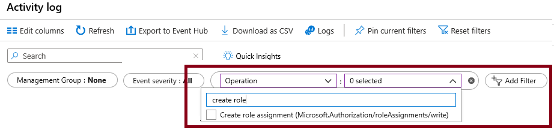

---
lab:
  title: 'Lab 02a: Verwalten von Abonnements und RBAC'
  module: Administer Governance and Compliance
---

# Lab 02a – Verwalten von Abonnements und RBAC

## Einführung in das Lab

In diesem Lab erfahren Sie mehr über die rollenbasierte Zugriffssteuerung. Sie erfahren, wie Sie Berechtigungen und Geltungsbereiche verwenden, um zu steuern, welche Aktionen Identitäten ausführen können und welche nicht. Außerdem erfahren Sie, wie Sie die Abonnementverwaltung mithilfe von Verwaltungsgruppen vereinfachen. 

Für dieses Lab wird ein Azure-Abonnement benötigt. Ihr Abonnementtyp kann sich auf die Verfügbarkeit von Features in diesem Lab auswirken. Sie können die Region ändern, aber in den Schritten wird die Region **USA, Osten** verwendet. 

## Geschätzte Zeit: 30 Minuten

## Labszenario

Um die Verwaltung von Azure-Ressourcen in Ihrer Organisation zu vereinfachen, wurden Sie mit der Implementierung der folgenden Funktionalitäten beauftragt:

- Erstellen einer Verwaltungsgruppe, die alle Ihre Azure-Abonnements enthält.

- Zuweisen von Berechtigungen zum Übermitteln von Supportanfragen für alle Abonnements in der Verwaltungsgruppe. Die Berechtigungen sollten beschränkt werden auf: 

    - Erstellen und Verwalten von virtuellen Computern
    - Erstellen von Supportanfragetickets (Hinzufügen von Azure-Anbietern nicht einschließen)

## Interaktive Labsimulationen

>**Hinweis**: Die zuvor bereitgestellten Laborsimulationen wurden eingestellt.

## Architekturdiagramm

## Stellenqualifikationen

+ Aufgabe 1: Implementieren von Verwaltungsgruppen.
+ Aufgabe 2: Überprüfen und Zuweisen einer integrierten Azure-Rolle.
+ Aufgabe 3: Erstellen einer benutzerdefinierten RBAC-Rolle.
+ Aufgabe 4: Überwachen von Rollenzuweisungen mit dem Aktivitätsprotokoll.

## Aufgabe 1: Implementieren von Verwaltungsgruppen

In dieser Aufgabe erstellen und konfigurieren Sie Verwaltungsgruppen. Verwaltungsgruppen werden verwendet, um Abonnements logisch zu organisieren und zu segmentieren. Sie ermöglichen es, RBAC und Azure Policy anderen Verwaltungsgruppen und Abonnements zuzuweisen und zu vererben. Wenn Ihre Organisation beispielsweise über ein dediziertes Supportteam für Europa verfügt, können Sie europäische Abonnements in einer Verwaltungsgruppe organisieren, um den Supportmitarbeitern Zugriff auf diese Abonnements zu ermöglichen (ohne individuellen Zugriff auf alle Abonnements zu bieten). In unserem Szenario muss jeder Mitarbeiter des Helpdesks eine Supportanfrage für alle Abonnements erstellen. 

1. Melden Sie sich beim **Azure-Portal** - `https://portal.azure.com` an.

1. Suchen Sie nach `Microsoft Entra ID`, und wählen Sie diese Option aus.

1. Wählen Sie im Blatt **Verwalten** die Option **Eigenschaften** aus.

1. Überprüfen Sie den Bereich **Zugriffsverwaltung für Azure-Ressourcen**. Stellen Sie sicher, dass Sie den Zugriff auf alle Azure-Abonnements und Verwaltungsgruppen in diesem Mandanten verwalten können.
   
1. Suchen Sie nach `Management groups`, und wählen Sie diese Option aus.

1. Klicken Sie auf dem Blatt **Verwaltungsgruppen** auf **+ Erstellen**.

1. Erstellen Sie eine Verwaltungsgruppe mit den folgenden Einstellungen. Wählen Sie **Übermitteln** aus, wenn Sie fertig sind. 

    | Einstellung | Wert |
    | --- | --- |
    | Verwaltungsgruppen-ID | `az104-mg1` (muss im Verzeichnis eindeutig sein) |
    | Anzeigename der Verwaltungsgruppe | `az104-mg1` |

1. **Aktualisieren Sie** die Verwaltungsgruppenseite, um sicherzustellen, dass Ihre neue Verwaltungsgruppe angezeigt wird. Dies kann einige Minuten dauern. 

   >**Hinweis:** Haben Sie die Stammverwaltungsgruppe bemerkt? Diese Stammverwaltungsgruppe ist in die Hierarchie integriert, sodass ihr alle Verwaltungsgruppen und Abonnements untergeordnet sind. Diese Stammverwaltungsgruppe ermöglicht das Anwenden von globalen Richtlinien und Azure-Rollenzuweisungen auf Verzeichnisebene. Nachdem Sie eine Verwaltungsgruppe erstellt haben, würden Sie alle Abonnements hinzufügen, die in der Gruppe enthalten sein sollen. 

## Aufgabe 2: Überprüfen und Zuweisen einer integrierten Azure-Rolle

In dieser Aufgabe werden Sie die integrierten Rollen überprüfen und die Rolle „VM-Mitwirkender“ einem Mitglied des Helpdesks zuweisen. Azure bietet eine große Anzahl [integrierter Rollen](https://learn.microsoft.com/azure/role-based-access-control/built-in-roles). 

1. Wählen Sie die Verwaltungsgruppe **az104-mg1** aus.

1. Wählen Sie das Blatt **Zugriffssteuerung (IAM)** und dann die Registerkarte **Rollen** aus.

1. Scrollen Sie durch die integrierten Rollendefinitionen, die verfügbar sind. **Zeigen Sie** eine Rolle an, um detaillierte Informationen zu **Berechtigungen**, **JSON**und **Zuweisungen** zu erhalten. Sie werden häufig *Besitzer*, *Mitwirkender*und *Leser* verwenden. 

1. Wählen Sie im Dropdownmenü **+Hinzufügen** aus, und wählen Sie **Rollenzuweisung hinzufügen** aus. 

1. Suchen Sie auf dem Blatt **Rollenzuweisung hinzufügen** nach **VM-Mitwirkender**, und wählen Sie dies aus. Mit der Rolle „Mitwirkender für virtuelle Computer“ können Sie virtuelle Computer verwalten, jedoch nicht auf deren Betriebssystem zugreifen oder das virtuelle Netzwerk und das Speicherkonto verwalten, mit denen sie verbunden sind. Dies ist eine gute Rolle für den Helpdesk. Wählen Sie **Weiter** aus.

    >**Schon gewusst?** In Azure war ursprünglich nur das **klassische** Bereitstellungsmodell verfügbar. Dies wurde durch das **Azure Resource Manager**-Bereitstellungsmodell ersetzt. Verwenden Sie als bewährte Methode keine klassischen Ressourcen. 

1. Wählen Sie in der Registerkarte **Mitglieder** die Option **+ Mitglieder auswählen** aus.

    >**Hinweis:** Im nächsten Schritt wird der **Helpdesk**-Gruppe die Rolle zugewiesen. Wenn Sie nicht über eine Helpdeskgruppe verfügen, nehmen Sie sich eine Minute Zeit, um sie zu erstellen.

1. Suchen Sie nach der `helpdesk`-Gruppe und wählen diese aus. Klicken Sie auf **Auswählen**. 

1. Klicken Sie zweimal auf **Überprüfen und zuweisen**, um die Rollenzuweisung zu erstellen.

1. Fahren Sie auf dem Blatt **Zugriffssteuerung (IAM)** fort. Bestätigen Sie auf der Registerkarte **Rollenzuweisungen**, dass die **Helpdesk**-Gruppe über die Rolle **VM-Mitwirkender** verfügt. 

    >**Hinweis:** Als bewährte Methode wird empfohlen, Rollen immer an Gruppen und nicht Personen zuzuweisen. 

    >**Schon gewusst?** Diese Zuweisung gewährt Ihnen möglicherweise keine zusätzlichen Rechte. Wenn Sie bereits über die Rolle „Besitzer“ verfügen, schließt diese Rolle alle Berechtigungen ein, die der Rolle „VM-Mitwirkender“ zugeordnet sind.
    
## Aufgabe 3: Definieren einer benutzerdefinierten RBAC-Rolle

In dieser Aufgabe werden Sie eine benutzerdefinierte RBAC-Rolle erstellen. Benutzerdefinierte Rollen sind ein wesentlicher Bestandteil der Implementierung des Prinzips der geringsten Rechte für eine Umgebung. Integrierte Rollen verfügen möglicherweise über zu viele Berechtigungen für Ihr Szenario. Wir werden auch eine neue Rolle erstellen und nicht benötigte Berechtigungen entfernen. Haben Sie einen Plan für die Verwaltung überlappender Berechtigungen?

1. Arbeiten Sie weiter an Ihrer Verwaltungsgruppe. Wechseln Sie zum Blatt **Zugriffssteuerung (IAM)**.

1. Wählen Sie **+ Hinzufügen** aus und wählen Sie dann aus dem Dropdownmenü **Benutzerdefinierte Rolle hinzufügen** aus.

1. Vervollständigen Sie auf der Registerkarte „Grundlagen“ die Konfiguration.

    | Einstellung | Wert |
    | --- | --- |
    | Name der benutzerdefinierten Rolle | `Custom Support Request` |
    | Beschreibung | `A custom contributor role for support requests.` |

1. Wählen Sie für **Baselineberechtigungen** die Option **Rolle klonen** aus. Wählen Sie im Dropdownmenü **Rolle zum Klonen** die Option **Mitwirkender für Supportanfragen** aus.

    

1. Wählen Sie **Weiter** aus, um zur Registerkarte **Berechtigungen** zu wechseln, und wählen Sie dann **+ Berechtigungen ausschließen** aus.

1. Geben Sie im Suchfeld „Ressourcenanbieter“ den Wert `.Support` ein und wählen **Microsoft.Support** aus.

1. Platzieren Sie in der Liste der Berechtigungen ein Kontrollkästchen neben **Sonstige: Registriert den Supportressourcenanbieter**, und wählen Sie dann **Hinzufügen** aus. Die Rolle sollte aktualisiert werden, um diese Berechtigung als *NotAction* einzuschließen.

    >**Hinweis:** Ein Azure-Ressourcenanbieter ist eine Menge von REST-Vorgängen, die Funktionalitäten für einen bestimmten Azure-Dienst aktivieren. Wir möchten nicht, dass der Helpdesk über diese Funktionalität verfügen kann, sodass sie aus der geklonten Rolle entfernt wird. 

1. Stellen Sie auf der Registerkarte **Zuweisbare Bereiche** sicher, dass Ihre Verwaltungsgruppe aufgeführt ist, und klicken Sie dann auf **Weiter**.

1. Überprüfen Sie den JSON-Code für die *Actions*, *NotActions* und*AssignableScopes*, die in der Rolle angepasst sind. 

1. Klicken Sie auf **Review + Create** (Überprüfen und erstellen) und dann auf **Create** (Erstellen).

    >**Hinweis:** An diesem Punkt haben Sie eine benutzerdefinierte Rolle erstellt und sie der Verwaltungsgruppe zugewiesen.  

## Aufgabe 4: Überwachen von Rollenzuweisungen mit dem Aktivitätsprotokoll

In dieser Aufgabe zeigen Sie das Aktivitätsprotokoll an, um zu ermitteln, ob jemand eine neue Rolle erstellt hat. 

1. Suchen Sie im Portal die Ressource **az104-mg1**, und wählen Sie **Aktivitätsprotokoll** aus. Das Aktivitätsprotokoll bietet Erkenntnisse zu Ereignissen auf Abonnementebene. 

1. Überprüfen Sie die Aktivitäten für Rollenzuweisungen. Das Aktivitätsprotokoll kann nach bestimmten Vorgängen gefiltert werden. 

    

## Bereinigen Ihrer Ressourcen

Wenn Sie mit **Ihrem eigenen Abonnement** arbeiten, nehmen Sie sich eine Minute Zeit, um die Labressourcen zu löschen. Dadurch wird sichergestellt, dass Ressourcen freigegeben und Kosten minimiert werden. Die einfachste Möglichkeit zum Löschen der Labressourcen besteht darin, die Ressourcengruppe des Labs zu löschen. 

+ Wählen Sie im Azure-Portal die Ressourcengruppe und dann **Ressourcengruppe löschen** aus, **geben Sie den Ressourcengruppennamen ein**, und klicken Sie dann auf **Löschen**.
+ Bei Verwendung von Azure PowerShell: `Remove-AzResourceGroup -Name resourceGroupName`.
+ Bei Verwendung der Befehlszeilenschnittstelle: `az group delete --name resourceGroupName`.
  
## Erweitern Ihrer Lernerfahrung mit Copilot

Copilot kann Sie beim Erlernen der Verwendung von Azure-Skripttools unterstützen. Copilot kann Sie auch in Bereichen unterstützen, die nicht im Lab behandelt werden oder in denen Sie weitere Informationen benötigen. Öffnen Sie einen Edge-Browser, und wählen Sie „Copilot“ (rechts oben) aus, oder navigieren Sie zu *copilot.microsoft.com*. Nehmen Sie sich einige Minuten Zeit, um diese Prompts auszuprobieren.
+ Erstelle zwei Tabellen, in denen wichtige PowerShell- und CLI-Befehle hervorgehoben werden, um Informationen zu Organisationsabonnements in Azure zu erhalten, und erläutere jeden Befehl in der Spalte „Erklärung“. 
+ Welches Format weist die Azure RBAC-JSON-Datei auf?
+ Welche grundlegenden Schritte müssen zum Erstellen einer benutzerdefinierten Azure RBAC-Rolle ausgeführt werden?
+ Was ist der Unterschied zwischen Azure RBAC-Rollen und Microsoft Entra ID-Rollen?

## Weiterlernen im eigenen Tempo

+ [Sichern Ihrer Azure-Ressourcen mit der rollenbasierten Zugriffssteuerung von Azure (Azure Role-Based Access Control, Azure RBAC)](https://learn.microsoft.com/training/modules/secure-azure-resources-with-rbac/). Verwenden Sie Azure RBAC zum Verwalten des Ressourcenzugriffs in Azure.
+ [Erstellen benutzerdefinierter Rollen für Azure-Ressourcen mit der rollenbasierten Zugriffssteuerung (Role-Based Access Control, RBAC)](https://learn.microsoft.com/training/modules/create-custom-azure-roles-with-rbac/). Hier erhalten Sie grundlegende Informationen zur Struktur der Rollendefinitionen für die Zugriffssteuerung. Ermitteln Sie die Rolleneigenschaften, die zur Definition Ihrer benutzerdefinierten Rollenberechtigungen verwendet werden. Erstellen Sie eine benutzerdefinierte Azure-Rolle, und weisen Sie sie einem Benutzer zu.

## Wichtige Erkenntnisse

Herzlichen Glückwunsch zum erfolgreichen Abschluss des Labs. Hier sind die wichtigsten Erkenntnisse für dieses Lab. 

+ Verwaltungsgruppen werden verwendet, um Abonnements logisch zu organisieren.
+ Die integrierte Stammverwaltungsgruppe umfasst alle Verwaltungsgruppen und Abonnements.
+ Azure verfügt über viele integrierte Rollen. Sie können diese Rollen zuweisen, um den Zugriff auf Ressourcen zu steuern.
+ Sie können neue Rollen erstellen oder vorhandene Rollen anpassen.
+ Rollen werden in einer JSON-formatierten Datei definiert und enthalten *Actions*, *NotActions*und *AssignableScopes*.
+ Sie können das Aktivitätsprotokoll verwenden, um Rollenzuweisungen zu überwachen.

