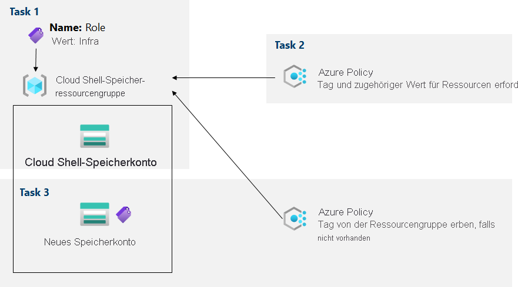

---
lab:
  title: 02b – Verwalten der Governance über eine Azure-Richtlinie
  module: Administer Governance and Compliance
---

# Lab 02b – Verwalten der Governance über eine Azure-Richtlinie
# Lab-Handbuch für Kursteilnehmer

## Labszenario

Um die Verwaltung der Azure-Ressourcen von Contoso zu verbessern, wurden Sie mit der Implementierung der folgenden Funktionalität beauftragt:

- Tagging von Ressourcengruppen, die ausschließlich Infrastrukturressourcen enthalten (z. B. Cloud Shell-Speicherkonten)

- Sicherstellen, dass nur ordnungsgemäß gekennzeichnete Infrastrukturressourcen zu Infrastrukturressourcengruppen hinzugefügt werden können

- Korrigieren nicht konformer Ressourcen

                **Hinweis:** Eine **[interaktive Labsimulation](https://mslabs.cloudguides.com/guides/AZ-104%20Exam%20Guide%20-%20Microsoft%20Azure%20Administrator%20Exercise%203)** ist verfügbar, mit der Sie dieses Lab in Ihrem eigenen Tempo durcharbeiten können. Möglicherweise liegen geringfügige Unterschiede zwischen der interaktiven Simulation und dem gehosteten Lab vor, aber die dargestellten Kernkonzepte und Ideen sind identisch. 

## Ziele

In diesem Lab werden folgende Aufgaben ausgeführt:

+ Aufgabe 1: Erstellen und Zuweisen von Tags über das Azure-Portal
+ Aufgabe 2: Erzwingen des Taggings mithilfe einer Azure-Richtlinie
+ Aufgabe 3: Anwenden des Taggings mithilfe einer Azure-Richtlinie

## Geschätzte Zeit: 30 Minuten

## Architekturdiagramm



### Anweisungen

## Übung 1

## Aufgabe 1: Zuweisen von Tags über das Azure-Portal

In dieser Aufgabe erstellen Sie ein Tag und weisen es über das Azure-Portal einer Azure-Ressourcengruppe zu.

1. Starten Sie im Azure-Portal im Bereich **Cloud Shell** eine **PowerShell**-Sitzung.

    >**Hinweis**: Wenn Sie **Cloud Shell** zum ersten Mal starten und die Meldung **Für Sie wurde kein Speicher bereitgestellt** angezeigt wird, wählen Sie das in diesem Lab verwendete Abonnement aus, und klicken Sie dann auf **Speicher erstellen**. 

1. Führen Sie in Cloud Shell folgenden Befehl aus, um den Namen des von Cloud Shell verwendeten Speicherkontos zu identifizieren:

   ```powershell
   df
   ```

1. Beachten Sie in der Ausgabe des Befehls den ersten Teil des vollqualifizierten Pfads, der das Cloud Shell-Basislaufwerk angibt (hier markiert als `xxxxxxxxxxxxxx`):

   ```
   //xxxxxxxxxxxxxx.file.core.windows.net/cloudshell   (..)  /usr/csuser/clouddrive
   ```

1. Suchen Sie im Azure-Portal nach der Option **Speicherkonten**, und wählen Sie sie aus. Klicken Sie anschließend in der Speicherkontenliste auf den Eintrag, der das Speicherkonto repräsentiert, das Sie im vorherigen Schritt identifiziert haben.

1. Klicken Sie auf dem Blatt „Speicherkonto“ auf den Link, der den Namen der Ressourcengruppe repräsentiert, die das Speicherkonto enthält.

    **Hinweis**: Notieren Sie sich den Namen der Ressourcengruppe, in der sich das Speicherkonto befindet. Sie benötigen den Namen später im Lab.

1. Klicken Sie auf dem Blatt der Ressourcengruppe im linken Menü auf **Tags**, und erstellen Sie ein neues Tag.

1. Erstellen Sie ein Tag mit den folgenden Einstellungen, und wenden Sie Ihre Änderung an:

    | Einstellung | Wert |
    | --- | --- |
    | Name | **Rolle** |
    | Wert | **Infra** |

1. Klicken Sie auf **Anwenden**, und schließen Sie das Tagbearbeitungsfenster, um zurück zum Speicherkontoblatt zu navigieren. Klicken Sie auf die Auslassungspunkte für das Speicherkonto, und wählen Sie **Tags bearbeiten** aus, um zu beachten, dass das neue Tag nicht automatisch dem Speicherkonto zugewiesen wurde. 

## Aufgabe 2: Erzwingen des Taggings mithilfe einer Azure-Richtlinie

In dieser Aufgabe weisen Sie der Ressourcengruppe die integrierte Richtlinie *Tag und zugehöriger Wert für Ressourcen erforderlich* zu und werten das Ergebnis aus. 

1. Suchen Sie im Azure-Portal nach der Option **Richtlinie**, und wählen Sie sie aus. 

1. Klicken Sie im Abschnitt **Erstellung** auf **Definitionen**. Nehmen Sie sich einen Moment Zeit, um die Liste der integrierten Richtliniendefinitionen zu durchsuchen, die Ihnen zur Verfügung stehen. Listen Sie alle integrierten Richtlinien zur Verwendung von Tags auf, indem Sie in der Dropdownliste **Kategorie** den Eintrag **Tags** auswählen (und die Auswahl alle anderen Einträge aufheben). 

1. Klicken Sie auf den Eintrag, der die integrierte Richtlinie **Tag und zugehöriger Wert für Ressourcen erforderlich** repräsentiert, und überprüfen Sie die zugehörige Definition.

1. Klicken Sie auf dem Blatt für die Definition der integrierten Richtlinie **Tag und zugehöriger Wert für Ressourcen erforderlich** auf **Zuweisen**.

1. Geben Sie den **Bereich** an, indem Sie auf die Schaltfläche mit den Auslassungspunkte klicken, und wählen Sie die folgenden Werte aus:

    | Einstellung | Wert |
    | --- | --- |
    | Subscription | Der Name des Azure-Abonnements, das Sie in diesem Lab verwenden. |
    | Ressourcengruppe | Der Name der Ressourcengruppe, in der sich das Cloud Shell-Konto befindet, das Sie in der vorherigen Aufgabe identifiziert haben. |

    >**Hinweis**: Ein Bereich bestimmt die Ressourcen oder Ressourcengruppen, in denen die Richtlinienzuweisung wirksam wird. Sie können Richtlinien auf Verwaltungsgruppen-, Abonnement- oder Ressourcengruppenebene zuweisen. Sie haben außerdem die Möglichkeit, Ausschlüsse anzugeben, z. B. einzelne Abonnements, Ressourcengruppen oder Ressourcen (je nach Zuweisungsbereich). 

1. Konfigurieren Sie auf dem Blatt **Grundlagen** die Eigenschaften der Zuweisung, indem Sie die folgenden Einstellungen angeben (übernehmen Sie für andere Einstellungen die Standardwerte):

    | Einstellung | Wert |
    | --- | --- |
    | Zuweisungsname | **Tag „Role“ mit Wert „Infra“ erforderlich**|
    | BESCHREIBUNG | **Anforderung eines Tags „Role“ mit dem Wert „Infra“ für alle Ressourcen in der Cloud Shell-Ressourcengruppe**|
    | Durchsetzung von Richtlinien | Aktiviert |

    >**Hinweis**: Der **Zuweisungsname** wird automatisch mit dem ausgewählten Richtliniennamen aufgefüllt, kann aber geändert werden. Geben Sie ggf. auch eine **Beschreibung** ein. **Zugewiesen von** wird basierend auf dem Benutzernamen, der die Zuweisung erstellt, automatisch aufgefüllt. 

1. Klicken Sie zweimal auf **Weiter**, und legen Sie die **Parameter** wie folgt fest:

    | Einstellung | Wert |
    | --- | --- |
    | Tag-Name | **Rolle** |
    | Tagwert | **Infra** |

1. Klicken Sie auf **Weiter**, und sehen Sie sich die Registerkarte **Korrektur** an. Lassen Sie das Kontrollkästchen **Verwaltete Identität erstellen** deaktiviert. 

    >**Hinweis**: Diese Einstellung kann verwendet werden, wenn die Richtlinie oder Initiative die Auswirkung **deployIfNotExists** oder **Modify** enthält.

1. Klicken Sie auf **Überprüfen + erstellen** und dann auf **Erstellen**.

    >**Hinweis**: Um sicherzustellen, dass die neue Richtlinienzuweisung wirksam ist, erstellen Sie nun ein weiteres Azure Storage-Konto in derselben Ressourcengruppe, ohne das erforderliche Tag explizit hinzuzufügen. 
    
    >**Hinweis**: Es kann zwischen 5 und 15 Minuten dauern, bis die Richtlinie wirksam wird.

1. Navigieren Sie zurück zum Blatt der Ressourcengruppe, die das Speicherkonto für das Cloud Shell-Basislaufwerk hostet, das Sie in der vorherigen Aufgabe identifiziert haben.

1. Klicken Sie auf dem Blatt „Ressourcengruppe“ auf **+ Erstellen**. Suchen Sie nach **Speicherkonto**, und klicken Sie auf **+ Erstellen**. 

1. Wechseln Sie zum Blatt **Speicherkonto erstellen**, und überprüfen Sie anhand der Registerkarte **Grundlagen**, dass Sie die Ressourcengruppe verwenden, auf die die Richtlinie angewendet wurde. Geben Sie anschließend die folgenden Einstellungen an (übernehmen Sie für andere Einstellungen die Standardwerte), klicken Sie auf **Überprüfen** und dann auf **Erstellen**:

    | Einstellung | Wert |
    | --- | --- |
    | Speicherkontoname | Eine beliebige weltweit eindeutige Kombination aus 3 bis 24 Kleinbuchstaben und Ziffern, beginnend mit einem Buchstaben. |

    >**Hinweis**: Möglicherweise wird der Fehler **Fehler bei der Überprüfung. Klicken Sie hier, um Details anzuzeigen.** angezeigt. Wenn dies der Fall ist, klicken Sie auf die Fehlermeldung, um den Grund für den Fehler anzuzeigen, und überspringen Sie den nächsten Schritt. 

1. Sobald Sie die Bereitstellung erstellt haben, sollte die Meldung **Fehler bei der Bereitstellung** in der Liste **Benachrichtigungen** des Portals angezeigt werden. Navigieren Sie über die Liste **Benachrichtigungen** zur Bereitstellungsübersicht, und klicken Sie auf die Meldung **Fehler bei der Bereitstellung. Klicken Sie hier, um Details anzuzeigen.** , um den Grund für den Fehler zu ermitteln. 

    >**Hinweis**: Überprüfen Sie, ob die Fehlermeldung darauf hinweist, dass die Ressourcenbereitstellung aufgrund einer Richtlinie nicht zugelassen wurde. 

    >**Hinweis**: Wenn Sie auf die Registerkarte **Unformatierte Fehlermeldung** klicken, werden weitere Einzelheiten zum Fehler angezeigt, darunter der Name der Rollendefinition **Tag „Role“ mit Wert „Infra“ erforderlich**. Die Bereitstellung war nicht erfolgreich, weil das zu erstellende Speicherkonto kein Tag mit dem Namen **Role** und dem Wert **Infra** enthielt.

## Aufgabe 3: Anwenden des Taggings mithilfe einer Azure-Richtlinie

In dieser Aufgabe wird eine andere Richtliniendefinition verwendet, um alle nicht konformen Ressourcen zu korrigieren. 

1. Suchen Sie im Azure-Portal nach der Option **Richtlinie**, und wählen Sie sie aus. 

1. Klicken Sie im Abschnitt **Erstellung** auf **Zuweisungen**. 

1. Klicken Sie in der Liste der Zuweisungen auf das Symbol mit den Auslassungspunkten in der Zeile, die die Richtlinienzuweisung **Tag „Role“ mit Wert „Infra“ erforderlich** darstellt. Verwenden Sie den Menüpunkt **Zuweisung löschen**, um die Zuweisung zu löschen.

1. Klicken Sie auf **Richtlinie zuweisen**, und geben Sie den **Bereich** an, indem Sie auf die Schaltfläche mit den Auslassungspunkte klicken. Wählen Sie die folgenden Werte aus:

    | Einstellung | Wert |
    | --- | --- |
    | Subscription | Der Name des Azure-Abonnements, das Sie in diesem Lab verwenden. |
    | Ressourcengruppe | Der Name der Ressourcengruppe, in der sich das Cloud Shell-Konto befindet, das Sie in der ersten Aufgabe identifiziert haben. |

1. Um die **Richtliniendefinition** festzulegen, klicken Sie auf die Schaltfläche mit den Auslassungspunkten und wählen dann **Tag von der Ressourcengruppe erben, falls nicht vorhanden** aus.

1. Konfigurieren Sie auf dem Blatt **Grundlagen** die übrigen Eigenschaften der Zuweisung, indem Sie die folgenden Einstellungen angeben (übernehmen Sie für andere Einstellungen die Standardwerte):

    | Einstellung | Wert |
    | --- | --- |
    | Zuweisungsname | **Role-Tag und zugehörigen Infra-Wert von der Cloud Shell-Ressourcengruppe erben, falls nicht vorhanden**|
    | BESCHREIBUNG | **Role-Tag und zugehörigen Infra-Wert von der Cloud Shell-Ressourcengruppe erben, falls nicht vorhanden**|
    | Durchsetzung von Richtlinien | Aktiviert |

1. Klicken Sie zweimal auf **Weiter**, und legen Sie die **Parameter** wie folgt fest:

    | Einstellung | Wert |
    | --- | --- |
    | Tag-Name | **Rolle** |

1. Klicken Sie auf **Weiter** und konfigurieren Sie auf der Registerkarte **Korrektur** die folgenden Einstellungen (übernehmen Sie für andere Einstellungen die Standardwerte):

    | Einstellung | Wert |
    | --- | --- |
    | Erstellen eines Wartungstask | enabled |
    | Zu korrigierende Richtlinie | **Tag von der Ressourcengruppe erben, falls nicht vorhanden** |

    >**Hinweis**: Diese Richtliniendefinition umfasst die Auswirkung **Modify**.

1. Klicken Sie auf **Überprüfen + erstellen** und dann auf **Erstellen**.

    >**Hinweis**: Um sicherzustellen, dass die neue Richtlinienzuweisung wirksam ist, erstellen Sie ein weiteres Azure Storage-Konto in derselben Ressourcengruppe, ohne das erforderliche Tag explizit hinzuzufügen. 
    
    >**Hinweis**: Es kann zwischen 5 und 15 Minuten dauern, bis die Richtlinie wirksam wird.

1. Navigieren Sie zurück zum Blatt der Ressourcengruppe, die das Speicherkonto für das Cloud Shell-Basislaufwerk hostet, das Sie in der ersten Aufgabe identifiziert haben.

1. Klicken Sie auf dem Blatt „Ressourcengruppe“ auf **+ Erstellen**. Suchen Sie nach **Speicherkonto**, und klicken Sie auf **+ Erstellen**. 

1. Wechseln Sie zum Blatt **Speicherkonto erstellen**, und überprüfen Sie anhand der Registerkarte **Grundlagen**, dass Sie die Ressourcengruppe verwenden, auf die die Richtlinie angewendet wurde. Geben Sie anschließend die folgenden Einstellungen an (übernehmen Sie für andere Einstellungen die Standardwerte), und klicken Sie auf **Überprüfen**:

    | Einstellung | Wert |
    | --- | --- |
    | Speicherkontoname | Eine beliebige weltweit eindeutige Kombination aus 3 bis 24 Kleinbuchstaben und Ziffern, beginnend mit einem Buchstaben. |

1. Vergewissern Sie sich, dass die Überprüfung dieses Mal erfolgreich war, und klicken Sie auf **Erstellen**.

1. Klicken Sie nach der Bereitstellung des neuen Speicherkontos auf die Schaltfläche **Zur Ressource wechseln**. Beachten Sie auf dem Blatt **Übersicht** des neu erstellte Speicherkontos, dass der Ressource automatisch das Tag **Role** mit dem Wert **Infra** zugewiesen wurde.

## Aufgabe 4: Bereinigen der Ressourcen

   >**Hinweis**: Denken Sie daran, alle neu erstellten Azure-Ressourcen zu entfernen, die Sie nicht mehr verwenden. Durch Entfernen ungenutzter Ressourcen wird sichergestellt, dass keine unerwarteten Gebühren anfallen. Beachten Sie jedoch, dass Azure-Richtlinien keine zusätzlichen Kosten verursachen.
   
   >**Hinweis**: Machen Sie sich keine Sorgen, wenn die Labressourcen nicht sofort entfernt werden können. Mitunter haben Ressourcen Abhängigkeiten, sodass der Löschvorgang länger dauert. Es gehört zu den üblichen Administratoraufgaben, die Ressourcennutzung zu überwachen. Überprüfen Sie also regelmäßig Ihre Ressourcen im Portal darauf, wie es um die Bereinigung bestellt ist. 

1. Suchen Sie im Portal nach der Option **Richtlinie**, und wählen Sie sie aus.

1. Klicken Sie im Abschnitt **Erstellen** auf **Zuweisungen**. Klicken Sie auf das Symbol mit den Auslassungspunkten rechts neben der Zuweisung, die Sie in der vorherigen Aufgabe erstellt haben, und klicken Sie auf **Zuweisung löschen**. 

1. Suchen Sie im Portal nach der Option **Speicherkonten**, und wählen Sie sie aus.

1. Wählen Sie in der Liste der Speicherkonten die Ressourcengruppe für das Speicherkonto aus, das Sie in der letzten Aufgabe dieses Labs erstellt haben. Wählen Sie **Tags** aus, und klicken Sie auf **Löschen** ( Papierkorbsymbol) rechts neben dem Tag **Role:Infra**. Klicken Sie dann auf **Anwenden**. 

1. Klicken Sie oben auf dem Blatt „Speicherkonto“ auf **Übersicht** und dann auf **Löschen**. Wenn Sie zur Bestätigung aufgefordert werden, geben Sie auf dem Blatt **Speicherkonto löschen** den Namen des zu bestätigenden Speicherkontos ein, und klicken Sie auf **Löschen**. 

## Überprüfung

In diesem Lab haben Sie die folgenden Aufgaben ausgeführt:

- Erstellen und Zuweisen von Tags über das Azure-Portal
- Erzwingen des Taggings mithilfe einer Azure-Richtlinie
- Anwenden des Taggings mithilfe einer Azure-Richtlinie
