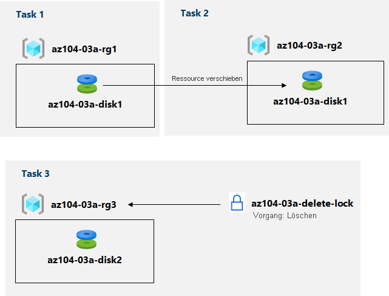

---
lab:
  title: 03a – Verwalten von Azure-Ressourcen über das Azure-Portal
  module: Module 03 - Azure Administration
---

# Übung 03a – Verwalten von Azure-Ressourcen über das Azure-Portal
# Lab-Handbuch für Kursteilnehmer

## Labszenario

You need to explore the basic Azure administration capabilities associated with provisioning resources and organizing them based on resource groups, including moving resources between resource groups. You also want to explore options for protecting disk resources from being accidentally deleted, while still allowing for modifying their performance characteristics and size.

## Ziele

In diesem Lab werden folgende Aufgaben ausgeführt:

+ Aufgabe 1: Erstellen von Ressourcengruppen und Bereitstellen von Ressourcen in Ressourcengruppen
+ Aufgabe 2: Verschieben von Ressourcen zwischen Ressourcengruppen
+ Aufgabe 3: Implementieren und Testen von Ressourcensperren

## Geschätzte Zeit: 20 Minuten

## Architekturdiagramm

## Anweisungen

### Übung 1

#### Aufgabe 1: Erstellen von Ressourcengruppen und Bereitstellen von Ressourcen in Ressourcengruppen

In dieser Aufgabe verwenden Sie das Azure-Portal, um Ressourcengruppen und einen Datenträger in der Ressourcengruppe zu erstellen.

1. Melden Sie sich am [**Azure-Portal**](http://portal.azure.com) an.

1. Suchen Sie im Azure-Portal nach **Datenträger**, wählen Sie diese Option aus. Klicken Sie auf **+ Erstellen**, und geben Sie die folgenden Einstellungen an:

    |Einstellung|Wert|
    |---|---|
    |Subscription| Der Name des Azure-Abonnements, in dem Sie die Ressourcengruppe erstellt haben |
    |Ressourcengruppe| Der Name einer neuen Ressourcengruppe **az104-03a-rg1** |
    |Name des Datenträgers| **az104-03a-disk1** |
    |Region| **(USA) USA, Osten** |
    |Verfügbarkeitszone| **None** |
    |Quellentyp| **None** |

    >**Hinweis**: Beim Erstellen einer Ressource haben Sie die Möglichkeit, eine neue Ressourcengruppe zu erstellen oder eine vorhandene zu verwenden.

1. Ändern Sie den Datenträgertyp und die Größe in **HDD Standard** bzw. **32 GiB**.

1. Klicken Sie auf **Überprüfen + erstellen** und dann auf **Erstellen**.

    ><bpt id="p1">**</bpt>Note<ept id="p1">**</ept>: Wait until the disk is created. This should take less than a minute.

#### Aufgabe 2: Verschieben von Ressourcen zwischen Ressourcengruppen 

In dieser Aufgabe verschieben wir die Datenträgerressource, die Sie in der vorherigen Aufgabe erstellt haben, in eine neue Ressourcengruppe. 

1. Suchen Sie nach **Ressourcengruppen**, und wählen Sie diese Option aus. 

1. Klicken Sie auf dem Blatt **Ressourcengruppen** auf den Eintrag der Ressourcengruppe **az104-03a-rg1**, die Sie in der vorherigen Aufgabe erstellt haben.

1. Wählen Sie auf dem Blatt **Übersicht** der Ressourcengruppe in der Liste der Ressourcengruppenressourcen den Eintrag aus, der den neu erstellten Datenträger darstellt, klicken Sie auf der Symbolleiste auf **Verschieben**, und wählen Sie in der Dropdownliste die Option **In eine andere Ressourcengruppe verschieben** aus.

    >**Hinweis**: Mit dieser Methode können Sie mehrere Ressourcen gleichzeitig verschieben. 

1. Below the <bpt id="p1">**</bpt>Resource group<ept id="p1">**</ept> text box, click <bpt id="p2">**</bpt>Create new<ept id="p2">**</ept> then type <bpt id="p3">**</bpt>az104-03a-rg2<ept id="p3">**</ept> in the text box. On the Review tab, select the checkbox <bpt id="p1">**</bpt>I understand that tools and scripts associated with moved resources will not work until I update them to use new resource IDs<ept id="p1">**</ept>, and click <bpt id="p2">**</bpt>Move<ept id="p2">**</ept>.

    ><bpt id="p1">**</bpt>Note<ept id="p1">**</ept>: Do not wait for the move to complete but instead proceed to the next task. The move might take about 10 minutes. You can determine that the operation was completed by monitoring activity log entries of the source or target resource group. Revisit this step once you complete the next task.

#### Aufgabe 3: Implementieren von Ressourcensperren

In dieser Aufgabe wenden Sie eine Ressourcensperre auf eine Azure-Ressourcengruppe an, die eine Datenträgerressource enthält.

1. Suchen Sie im Azure-Portal nach **Datenträger**, wählen Sie diese Option aus. Klicken Sie auf **+ Erstellen**, und geben Sie die folgenden Einstellungen an:

    |Einstellung|Wert|
    |---|---|
    |Subscription| Name des Abonnements, das Sie für dieses Lab verwenden |
    |Ressourcengruppe| Klicken Sie auf **Neue Ressourcengruppe erstellen**, und nennen Sie sie **az104-03a-rg3**. |
    |Name des Datenträgers| **az104-03a-disk2** |
    |Region| Der Name der Azure-Region, in der Sie die anderen Ressourcengruppen in diesem Lab erstellt haben |
    |Verfügbarkeitszone| **None** |
    |Quellentyp| **None** |

1. Legen Sie den Datenträgertyp und die Größe auf **HDD Standard** bzw. **32 GiB** fest.

1. Klicken Sie auf **Überprüfen + erstellen** und dann auf **Erstellen**.

1. Klicken Sie auf **Zu Ressource wechseln**.

1. Klicken Sie auf der Seite „Übersicht“ des Datenträgers auf den Namen der Ressourcengruppe, **az104-03a-rg3**.

1. Klicken Sie auf dem Blatt der Ressourcengruppe **az104-03a-rg3** auf **Sperren** und dann auf **+ Hinzufügen**, und geben Sie die folgenden Einstellungen an:

    |Einstellung|Wert|
    |---|---|
    |Sperrenname| **az104-03a-delete-lock** |
    |Sperrtyp| **Löschen** |
    
1. Klicken Sie auf **OK**    

1. Klicken Sie auf dem Blatt der Ressourcengruppe **az104-03a-rg3** auf **Übersicht**, wählen Sie in der Liste der Ressourcengruppenressourcen den Eintrag aus, der den zuvor in dieser Aufgabe erstellten Datenträger darstellt, und klicken Sie auf der Symbolleiste auf **Löschen.** 

1. Wenn die Meldung **Möchten Sie alle ausgewählten Ressourcen löschen?** angezeigt wird, geben Sie im Feld **Löschen bestätigen** das Wort **ja** ein, und klicken Sie auf **Löschen**.

1. Es sollte eine Fehlermeldung angezeigt werden, in der Sie über den fehlerhaften Löschvorgang benachrichtigt werden. 

    >**Hinweis**: Wie die Fehlermeldung besagt, handelt es sich um einen erwarteten Fehler aufgrund der Löschsperre auf Ressourcengruppenebene.

1. Kehren Sie zur Liste der Ressourcen in der Ressourcengruppe **az104-03a-rg3** zurück, und klicken Sie auf den Eintrag der Ressource **az104-03a-disk2**. 

1. On the <bpt id="p1">**</bpt>az104-03a-disk2<ept id="p1">**</ept> blade, in the <bpt id="p2">**</bpt>Settings<ept id="p2">**</ept> section, click <bpt id="p3">**</bpt>Size + performance<ept id="p3">**</ept>, set the disk type and size to <bpt id="p4">**</bpt>Premium SSD<ept id="p4">**</ept> and <bpt id="p5">**</bpt>64 GiB<ept id="p5">**</ept>, respectively, and click <bpt id="p6">**</bpt>Resize<ept id="p6">**</ept> to apply the change. Verify that the change was successful.

    >**Hinweis**: Dies entspricht den Erwartungen, weil die Sperre auf Ressourcengruppenebene nur für Löschvorgänge gilt. 

#### Bereinigen von Ressourcen

   >Sie möchten die grundlegenden Azure-Verwaltungsfunktionen erkunden, die mit der Bereitstellung von Ressourcen und der Strukturierung von Ressourcen in Ressourcengruppen verbunden sind, einschließlich des Verschiebens von Ressourcen zwischen Ressourcengruppen.

1. Navigieren Sie zum Blatt der Ressourcengruppe **az104-03a-rg3**, zeigen Sie das Blatt **Sperren** an, und entfernen Sie die Sperre **az104-03a-delete-lock**, indem Sie auf der rechten Seite des Sperreintrags **Löschen** auf den Link **Löschen** klicken.

#### Überprüfung

In diesem Lab haben Sie die folgenden Aufgaben ausgeführt:

- Erstellen von Ressourcengruppen und Bereitstellen von Ressourcen in Ressourcengruppen
- Verschieben von Ressourcen zwischen Ressourcengruppen
- Implementieren und Testen von Ressourcensperren
