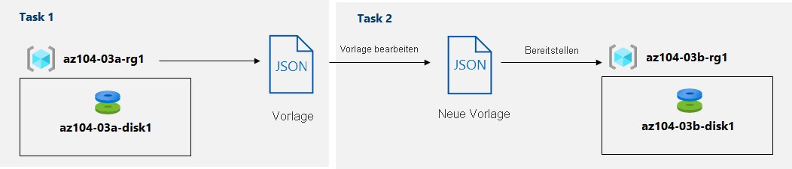

---
lab:
  title: 03b – Verwalten von Azure-Ressourcen mithilfe von ARM-Vorlagen
  module: Administer Azure Resources
---

# Lab 03b – Verwalten von Azure-Ressourcen mithilfe von ARM-Vorlagen
# Lab-Handbuch für Kursteilnehmer

## Labszenario
Nachdem Sie die grundlegenden Azure-Verwaltungsfunktionen im Zusammenhang mit der Bereitstellung von Ressourcen und deren Strukturierung basierend auf Ressourcengruppen mithilfe des Azure-Portals kennengelernt haben, führen Sie die entsprechenden Aufgaben jetzt mithilfe von Azure Resource Manager-Vorlagen aus.

                **Hinweis:** Eine **[interaktive Labsimulation](https://mslabs.cloudguides.com/guides/AZ-104%20Exam%20Guide%20-%20Microsoft%20Azure%20Administrator%20Exercise%205)** ist verfügbar, mit der Sie dieses Lab in Ihrem eigenen Tempo durcharbeiten können. Möglicherweise liegen geringfügige Unterschiede zwischen der interaktiven Simulation und dem gehosteten Lab vor, aber die dargestellten Kernkonzepte und Ideen sind identisch. 

## Ziele

Dieses Lab deckt Folgendes ab:

+ Aufgabe 1: Überprüfen einer ARM-Vorlage für die Bereitstellung eines verwalteten Azure-Datenträgers
+ Aufgabe 2: Erstellen eines verwalteten Azure-Datenträgers mithilfe einer ARM-Vorlage
+ Aufgabe 3: Überprüfen der auf einer ARM-Vorlage basierenden Bereitstellung eines verwalteten Azure-Datenträgers

## Geschätzte Zeit: 20 Minuten

## Architekturdiagramm



### Anweisungen

## Übung 1

## Aufgabe 1: Überprüfen einer ARM-Vorlage für die Bereitstellung eines verwalteten Azure-Datenträgers

1. Melden Sie sich am [**Azure-Portal**](http://portal.azure.com) an.

1. Suchen Sie im Azure-Portal nach **Ressourcengruppen**, und wählen Sie die entsprechende Option aus. 

1. Klicken Sie in der Liste der Ressourcengruppen auf **az104-03a-rg1**.

1. Klicken Sie auf dem Blatt der Ressourcengruppe **az104-03a-rg1** im Abschnitt **Einstellungen** auf **Bereitstellungen**.

1. Klicken Sie auf dem Blatt **az104-03a-rg1 – Bereitstellungen** auf den ersten Eintrag in der Liste der Bereitstellungen.

1. Klicken Sie auf dem Blatt **Microsoft.ManagedDisk-* XXXXXXXXX* \| Übersicht** auf **Vorlagen**.

    >**Hinweis**: Überprüfen Sie den Inhalt der Vorlage, und beachten Sie das Vorhandensein der Optionen **Herunterladen** zum Download auf den lokalen Computer, **Zu Bibliothek hinzuzufügen** oder **Bereitstellen** für eine erneute Bereitstellung.

1. Klicken Sie auf **Herunterladen**, und speichern Sie die komprimierte Datei mit den Vorlagen- und Parameterdateien im Ordner **Downloads** auf Ihrem Lab-Computer.

1. Klicken Sie auf dem Blatt **Microsoft.ManagedDisk-* XXXXXXXXX* \| Vorlage** auf **Eingaben**.

1. Beachten Sie den Wert des Parameters **location**. Sie werden dies in der nächsten Aufgabe benötigen.

1. Extrahieren Sie den Inhalt der heruntergeladenen Datei in den Ordner **Downloads** auf Ihrem Lab-Computer.

    >**Hinweis**: Diese Dateien stehen auch als **\\Allfiles\\Labs\\03\\az104-03b-md-template.json** und **\\Allfiles\\Labs\\03\\az104-03b-md-parameters.json** zur Verfügung.
    
1. Schließen Sie alle **Datei-Explorer**-Fenster.

## Aufgabe 2: Erstellen eines verwalteten Azure-Datenträgers mithilfe einer ARM-Vorlage

1. Suchen Sie im Azure-Portal nach **Benutzerdefinierte Vorlage bereitstellen**, und wählen Sie sie aus.

1. Klicken Sie auf dem Blatt **Benutzerdefinierte Bereitstellung** auf **Eigene Vorlage im Editor erstellen**.

1. Klicken Sie auf dem Blatt **Vorlage bearbeiten** auf **Datei laden**, und laden Sie die Datei **template.json** hoch, die Sie in der vorherigen Aufgabe heruntergeladen haben.

1. Entfernen Sie im Editorbereich die folgenden Zeilen:

   ```json
   "sourceResourceId": {
       "type": "String"
   },
   ```

   ```json
   "hyperVGeneration": {
       "defaultValue": "V1",
       "type": "String"
   },      
   ```

    >**Hinweis**: Diese Parameter werden entfernt, da sie auf die aktuelle Bereitstellung nicht anwendbar sind. Insbesondere die Parameter „sourceResourceId“, „sourceUri“, „osType“ und „hyperVGeneration“ gelten für die Erstellung eines Azure-Datenträgers aus einer vorhandenen VHD-Datei.

1. **Speichern** Sie die Änderungen.

1. Klicken Sie zurück auf dem Blatt **Benutzerdefinierte Bereitstellung** auf **Parameter bearbeiten**. 

1. Klicken Sie auf dem Blatt **Parameter bearbeiten** auf **Datei laden**, und laden Sie die Datei **parameters.json** hoch, die Sie in der vorherigen Aufgabe heruntergeladen haben. **Speichern** Sie anschließend die Änderungen.

1. Geben Sie auf dem Blatt **Benutzerdefinierte Bereitstellung** die folgenden Einstellungen an:

    | Einstellung | Wert |
    | --- |--- |
    | Subscription | *Der Name des in diesem Lab verwendeten Azure-Abonnements* |
    | Ressourcengruppe | Der Name einer **neuen** Ressourcengruppe **az104-03b-rg1** |
    | Region | Der Name einer beliebigen Azure-Region, die in dem für dieses Lab verwendeten Abonnement verfügbar ist |
    | Datenträgername | **az104-03b-disk1** |
    | Location | Der Wert des Parameters „location“, den Sie sich in der vorherigen Aufgabe notiert haben |
    | Sku | **Standard_LRS** |
    | Datenträgergröße (GB) | **32** |
    | Erstellungsoption | **empty** |
    | Typ des Datenträgerverschlüsselungssatzes | **EncryptionAtRestWithPlatformKey** |
    | Netzwerkzugriffsrichtlinie | **AllowAll** |

1. Wählen Sie **Überprüfen + erstellen** und anschließend **Erstellen** aus.

1. Überprüfen Sie, ob die Bereitstellung erfolgreich abgeschlossen wurde.

## Aufgabe 3: Überprüfen der auf einer ARM-Vorlage basierenden Bereitstellung eines verwalteten Azure-Datenträgers

1. Suchen Sie im Azure-Portal nach **Ressourcengruppen**, und wählen Sie die entsprechende Option aus. 

1. Klicken Sie in der Liste der Ressourcengruppen auf **az104-03b-rg1**.

1. Klicken Sie auf dem Blatt der Ressourcengruppe **az104-03b-rg1** im Abschnitt **Einstellungen** auf **Bereitstellungen**.

1. Klicken Sie auf dem Blatt **az104-03b-rg1 – Bereitstellungen** auf den ersten Eintrag in der Liste der Bereitstellungen, und überprüfen Sie den Inhalt der Blätter **Eingabe** und **Vorlage**.

## Bereinigen von Ressourcen

   >**Hinweis**: Löschen Sie keine Ressourcen, die Sie in diesem Lab bereitgestellt haben. Sie werden im nächsten Lab dieses Moduls darauf verweisen.

## Überprüfung

In diesem Lab haben Sie die folgenden Aufgaben ausgeführt:

- Überprüfen einer ARM-Vorlage für die Bereitstellung eines verwalteten Azure-Datenträgers
- Erstellen eines verwalteten Azure-Datenträgers mithilfe einer ARM-Vorlage
- Überprüfen der auf einer ARM-Vorlage basierenden Bereitstellung eines verwalteten Azure-Datenträgers
