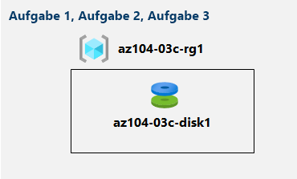

---
lab:
  title: 'Lab 03c: Verwalten von Azure-Ressourcen mithilfe von Azure PowerShell'
  module: Administer Azure Resources
---

# Lab 03c – Verwalten von Azure-Ressourcen mithilfe von Azure PowerShell
# Lab-Handbuch für Kursteilnehmer

## Labszenario

Nachdem Sie die grundlegenden Azure-Verwaltungsfunktionen im Zusammenhang mit der Bereitstellung von Ressourcen und deren Strukturierung in Ressourcengruppen kennengelernt und mithilfe des Azure-Portals und anhand von Azure Resource Manager-Vorlagen ausgeführt haben, führen Sie die entsprechende Aufgabe jetzt mithilfe von Azure PowerShell durch. Damit Sie die Azure PowerShell-Module nicht installieren müssen, verwenden Sie die in Azure Cloud Shell verfügbare PowerShell-Umgebung.

                **Hinweis:** Eine **[interaktive Labsimulation](https://mslabs.cloudguides.com/guides/AZ-104%20Exam%20Guide%20-%20Microsoft%20Azure%20Administrator%20Exercise%206)** ist verfügbar, mit der Sie dieses Lab in Ihrem eigenen Tempo durcharbeiten können. Möglicherweise liegen geringfügige Unterschiede zwischen der interaktiven Simulation und dem gehosteten Lab vor, aber die dargestellten Kernkonzepte und Ideen sind identisch. 

## Ziele

Dieses Lab deckt Folgendes ab:

+ Aufgabe 1: Starten einer PowerShell-Sitzung in Azure Cloud Shell
+ Aufgabe 2: Erstellen einer Ressourcengruppe und eines verwalteten Azure-Datenträgers mithilfe von Azure PowerShell
+ Aufgabe 3: Konfigurieren des verwalteten Datenträgers mithilfe von Azure PowerShell

## Geschätzte Zeit: 20 Minuten

## Architekturdiagramm



### Anweisungen

> **Hinweis:**  Erstellen Sie immer Ihr eigenes sicheres Kennwort für alle virtuellen Computer oder Benutzerkonten, die Sie erstellen. Wenn der virtuelle Computer für Sie erstellt wurde, wählen Sie im Portal **Kennwort zurücksetzen** aus, um das Kennwort zu ändern. 

## Übung 1

## Aufgabe 1: Starten einer PowerShell-Sitzung in Azure Cloud Shell

In dieser Aufgabe öffnen Sie eine PowerShell-Sitzung in Cloud Shell. 

1. Öffnen Sie **Azure Cloud Shell** im Portal, indem Sie oben rechts im Azure-Portal auf das entsprechende Symbol klicken.

1. Wenn Sie aufgefordert werden, entweder **Bash** oder **PowerShell** auszuwählen, wählen Sie **PowerShell** aus. 

    >**Hinweis**: Wenn Sie **Cloud Shell** zum ersten Mal starten und die Meldung **Für Sie wurde kein Speicher bereitgestellt** angezeigt wird, wählen Sie das in diesem Lab verwendete Abonnement aus, und klicken Sie dann auf **Speicher erstellen**. 

1. Wenn Sie dazu aufgefordert werden, klicken Sie auf **Speicher erstellen**, und warten Sie, bis der Azure Cloud Shell-Bereich angezeigt wird. 

1. Stellen Sie sicher, dass **PowerShell** im Dropdownmenü oben links im Cloud Shell-Bereich angezeigt wird.

## Aufgabe 2: Erstellen einer Ressourcengruppe und eines verwalteten Azure-Datenträgers mithilfe von Azure PowerShell

In dieser Aufgabe erstellen Sie eine Ressourcengruppe und einen verwalteten Azure-Datenträger, indem Sie eine Azure PowerShell-Sitzung in Cloud Shell verwenden.

1. Um eine Ressourcengruppe in derselben Azure-Region zu erstellen, in der sich auch die im vorherigen Lab erstellte Ressourcengruppe **az104-03b-rg1** befindet, führen Sie in der PowerShell-Sitzung in Cloud Shell Folgendes aus:

   ```powershell
   $location = (Get-AzResourceGroup -Name az104-03b-rg1).Location

   $rgName = 'az104-03c-rg1'

   New-AzResourceGroup -Name $rgName -Location $location
   ```
1. Um Eigenschaften der neu erstellten Ressourcengruppe abzurufen, führen Sie folgenden Befehl aus:

   ```powershell
   Get-AzResourceGroup -Name $rgName
   ```
1. Um einen neuen verwalteten Datenträger mit denselben Merkmalen zu erstellen, die Sie in den vorherigen Labs dieses Moduls für Datenträger verwendet haben, führen Sie Folgendes aus:

   ```powershell
   $diskConfig = New-AzDiskConfig `
    -Location $location `
    -CreateOption Empty `
    -DiskSizeGB 32 `
    -Sku Standard_LRS

   $diskName = 'az104-03c-disk1'

   New-AzDisk `
    -ResourceGroupName $rgName `
    -DiskName $diskName `
    -Disk $diskConfig
   ```

1. Um Eigenschaften des neu erstellten Datenträgers abzurufen, führen Sie folgenden Befehl aus:

   ```powershell
   Get-AzDisk -ResourceGroupName $rgName -Name $diskName
   ```

## Aufgabe 3: Konfigurieren des verwalteten Datenträgers mithilfe von Azure PowerShell

In dieser Aufgabe verwalten Sie die Konfiguration des verwalteten Azure-Datenträgers mithilfe einer Azure PowerShell-Sitzung in Cloud Shell. 

1. Um die Größe des verwalteten Azure-Datenträgers auf **64 GB** zu erhöhen, führen Sie in der PowerShell-Sitzung in Cloud Shell den folgenden Befehl aus:

   ```powershell
   New-AzDiskUpdateConfig -DiskSizeGB 64 | Update-AzDisk -ResourceGroupName $rgName -DiskName $diskName
   ```

1. Um die Wirksamkeit der Änderung zu überprüfen, führen Sie folgenden Befehl aus:

   ```powershell
   Get-AzDisk -ResourceGroupName $rgName -Name $diskName
   ```

1. Führen Sie Folgendes aus, um die aktuelle SKU als **Standard_LRS** zu überprüfen:

   ```powershell
   (Get-AzDisk -ResourceGroupName $rgName -Name $diskName).Sku
   ```

1. Um die SKU für die Datenträgerleistung in **Premium_LRS** zu ändern, führen Sie in der PowerShell-Sitzung in Cloud Shell den folgenden Befehl aus:

   ```powershell
   New-AzDiskUpdateConfig -Sku Premium_LRS | Update-AzDisk -ResourceGroupName $rgName -DiskName $diskName
   ```

1. Um die Wirksamkeit der Änderung zu überprüfen, führen Sie folgenden Befehl aus:

   ```powershell
   (Get-AzDisk -ResourceGroupName $rgName -Name $diskName).Sku
   ```

## Bereinigen von Ressourcen

   >**Hinweis**: Löschen Sie keine Ressourcen, die Sie in diesem Lab bereitgestellt haben. Sie werden im nächsten Lab dieses Moduls darauf verweisen.

## Überprüfung

In diesem Lab haben Sie die folgenden Aufgaben ausgeführt:

- Starten einer PowerShell-Sitzung in Azure Cloud Shell
- Erstellen einer Ressourcengruppe und eines verwalteten Azure-Datenträgers mithilfe von Azure PowerShell
- Konfigurieren des verwalteten Datenträgers mithilfe von Azure PowerShell
