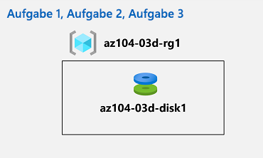

---
lab:
  title: 'Lab 03d: Verwalten von Azure-Ressourcen mithilfe der Azure-Befehlszeilenschnittstelle (optional)'
  module: Administer Azure Resources
---

# Lab 03d – Verwalten von Azure-Ressourcen mithilfe der Azure CLI
# Lab-Handbuch für Kursteilnehmer

## Labszenario

Nachdem Sie die grundlegenden Azure-Verwaltungsfunktionen im Zusammenhang mit der Bereitstellung von Ressourcen und deren Strukturierung in Ressourcengruppen kennengelernt und mithilfe des Azure-Portals, anhand von Azure Resource Manager-Vorlagen sowie über die Azure PowerShell ausgeführt haben, führen Sie die entsprechende Aufgabe jetzt mithilfe der Azure CLI durch. Damit Sie die Azure CLI nicht installieren müssen, verwenden Sie die in Azure Cloud Shell verfügbare Bash-Umgebung.

**Hinweis:** Eine **[interaktive Labsimulation](https://mslabs.cloudguides.com/guides/AZ-104%20Exam%20Guide%20-%20Microsoft%20Azure%20Administrator%20Exercise%207)** ist verfügbar, mit der Sie dieses Lab in Ihrem eigenen Tempo durcharbeiten können. Möglicherweise liegen geringfügige Unterschiede zwischen der interaktiven Simulation und dem gehosteten Lab vor, aber die dargestellten Kernkonzepte und Ideen sind identisch. 

## Ziele

Dieses Lab deckt Folgendes ab:

+ Aufgabe 1: Starten einer Bash-Sitzung in Azure Cloud Shell
+ Aufgabe 2: Erstellen einer Ressourcengruppe und eines verwalteten Azure-Datenträgers mithilfe der Azure CLI
+ Aufgabe 3: Konfigurieren des verwalteten Datenträgers mithilfe der Azure CLI

## Geschätzte Zeit: 20 Minuten

## Architekturdiagramm



### Anweisungen

## Übung 1

## Aufgabe 1: Starten einer Bash-Sitzung in Azure Cloud Shell

In dieser Aufgabe öffnen Sie eine Bash-Sitzung in Cloud Shell. 

1. Öffnen Sie **Azure Cloud Shell** im Portal, indem Sie oben rechts im Azure-Portal auf das entsprechende Symbol klicken.

1. Wählen Sie bei Aufforderung zur Auswahl von **Bash** oder **PowerShell** die Option **Bash** aus. 

    >**Hinweis**: Wenn Sie **Cloud Shell** zum ersten Mal starten und die Meldung **Für Sie wurde kein Speicher bereitgestellt** angezeigt wird, wählen Sie das in diesem Lab verwendete Abonnement aus, und klicken Sie dann auf **Speicher erstellen**. 

1. Wenn Sie dazu aufgefordert werden, klicken Sie auf **Speicher erstellen**, und warten Sie, bis der Azure Cloud Shell-Bereich angezeigt wird. 

1. Stellen Sie sicher, dass **Bash** im Dropdownmenü oben links im Cloud Shell-Bereich angezeigt wird.

## Aufgabe 2: Erstellen einer Ressourcengruppe und eines verwalteten Azure-Datenträgers mithilfe der Azure CLI

In dieser Aufgabe erstellen Sie eine Ressourcengruppe und einen verwalteten Azure-Datenträger, indem Sie eine Azure CLI-Sitzung in Cloud Shell verwenden.

1. Um eine Ressourcengruppe in derselben Azure-Region zu erstellen, in der sich auch die im vorherigen Lab erstellte Ressourcengruppe **az104-03c-rg1** befindet, führen Sie in der Bash-Sitzung in Cloud Shell Folgendes aus:

   ```sh
   LOCATION=$(az group show --name 'az104-03c-rg1' --query location --out tsv)

   RGNAME='az104-03d-rg1'

   az group create --name $RGNAME --location $LOCATION
   ```
1. Um Eigenschaften der neu erstellten Ressourcengruppe abzurufen, führen Sie folgenden Befehl aus:

   ```sh
   az group show --name $RGNAME
   ```
1. Um einen neuen verwalteten Datenträger mit denselben Merkmalen zu erstellen, die Sie in den vorherigen Labs dieses Moduls für Datenträger verwendet haben, führen Sie in der Bash-Sitzung in Cloud Shell Folgendes aus:

   ```sh
   DISKNAME='az104-03d-disk1'

   az disk create \
   --resource-group $RGNAME \
   --name $DISKNAME \
   --sku 'Standard_LRS' \
   --size-gb 32
   ```
    >**Hinweis**: Stellen Sie bei Verwendung einer mehrzeiligen Syntax sicher, dass jede Zeile mit einem umgekehrten Schrägstrich (`\`) ohne nachstehende Leerzeichen endet und dass die Zeilen nicht mit Leerzeichen beginnen.

1. Um Eigenschaften des neu erstellten Datenträgers abzurufen, führen Sie folgenden Befehl aus:

   ```sh
   az disk show --resource-group $RGNAME --name $DISKNAME
   ```

## Aufgabe 3: Konfigurieren des verwalteten Datenträgers mithilfe der Azure CLI

In dieser Aufgabe verwalten Sie die Konfiguration des verwalteten Azure-Datenträgers mithilfe einer Azure CLI-Sitzung in Cloud Shell. 

1. Um die Größe des verwalteten Azure-Datenträgers auf **64 GB** zu erhöhen, führen Sie in der Bash-Sitzung in Cloud Shell den folgenden Befehl aus:

   ```sh
   az disk update --resource-group $RGNAME --name $DISKNAME --size-gb 64
   ```

1. Um die Wirksamkeit der Änderung zu überprüfen, führen Sie folgenden Befehl aus:

   ```sh
   az disk show --resource-group $RGNAME --name $DISKNAME --query diskSizeGB
   ```

1. Um die SKU für die Datenträgerleistung in **Premium_LRS** zu ändern, führen Sie in der Bash-Sitzung in Cloud Shell den folgenden Befehl aus:

   ```sh
   az disk update --resource-group $RGNAME --name $DISKNAME --sku 'Premium_LRS'
   ```

1. Um die Wirksamkeit der Änderung zu überprüfen, führen Sie folgenden Befehl aus:

   ```sh
   az disk show --resource-group $RGNAME --name $DISKNAME --query sku
   ```

## Bereinigen von Ressourcen

 > **Hinweis**: Denken Sie daran, alle neu erstellten Azure-Ressourcen zu entfernen, die Sie nicht mehr verwenden. Durch das Entfernen nicht verwendeter Ressourcen wird sichergestellt, dass keine unerwarteten Kosten anfallen.

 > **Hinweis**: Machen Sie sich keine Sorgen, wenn die Labressourcen nicht sofort entfernt werden können. Mitunter haben Ressourcen Abhängigkeiten, sodass der Löschvorgang lange dauert. Es gehört zu den üblichen Administratoraufgaben, die Ressourcennutzung zu überwachen. Überprüfen Sie also regelmäßig Ihre Ressourcen im Portal darauf, wie es um die Bereinigung bestellt ist. 

1. Öffnen Sie im Azure-Portal im **Cloud Shell**-Bereich die **Bash**-Sitzung.

1. Listen Sie alle Ressourcengruppen auf, die während der Labs in diesem Modul erstellt wurden, indem Sie den folgenden Befehl ausführen:

   ```sh
   az group list --query "[?starts_with(name,'az104-03')].name" --output tsv
   ```

1. Löschen Sie alle Ressourcengruppen, die Sie während der praktischen Übungen in diesem Modul erstellt haben, indem Sie den folgenden Befehl ausführen:

   ```sh
   az group list --query "[?starts_with(name,'az104-03')].[name]" --output tsv | xargs -L1 bash -c 'az group delete --name $0 --no-wait --yes'
   ```

    >**Hinweis**: Der Befehl wird (dem --nowait-Parameter entsprechend) asynchron ausgeführt. Dies bedeutet, dass Sie zwar einen weiteren Azure CLI-Befehl in derselben Bash-Sitzung direkt im Anschluss ausführen können, es jedoch einige Minuten dauert, bis die Ressourcengruppen tatsächlich entfernt werden.

## Überprüfung

In diesem Lab haben Sie die folgenden Aufgaben ausgeführt:

- Starten einer Bash-Sitzung in Azure Cloud Shell
- Erstellen einer Ressourcengruppe und eines verwalteten Azure-Datenträgers mithilfe der Azure CLI
- Konfigurieren des verwalteten Datenträgers mithilfe der Azure CLI
