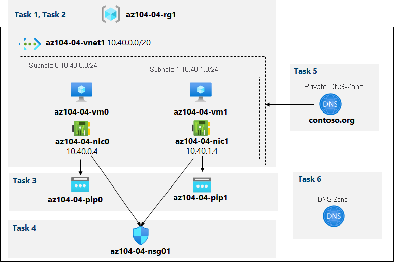

---
lab:
  title: 'Lab 04: Implementieren von virtuellen Netzwerken'
  module: Administer Virtual Networking
---

# Lab 04: Implementieren von virtuellen Netzwerken

# Lab-Handbuch für Kursteilnehmer

## Labszenario

Sie müssen die Funktionen virtueller Azure-Netzwerke untersuchen. Zunächst möchten Sie ein virtuelles Netzwerk in Azure erstellen, das einige Azure-VMs hostet. Da Sie netzwerkbasierte Segmentierung implementieren möchten, stellen Sie sie in verschiedenen Subnetzen des virtuellen Netzwerks bereit. Sie möchten auch sicherstellen, dass sich ihre privaten und öffentlichen IP-Adressen im Laufe der Zeit nicht ändern. Um die Sicherheitsanforderungen von Contoso zu erfüllen, müssen Sie öffentliche Endpunkte von Azure-VMs schützen, auf die über das Internet zugegriffen werden kann. Schließlich müssen Sie DNS-Namensauflösung für Azure-VMs sowohl innerhalb des virtuellen Netzwerks als auch aus dem Internet implementieren.

                **Hinweis:** Eine **[interaktive Labsimulation](https://mslabs.cloudguides.com/guides/AZ-104%20Exam%20Guide%20-%20Microsoft%20Azure%20Administrator%20Exercise%208)** ist verfügbar, mit der Sie dieses Lab in Ihrem eigenen Tempo durcharbeiten können. Möglicherweise liegen geringfügige Unterschiede zwischen der interaktiven Simulation und dem gehosteten Lab vor, aber die dargestellten Kernkonzepte und Ideen sind identisch. 

## Ziele

Dieses Lab deckt Folgendes ab:

+ Aufgabe 1: Erstellen und Konfigurieren eines virtuellen Netzwerks
+ Aufgabe 2: Bereitstellen von VMs in virtuellen Netzwerken
+ Aufgabe 3: Konfigurieren privater und öffentlicher IP-Adressen von Azure-VMs
+ Aufgabe 4: Konfigurieren von Netzwerksicherheitsgruppen
+ Aufgabe 5: Konfigurieren von Azure DNS für interne Namensauflösung
+ Aufgabe 6: Konfigurieren von Azure DNS für externe Namensauflösung

## Geschätzte Zeitdauer: 40 Minuten

## Architekturdiagramm



### Anweisungen

## Übung 1

## Aufgabe 1: Erstellen und Konfigurieren eines virtuellen Netzwerks

In dieser Aufgabe erstellen Sie ein virtuelles Netzwerk mit mehreren Subnetzen, indem Sie das Azure-Portal verwenden.

1. Melden Sie sich beim [Azure-Portal](https://portal.azure.com) an.

1. Suchen Sie im Azure-Portal nach **Virtuelle Netzwerke**, und wählen Sie diese Option aus. Klicken Sie dann auf dem Blatt **Virtuelle Netzwerke** auf **+ Erstellen**.

1. Erstellen Sie ein virtuelles Netzwerk mit den folgenden Einstellungen (übernehmen Sie für andere Einstellungen die Standardwerte):

    | Einstellung | Wert |
    | --- | --- |
    | Subscription | Der Name des Azure-Abonnements, das Sie in diesem Lab verwenden. |
    | Ressourcengruppe | Der Name einer **neuen** Ressourcengruppe **az104-04-rg1**. |
    | Name | **az104-04-vnet1** |
    | Region | Der Name einer beliebigen Azure-Region, die in dem Abonnement verfügbar ist, das Sie in diesem Lab verwenden. |

1. Klicken Sie auf **Weiter: IP-Adressen**. Die **Startadresse** ist **10.40.0.0**. Die **Adressraumgröße** ist **/20**. Klicken Sie unbedingt auf **Hinzufügen**. 

1. Klicken Sie auf **+ Subnetz hinzufügen**, geben Sie die folgenden Werte ein, und klicken Sie dann auf **Hinzufügen**.

    | Einstellung | Wert |
    | --- | --- |
    | Subnetzname | **subnet0** |
    | Startadresse | **10.40.0.0** |
    | Subnetzgröße | **/24 (256 Adressen)** |

1. Übernehmen Sie die Standardwerte, und klicken Sie auf **Überprüfen und erstellen**. Führen Sie die Überprüfung aus, und klicken Sie erneut auf **Erstellen**, um Ihre Bereitstellung zu übermitteln.

    >**Hinweis**: Warten Sie, bis das virtuelle Netzwerk bereitgestellt wird. Das sollte weniger als eine Minute dauern.

1. Klicken Sie auf **Zu Ressource wechseln**.

1. Klicken Sie auf dem Blatt **az104-04-vnet1** des virtuellen Netzwerks auf **Subnetze** und dann auf **+ Subnetz**.

1. Erstellen Sie ein Subnetz mit den folgenden Einstellungen (übernehmen Sie für andere Einstellungen die Standardwerte):

    | Einstellung | Wert |
    | --- | --- |
    | Name | **subnet1** |
    | Adressbereich (CIDR-Block) | **10.40.1.0/24** |
    | Netzwerksicherheitsgruppe | **None** |
    | Routingtabelle | **None** |

1. Klicken Sie unten auf der Seite auf **Speichern**.

## Aufgabe 2: Bereitstellen von VMs in virtuellen Netzwerken

In dieser Aufgabe stellen Sie Azure-VMs mithilfe einer ARM-Vorlage in verschiedenen Subnetzen des virtuellen Netzwerks bereit.

1. Öffnen Sie **Azure Cloud Shell** im Azure-Portal, indem Sie auf das Symbol oben rechts im Azure-Portal klicken.

1. Wenn Sie aufgefordert werden, entweder **Bash** oder **PowerShell** auszuwählen, wählen Sie **PowerShell** aus.

    >**Hinweis**: Wenn Sie **Cloud Shell** zum ersten Mal starten und die Meldung **Für Sie wurde kein Speicher bereitgestellt** angezeigt wird, wählen Sie das Abonnement aus, das Sie in diesem Lab verwenden, und klicken Sie dann auf **Speicher erstellen**.

1. Klicken Sie in der Symbolleiste des Cloud Shell-Bereichs auf das Symbol **Dateien hochladen/herunterladen** und im Dropdownmenü auf **Hochladen**. Laden Sie **\\Allfiles\\Labs\\04\\az104-04-vms-loop-template.json** und **\\Allfiles\\Labs\\04\\az104-04-vms-loop-parameters.json** in das Basisverzeichnis von Cloud Shell hoch.

    >**Hinweis**: Sie müssen jede Datei separat hochladen. Verwenden Sie nach dem Hochladen den Befehl **dir**, um sich zu vergewissern, dass beide Dateien erfolgreich hochgeladen wurden.

1. Führen Sie im Bereich „Cloud Shell“ Folgendes aus, um zwei VMs mithilfe der Vorlagen- und Parameterdateien bereitzustellen:
    >**Hinweis**: Sie werden aufgefordert, ein Administratorkennwort anzugeben.
    
   ```powershell
   $rgName = 'az104-04-rg1'

   New-AzResourceGroupDeployment `
      -ResourceGroupName $rgName `
      -TemplateFile $HOME/az104-04-vms-loop-template.json `
      -TemplateParameterFile $HOME/az104-04-vms-loop-parameters.json
   ```
   
    >**Hinweis**: Diese Methode zum Bereitstellen von ARM-Vorlagen verwendet Azure PowerShell. Sie können dieselbe Aufgabe ausführen, indem Sie den entsprechenden Azure CLI-Befehl **az deployment create** ausführen (weitere Informationen finden Sie unter [Bereitstellen von Ressourcen mit Resource Manager-Vorlagen und der Azure CLI](https://docs.microsoft.com/en-us/azure/azure-resource-manager/templates/deploy-cli)).

    >**Hinweis**: Warten Sie, bis die Bereitstellung abgeschlossen ist, bevor Sie mit der nächsten Aufgabe fortfahren. Dieser Vorgang dauert etwa zwei Minuten.

    >**Hinweis:** Wenn Sie einen Fehler erhalten haben, der besagt, dass die VM-Größe nicht verfügbar ist, bitten Sie Ihren Kursleiter um Hilfe, und versuchen Sie diese Schritte:
    > 1. Klicken Sie in Ihrer Cloud Shell-Instanz auf die Schaltfläche `{}`. Wählen Sie auf der linken Randleiste die Datei **az104-04-vms-loop-parameters.json** aus, und notieren Sie sich den Wert des Parameters `vmSize`.
    > 1. Überprüfen Sie den Speicherort, an dem die Ressourcengruppe az104-04-rg1 bereitgestellt wird. Sie können `az group show -n az104-04-rg1 --query location` in Ihrer Cloud Shell-Instanz ausführen, um ihn abzurufen.
    > 1. Führen Sie `az vm list-skus --location <Replace with your location> -o table --query "[? contains(name,'Standard_D2s')].name"` in Ihrer Cloud Shell-Instanz aus. Wenn keine aufgelisteten SKUs vorhanden sind (d. h. es gibt keine Ergebnisse), können Sie keine virtuellen D2S-Computer in dieser Region bereitstellen. Sie müssen eine Region finden, in der Sie virtuelle D2S-Computer bereitstellen können. Sobald Sie einen geeigneten Standort ausgewählt haben, löschen Sie die Ressourcengruppe AZ104-04-rg1, und starten Sie das Lab neu.
    > 1. Ersetzen Sie den Wert des Parameters `vmSize` durch einen der Werte, die vom zuletzt ausgeführten Befehl zurückgegeben wurden.
    > 1. Stellen Sie nun Ihre Vorlagen erneut bereit, indem Sie den Befehl `New-AzResourceGroupDeployment` erneut ausführen. Sie können mehrmals die Schaltfläche „Nach oben“ klicken, um den zuletzt ausgeführten Befehl einzublenden.

1. Schließen Sie den Cloud Shell-Bereich.

#### Aufgabe 3: Konfigurieren privater und öffentlicher IP-Adressen von Azure-VMs

In dieser Aufgabe konfigurieren Sie die statische Zuweisung öffentlicher und privater IP-Adressen, die Netzwerkschnittstellen von Azure-VMs zugewiesen sind.

   >**Hinweis**: Private und öffentliche IP-Adressen werden tatsächlich den Netzwerkschnittstellen zugewiesen, die wiederum an Azure-VMs angefügt sind. Es ist jedoch üblich, stattdessen auf IP-Adressen zu verweisen, die Azure-VMs zugewiesen sind.

   >**Hinweis**: Sie benötigen **zwei** öffentliche IP-Adressen, um dieses Lab abzuschließen. 

1. Suchen Sie im Azure-Portal nach **Öffentlichen IP-Adressen**, und wählen Sie sie aus, und wählen Sie dann **+ Erstellen** aus.

1. Stellen Sie sicher, dass die **Ressourcengruppe** **az104-04-rg1** lautet.

1. Stellen Sie in den **Konfigurationsdetails** sicher, dass der **Name** **az104-04-pip0** lautet.

1. Wählen Sie **Überprüfen und erstellen** und dann **Erstellen** aus.

1. Suchen Sie im Azure-Portal nach **Öffentlichen IP-Adressen**, und wählen Sie sie aus, und wählen Sie dann **+ Erstellen** aus.

1. Stellen Sie sicher, dass die **Ressourcengruppe** **az104-04-rg1** lautet.

1. Stellen Sie in den **Konfigurationsdetails** sicher, dass der **Name** **az104-04-pip1** lautet.

1. Wählen Sie **Überprüfen und erstellen** und dann **Erstellen** aus.

1. Suchen Sie im Azure-Portal nach **Ressourcengruppen**, und klicken Sie auf dem Blatt **Ressourcengruppen** auf **az104-04-rg1**.

1. Klicken Sie auf dem Ressourcengruppenblatt **az104-04-rg1** in der Liste der zugehörigen Ressourcen auf **az104-04-vnet1**.

1. Überprüfen Sie auf dem Blatt **az104-04-vnet1** des virtuellen Netzwerks den Abschnitt **Verbundene Geräte**, und überprüfen Sie, ob zwei Netzwerkschnittstellen (**az104-04-nic0** und **az104-04-nic1**) an das virtuelle Netzwerk angefügt sind.

1. Klicken Sie auf **az104-04-nic0** und auf dem Blatt **az104-04-nic0** auf **IP-Konfigurationen**.

    >**Hinweis**: Überprüfen Sie, ob **ipconfig1** derzeit mit einer dynamischen privaten IP-Adresse eingerichtet ist.

1. Klicken Sie in der Liste der IP-Konfigurationen auf **ipconfig1**.

1. Stellen Sie sicher, dass die **Zuteilung** **statisch** ist.

1. Wählen Sie **Öffentliche IP-Adresse zuordnen** und dann in der Dropdownliste **Öffentliche IP-Adresse** **az104-04-pip0** aus.

1. Wählen Sie **Speichern** aus.

1. Navigieren Sie zurück zum Blatt **az104-04-vnet1**.

1. Klicken Sie auf **az104-04-nic1** und auf dem Blatt von **az104-04-nic1** auf **IP-Konfigurationen**.

    >**Hinweis**: Überprüfen Sie, ob **ipconfig1** derzeit mit einer dynamischen privaten IP-Adresse eingerichtet ist.

1. Klicken Sie in der Liste der IP-Konfigurationen auf **ipconfig1**.

1. Stellen Sie sicher, dass die **Zuteilung** **statisch** ist.

1. Wählen Sie **Öffentliche IP-Adresse zuordnen** und dann in der Dropdownliste **Öffentliche IP-Adresse** **az104-04-pip1** aus.

1. Wählen Sie **Speichern** aus.
   
1. Navigieren Sie zurück zum Blatt der Ressourcengruppe **az104-04-rg1**. Klicken Sie in der Liste der zugehörigen Ressourcen auf **az104-04-vm0**, und notieren Sie sich aus dem Blatt der VM **az104-04-vm0** den Eintrag für die öffentliche IP-Adresse.

1. Navigieren Sie zurück zum Blatt der Ressourcengruppe **az104-04-rg1**. Klicken Sie in der Liste der zugehörigen Ressourcen auf **az104-04-vm1**, und notieren Sie sich aus dem Blatt der VM **az104-04-vm1** den Eintrag für die öffentliche IP-Adresse.

    >**Hinweis**: Sie benötigen beide IP-Adressen in der letzten Aufgabe dieses Labs.

## Aufgabe 4: Konfigurieren von Netzwerksicherheitsgruppen

In dieser Aufgabe konfigurieren Sie Netzwerksicherheitsgruppen, um eingeschränkte Konnektivität mit Azure-VMs zu ermöglichen.

1. Navigieren Sie im Azure-Portal zurück zum Blatt der Ressourcengruppe **az104-04-rg1**, und klicken Sie in der Liste der zugehörigen Ressourcen auf **az104-04-vm0**.

1. Klicken Sie auf dem Übersichtsblatt von **az104-04-vm0** auf **Verbinden**, klicken Sie im Dropdownmenü auf **RDP**, klicken Sie auf dem Blatt **Verbinden mit RDP** auf **RDP-Datei herunterladen** unter Verwendung der öffentlichen IP-Adresse, und befolgen Sie die Anweisungen, um die Remotedesktopsitzung zu starten.

1. Beachten Sie, dass der Verbindungsversuch fehlschlägt.

    >**Hinweis**: Dies ist zu erwarten, da öffentliche IP-Adressen der Standard-SKU standardmäßig erfordern, dass die Netzwerkschnittstellen, denen sie zugewiesen sind, durch eine Netzwerksicherheitsgruppe geschützt sind. Um Remotedesktopverbindungen zuzulassen, erstellen Sie eine Netzwerksicherheitsgruppe, die eingehenden RDP-Datenverkehr aus dem Internet explizit zulässt, und weisen sie Netzwerkschnittstellen beider VMs zu.

1. Beenden Sie die die VMs **az104-04-vm0** und **az104-04-vm1**.

    >**Hinweis:** Dieser Schritt dient der Zweckmäßigkeit für dieses Lab. Wenn die virtuellen Computer ausgeführt werden, wenn eine Netzwerksicherheitsgruppe an ihre Netzwerkschnittstelle angefügt ist, kann es mehr als 30 Minuten dauern, bis die Verbindung wirksam wird. Nachdem die Netzwerksicherheitsgruppe erstellt und angefügt wurde, werden die virtuellen Computer neu gestartet, und die Verbindung wird sofort wirksam.

1. Suchen Sie im Azure-Portal nach **Netzwerksicherheitsgruppen**, und wählen Sie sie aus, und klicken Sie dann auf dem Blatt **Netzwerksicherheitsgruppen** auf **+ Erstellen**.

1. Erstellen Sie eine Netzwerksicherheitsgruppe mit den folgenden Einstellungen (übernehmen Sie für andere Einstellungen die Standardwerte):

    | Einstellung | Wert |
    | --- | --- |
    | Subscription | Der Name des Azure-Abonnements, das Sie in diesem Lab verwenden. |
    | Ressourcengruppe | **az104-04-rg1** |
    | Name | **az104-04-nsg01** |
    | Region | Der Name der Azure-Region, in der Sie alle anderen Ressourcen in diesem Lab bereitgestellt haben. |

1. Klicken Sie auf **Überprüfen und erstellen**. Führen Sie die Überprüfung aus, und klicken Sie auf **Erstellen**, um Ihre Bereitstellung zu übermitteln.

    >**Hinweis**: Warten Sie, bis die Bereitstellung abgeschlossen ist. Dieser Vorgang dauert etwa zwei Minuten.

1. Klicken Sie auf dem Blatt „Bereitstellung“ auf **Zu Ressource** wechseln, um das Blatt für die Netzwerksicherheitsgruppe **az104-04-nsg01** zu öffnen.

1. Klicken Sie auf dem Blatt der Netzwerksicherheitsgruppe **az104-04-nsg01** im Abschnitt **Einstellungen** auf **Eingangssicherheitsregeln**.

1. Fügen Sie eine Eingangsregel mit den folgenden Einstellungen hinzu (übernehmen Sie für andere Einstellungen die Standardwerte):

    | Einstellung | Wert |
    | --- | --- |
    | `Source` | **Alle** |
    | Source port ranges | * |
    | Destination | **Alle** |
    | Dienst | **RDP** |
    | Aktion | **Zulassen** |
    | Priorität | **300** |
    | Name | **AllowRDPInBound** |

1. Klicken Sie auf dem Blatt der Netzwerksicherheitsgruppe **az104-04-nsg01** im Abschnitt **Einstellungen** auf **Netzwerkschnittstellen**, und klicken Sie dann auf **+ Verknüpfen**.

1. Verknüpfen Sie die Netzwerksicherheitsgruppe **az104-04-nsg01** mit den **Netzwerkschnittstellen az104-04-nic0** und **az104-04-nic1**.

    >**Hinweis**: Es kann bis zu fünf Minuten dauern, bis die Regeln aus der neu erstellten Netzwerksicherheitsgruppe auf die Netzwerkschnittstellenkarte angewendet werden.

1. Starten Sie die die VMs **az104-04-vm0** und **az104-04-vm1**.

1. Navigieren Sie zurück zum Blatt der VM **az104-04-vm0**.

    >**Hinweis**: In den folgenden Schritten überprüfen Sie, ob Sie sich erfolgreich mit der Ziel-VM verbinden können.

1. Klicken Sie auf dem Blatt von **az104-04-vm0** auf **Verbinden**, klicken Sie auf **RDP**, klicken Sie auf dem Blatt **Verbinden mit RDP** auf **RDP-Datei herunterladen** unter Verwendung der öffentlichen IP-Adresse, und befolgen Sie die Anweisungen, um die Remotedesktopsitzung zu starten.

    >**Hinweis**: Dieser Schritt bezieht sich auf das Herstellen einer Verbindung über Remotedesktop von einem Windows-Computer aus. Auf einem Mac können Sie einen Remotedesktopclient aus dem Mac App Store verwenden. Auf Linux-Computern können Sie Open-Source-RDP-Clientsoftware verwenden.

    >**Hinweis**: Sie können Warnungseingabeaufforderungen ignorieren, wenn Sie eine Verbindung mit den Ziel-VMs herstellen.

1. Wenn Sie dazu aufgefordert werden, melden Sie sich mit dem Benutzernamen und Kennwort in der Parameterdatei an.

    >**Hinweis**: Lassen Sie die Remotedesktopsitzung geöffnet. Sie werden dies in der nächsten Aufgabe benötigen.

#### Aufgabe 5: Konfigurieren von Azure DNS für interne Namensauflösung

In dieser Aufgabe konfigurieren Sie DNS-Namensauflösung innerhalb eines virtuellen Netzwerks mit privaten Azure DNS-Zonen.

1. Suchen Sie im Azure-Portal nach **Private DNS Zonen**, wählen Sie diese Option aus, und klicken Sie dann auf dem Blatt **Private DNS Zonen** auf **+ Erstellen**.

1. Erstellen Sie eine private DNS-Zone mit den folgenden Einstellungen (übernehmen Sie für andere Einstellungen die Standardwerte):

    | Einstellung | Wert |
    | --- | --- |
    | Subscription | Der Name des Azure-Abonnements, das Sie in diesem Lab verwenden. |
    | Ressourcengruppe | **az104-04-rg1** |
    | Name | **contoso.org** |

1. Klicken Sie auf **Überprüfen und erstellen**. Führen Sie die Überprüfung aus, und klicken Sie erneut auf **Erstellen**, um Ihre Bereitstellung zu übermitteln.

    >**Hinweis**: Warten Sie, bis die private DNS-Zone erstellt wurde. Dieser Vorgang dauert etwa zwei Minuten.

1. Klicken Sie auf **Zu Ressource wechseln**, um das Blatt für die private DNS-Zone von **contoso.org** zu öffnen.

1. Klicken Sie auf dem Blatt der privaten DNS-Zone von **contoso.org** im Abschnitt **Einstellungen** auf **Verknüpfungen mit virtuellen Netzwerken**.

1. Klicken Sie auf **Hinzufügen**, um eine Verknüpfung mit einem virtuellen Netzwerk mit den folgenden Einstellungen zu erstellen (übernehmen Sie für andere Einstellungen die Standardwerte):

    | Einstellung | Wert |
    | --- | --- |
    | Linkname | **az104-04-vnet1-link** |
    | Subscription | Der Name des Azure-Abonnements, das Sie in diesem Lab verwenden. |
    | Virtuelles Netzwerk | **az104-04-vnet1** |
    | Automatische Registrierung aktivieren | enabled |

1. Klicken Sie auf **OK**.

    >**Hinweis**: Warten Sie, bis die Verknüpfung mit dem virtuellen Netzwerk erstellt wird. Das sollte weniger als eine Minute dauern.

1. Klicken Sie Blatt für die private DNS-Zone von **contoso.org** in der Randleiste auf **Übersicht**.

1. Überprüfen Sie, ob die DNS-Einträge für **az104-04-vm0** und **az104-04-vm1** in der Liste der Datensatzgruppen als **Automatisch registriert** angezeigt werden.

    >**Hinweis**: Möglicherweise müssen Sie einige Minuten warten und die Seite aktualisieren, wenn die Datensatzgruppen nicht aufgeführt werden.

1. Wechseln Sie in der Remotedesktopsitzung zu **az104-04-vm0**, klicken Sie mit der rechten Maustaste auf die Schaltfläche **Start**, und klicken Sie im Kontextmenü auf **Windows PowerShell (Administrator)**.

1. Führen Sie im Windows PowerShell-Konsolenfenster Folgendes aus, um die interne Namensauflösung in der neu erstellten privaten DNS-Zone zu testen:

   ```powershell
   nslookup az104-04-vm0.contoso.org
   nslookup az104-04-vm1.contoso.org
   ```

1. Überprüfen Sie, ob die Ausgabe des Befehls die private IP-Adresse von **az104-04-vm1** (**10.40.1.4**) enthält.

## Aufgabe 6: Konfigurieren von Azure DNS für externe Namensauflösung

In dieser Aufgabe konfigurieren Sie externe DNS-Namensauflösung mithilfe öffentlicher Azure DNS-Zonen.

1. Öffnen Sie in einem Webbrowser eine neue Registerkarte, und navigieren Sie zu <https://www.godaddy.com/domains/domain-name-search>.

1. Verwenden Sie die Domänennamensuche, um einen Domänennamen zu identifizieren, der nicht verwendet wird.

1. Suchen Sie im Azure-Portal nach **DNS Zonen**, wählen Sie diese Option aus, und klicken Sie dann auf dem Blatt **DNS Zonen** auf **+ Erstellen**.

1. Erstellen Sie eine DNS-Zone mit den folgenden Einstellungen (übernehmen Sie für andere Einstellungen die Standardwerte):

    | Einstellung | Wert |
    | --- | --- |
    | Subscription | Der Name des Azure-Abonnements, das Sie in diesem Lab verwenden. |
    | Ressourcengruppe | **az104-04-rg1** |
    | Name | Der DNS-Domänenname, den Sie zuvor in dieser Aufgabe identifiziert haben. |

1. Klicken Sie auf **Überprüfen und erstellen**. Führen Sie die Überprüfung aus, und klicken Sie erneut auf **Erstellen**, um Ihre Bereitstellung zu übermitteln.

    >**Hinweis**: Warten Sie, bis die DNS-Zone erstellt wurde. Dieser Vorgang dauert etwa zwei Minuten.

1. Klicken Sie auf **Zu Ressource wechseln**, um das Blatt der neu erstellten DNS-Zone zu öffnen.

1. Klicken Sie auf dem Blatt „DNS-Zone“ auf **+ Datensatzgruppe**.

1. Fügen Sie eine Datensatzgruppe mit den folgenden Einstellungen hinzu (übernehmen Sie für andere Einstellungen die Standardwerte):

    | Einstellung | Wert |
    | --- | --- |
    | Name | **az104-04-vm0** |
    | Typ | **A** |
    | Alias-Ressourceneintragssatz | **Nein** |
    | TTL | **1** |
    | TTL-Einheit | **Stunden** |
    | IP address (IP-Adresse) | Die öffentliche IP-Adresse von **az104-04-vm0**, die Sie in der dritten Übung dieses Labs identifiziert haben. |

1. Klicken Sie auf **OK**

1. Klicken Sie auf dem Blatt „DNS-Zone“ auf **+ Datensatzgruppe**.

1. Fügen Sie eine Datensatzgruppe mit den folgenden Einstellungen hinzu (übernehmen Sie für andere Einstellungen die Standardwerte):

    | Einstellung | Wert |
    | --- | --- |
    | Name | **az104-04-vm1** |
    | Typ | **A** |
    | Alias-Ressourceneintragssatz | **Nein** |
    | TTL | **1** |
    | TTL-Einheit | **Stunden** |
    | IP address (IP-Adresse) | Die öffentliche IP-Adresse von **az104-04-vm1**, die Sie in der dritten Übung dieses Labs identifiziert haben. |

1. Klicken Sie auf **OK**

1. Notieren Sie sich aus dem Blatt „DNS-Zone“ den Namen des Eintrags **Namensserver 1**.

1. Öffnen Sie im Azure-Portal die **PowerShell**-Sitzung in **Cloud Shell**, indem Sie auf das Symbol oben rechts im Azure-Portal klicken.

1. Führen Sie im Bereich Cloud Shell Folgendes aus, um die Namensauflösung der DNS-Datensatzgruppe **az104-04-vm0** in der neu erstellten DNS-Zone zu testen (ersetzen Sie den Platzhalter `[Name server 1]` durch den Namen des **Namensservers 1**, den Sie sich zuvor in dieser Aufgabe notiert haben, und den Platzhalter `[domain name]` durch den Namen der DNS-Domäne, die Sie zuvor in dieser Aufgabe erstellt haben):

   ```powershell
   nslookup az104-04-vm0.[domain name] [Name server 1]
   ```

1. Überprüfen Sie, ob die Ausgabe des Befehls die öffentliche IP-Adresse von **az104-04-vm0** enthält.

1. Führen Sie im Bereich Cloud Shell Folgendes aus, um die Namensauflösung der DNS-Datensatzgruppe **az104-04-vm1** in der neu erstellten DNS-Zone zu testen (ersetzen Sie den Platzhalter `[Name server 1]` durch den Namen des **Namensservers 1**, den Sie sich zuvor in dieser Aufgabe notiert haben, und den Platzhalter `[domain name]` durch den Namen der DNS-Domäne, die Sie zuvor in dieser Aufgabe erstellt haben):

   ```powershell
   nslookup az104-04-vm1.[domain name] [Name server 1]
   ```

1. Überprüfen Sie, ob die Ausgabe des Befehls die öffentliche IP-Adresse von **az104-04-vm1** enthält.

## Bereinigen von Ressourcen

 > **Hinweis**: Denken Sie daran, alle neu erstellten Azure-Ressourcen zu entfernen, die Sie nicht mehr verwenden. Durch das Entfernen nicht verwendeter Ressourcen wird sichergestellt, dass keine unerwarteten Kosten anfallen.

 > **Hinweis**: Machen Sie sich keine Sorgen, wenn die Labressourcen nicht sofort entfernt werden können. Mitunter haben Ressourcen Abhängigkeiten, sodass der Löschvorgang länger dauert. Es gehört zu den üblichen Administratoraufgaben, die Ressourcennutzung zu überwachen. Überprüfen Sie also regelmäßig Ihre Ressourcen im Portal darauf, wie es um die Bereinigung bestellt ist. 

1. Öffnen Sie im Azure-Portal im Bereich **Cloud Shell** die **PowerShell**-Sitzung.

1. Listen Sie alle Ressourcengruppen auf, die während der Labs in diesem Modul erstellt wurden, indem Sie den folgenden Befehl ausführen:

   ```powershell
   Get-AzResourceGroup -Name 'az104-04*'
   ```

1. Löschen Sie alle Ressourcengruppen, die Sie während der praktischen Übungen in diesem Modul erstellt haben, indem Sie den folgenden Befehl ausführen:

   ```powershell
   Get-AzResourceGroup -Name 'az104-04*' | Remove-AzResourceGroup -Force -AsJob
   ```

    >**Hinweis**: Der Befehl wird (wie über den Parameter „-AsJob“ festgelegt) asynchron ausgeführt. Dies bedeutet, dass Sie zwar direkt im Anschluss einen weiteren PowerShell-Befehl in derselben PowerShell-Sitzung ausführen können, es jedoch einige Minuten dauert, bis die Ressourcengruppen tatsächlich entfernt werden.

## Überprüfung

In diesem Lab haben Sie die folgenden Aufgaben ausgeführt:

+ Erstellen und Konfigurieren eines virtuellen Netzwerks
+ Bereitstellen von VMs im virtuellen Netzwerk
+ Konfigurieren privater und öffentlicher IP-Adressen von Azure-VMs
+ Konfigurieren von Netzwerksicherheitsgruppen
+ Konfigurieren von Azure DNS für interne Namensauflösung
+ Konfigurieren von Azure DNS für externe Namensauflösung
