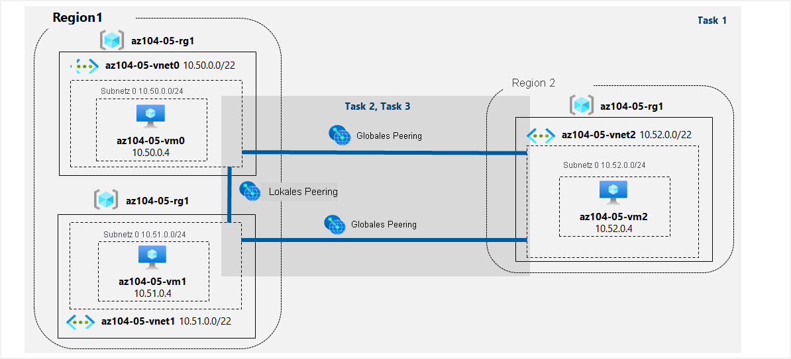

---
lab:
  title: "05\_– Implementieren von Konnektivität zwischen Standorten"
  module: Module 05 - Intersite Connectivity
---

# <a name="lab-05---implement-intersite-connectivity"></a>Übung 05 – Implementieren von Konnektivität zwischen Standorten
# <a name="student-lab-manual"></a>Lab-Handbuch für Kursteilnehmer

## <a name="lab-scenario"></a>Labszenario

Contoso has its datacenters in Boston, New York, and Seattle offices connected via a mesh wide-area network links, with full connectivity between them. You need to implement a lab environment that will reflect the topology of the Contoso's on-premises networks and verify its functionality.

## <a name="objectives"></a>Ziele

Dieses Lab deckt Folgendes ab:

+ Aufgabe 1: Bereitstellen der Laborumgebung
+ Aufgabe 2: Konfigurieren des Peerings lokaler und globaler virtueller Netzwerke
+ Aufgabe 3: Testen der Konnektivität zwischen den Standorten

## <a name="estimated-timing-30-minutes"></a>Geschätzte Zeit: 30 Minuten

## <a name="architecture-diagram"></a>Architekturdiagramm



### <a name="instructions"></a>Anweisungen

#### <a name="task-1-provision-the-lab-environment"></a>Aufgabe 1: Bereitstellen der Laborumgebung

In dieser Aufgabe stellen Sie drei VMs in separaten virtuellen Netzwerken bereit. Zwei davon befinden sich in derselben und das dritte in einer anderen Azure-Region.

1. Melden Sie sich beim [Azure-Portal](https://portal.azure.com) an.

1. Öffnen Sie **Azure Cloud Shell** im Azure-Portal, indem Sie oben rechts im Azure-Portal auf das entsprechende Symbol klicken.

1. Wenn Sie aufgefordert werden, entweder **Bash** oder **PowerShell** auszuwählen, wählen Sie **PowerShell** aus.

    >**Hinweis**: Wenn Sie **Cloud Shell** zum ersten Mal starten und die Meldung **Für Sie wurde kein Speicher bereitgestellt** angezeigt wird, wählen Sie das Abonnement aus, das Sie in diesem Lab verwenden, und klicken Sie dann auf **Speicher erstellen**.

1. Klicken Sie in der Symbolleiste des Cloud Shell-Bereichs auf das Symbol **Dateien hochladen/herunterladen**, klicken Sie im Dropdownmenü auf **Hochladen**, und laden Sie die Dateien **\\Allfiles\\Labs\\05\\az104-05-vnetvm-loop-template.json** und **\\Allfiles\\Labs\\05\\az104-05-vnetvm-loop-parameters.json** in das Cloud Shell-Basisverzeichnis hoch.

1. Edit the <bpt id="p1">**</bpt>Parameters<ept id="p1">**</ept> file you just uploaded and change the password. If you need help editing the file in the Shell please ask your instructor for assistance. As a best practice, secrets, like passwords, should be more securely stored in the Key Vault. 

1. From the Cloud Shell pane, run the following to create the resource group that will be hosting the lab environment. The first two virtual networks and a pair of virtual machines will be deployed in [Azure_region_1]. The third virtual network and the third virtual machine will be deployed in the same resource group but another [Azure_region_2]. (replace the [Azure_region_1] and [Azure_region_2] placeholder, including the square brackets, with the names of two different Azure regions where you intend to deploy these Azure virtual machines. An example is $location1 = 'eastus'. You can use Get-AzLocation to list all locations.):

   ```powershell
   $location1 = 'eastus'

   $location2 = 'westus'

   $rgName = 'az104-05-rg1'

   New-AzResourceGroup -Name $rgName -Location $location1
   ```

   ><bpt id="p1">**</bpt>Note<ept id="p1">**</ept>: The regions used above were tested and known to work when this lab was last officially reviewed. If you would prefer to use different locations, or they no longer work, you will need to identify two different regions that Standard D2Sv3 virtual machines can be deployed into.
   >
   >Um Azure-Regionen zu identifizieren, führen Sie in einer PowerShell-Sitzung in Cloud Shell das Cmdlet **(Get-AzLocation).Location** aus.
   >
   >Nachdem Sie zwei Regionen ermittelt haben, die Sie verwenden möchten, führen Sie den folgenden Befehl in der Cloud Shell für jede Region aus, um zu bestätigen, dass Sie dort Standard D2Sv3-VMs bereitstellen können.
   >
   >```az vm list-skus --location <Replace with your location> -o table --query "[? contains(name,'Standard_D2s')].name" ```
   >
   >If the command returns no results, then you need to choose another region. Once you have identified two suitable regions, you can adjust the regions in the code block above.

1. Führen Sie im Cloud Shell-Bereich folgenden Befehl aus, um mithilfe der hochgeladenen Vorlagen- und Parameterdateien die drei virtuellen Netzwerke zu erstellen und VMs darin bereitzustellen:

   ```powershell
   New-AzResourceGroupDeployment `
      -ResourceGroupName $rgName `
      -TemplateFile $HOME/az104-05-vnetvm-loop-template.json `
      -TemplateParameterFile $HOME/az104-05-vnetvm-loop-parameters.json `
      -location1 $location1 `
      -location2 $location2
   ```

    >Contoso verfügt über Rechenzentren in Boston, New York und Seattle, die über ein Netz aus WAN-Verbindungen mit vollständiger Konnektivität verbunden sind.

1. Schließen Sie den Cloud Shell-Bereich.

#### <a name="task-2-configure-local-and-global-virtual-network-peering"></a>Aufgabe 2: Konfigurieren des Peerings lokaler und globaler virtueller Netzwerke

In dieser Aufgabe konfigurieren Sie das lokale und globale Peering zwischen den virtuellen Netzwerken, die Sie in den vorherigen Aufgaben bereitgestellt haben.

1. Suchen Sie im Azure-Portal nach der Option **Virtuelle Netzwerke** und wählen Sie sie aus.

1. Überprüfen Sie die virtuellen Netzwerke, die Sie in der vorherigen Aufgabe erstellt haben, und stellen Sie sicher, dass sich die ersten beiden in derselben Azure-Region und das dritte in einer anderen Azure-Region befinden.

    >**Hinweis**: Die Vorlage, die Sie für die Bereitstellung der drei virtuellen Netzwerke verwendet haben, stellt sicher, dass sich die IP-Adressbereiche der drei virtuellen Netzwerke nicht überschneiden.

1. Klicken Sie in der Liste virtueller Netzwerke auf **az104-05-vnet0**.

1. Klicken Sie auf dem Blatt des virtuellen Netzwerks **az104-05-vnet0** im Abschnitt **Einstellungen** auf **Peerings** und dann auf **+ Hinzufügen**.

1. Fügen Sie ein Peering mit den folgenden Einstellungen hinzu (übernehmen Sie für andere Einstellungen die Standardwerte), und klicken Sie auf **Hinzufügen**:

    | Einstellung | Wert|
    | --- | --- |
    | Dieses virtuelle Netzwerk: Name des Peeringlinks | **az104-05-vnet0_to_az104-05-vnet1** |
    | Dieses virtuelle Netzwerk: Datenverkehr zum virtuellen Remotenetzwerk | **Zulassen (Standard)** |
    | Dieses virtuelle Netzwerk: Vom virtuellen Remotenetzwerk weitergeleiteter Datenverkehr | **Von außerhalb dieses virtuellen Netzwerks stammenden Datenverkehr blockieren** |
    | Gateway des virtuellen Netzwerks | **None** |
    | Virtuelles Remotenetzwerk: Name des Peeringlinks | **az104-05-vnet1_to_az104-05-vnet0** |
    | Bereitstellungsmodell für das virtuelle Netzwerk | **Resource Manager** |
    | Ich kenne meine Ressourcen-ID | Nicht ausgewählt |
    | Subscription | Der Name des Azure-Abonnements, das Sie in diesem Lab verwenden. |
    | Virtuelles Netzwerk | **az104-05-vnet1** |
    | Datenverkehr zum virtuellen Remotenetzwerk | **Zulassen (Standard)** |
    | Traffic forwarded from remote virtual network (Vom virtuellen Remotenetzwerk weitergeleiteter Datenverkehr) | **Von außerhalb dieses virtuellen Netzwerks stammenden Datenverkehr blockieren** |
    | Gateway des virtuellen Netzwerks | **None** |

    >**Hinweis**: In diesem Schritt werden zwei lokale Peerings eingerichtet: eines zwischen „az104-05-vnet0“ und „az104-05-vnet1“ und das andere zwischen „az104-05-vnet1“ und „az104-05-vnet0“.

    >**Hinweis**: Falls die in der vorherigen Aufgabe erstellten virtuellen Netzwerke nicht in der Oberfläche des Azure-Portals angezeigt werden, können Sie das Peering konfigurieren, indem Sie über Cloud Shell die folgenden PowerShell-Befehle ausführen:
    
   ```powershell
   $rgName = 'az104-05-rg1'

   $vnet0 = Get-AzVirtualNetwork -Name 'az104-05-vnet0' -ResourceGroupName $rgname

   $vnet1 = Get-AzVirtualNetwork -Name 'az104-05-vnet1' -ResourceGroupName $rgname

   Add-AzVirtualNetworkPeering -Name 'az104-05-vnet0_to_az104-05-vnet1' -VirtualNetwork $vnet0 -RemoteVirtualNetworkId $vnet1.Id

   Add-AzVirtualNetworkPeering -Name 'az104-05-vnet1_to_az104-05-vnet0' -VirtualNetwork $vnet1 -RemoteVirtualNetworkId $vnet0.Id
   ``` 

1. Klicken Sie auf dem Blatt des virtuellen Netzwerks **az104-05-vnet0** im Abschnitt **Einstellungen** auf **Peerings** und dann auf **+ Hinzufügen**.

1. Fügen Sie ein Peering mit den folgenden Einstellungen hinzu (übernehmen Sie für andere Einstellungen die Standardwerte), und klicken Sie auf **Hinzufügen**:

    | Einstellung | Wert|
    | --- | --- |
    | Dieses virtuelle Netzwerk: Name des Peeringlinks | **az104-05-vnet0_to_az104-05-vnet2** |
    | Dieses virtuelle Netzwerk: Datenverkehr zum virtuellen Remotenetzwerk | **Zulassen (Standard)** |
    | Dieses virtuelle Netzwerk: Vom virtuellen Remotenetzwerk weitergeleiteter Datenverkehr | **Von außerhalb dieses virtuellen Netzwerks stammenden Datenverkehr blockieren** |
    | Gateway des virtuellen Netzwerks | **None** |
    | Virtuelles Remotenetzwerk: Name des Peeringlinks | **az104-05-vnet2_to_az104-05-vnet0** |
    | Bereitstellungsmodell für das virtuelle Netzwerk | **Resource Manager** |
    | Ich kenne meine Ressourcen-ID | Nicht ausgewählt |
    | Subscription | Der Name des Azure-Abonnements, das Sie in diesem Lab verwenden. |
    | Virtuelles Netzwerk | **az104-05-vnet2** |
    | Datenverkehr zum virtuellen Remotenetzwerk | **Zulassen (Standard)** |
    | Traffic forwarded from remote virtual network (Vom virtuellen Remotenetzwerk weitergeleiteter Datenverkehr) | **Von außerhalb dieses virtuellen Netzwerks stammenden Datenverkehr blockieren** |
    | Gateway des virtuellen Netzwerks | **None** |

    >**Hinweis**: In diesem Schritt werden zwei globale Peerings eingerichtet: eines zwischen „az104-05-vnet0“ und „az104-05-vnet2“ und das andere zwischen „az104-05-vnet2“ und „az104-05-vnet0“.

    >**Hinweis**: Falls die in der vorherigen Aufgabe erstellten virtuellen Netzwerke nicht in der Oberfläche des Azure-Portals angezeigt werden, können Sie das Peering konfigurieren, indem Sie über Cloud Shell die folgenden PowerShell-Befehle ausführen:
    
   ```powershell
   $rgName = 'az104-05-rg1'

   $vnet0 = Get-AzVirtualNetwork -Name 'az104-05-vnet0' -ResourceGroupName $rgname

   $vnet2 = Get-AzVirtualNetwork -Name 'az104-05-vnet2' -ResourceGroupName $rgname

   Add-AzVirtualNetworkPeering -Name 'az104-05-vnet0_to_az104-05-vnet2' -VirtualNetwork $vnet0 -RemoteVirtualNetworkId $vnet2.Id

   Add-AzVirtualNetworkPeering -Name 'az104-05-vnet2_to_az104-05-vnet0' -VirtualNetwork $vnet2 -RemoteVirtualNetworkId $vnet0.Id
   ``` 

1. Wechseln Sie zurück zum Blatt **Virtuelle Netzwerke**, und klicken Sie in der Liste virtueller Netzwerke auf **az104-05-vnet1**.

1. Klicken Sie auf dem Blatt des virtuellen Netzwerks **az104-05-vnet1** im Abschnitt **Einstellungen** auf **Peerings** und dann auf **+ Hinzufügen**.

1. Fügen Sie ein Peering mit den folgenden Einstellungen hinzu (übernehmen Sie für andere Einstellungen die Standardwerte), und klicken Sie auf **Hinzufügen**:

    | Einstellung | Wert|
    | --- | --- |
    | Dieses virtuelle Netzwerk: Name des Peeringlinks | **az104-05-vnet1_to_az104-05-vnet2** |
    | Dieses virtuelle Netzwerk: Datenverkehr zum virtuellen Remotenetzwerk | **Zulassen (Standard)** |
    | Dieses virtuelle Netzwerk: Vom virtuellen Remotenetzwerk weitergeleiteter Datenverkehr | **Von außerhalb dieses virtuellen Netzwerks stammenden Datenverkehr blockieren** |
    | Gateway des virtuellen Netzwerks | **None** |
    | Virtuelles Remotenetzwerk: Name des Peeringlinks | **az104-05-vnet2_to_az104-05-vnet1** |
    | Bereitstellungsmodell für das virtuelle Netzwerk | **Resource Manager** |
    | Ich kenne meine Ressourcen-ID | Nicht ausgewählt |
    | Subscription | Der Name des Azure-Abonnements, das Sie in diesem Lab verwenden. |
    | Virtuelles Netzwerk | **az104-05-vnet2** |
    | Datenverkehr zum virtuellen Remotenetzwerk | **Zulassen (Standard)** |
    | Traffic forwarded from remote virtual network (Vom virtuellen Remotenetzwerk weitergeleiteter Datenverkehr) | **Von außerhalb dieses virtuellen Netzwerks stammenden Datenverkehr blockieren** |
    | Gateway des virtuellen Netzwerks | **None** |

    >**Hinweis**: In diesem Schritt werden zwei globale Peerings eingerichtet: eines zwischen „az104-05-vnet1“ und „az104-05-vnet2“ und das andere zwischen „az104-05-vnet2“ und „az104-05-vnet1“.

    >**Hinweis**: Falls die in der vorherigen Aufgabe erstellten virtuellen Netzwerke nicht in der Oberfläche des Azure-Portals angezeigt werden, können Sie das Peering konfigurieren, indem Sie über Cloud Shell die folgenden PowerShell-Befehle ausführen:
    
   ```powershell
   $rgName = 'az104-05-rg1'

   $vnet1 = Get-AzVirtualNetwork -Name 'az104-05-vnet1' -ResourceGroupName $rgname

   $vnet2 = Get-AzVirtualNetwork -Name 'az104-05-vnet2' -ResourceGroupName $rgname

   Add-AzVirtualNetworkPeering -Name 'az104-05-vnet1_to_az104-05-vnet2' -VirtualNetwork $vnet1 -RemoteVirtualNetworkId $vnet2.Id

   Add-AzVirtualNetworkPeering -Name 'az104-05-vnet2_to_az104-05-vnet1' -VirtualNetwork $vnet2 -RemoteVirtualNetworkId $vnet1.Id
   ``` 

#### <a name="task-3-test-intersite-connectivity"></a>Aufgabe 3: Testen der Konnektivität zwischen den Standorten

In dieser Aufgabe testen Sie die Konnektivität zwischen VMs in den drei virtuellen Netzwerken, die Sie in der vorherigen Aufgabe über lokales und globales Peering verbunden haben.

1. Suchen Sie im Azure-Portal nach **Virtuelle Computer**, und klicken Sie darauf.

1. Klicken Sie in der Liste der VMs auf **az104-05-vm0**.

1. Klicken Sie auf dem Blatt von **az104-05-vm0** auf **Verbinden**, klicken Sie im Dropdownmenü auf **RDP**, klicken Sie auf dem Blatt **Verbinden mit RDP** auf **RDP-Datei herunterladen**, und befolgen Sie die Anweisungen, um die Remotedesktopsitzung zu starten.

    >Sie müssen eine Laborumgebung implementieren, die die Topologie der lokalen Netzwerke von Contoso widerspiegelt, und deren Funktionalität überprüfen.

    >**Hinweis**: Sie können Warnungseingabeaufforderungen ignorieren, wenn Sie eine Verbindung mit den Ziel-VMs herstellen.

1. Wenn Sie dazu aufgefordert werden, melden Sie sich mit dem Benutzernamen **Student** und dem Kennwort in Ihrer Parameterdatei an. 

1. Klicken Sie in der Remotedesktopsitzung mit **az104-05-vm0** mit der rechten Maustaste auf die Schaltfläche **Start**, und klicken Sie im Kontextmenü auf **Windows PowerShell (Administrator)** .

1. Führen Sie im Windows PowerShell-Konsolenfenster den folgenden Befehl aus, um die Konnektivität mit **az104-05-vm1** (mit der privaten IP-Adresse **10.51.0.4**) über TCP-Port 3389 zu testen:

   ```powershell
   Test-NetConnection -ComputerName 10.51.0.4 -Port 3389 -InformationLevel 'Detailed'
   ```

    >**Hinweis**: Beim Test wird TCP 3389 verwendet, weil dieser Port standardmäßig von der Betriebssystemfirewall zugelassen wird.

1. Überprüfen Sie die Ausgabe des Befehls, und stellen Sie sicher, dass die Verbindung erfolgreich war.

1. Führen Sie im Windows PowerShell-Konsolenfenster den folgenden Befehl aus, um die Konnektivität mit **az104-05-vm2** (mit der privaten IP-Adresse **10.52.0.4**) zu testen:

   ```powershell
   Test-NetConnection -ComputerName 10.52.0.4 -Port 3389 -InformationLevel 'Detailed'
   ```

1. Wechseln Sie auf Ihrem Labcomputer zurück zum Azure-Portal, und kehren Sie zum Blatt **VMs** zurück.

1. Klicken Sie in der Liste der VMs auf **az104-05-vm1**.

1. Klicken Sie auf dem Blatt von **az104-05-vm1** auf **Verbinden**, klicken Sie im Dropdownmenü auf **RDP**, klicken Sie auf dem Blatt **Verbinden mit RDP** auf **RDP-Datei herunterladen**, und befolgen Sie die Anweisungen, um die Remotedesktopsitzung zu starten.

    ><bpt id="p1">**</bpt>Note<ept id="p1">**</ept>: This step refers to connecting via Remote Desktop from a Windows computer. On a Mac, you can use Remote Desktop Client from the Mac App Store and on Linux computers you can use an open source RDP client software.

    >**Hinweis**: Sie können Warnungseingabeaufforderungen ignorieren, wenn Sie eine Verbindung mit den Ziel-VMs herstellen.

1. Wenn Sie dazu aufgefordert werden, melden Sie sich mit dem Benutzernamen **Student** und dem Kennwort in Ihrer Parameterdatei an. 

1. Klicken Sie in der Remotedesktopsitzung mit **az104-05-vm1** mit der rechten Maustaste auf die Schaltfläche **Start**, und klicken Sie im Kontextmenü auf **Windows PowerShell (Administrator)** .

1. Führen Sie im Windows PowerShell-Konsolenfenster den folgenden Befehl aus, um die Konnektivität mit **az104-05-vm2** (mit der privaten IP-Adresse **10.52.0.4**) über TCP-Port 3389 zu testen:

   ```powershell
   Test-NetConnection -ComputerName 10.52.0.4 -Port 3389 -InformationLevel 'Detailed'
   ```

    >**Hinweis**: Beim Test wird TCP 3389 verwendet, weil dieser Port standardmäßig von der Betriebssystemfirewall zugelassen wird.

1. Überprüfen Sie die Ausgabe des Befehls, und stellen Sie sicher, dass die Verbindung erfolgreich war.

#### <a name="clean-up-resources"></a>Bereinigen von Ressourcen

><bpt id="p1">**</bpt>Note<ept id="p1">**</ept>: Remember to remove any newly created Azure resources that you no longer use. Removing unused resources ensures you will not see unexpected charges.

><bpt id="p1">**</bpt>Note<ept id="p1">**</ept>:  Don't worry if the lab resources cannot be immediately removed. Sometimes resources have dependencies and take a longer time to delete. It is a common Administrator task to monitor resource usage, so just periodically review your resources in the Portal to see how the cleanup is going. 

1. Öffnen Sie im Azure-Portal im Bereich **Cloud Shell** die **PowerShell**-Sitzung.

1. Listen Sie alle Ressourcengruppen auf, die während der Labs in diesem Modul erstellt wurden, indem Sie den folgenden Befehl ausführen:

   ```powershell
   Get-AzResourceGroup -Name 'az104-05*'
   ```

1. Löschen Sie alle Ressourcengruppen, die Sie während der praktischen Übungen in diesem Modul erstellt haben, indem Sie den folgenden Befehl ausführen:

   ```powershell
   Get-AzResourceGroup -Name 'az104-05*' | Remove-AzResourceGroup -Force -AsJob
   ```

    >**Hinweis**: Der Befehl wird (wie über den Parameter „-AsJob“ festgelegt) asynchron ausgeführt. Dies bedeutet, dass Sie zwar direkt im Anschluss einen weiteren PowerShell-Befehl in derselben PowerShell-Sitzung ausführen können, es jedoch einige Minuten dauert, bis die Ressourcengruppen tatsächlich entfernt werden.

#### <a name="review"></a>Überprüfung

In diesem Lab haben Sie die folgenden Aufgaben ausgeführt:

+ Bereitstellen der Laborumgebung
+ Konfigurieren des Peerings lokaler und globaler virtueller Netzwerke
+ Testen der Konnektivität zwischen Standorten
