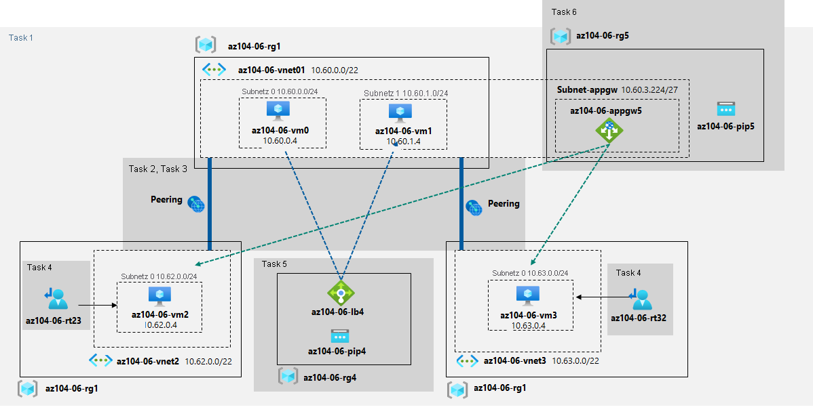

---
lab:
  title: "Lab\_06: Implementieren einer Datenverkehrsverwaltung"
  module: Administer Network Traffic Management
---

# Lab 06 : Implementieren von Datenverkehrsverwaltung
# Lab-Handbuch für Kursteilnehmer

## Labszenario

Sie wurden damit beauftragt, die Verwaltung des Netzwerkdatenverkehrs für Azure-VMs in der Hub-and-Spoke-Netzwerktopologie zu testen, die Contoso in seiner Azure-Umgebung ggf. implementieren möchte (anstatt die Meshtopologie zu erstellen, die Sie im vorherigen Lab getestet haben). Diese Tests müssen die Implementierung der Konnektivität zwischen Spokes umfassen, indem benutzerdefinierte Routen verwendet werden, die den Datenverkehr über den Hub erzwingen, sowie die Verteilung des Datenverkehrs auf VMs mithilfe von Lastenausgleichsmodulen der Ebene 4 und der Ebene 7. Zu diesem Zweck möchten Sie Azure Load Balancer (Ebene 4) und Azure Application Gateway (Ebene 7) verwenden.

                **Hinweis:** Eine **[interaktive Labsimulation](https://mslabs.cloudguides.com/guides/AZ-104%20Exam%20Guide%20-%20Microsoft%20Azure%20Administrator%20Exercise%2010)** ist verfügbar, mit der Sie dieses Lab in Ihrem eigenen Tempo durcharbeiten können. Möglicherweise liegen geringfügige Unterschiede zwischen der interaktiven Simulation und dem gehosteten Lab vor, aber die dargestellten Kernkonzepte und Ideen sind identisch. 

>**Hinweis**: Dieses Lab erfordert standardmäßig insgesamt 8 vCPUs, die in der Standard_Dsv3-Serie in der von Ihnen für die Bereitstellung ausgewählten Region verfügbar sind, da es die Bereitstellung von vier Azure-VMs der Standard_D2s_v3-SKU beinhaltet. Wenn Ihre Kursteilnehmer Testkonten verwenden, die auf 4 vCPUs beschränkt sind, können Sie eine VM-Größe verwenden, die nur eine vCPU erfordert (z. B. Standard_B1s).

## Ziele

Dieses Lab deckt Folgendes ab:

+ Aufgabe 1: Bereitstellen der Laborumgebung
+ Aufgabe 2: Konfigurieren der Hub-and-Spoke-Netzwerktopologie
+ Aufgabe 3: Testen der Transitivität des Peerings virtueller Netzwerke
+ Aufgabe 4: Konfigurieren des Routings in der Hub-and-Spoke-Topologie
+ Aufgabe 5: Implementieren von Azure Load Balancer
+ Aufgabe 6: Implementieren von Azure Application Gateway

## Geschätzte Zeit: 60 Minuten

## Architekturdiagramm




### Anweisungen

## Übung 1

## Aufgabe 1: Bereitstellen der Laborumgebung

In dieser Aufgabe stellen Sie vier VMs in derselben Azure-Region bereit. Die ersten beiden VMs befinden sich in einem virtuellen Hubnetzwerk, während sich jede der beiden verbleibenden VMs in einem separaten virtuellen Spokenetzwerk befindet.

1. Melden Sie sich beim [Azure-Portal](https://portal.azure.com) an.

1. Öffnen Sie **Azure Cloud Shell** im Azure-Portal, indem Sie oben rechts im Azure-Portal auf das entsprechende Symbol klicken.

1. Wenn Sie aufgefordert werden, entweder **Bash** oder **PowerShell** auszuwählen, wählen Sie **PowerShell** aus.

    >**Hinweis**: Wenn Sie **Cloud Shell** zum ersten Mal starten und die Meldung **Für Sie wurde kein Speicher bereitgestellt** angezeigt wird, wählen Sie das Abonnement aus, das Sie in diesem Lab verwenden, und klicken Sie dann auf **Speicher erstellen**.

1. Klicken Sie in der Symbolleiste des Cloud Shell-Bereichs auf das Symbol **Dateien hochladen/herunterladen**, klicken Sie im Dropdownmenü auf **Hochladen**, und laden Sie die Dateien **\\Allfiles\\Labs\\06\\az104-06-vms-loop-template.json** und **\\Allfiles\\Labs\\06\\az104-06-vms-loop-parameters.json** in das Cloud Shell-Basisverzeichnis hoch.

1. Führen Sie im Cloud Shell-Bereich Folgendes aus, um die erste Ressourcengruppe zu erstellen, in der die Labumgebung gehostet wird (ersetzen Sie den Platzhalter [Azure_region] durch den Namen einer Azure-Region, in der Sie Azure-VMs bereitstellen möchten) (Sie können mithilfe des Cmdlets (Get-AzLocation).Location die Regionsliste abrufen):

    ```powershell 
    $location = '[Azure_region]'
    ```
    
    Nun der Name der Ressourcengruppe:
    ```powershell
    $rgName = 'az104-06-rg1'
    ```
    
    Erstellen Sie schließlich die Ressourcengruppe am gewünschten Speicherort:
    ```powershell
    New-AzResourceGroup -Name $rgName -Location $location
    ```


1. Führen Sie im Cloud-Shell Bereich Folgendes aus, um die drei virtuellen Netzwerke und vier Azure-VMs in ihnen mithilfe der hochgeladenen Vorlagen- und Parameterdateien zu erstellen:

    >**Hinweis**: Sie werden aufgefordert, ein Administratorkennwort anzugeben.

   ```powershell
   New-AzResourceGroupDeployment `
      -ResourceGroupName $rgName `
      -TemplateFile $HOME/az104-06-vms-loop-template.json `
      -TemplateParameterFile $HOME/az104-06-vms-loop-parameters.json
   ```

    >**Hinweis**: Warten Sie, bis die Bereitstellung abgeschlossen ist, bevor Sie mit dem nächsten Schritt fortfahren. Dieser Vorgang dauert etwa fünf Minuten.

    >**Hinweis:** Wenn Sie einen Fehler erhalten haben, der besagt, dass die VM-Größe nicht verfügbar ist, bitten Sie Ihren Kursleiter um Hilfe, und versuchen Sie diese Schritte.
    > 1. Klicken Sie in Ihrer Cloud Shell-Instanz auf die Schaltfläche `{}`. Wählen Sie auf der linken Randleiste die Datei **az104-06-vms-loop-parameters.json** aus, und notieren Sie sich den Wert des Parameters `vmSize`.
    > 1. Überprüfen Sie den Standort, an dem die Ressourcengruppe „az104-06-rg1“ bereitgestellt wird. Sie können `az group show -n az104-06-rg1 --query location` in Ihrer Cloud Shell-Instanz ausführen, um ihn abzurufen.
    > 1. Führen Sie `az vm list-skus --location <Replace with your location> -o table --query "[? contains(name,'Standard_D2s')].name"` in Ihrer Cloud Shell-Instanz aus.
    > 1. Ersetzen Sie den Wert des Parameters `vmSize` durch einen der Werte, die vom zuletzt ausgeführten Befehl zurückgegeben wurden. Wenn keine Werte zurückgegeben werden, müssen Sie möglicherweise eine andere Region für die Bereitstellung auswählen. Sie können auch einen anderen Seriennamen wie „Standard_B1s“ auswählen.
    > 1. Stellen Sie nun Ihre Vorlagen erneut bereit, indem Sie den Befehl `New-AzResourceGroupDeployment` erneut ausführen. Sie können mehrmals die Schaltfläche „Nach oben“ klicken, um den zuletzt ausgeführten Befehl einzublenden.

1. Führen Sie im Cloud Shell-Bereich Folgendes aus, um die Erweiterung Network Watcher auf den im vorherigen Schritt bereitgestellten Azure-VMs zu installieren:

   ```powershell
   $rgName = 'az104-06-rg1'
   $location = (Get-AzResourceGroup -ResourceGroupName $rgName).location
   $vmNames = (Get-AzVM -ResourceGroupName $rgName).Name

   foreach ($vmName in $vmNames) {
     Set-AzVMExtension `
     -ResourceGroupName $rgName `
     -Location $location `
     -VMName $vmName `
     -Name 'networkWatcherAgent' `
     -Publisher 'Microsoft.Azure.NetworkWatcher' `
     -Type 'NetworkWatcherAgentWindows' `
     -TypeHandlerVersion '1.4'
   }
   ```

    >**Hinweis**: Warten Sie, bis die Bereitstellung abgeschlossen ist, bevor Sie mit dem nächsten Schritt fortfahren. Dieser Vorgang dauert etwa fünf Minuten.


1. Schließen Sie den Cloud Shell-Bereich.

## Aufgabe 2: Konfigurieren der Hub-and-Spoke-Netzwerktopologie

In dieser Aufgabe konfigurieren Sie lokales Peering zwischen den virtuellen Netzwerken, die Sie in den vorherigen Aufgaben bereitgestellt haben, um eine Hub-and-Spoke-Netzwerktopologie zu erstellen.

1. Suchen Sie im Azure-Portal nach der Option **Virtuelle Netzwerke** und wählen Sie sie aus.

1. Überprüfen Sie die virtuellen Netzwerke, die Sie in der vorherigen Aufgabe erstellt haben.

    >**Hinweis**: Die Vorlage, die Sie für die Bereitstellung der drei virtuellen Netzwerke verwendet haben, stellt sicher, dass sich die IP-Adressbereiche der drei virtuellen Netzwerke nicht überschneiden.

1. Wählen Sie in der Liste der virtuellen Netzwerke **az104-06-vnet2** aus.

1. Wählen Sie auf dem Blatt **az104-06-vnet2** die Option **Eigenschaften** aus. 

1. Notieren Sie sich aus dem Blatt **az104-06-vnet2 \| Eigenschaften** den Wert der Eigenschaft **Ressourcen-ID**.

1. Navigieren Sie zurück zur Liste der virtuellen Netzwerke, und wählen Sie **az104-06-vnet3** aus.

1. Wählen Sie auf dem Blatt **az104-06-vnet3** die Option **Eigenschaften** aus. 

1. Notieren Sie sich aus dem Blatt **az104-06-vnet3 \| Eigenschaften** den Wert der Eigenschaft **Ressourcen-ID**.

    >**Hinweis**: Sie benötigen die Werte der ResourceID-Eigenschaft für beide virtuellen Netzwerke später in dieser Aufgabe.

    >**Hinweis**: Dies ist eine Problemumgehung, die das Problem behebt, dass das Azure-Portal gelegentlich das neu bereitgestellte virtuelle Netzwerk nicht anzeigt, wenn Peerings virtueller Netzwerke erstellt werden.

1. Klicken Sie in der Liste der virtuellen Netzwerke auf **az104-06-vnet01**.

1. Klicken Sie auf dem Blatt des virtuellen Netzwerks **az104-06-vnet01** im Abschnitt **Einstellungen** auf **Peerings** und dann auf **+ Hinzufügen**.

1. Fügen Sie ein Peering mit den folgenden Einstellungen hinzu (übernehmen Sie für andere Einstellungen die Standardwerte), und klicken Sie auf **Hinzufügen**:

    | Einstellung | Wert |
    | --- | --- |
    | Dieses virtuelle Netzwerk: Name des Peeringlinks | **az104-06-vnet01_to_az104-06-vnet2** |
    | Zugriff zum virtuellen Remote-Netzwerk zulassen | **Stellen Sie sicher, dass das Kontrollkästchen aktiviert ist (Standard)** |
    | Virtuelles Remotenetzwerk: Name des Peeringlinks | **az104-06-vnet2_to_az104-06-vnet01** |
    | Bereitstellungsmodell für das virtuelle Netzwerk | **Resource Manager** |
    | Ich kenne meine Ressourcen-ID | enabled |
    | Ressourcen-ID | Der Wert des resourceID-Parameters von **az104-06-vnet2**, den Sie sich zuvor in dieser Aufgabe notiert haben. |
    | Geben Sie Zugriff auf das virtuelle Netzwerk | **Stellen Sie sicher, dass das Kontrollkästchen aktiviert ist (Standard)** |
    | Datenverkehr zum virtuellen Remotenetzwerk zulassen | **Stellen Sie sicher, dass das Kontrollkästchen aktiviert ist (Standard)** |
    

    >**Hinweis**: Warten Sie, bis der Vorgang abgeschlossen wurde.

    >**Hinweis**: In diesem Schritt werden zwei lokale Peerings eingerichtet: eines von az104-06-vnet01 bis az104-06-vnet2 und das andere von az104-06-vnet2 bis az104-06-vnet01.

1. Klicken Sie auf dem Blatt des virtuellen Netzwerks **az104-06-vnet01** im Abschnitt **Einstellungen** auf **Peerings** und dann auf **+ Hinzufügen**.

1. Fügen Sie ein Peering mit den folgenden Einstellungen hinzu (übernehmen Sie für andere Einstellungen die Standardwerte), und klicken Sie auf **Hinzufügen**:

    | Einstellung | Wert |
    | --- | --- |
    | Dieses virtuelle Netzwerk: Name des Peeringlinks | **az104-06-vnet01_to_az104-06-vnet3** |
    | Zugriff zum virtuellen Remote-Netzwerk zulassen | **Stellen Sie sicher, dass das Kontrollkästchen aktiviert ist (Standard)** |    
    | Virtuelles Remotenetzwerk: Name des Peeringlinks | **az104-06-vnet3_to_az104-06-vnet01** |
    | Bereitstellungsmodell für das virtuelle Netzwerk | **Resource Manager** |
    | Ich kenne meine Ressourcen-ID | enabled |
    | Ressourcen-ID | Der Wert des resourceID-Parameters von **az104-06-vnet3**, den Sie sich zuvor in dieser Aufgabe notiert haben. |
    | Geben Sie Zugriff auf das virtuelle Netzwerk | **Stellen Sie sicher, dass das Kontrollkästchen aktiviert ist (Standard)** |
    | Datenverkehr zum virtuellen Remotenetzwerk zulassen | **Stellen Sie sicher, dass das Kontrollkästchen aktiviert ist (Standard)** |

    >**Hinweis**: Warten Sie, bis der Vorgang abgeschlossen wurde.
    
    >**Hinweis**: In diesem Schritt werden zwei lokale Peerings eingerichtet: eines von az104-06-vnet01 bis az104-06-vnet3 und das andere von az104-06-vnet3 bis az104-06-vnet01. Dies schließt die Einrichtung der Hub-and-Spoke-Topologie (mit zwei virtuellen Spokenetzwerken) ab.

## Aufgabe 3: Testen der Transitivität des Peerings virtueller Netzwerke

In dieser Aufgabe testen Sie die Transitivität des Peerings virtueller Netzwerke mithilfe von Network Watcher.

1. Suchen Sie im Azure-Portal nach dem **Network Watcher**, und wählen Sie diese Option aus.

1. Erweitern Sie auf dem Blatt **Network Watcher** die Liste der Azure-Regionen. Prüfen Sie, ob der Dienst in der von Ihnen genutzten Region aktiviert ist. 

1. Navigieren Sie auf dem Blatt **Network Watcher** zu **Problembehandlung für Verbindung**.

1. Führen Sie auf dem Blatt **Network Watcher - Problembehandlung für Verbindung** eine Überprüfung mit den folgenden Einstellungen aus (übernehmen Sie die Standardwerte für andere Einstellungen):

    > **Hinweis:** Es kann einige Minuten dauern, bis die Ressourcengruppe aufgelistet wird. Wenn Sie nicht warten möchten, versuchen Sie Folgendes: Löschen Sie die Network Watcher-Instanz, erstellen Sie eine neue Network Watcher-Instanz, und wiederholen Sie anschließend die Problembehandlung für die Verbindung. 

    | Einstellung | Wert |
    | --- | --- |
    | Subscription | Der Name des Azure-Abonnements, das Sie in diesem Lab verwenden. |
    | Resource group | **az104-06-rg1** |
    | Quellentyp | **Virtueller Computer** |
    | Virtueller Computer | **az104-06-vm0** |
    | Destination | **Manuell angeben** |
    | URI, FQDN oder IPv4 | **10.62.0.4** |
    | Protokoll | **TCP** |
    | Zielport | **3389** |

    > **Hinweis**: **10.62.0.4** stellt die private IP-Adresse von **az104-06-vm2** dar.

1. Klicken Sie auf **Diagnosetests ausführen**, und warten Sie, bis Ergebnisse der Konnektivitätsprüfung zurückgegeben werden. Vergewissern Sie sich, dass der Status **Erfolgreich** lautet. Überprüfen Sie den Netzwerkpfad, und beachten Sie, dass die Verbindung direkt war, ohne Zwischenhops zwischen den VMs.

    > **Hinweis**: Dies ist zu erwarten, da das virtuelle Hubnetzwerk direkt mithilfe von Peering mit dem ersten virtuellen Spokenetzwerk verbunden wird.

1. Führen Sie auf dem Blatt **Network Watcher - Problembehandlung für Verbindung** eine Überprüfung mit den folgenden Einstellungen aus (übernehmen Sie die Standardwerte für andere Einstellungen):

    | Einstellung | Wert |
    | --- | --- |
    | Subscription | Der Name des Azure-Abonnements, das Sie in diesem Lab verwenden. |
    | Resource group | **az104-06-rg1** |
    | Quellentyp | **Virtueller Computer** |
    | Virtueller Computer | **az104-06-vm0** |
    | Destination | **Manuell angeben** |
    | URI, FQDN oder IPv4 | **10.63.0.4** |
    | Protokoll | **TCP** |
    | Zielport | **3389** |

    > **Hinweis**: **10.63.0.4** stellt die private IP-Adresse von **az104-06-vm3** dar.

1. Klicken Sie auf **Diagnosetests ausführen**, und warten Sie, bis Ergebnisse der Konnektivitätsprüfung zurückgegeben werden. Vergewissern Sie sich, dass der Status **Erfolgreich** lautet. Überprüfen Sie den Netzwerkpfad, und beachten Sie, dass die Verbindung direkt war, ohne Zwischenhops zwischen den VMs.

    > **Hinweis**: Dies ist zu erwarten, da das virtuelle Hubnetzwerk direkt mithilfe von Peering mit dem zweiten virtuellen Spokenetzwerk verbunden wird.

1. Führen Sie auf dem Blatt **Network Watcher - Problembehandlung für Verbindung** eine Überprüfung mit den folgenden Einstellungen aus (übernehmen Sie die Standardwerte für andere Einstellungen):

    | Einstellung | Wert |
    | --- | --- |
    | Subscription | Der Name des Azure-Abonnements, das Sie in diesem Lab verwenden. |
    | Resource group | **az104-06-rg1** |
    | Quellentyp | **Virtueller Computer** |
    | Virtueller Computer | **az104-06-vm2** |
    | Destination | **Manuell angeben** |
    | URI, FQDN oder IPv4 | **10.63.0.4** |
    | Protokoll | **TCP** |
    | Zielport | **3389** |

1. Klicken Sie auf **Diagnosetests ausführen**, und warten Sie, bis Ergebnisse der Konnektivitätsprüfung zurückgegeben werden. Beachten Sie, dass der Status als **Fehler** angegeben wird.

    > **Hinweis**: Dies ist zu erwarten, da die beiden virtuellen Spokenetzwerke nicht mithilfe von Peering miteinander verbunden sind (Peering virtueller Netzwerke ist nicht transitiv).

## Aufgabe 4: Konfigurieren des Routings in der Hub-and-Spoke-Topologie

In dieser Aufgabe konfigurieren und testen Sie das Routing zwischen den beiden virtuellen Spokenetzwerken, indem Sie IP-Weiterleitung für die Netzwerkschnittstelle der VM **az104-06-vm0** aktivieren, Routing innerhalb ihres Betriebssystems aktivieren und benutzerdefinierte Routen im virtuellen Spokenetzwerk konfigurieren.

1. Suchen Sie im Azure-Portal nach **Virtuelle Computer**, und wählen Sie diese Option aus.

1. Klicken Sie auf dem Blatt **Virtuelle Computer** in der Liste der VMs auf **az104-06-vm0**.

1. Klicken Sie auf dem Blatt der VM **az104-06-vm0** im Abschnitt **Einstellungen** auf **Netzwerk**.

1. Klicken Sie auf den Link **az104-06-nic0** neben der Bezeichnung **Netzwerkschnittstelle**, und klicken Sie dann auf dem Blatt der Netzwerkschnittstelle **az104-06-nic0** im Abschnitt **Einstellungen** auf **IP-Konfigurationen**.

1. Legen Sie **IP-Weiterleitung** auf **Aktiviert** fest, und speichern Sie die Änderung.

   > **Hinweis**: Diese Einstellung ist erforderlich, damit **az104-06-vm0** als Router funktioniert, der Datenverkehr zwischen zwei virtuellen Spokenetzwerken weiterleitet.

   > **Hinweis**: Nun müssen Sie das Betriebssystem der VM **az104-06-vm0** konfigurieren, um Routing zu unterstützen.

1. Navigieren Sie im Azure-Portal zurück zum Blatt der Azure-VM **az104-06-vm0**, und klicken Sie auf **Übersicht.**

1. Klicken Sie auf dem Blatt **az104-06-vm0** im Abschnitt **Vorgänge** auf **Skriptausführung**, und klicken Sie in der Liste der Befehle **auf RunPowerShellScript**.

1. Geben Sie auf dem Blatt **Skriptausführung** Folgendes ein, und klicken Sie auf **Ausführen**, um die Windows Server-Rolle „Remotezugriff“ zu installieren.

   ```powershell
   Install-WindowsFeature RemoteAccess -IncludeManagementTools
   ```

   > **Hinweis**: Warten Sie auf die Bestätigung, dass der Befehl erfolgreich abgeschlossen wurde.

1. Geben Sie auf dem Blatt **Skriptausführung** Folgendes ein, und klicken Sie auf **Ausführen**, um den die Rolle „Routing“ zu installieren.

   ```powershell
   Install-WindowsFeature -Name Routing -IncludeManagementTools -IncludeAllSubFeature

   Install-WindowsFeature -Name "RSAT-RemoteAccess-Powershell"

   Install-RemoteAccess -VpnType RoutingOnly

   Get-NetAdapter | Set-NetIPInterface -Forwarding Enabled
   ```

   > **Hinweis**: Warten Sie auf die Bestätigung, dass der Befehl erfolgreich abgeschlossen wurde.

   > **Hinweis**: Jetzt müssen Sie benutzerdefinierte Routen in den virtuellen Spokenetzwerken erstellen und konfigurieren.

1. Suchen Sie im Azure-Portal nach **Routentabellen**, und wählen Sie diese Option aus. Klicken Sie dann auf dem Blatt **Routentabellen** auf **+ Erstellen**.

1. Erstellen Sie eine Routentabelle mit den folgenden Einstellungen (übernehmen Sie für andere Einstellungen die Standardwerte):

    | Einstellung | Wert |
    | --- | --- |
    | Subscription | Der Name des Azure-Abonnements, das Sie in diesem Lab verwenden. |
    | Resource group | **az104-06-rg1** |
    | Location | Der Name der Azure-Region, in der Sie die virtuellen Netzwerke erstellt haben. |
    | Name | **az104-06-rt23** |
    | Gatewayrouten verteilen | **Nein** |

1. Klicken Sie auf **Überprüfen und erstellen**. Führen Sie die Überprüfung aus, und klicken Sie auf **Erstellen**, um Ihre Bereitstellung zu übermitteln.

   > **Hinweis**: Warten Sie, bis die Routentabelle erstellt wurde. Dieser Vorgang dauert etwa drei Minuten.

1. Klicken Sie auf **Zu Ressource wechseln**.

1. Klicken Sie auf dem Blatt der Routentabelle **az104-06-rt23** im Abschnitt **Einstellungen** auf **Routen** und dann auf **+ Hinzufügen**.

1. Fügen Sie eine neue Route mit den folgenden Einstellungen hinzu:

    | Einstellung | Wert |
    | --- | --- |
    | Routenname | **az104-06-route-vnet2-to-vnet3** |
    | Adresspräfix für das Ziel | **IP-Adressen** |
    | Ziel-IP-Adressen/CIDR-Bereiche | **10.63.0.0/20** |
    | Typ des nächsten Hops | **Virtuelles Gerät** |
    | Adresse des nächsten Hops | **10.60.0.4** |

1. Klicken Sie auf **Hinzufügen**.

1. Klicken Sie auf dem Blatt der Routentabelle **az104-06-rt23** im Abschnitt **Einstellungen** auf **Subnetze** und dann auf **+ Zuordnen**.

1. Ordnen Sie die Routentabelle **az104-06-rt23** dem folgenden Subnetz zu:

    | Einstellung | Wert |
    | --- | --- |
    | Virtuelles Netzwerk | **az104-06-vnet2** |
    | Subnet | **subnet0** |

1. Klicken Sie auf **Hinzufügen**.

1. Navigieren Sie zurück zum Blatt **Routentabellen**, und klicken Sie auf **+ Erstellen**.

1. Erstellen Sie eine Routentabelle mit den folgenden Einstellungen (übernehmen Sie für andere Einstellungen die Standardwerte):

    | Einstellung | Wert |
    | --- | --- |
    | Subscription | Der Name des Azure-Abonnements, das Sie in diesem Lab verwenden. |
    | Resource group | **az104-06-rg1** |
    | Region | Der Name der Azure-Region, in der Sie die virtuellen Netzwerke erstellt haben. |
    | Name | **az104-06-rt32** |
    | Gatewayrouten verteilen | **Nein** |

1. Klicken Sie auf „Überprüfen und erstellen“. Führen Sie die Überprüfung aus, und klicken Sie auf „Erstellen“, um Ihre Bereitstellung zu übermitteln.

   > **Hinweis**: Warten Sie, bis die Routentabelle erstellt wurde. Dieser Vorgang dauert etwa drei Minuten.

1. Klicken Sie auf **Zu Ressource wechseln**.

1. Klicken Sie auf dem Blatt der Routentabelle **az104-06-rt32** im Abschnitt **Einstellungen** auf **Routen** und dann auf **+ Hinzufügen**.

1. Fügen Sie eine neue Route mit den folgenden Einstellungen hinzu:

    | Einstellung | Wert |
    | --- | --- |
    | Routenname | **az104-06-route-vnet3-to-vnet2** |
    | Adresspräfix für das Ziel | **IP-Adressen** |
    | Ziel-IP-Adressen/CIDR-Bereiche | **10.62.0.0/20** |
    | Typ des nächsten Hops | **Virtuelles Gerät** |
    | Adresse des nächsten Hops | **10.60.0.4** |

1. Klicken Sie auf **OK**

1. Klicken Sie auf dem Blatt der Routentabelle **az104-06-rt32** im Abschnitt **Einstellungen** auf **Subnetze** und dann auf **+ Zuordnen**.

1. Ordnen Sie die Routentabelle **az104-06-rt32** dem folgenden Subnetz zu:

    | Einstellung | Wert |
    | --- | --- |
    | Virtuelles Netzwerk | **az104-06-vnet3** |
    | Subnet | **subnet0** |

1. Klicken Sie auf **OK**

1. Navigieren Sie im Azure-Portal zurück zum Blatt **Network Watcher - Problembehandlung für Verbindung**.

1. Verwenden Sie auf dem Blatt **Network Watcher – Problembehandlung für Verbindung** die folgenden Einstellungen (übernehmen Sie die Standardwerte für andere Einstellungen):

    | Einstellung | Wert |
    | --- | --- |
    | Subscription | Der Name des Azure-Abonnements, das Sie in diesem Lab verwenden. |
    | Resource group | **az104-06-rg1** |
    | Quellentyp | **Virtueller Computer** |
    | Virtueller Computer | **az104-06-vm2** |
    | Destination | **Manuell angeben** |
    | URI, FQDN oder IPv4 | **10.63.0.4** |
    | Protokoll | **TCP** |
    | Zielport | **3389** |

1. Klicken Sie auf **Diagnosetests ausführen**, und warten Sie, bis Ergebnisse der Konnektivitätsprüfung zurückgegeben werden. Vergewissern Sie sich, dass der Status **Erfolgreich** lautet. Überprüfen Sie den Netzwerkpfad, und beachten Sie, dass der Datenverkehr über **10.60.0.4** weitergeleitet wurde (Netzwerkadapter **az104-06-nic0** zugewiesen). Wenn der Status **Fehler** lautet, sollten Sie „az104-06-vm0“ beenden und dann neu starten.

    > **Hinweis**: Dies ist zu erwarten, da der Datenverkehr zwischen virtuellen Spokenetzwerken jetzt über die VM im virtuellen Hubnetzwerk weitergeleitet wird, der als Router fungiert.

    > **Hinweis**: Sie können **Network Watcher** verwenden, um die Topologie des Netzwerks anzuzeigen.

## Aufgabe 5: Implementieren von Azure Load Balancer

In dieser Aufgabe implementieren Sie einen Azure Load Balancer vor den beiden Azure-VMs im virtuellen Hubnetzwerk.

1. Suchen Sie im Azure-Portal nach **Lastenausgleichsmodule**, und wählen Sie diese Option aus. Klicken Sie auf dem Blatt **Lastenausgleichsmodule** auf **+ Erstellen**.

1. Erstellen Sie einen Lastenausgleich mit den folgenden Einstellungen (übernehmen Sie für andere Einstellungen die Standardwerte), und klicken Sie auf **Weiter : Front-End-IP-Konfiguration**:

    | Einstellung | Wert |
    | --- | --- |
    | Subscription | Der Name des Azure-Abonnements, das Sie in diesem Lab verwenden. |
    | Resource group | **az104-06-rg4** (falls erforderlich erstellen) |
    | Name | **az104-06-lb4** |
    | Region | Der Name der Azure-Region, in der Sie alle anderen Ressourcen in diesem Lab bereitgestellt haben. |
    | SKU  | **Standard** |
    | Typ | **Public** |
    | Tarif | **Regional** |
    
1. Klicken Sie auf der Registerkarte **Front-End-IP-Konfiguration** und dann auf **Front-End-IP-Konfiguration hinzufügen**. Wählen Sie die folgende Einstellung aus:  
     
    | Einstellung | Wert |
    | --- | --- |
    | Name | **az104-06-fe4** |
    | IP-Typ | IP-Adresse |
    | Öffentliche IP-Adresse | Wählen Sie **Neu erstellen** aus. |
    | Gateway Load Balancer | Keine |
    
1. Wählen Sie im Popupmenü **Öffentliche IP-Adresse hinzufügen** die folgenden Einstellungen aus, und klicken Sie dann auf **OK** und **Hinzufügen**. Wenn Sie fertig sind, klicken Sie auf **Weiter: Back-End-Pools**. 
     
    | Einstellung | Wert |
    | --- | --- |
    | Name | **az104-06-pip4** |
    | SKU | Standard |
    | Tarif | Länderspezifisch |
    | Zuweisung | statischen |
    | Routingpräferenz | **Microsoft Network** |

1. Klicken Sie auf der Registerkarte **Back-End-Pools** auf **Back-End-Pool hinzufügen**, und geben Sie folgende Einstellungen an (übernehmen Sie für andere Einstellungen die Standardwerte). Klicken Sie zweimal nacheinander auf **+ Hinzufügen** und dann auf **Weiter: Eingangsregeln**. 

    | Einstellung | Wert |
    | --- | --- |
    | Name | **az104-06-lb4-be1** |
    | Virtuelles Netzwerk | **az104-06-vnet01** |
    | Konfiguration des Back-End-Pools | **NIC** | 
    | IP-Version | **IPv4** |
    | Auf **Hinzufügen** klicken, um einen virtuellen Computer hinzuzufügen |  |
    | az104-06-vm0 | **Kontrollkästchen aktivieren** |
    | az104-06-vm1 | **Kontrollkästchen aktivieren** |


1. Klicken Sie auf der Registerkarte **Eingangsregeln** auf **Lastenausgleichsregel hinzufügen**. Fügen Sie eine Lastenausgleichsregel mit den folgenden Einstellungen hinzu (übernehmen Sie für andere Einstellungen die Standardwerte). Wenn Sie fertig sind, klicken Sie auf **Hinzufügen**.

    | Einstellung | Wert |
    | --- | --- |
    | Name | **az104-06-lb4-lbrule1** |
    | IP-Version | **IPv4** |
    | Front-End-IP-Adresse | **az104-06-fe4** |
    | Back-End-Pool | **az104-06-lb4-be1** |    
    | Protocol | **TCP** |
    | Port | **80** |
    | Back-End-Port | **80** |
    | Integritätstest | **Neu erstellen** |
    | Name | **az104-06-lb4-hp1** |
    | Protokoll | **TCP** |
    | Port | **80** |
    | Intervall | **5** |
    | Fenster zum Erstellen von Integritätstests schließen | **OK** | 
    | Sitzungspersistenz | **None** |
    | Leerlaufzeitüberschreitung (Minuten) | **4** |
    | TCP-Zurücksetzung | **Disabled** |
    | Unverankerte IP | **Deaktiviert** |
    | Übersetzung der Quellnetzwerkadresse (SNAT) für ausgehenden Datenverkehr | **Empfohlen** |

1. Wenn Sie Zeit haben, sehen Sie sich die anderen Registerkarten an, und klicken Sie dann auf **Überprüfen und erstellen**. Stellen Sie sicher, dass keine Überprüfungsfehler vorhanden sind, und klicken Sie dann auf **Erstellen**. 

1. Warten Sie, bis der Lastenausgleich bereitgestellt wurde, und klicken Sie dann auf **Zu Ressource wechseln**.  

1. Wählen Sie auf der Ressourcenseite des Lastenausgleichs die Option **Frontend-IP-Konfiguration** aus. Kopieren Sie die IP-Adresse.

1. Öffnen Sie eine weitere Browserregisterkarte, und navigieren Sie zu der IP-Adresse. Vergewissern Sie sich, dass im Browserfenster die Meldung **Hello World from az104-06-vm0** oder **Hello World from az104-06-vm1** angezeigt wird.

1. Aktualisieren Sie das Fenster, um die Änderungen der Nachricht an den anderen virtuellen Computer zu überprüfen. Das zeigt, dass der Lastenausgleich durch die virtuellen Computer weitergeleitet wird.

    > **Hinweis**: Möglicherweise müssen Sie mehrmals aktualisieren oder ein neues Browserfenster im InPrivate-Modus öffnen.

## Aufgabe 6: Implementieren von Azure Application Gateway

In dieser Aufgabe implementieren Sie eine Azure Application Gateway-Instanz vor den beiden Azure-VMs im virtuellen Spokenetzwerk.

1. Suchen Sie im Azure-Portal nach **Virtuelle Netzwerke**, und wählen Sie diese Option aus.

1. Klicken Sie auf dem Blatt **Virtuelle Netzwerke** in der Liste der virtuellen Netzwerke auf **az104-06-vnet01**.

1. Klicken Sie auf dem Blatt des virtuellen Netzwerks **az104-06-vnet01** im Abschnitt **Einstellungen** auf **Subnetze** und dann auf **+ Subnetz**.

1. Fügen Sie ein Subnetz mit den folgenden Einstellungen hinzu (übernehmen Sie für andere Einstellungen die Standardwerte):

    | Einstellung | Wert |
    | --- | --- |
    | Name | **subnet-appgw** |
    | Subnetzadressbereich | **10.60.3.224/27** |

1. Klicken Sie unten auf der Seite auf **Speichern**.

    > **Hinweis**: Dieses Subnetz wird von den Azure Application Gateway-Instanzen verwendet, die Sie später in dieser Aufgabe bereitstellen. Das Application Gateway erfordert ein dediziertes Subnetz der Größe /27 oder höher.

1. Suchen Sie im Azure-Portal nach **Application Gateways**, und wählen Sie diese Option aus. Klicken Sie auf dem Blatt **Application Gateways** auf **+ Erstellen**.

1. Geben Sie auf der Registerkarte **Grundlagen** die folgenden Einstellungen an (übernehmen Sie für andere Einstellungen die Standardwerte):

    | Einstellung | Wert |
    | --- | --- |
    | Subscription | Der Name des Azure-Abonnements, das Sie in diesem Lab verwenden. |
    | Resource group | **az104-06-rg5** (neu erstellen) |
    | Name des Anwendungsgateways | **az104-06-appgw5** |
    | Region | Der Name der Azure-Region, in der Sie alle anderen Ressourcen in diesem Lab bereitgestellt haben. |
    | Tarif | **Standard V2** |
    | Aktivieren der automatischen Skalierung | **Nein** |
    | Anzahl von Instanzen | **2** |
    | Verfügbarkeitszone | **None** |
    | HTTP2 | **Disabled** |
    | Virtuelles Netzwerk | **az104-06-vnet01** |
    | Subnet | **subnet-appgw (10.60.3.224/27)** |

1. Klicken Sie auf **Weiter: Front-Ends >** , und geben Sie die folgenden Einstellungen an (übernehmen Sie für andere Einstellungen die Standardwerte). Klicken Sie abschließend auf **OK**. 

    | Einstellung | Wert |
    | --- | --- |
    | Typ der Front-End-IP-Adresse | **Public** |
    | Öffentliche IP-Adresse| **Neu hinzufügen** | 
    | Name | **az104-06-pip5** |
    | Verfügbarkeitszone | **None** |

1. Klicken Sie auf **Weiter: Back-Ends >** und dann auf **Back-End-Pool hinzufügen**. Geben Sie die folgenden Einstellungen an (übernehmen Sie für andere Einstellungen die Standardwerte). Wenn Sie fertig sind, klicken Sie auf **Hinzufügen**.

    | Einstellung | Wert |
    | --- | --- |
    | Name | **az104-06-appgw5-be1** |
    | Hinzufügen eines Back-End-Pools ohne Ziele | **Nein** |
    | IP-Adresse oder FQDN | **10.62.0.4** | 
    | IP-Adresse oder FQDN | **10.63.0.4** |

    > **Hinweis**: Die Ziele stellen die privaten IP-Adressen von VMs in den virtuellen Spokenetzwerken **az104-06-vm2** und **az104-06-vm3** dar.

1. Klicken Sie auf **Weiter: Konfiguration >** und dann auf **+ Routingregel hinzufügen**. Geben Sie die folgenden Einstellungen an:

    | Einstellung | Wert |
    | --- | --- |
    | Regelname | **az104-06-appgw5-rl1** |
    | Priorität | **10** |
    | Name des Listeners | **az104-06-appgw5-rl1l1** |
    | Front-End-IP | **Public** |
    | Protocol | **HTTP** |
    | Port | **80** |
    | Listenertyp | **Grundlegend** |
    | URL zur Fehlerseite | **Nein** |

1. Wechseln Sie zur Registerkarte **Back-End-Ziele**, und geben Sie die folgenden Einstellungen an (übernehmen Sie für andere Einstellungen die Standardwerte). Wenn Sie fertig sind, klicken Sie zweimal nacheinander auf **Hinzufügen**.  

    | Einstellung | Wert |
    | --- | --- |
    | Zieltyp | **Back-End-Pool** |
    | Back-End-Ziel | **az104-06-appgw5-be1** |
    | Back-End-Einstellungen | **Neu hinzufügen** |
    | Name der Back-End-Einstellungen | **az104-06-appgw5-http1** |
    | Back-End-Protokoll | **HTTP** |
    | Back-End-Port | **80** |
    | Zusätzliche Einstellungen | **Standardwerte übernehmen** |
    | Hostname | **Standardwerte übernehmen** |

1. Klicken Sie auf **Weiter: Tags >** , gefolgt von **Weiter: Überprüfen und erstellen >** , und klicken Sie dann auf **Erstellen**.

    > **Hinweis**: Warten Sie, bis die Application Gateway-Instanz erstellt wurde. Dies kann etwa acht Minuten dauern.

1. Suchen Sie im Azure-Portal nach **Application Gateways**, und wählen Sie diese Option aus. Klicken Sie auf dem Blatt **Application Gateways** auf **az104-06-appgw5**.

1. Kopieren Sie auf dem Application Gateway-Blatt **az104-06-appgw5** den Wert für **Öffentliche Front-End-IP-Adresse**.

1. Öffnen Sie ein weiteres Browserfenster, und navigieren Sie zu der IP-Adresse, die Sie im vorherigen Schritt identifiziert haben.

1. Vergewissern Sie sich, dass im Browserfenster die Meldung **Hello World from az104-06-vm2** oder **Hello World from az104-06-vm3** angezeigt wird.

1. Aktualisieren Sie das Fenster, um die Änderungen der Nachricht an den anderen virtuellen Computer zu überprüfen. 

    > **Hinweis**: Möglicherweise müssen Sie mehrmals aktualisieren oder ein neues Browserfenster im InPrivate-Modus öffnen.

    > **Hinweis**: Die Verwendung von VMs in mehreren virtuellen Netzwerken als Ziel ist keine übliche Konfiguration, aber sie soll verdeutlichen, dass Application Gateway in der Lage ist, auf VMs in mehreren virtuellen Netzwerken (sowie Endpunkte in anderen Azure-Regionen oder sogar außerhalb von Azure) abzuzielen, im Gegensatz zu Azure Load Balancer, der einen Lastausgleich für VMs im selben virtuellen Netzwerk vornimmt.

## Bereinigen von Ressourcen

>**Hinweis**: Denken Sie daran, alle neu erstellten Azure-Ressourcen zu entfernen, die Sie nicht mehr verwenden. Durch das Entfernen nicht verwendeter Ressourcen wird sichergestellt, dass keine unerwarteten Kosten anfallen.

>**Hinweis**: Machen Sie sich keine Sorgen, wenn die Labressourcen nicht sofort entfernt werden können. Mitunter haben Ressourcen Abhängigkeiten, sodass der Löschvorgang länger dauert. Es gehört zu den üblichen Administratoraufgaben, die Ressourcennutzung zu überwachen. Überprüfen Sie also regelmäßig Ihre Ressourcen im Portal darauf, wie es um die Bereinigung bestellt ist. 

1. Öffnen Sie im Azure-Portal im Bereich **Cloud Shell** die **PowerShell**-Sitzung.

1. Listen Sie alle Ressourcengruppen auf, die während der Labs in diesem Modul erstellt wurden, indem Sie den folgenden Befehl ausführen:

   ```powershell
   Get-AzResourceGroup -Name 'az104-06*'
   ```

1. Löschen Sie alle Ressourcengruppen, die Sie während der praktischen Übungen in diesem Modul erstellt haben, indem Sie den folgenden Befehl ausführen:

   ```powershell
   Get-AzResourceGroup -Name 'az104-06*' | Remove-AzResourceGroup -Force -AsJob
   ```

    >**Hinweis**: Der Befehl wird (wie über den Parameter „-AsJob“ festgelegt) asynchron ausgeführt. Dies bedeutet, dass Sie zwar direkt im Anschluss einen weiteren PowerShell-Befehl in derselben PowerShell-Sitzung ausführen können, es jedoch einige Minuten dauert, bis die Ressourcengruppen tatsächlich entfernt werden.

## Überprüfung

In diesem Lab haben Sie die folgenden Aufgaben ausgeführt:

+ Bereitstellen der Laborumgebung
+ Konfigurieren der Hub-and-Spoke-Netzwerktopologie
+ Testen der Transitivität des Peerings virtueller Netzwerke
+ Konfigurieren des Routings in der Hub-and-Spoke-Topologie
+ Implementieren von Azure Load Balancer
+ Implementieren von Azure Application Gateway
