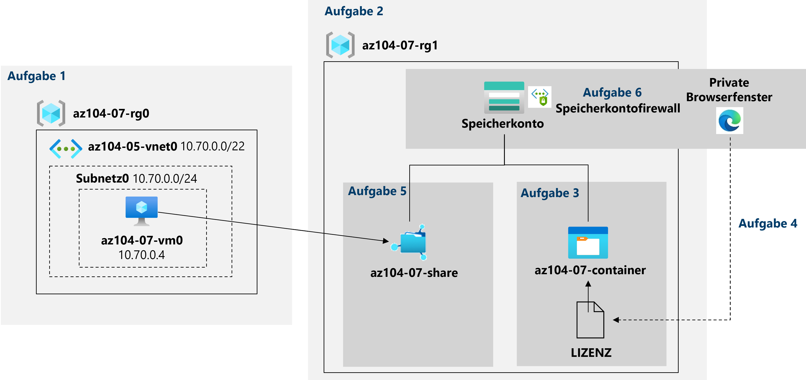

---
lab:
  title: '07: Verwalten von Azure-Speicher'
  module: Module 07 - Azure Storage
ms.openlocfilehash: 9703d6543f6b3cf7791352a4ee0ba84cda3b5934
ms.sourcegitcommit: be14e4ff5bc638e8aee13ec4b8be29525d404028
ms.translationtype: HT
ms.contentlocale: de-DE
ms.lasthandoff: 05/11/2022
ms.locfileid: "144937824"
---
# <a name="lab-07---manage-azure-storage"></a>Lab 07: Verwalten von Azure-Speicher
# <a name="student-lab-manual"></a>Lab-Handbuch für Kursteilnehmer

## <a name="lab-scenario"></a>Labszenario

Sie müssen die Verwendung von Azure-Speicher zum Speichern von Dateien auswerten, die sich derzeit in lokalen Datenspeichern befinden. Obwohl auf die meisten dieser Dateien nicht häufig zugegriffen wird, gibt es einige Ausnahmen. Sie möchten die Kosten für Speicher minimieren, indem Sie Dateien mit seltenerem Zugriff auf kostengünstigeren Speicherebenen platzieren. Außerdem möchten Sie verschiedene Schutzmechanismen untersuchen, die Azure Storage bietet, einschließlich Netzwerkzugriff, Authentifizierung, Autorisierung und Replikation. Abschließend möchten Sie ermitteln, in welchem Umfang der Azure Files-Dienst zum Hosten Ihrer lokalen Dateifreigaben geeignet sein kann.

## <a name="objectives"></a>Ziele

Dieses Lab deckt Folgendes ab:

+ Aufgabe 1: Bereitstellen der Laborumgebung
+ Aufgabe 2: Erstellen und Konfigurieren von Azure Storage-Konten
+ Aufgabe 3: Verwalten eines Blobspeichers
+ Aufgabe 4: Verwalten von Authentifizierung und Autorisierung für Azure Storage
+ Aufgabe 5: Erstellen und Konfigurieren von Azure Files-Freigaben
+ Aufgabe 6: Verwalten des Netzwerkzugriffs für Azure Storage

## <a name="estimated-timing-40-minutes"></a>Geschätzte Zeit: 40 Minuten

## <a name="architecture-diagram"></a>Architekturdiagramm




## <a name="instructions"></a>Anweisungen

### <a name="exercise-1"></a>Übung 1

#### <a name="task-1-provision-the-lab-environment"></a>Aufgabe 1: Bereitstellen der Laborumgebung

In dieser Aufgabe stellen Sie eine Azure-VM bereit, die Sie später in diesem Lab verwenden.

1. Melden Sie sich beim [Azure-Portal](https://portal.azure.com) an.

1. Öffnen Sie **Azure Cloud Shell** im Azure-Portal, indem Sie auf das Symbol oben rechts im Azure-Portal klicken.

1. Wenn Sie aufgefordert werden, entweder **Bash** oder **PowerShell** auszuwählen, wählen Sie **PowerShell** aus.

    >**Hinweis**: Wenn Sie **Cloud Shell** zum ersten Mal starten und die Meldung **Für Sie wurde kein Speicher bereitgestellt** angezeigt wird, wählen Sie das Abonnement aus, das Sie in diesem Lab verwenden, und klicken Sie dann auf **Speicher erstellen**.

1. Klicken Sie in der Symbolleiste des Cloud Shell-Bereichs auf das Symbol **Dateien hochladen/herunterladen**, klicken Sie im Dropdownmenü auf **Hochladen**, und laden Sie die Dateien **\\Allfiles\\Labs\\07\\az104-07-vm-template.json** und **\\Allfiles\\Labs\\07\\az104-07-vm-parameters.json** in das Cloud Shell-Basisverzeichnis hoch.

1. Bearbeiten Sie die **Parameterdatei**, die Sie gerade hochgeladen haben, und ändern Sie das Kennwort. Wenn Sie Hilfe bei der Bearbeitung der Datei in der Shell benötigen, bitten Sie Ihren Dozenten um Unterstützung. Als bewährte Methode sollten Geheimnisse, z. B. Kennwörter, sicherer in Key Vault gespeichert werden. 

1. Führen Sie im Cloud Shell-Bereich Folgendes aus, um die Ressourcengruppe zu erstellen, die die VMs hostet (ersetzen Sie den Platzhalter [Azure_region] durch den Namen einer Azure-Region, in der Sie Azure-VMs bereitstellen möchten).

    >**Hinweis**: Um die Namen der Azure-Regionen aufzulisten, führen Sie `(Get-AzLocation).Location`
    > aus. **Hinweis**: Jeder der Befehle unten sollte separat eingegeben werden.

    ```powershell
    $location = '[Azure_region]'
    ```
  
    ```powershell
     $rgName = 'az104-07-rg0'
    ```

    ```powershell
    New-AzResourceGroup -Name $rgName -Location $location
    ```
    
1. Führen Sie im Cloud Shell-Bereich Folgendes aus, um die VM mithilfe der hochgeladenen Vorlagen- und Parameterdateien bereitzustellen:

   ```powershell
   New-AzResourceGroupDeployment `
      -ResourceGroupName $rgName `
      -TemplateFile $HOME/az104-07-vm-template.json `
      -TemplateParameterFile $HOME/az104-07-vm-parameters.json `
      -AsJob
   ```

    >**Hinweis**: Warten Sie nicht, bis die Bereitstellung abgeschlossen ist, sondern fahren Sie mit der nächsten Aufgabe fort.

    >**Hinweis:** Wenn Sie einen Fehler erhalten haben, der besagt, dass die VM-Größe nicht verfügbar ist, bitten Sie Ihren Kursleiter um Hilfe, und versuchen Sie diese Schritte.
    > 1. Klicken Sie in Ihrer Cloud Shell-Instanz auf die Schaltfläche `{}`. Wählen Sie auf der linken Randleiste die Datei **az104-07-vm-parameters.json** aus, und notieren Sie sich den Wert des Parameters `vmSize`.
    > 1. Überprüfen Sie den Speicherort, an dem die Ressourcengruppe az104-04-rg1 bereitgestellt wird. Sie können `az group show -n az104-04-rg1 --query location` in Ihrer Cloud Shell-Instanz ausführen, um ihn abzurufen.
    > 1. Führen Sie `az vm list-skus --location <Replace with your location> -o table --query "[? contains(name,'Standard_D2s')].name"` in Ihrer Cloud Shell-Instanz aus.
    > 1. Ersetzen Sie den Wert des Parameters `vmSize` durch einen der Werte, die vom zuletzt ausgeführten Befehl zurückgegeben wurden.
    > 1. Stellen Sie nun Ihre Vorlagen erneut bereit, indem Sie den Befehl `New-AzResourceGroupDeployment` erneut ausführen. Sie können mehrmals die Schaltfläche „Nach oben“ klicken, um den zuletzt ausgeführten Befehl einzublenden.

1. Schließen Sie den Cloud Shell-Bereich.

#### <a name="task-2-create-and-configure-azure-storage-accounts"></a>Aufgabe 2: Erstellen und Konfigurieren von Azure Storage-Konten

In dieser Aufgabe erstellen und konfigurieren Sie ein Azure Storage-Konto.

1. Suchen Sie im Azure-Portal nach **Speicherkonten**, und wählen Sie diese Option aus. Klicken Sie dann auf **+ Erstellen**.

1. Geben Sie auf der Registerkarte **Grundeinstellungen** des Blatts **Speicherkonto erstellen** die folgenden Einstellungen an (übernehmen Sie die Standardwerte für andere Einstellungen):

    | Einstellung | Wert |
    | --- | --- |
    | Subscription | Der Name des Azure-Abonnements, das Sie in diesem Lab verwenden |
    | Resource group | Der Name einer **neuen** Ressourcengruppe **az104-07-rg1**. |
    | Speicherkontoname | Ein beliebiger global eindeutiger Name, der zwischen 3 und 24 Zeichen lang ist und aus Buchstaben und Ziffern besteht. |
    | Region | Der Name einer Azure-Region, in der Sie ein Azure Storage-Konto erstellen können.  |
    | Leistung | **Standard** |
    | Redundanz | **Georedundanter Speicher (GRS)** |

1. Klicken Sie auf **Weiter: Erweitert >** , überprüfen Sie auf der Registerkarte **Erweitert** des Blatts **Speicherkonto erstellen** die verfügbaren Optionen, akzeptieren Sie die Standardeinstellungen, und klicken Sie auf **Weiter: Netzwerk >** .

1. Überprüfen Sie auf der Registerkarte **Netzwerke** des Blatts **Speicherkonto erstellen** die verfügbaren Optionen, akzeptieren Sie die Standardoption **Öffentlicher Endpunkt (alle Netzwerke}** , und klicken Sie auf **Weiter: Datenschutz >** .

1. Überprüfen Sie auf der Registerkarte **Datenschutz** des Blatts **Speicherkonto erstellen** die verfügbaren Optionen, akzeptieren Sie die Standardeinstellungen, klicken Sie auf **Überprüfen und Erstellen**, warten Sie den Abschluss des Überprüfungsvorgangs ab, und klicken Sie auf **Erstellen**.

    >**Hinweis**: Warten Sie, bis das Storage-Konto erstellt wurde. Dieser Vorgang dauert etwa zwei Minuten.

1. Klicken Sie auf dem Blatt "Bereitstellung" auf **Zu Ressource** wechseln, um das Blatt „Azure Storage-Konto“ anzuzeigen.

1. Klicken Sie auf dem Blatt „Storage-Konto“ im Abschnitt **Datenverwaltung** auf **Georeplikation**, und notieren Sie sich den sekundären Standort. 

1. Wählen Sie auf dem Blatt „Storage-Konto“ im Abschnitt **Einstellungen** die Option **Konfiguration** aus. Wählen Sie in der Dropdownliste **Replikation** die Option **Lokal redundanter Speicher (LRS)** aus, und speichern Sie die Änderung.

1. Wechseln Sie zurück zum Blatt **Georeplikation**, und beachten Sie, dass das Storage-Konto zu diesem Zeitpunkt nur über den primären Standort verfügt.

1. Zeigen Sie erneut das Blatt **Konfiguration** des Storage-Kontos an, legen Sie **Blobzugriffsebene (Standard)** auf **Kalt** fest, und speichern Sie die Änderung.

    > **Hinweis**: Die kalte Zugriffsebene eignet sich optimal für Daten, auf die nicht häufig zugegriffen wird.

#### <a name="task-3-manage-blob-storage"></a>Aufgabe 3: Verwalten eines Blobspeichers

In dieser Aufgabe erstellen Sie einen Blobcontainer, in den Sie ein Blob hochladen.

1. Klicken Sie auf dem Blatt „Storage-Konto“ im Abschnitt **Datenspeicher** auf **Container**.

1. Klicken Sie auf **+ Container**, und erstellen Sie einen Container mit den folgenden Einstellungen:

    | Einstellung | Wert |
    | --- | --- |
    | Name | **az104-07-container**  |
    | Öffentliche Zugriffsebene | **Privat (kein anonymer Zugriff)** |

1. Klicken Sie in der Liste der Container auf **az104-07-container** und dann auf **Hochladen**.

1. Navigieren Sie auf Ihrem Lab-Computer zu **\\Allfiles\\Labs\\07\\LICENSE**, und klicken Sie auf **Öffnen**.

1. Erweitern Sie auf dem Blatt **Blob hochladen** den Abschnitt **Erweitert**, und geben Sie die folgenden Einstellungen an (übernehmen Sie für andere Einstellungen die Standardwerte):

    | Einstellung | Wert |
    | --- | --- |
    | Authentifizierungsart | **Kontoschlüssel**  |
    | Blobtyp | **Blockblob** |
    | Blockgröße | **4 MB** |
    | Zugriffsebene | **Heiße Ebene** |
    | In Ordner hochladen | **Lizenzen** |

    > **Hinweis**: Die Zugriffsebene kann für einzelne Blobs festgelegt werden.

1. Klicken Sie auf **Hochladen**.

    > **Hinweis**: Beachten Sie, dass der Upload automatisch einen Unterordner namens **licenses** erstellt hat.

1. Klicken Sie auf dem Blatt **az104-07-container** auf **licenses** und dann auf **LIZENZ**.

1. Überprüfen Sie auf dem Blatt **licenses/LIZENZ** die verfügbaren Optionen.

    > **Hinweis**: Sie haben die Möglichkeit, das Blob herunterzuladen, seine Zugriffsebene zu ändern (derzeit ist sie auf **Heiß** festgelegt), eine Lease zu erwerben, was seinen Leasestatus auf **Gesperrt** ändern würde (derzeit ist es auf **Ungesperrt** festgelegt) und das Blob vor Änderungen oder Löschung zu schützen sowie benutzerdefinierte Metadaten zuzuweisen (durch Angabe beliebiger Schlüssel- und Wertepaare). Sie haben auch die Möglichkeit, die Datei direkt innerhalb der Azure-Portal-Schnittstelle zu **bearbeiten**, ohne sie zuerst herunterzuladen. Sie können auch Momentaufnahmen erstellen und ein SAS-Token generieren (Sie untersuchen diese Option in der nächsten Aufgabe).

#### <a name="task-4-manage-authentication-and-authorization-for-azure-storage"></a>Aufgabe 4: Verwalten von Authentifizierung und Autorisierung für Azure Storage

In dieser Aufgabe konfigurieren Sie Authentifizierung und Autorisierung für Azure Storage.

1. Klicken Sie auf dem Blatt **licenses/LIZENZ** auf der Registerkarte **Übersicht** neben dem Eintrag **URL** auf die Schaltfläche **In Zwischenablage kopieren**.

1. Öffnen Sie im InPrivate-Modus ein weiteres Browserfenster, und navigieren Sie zu der URL, die Sie im vorherigen Schritt kopiert haben.

1. Es sollte eine XML-formatierte Meldung mit dem Hinweis **ResourceNotFound** oder **PublicAccessNotPermitted** angezeigt werden.

    > **Hinweis**: Dies ist zu erwarten, da für den Container, den Sie erstellt haben, die öffentliche Zugriffsebene auf **Privat (kein anonymer Zugriff)** festgelegt ist.

1. Schließen Sie das Browserfenster im InPrivate-Modus, kehren Sie zum Browserfenster mit dem Blatt **licenses/LIZENZ** des Azure Storage-Containers zurück, und wechseln Sie zur Registerkarte **SAS generieren**.

1. Geben Sie auf der Registerkarte **SAS generieren** des Blatts **licenses/LIZENZ** die folgenden Einstellungen an (übernehmen Sie die Standardwerte für andere Einstellungen):

    | Einstellung | Wert |
    | --- | --- |
    | Signaturschlüssel | **Schlüssel 1** |
    | Berechtigungen | **Lesen** |
    | Startdatum | gestriges Datum |
    | Startzeit | Aktuelle Uhrzeit |
    | Ablaufdatum | Datum von morgen |
    | Ablaufzeit | Aktuelle Uhrzeit |
    | Zulässige IP-Adressen | Lassen Sie dieses Feld leer. |
    

1. Klicken Sie auf **SAS-Token und URL generieren**.

1. Klicken Sie neben dem Eintrag **Blob-SAS-URL** auf die Schaltfläche **In Zwischenablage kopieren**.

1. Öffnen Sie im InPrivate-Modus ein weiteres Browserfenster, und navigieren Sie zu der URL, die Sie im vorherigen Schritt kopiert haben.

    > **Hinweis**: Wenn Sie Microsoft Edge verwenden, sollte die Seite **MIT-Lizenz (MIT)** angezeigt werden. Wenn Sie Chrome, Microsoft Edge (Chromium) oder Firefox verwenden, sollten Sie den Inhalt der Datei anzeigen können, indem Sie sie herunterladen und mit dem Editor öffnen.

    > **Hinweis**: Dies ist zu erwarten, da Ihr Zugriff jetzt basierend auf dem neu generierten SAS-Token autorisiert ist.

    > **Hinweis**: Speichern Sie die Blob-SAS-URL. Sie benötigen sie später in diesem Lab.

1. Schließen Sie das Browserfenster im InPrivate-Modus, kehren Sie zum Browserfenster mit dem Blatt **licenses/LIZENZ** des Azure Storage-Containers zurück, und navigieren Sie von dort aus zum Blatt **az104-07-container**.

1. Klicken Sie neben der Bezeichnung **Authentifizierungsmethode** auf den Link **Zum Azure AD-Benutzerkonto wechseln**.

    > **Hinweis**: Beim Ändern der Authentifizierungsmethode wird ein Fehler angezeigt (der Fehler lautet *„Sie haben keine Berechtigungen zum Auflisten der Daten unter Verwendung Ihres Benutzerkontos mit Azure AD“* ). Dies entspricht dem erwarteten Verhalten.  

    > **Hinweis**: Zu diesem Zeitpunkt sind Sie nicht berechtigt, die Authentifizierungsmethode zu ändern.

1. Klicken Sie auf dem Blatt **az104-07-container** auf **Zugriffssteuerung (IAM)** .

1. Klicken Sie auf der Registerkarte **Zugriff überprüfen** auf **Rollenzuweisung hinzufügen**.

1. Geben Sie auf dem Blatt **Rollenzuweisung hinzufügen** die folgenden Einstellungen an:

    | Einstellung | Wert |
    | --- | --- |
    | Rolle | **Besitzer von Speicherblobdaten** |
    | Zugriff zuweisen zu | **Benutzer, Gruppe oder Dienstprinzipal** |
    | Member | Der Name Ihres Benutzerkontos |

1. Klicken Sie auf **Überprüfen und zuweisen** und dann auf **Überprüfen und zuweisen**. Kehren Sie zum Blatt **Übersicht** des Containers **az104-07-container** zurück, und überprüfen Sie, ob Sie die Authentifizierungsmethode in (Zu Azure AD-Benutzerkonto wechseln) ändern können.

    > **Hinweis**: Es kann etwa fünf Minuten dauern, bis die Änderung wirksam wird.

#### <a name="task-5-create-and-configure-an-azure-files-shares"></a>Aufgabe 5: Erstellen und Konfigurieren von Azure Files-Freigaben

In dieser Aufgabe erstellen und konfigurieren Sie Azure Files-Freigaben.

> **Hinweis**: Bevor Sie diese Aufgabe starten, überprüfen Sie, ob die VM, sie Sie in der ersten Aufgabe dieses Labs bereitgestellt haben, ausgeführt wird.

1. Navigieren Sie im Azure-Portal zurück zum Blatt des Speicherkontos, das Sie in der ersten Aufgabe dieses Labs erstellt haben, und klicken Sie im Abschnitt **Datenspeicher** auf **Dateifreigaben**.

1. Klicken Sie auf **+ Dateifreigabe**, und erstellen Sie eine Dateifreigabe mit den folgenden Einstellungen:

    | Einstellung | Wert |
    | --- | --- |
    | Name | **az104-07-share** |

1. Klicken Sie auf die neu erstellte Dateifreigabe, und klicken Sie auf **Verbinden**.

1. Stellen Sie auf dem Blatt **Verbinden** sicher, dass die Registerkarte **Windows** ausgewählt ist. Unten sehen Sie ein graues Textfeld mit einem Skript. Zeigen Sie in der unteren rechten Ecke dieses Felds auf das Seitensymbol, und klicken Sie auf **In Zwischenablage kopieren**.

1. Suchen Sie im Azure-Portal nach **Virtuelle Computer**, und klicken Sie in der Liste der VMs auf **az104-07-vm0**.

1. Klicken Sie auf dem Blatt **az104-07-vm0** im Abschnitt **Vorgänge** auf **Befehl ausführen**.

1. Klicken Sie auf dem Blatt **az104-07-vm0 - Befehl ausführen** auf **RunPowerShellScript**.

1. Fügen Sie auf dem Blatt **Befehlsskript ausführen** das Skript in den **Bereich PowerShell-Skript** ein, das Sie zuvor in dieser Aufgabe kopiert haben, und klicken Sie dann auf **Ausführen**.

1. Bestätigen Sie, dass das Skript erfolgreich abgeschlossen wurde.

1. Ersetzen Sie den Inhalt des Bereichs **PowerShell-Skript** durch das folgende Skript, und klicken Sie auf **Ausführen**:

   ```powershell
   New-Item -Type Directory -Path 'Z:\az104-07-folder'

   New-Item -Type File -Path 'Z:\az104-07-folder\az-104-07-file.txt'
   ```

1. Bestätigen Sie, dass das Skript erfolgreich abgeschlossen wurde.

1. Navigieren Sie zurück zum Blatt der Dateifreigabe **az104-07-share**, klicken Sie auf **Aktualisieren**, und überprüfen Sie, ob **az104-07-folder** in der Ordnerliste angezeigt wird.

1. Klicken Sie auf **az104-07-folder**, und überprüfen Sie, ob **az104-07-file.txt** in der Liste der Dateien angezeigt wird.

#### <a name="task-6-manage-network-access-for-azure-storage"></a>Aufgabe 6: Verwalten des Netzwerkzugriffs für Azure Storage

In dieser Aufgabe konfigurieren Sie den Netzwerkzugriff für Azure Storage.

1. Navigieren Sie im Azure-Portal zurück zum Blatt des Speicherkontos, das Sie in der ersten Aufgabe dieses Labs erstellt haben, und klicken Sie im Abschnitt **Sicherheit und Netzwerk** auf **Netzwerk**. Klicken Sie dann auf **Firewalls und virtuelle Netzwerke**.

1. Klicken Sie auf die Option **Enabled from selected virtual networks and IP addresses** (Über ausgewählte virtuelle Netzwerke und IP-Adressen aktiviert), und überprüfen Sie die Konfigurationseinstellungen, die verfügbar sind, sobald diese Option aktiviert wurde.

    > **Hinweis**: Sie können diese Einstellungen verwenden, um direkte Konnektivität zwischen Azure-VMs in bestimmten Subnetzen virtueller Netzwerke und dem Speicherkonto mithilfe von Dienstendpunkten zu konfigurieren.

1. Aktivieren Sie das Kontrollkästchen **Client-IP-Adresse hinzufügen**, und speichern Sie die Änderung.

1. Öffnen Sie im InPrivate-Modus ein weiteres Browserfenster, und navigieren Sie zu der Blob-SAS-URL, die Sie in der vorherigen Aufgabe generiert haben.

    > **Hinweis:** Wenn Sie die SAS-URL aus Aufgabe 4 nicht erfasst haben, müssen Sie eine neue mit derselben Konfiguration generieren. Verwenden Sie die Schritte 4 bis 6 aus Aufgabe 4 als Leitfaden zum Generieren einer neuen SAS-Blob-URL. 

1. Ihnen sollte der Inhalt der Seite **MIT-Lizenz (MIT)** angezeigt werden.

    > **Hinweis**: Dies ist zu erwarten, da Sie von Ihrer Client-IP-Adresse aus eine Verbindung herstellen.

1. Schließen Sie das Browserfenster im InPrivate-Modus, und kehren Sie zum Browserfenster mit dem Blatt **Netzwerk** des Azure Storage-Kontos zurück.

1. Öffnen Sie **Azure Cloud Shell** im Azure-Portal, indem Sie auf das Symbol oben rechts im Azure-Portal klicken.

1. Wenn Sie aufgefordert werden, entweder **Bash** oder **PowerShell** auszuwählen, wählen Sie **PowerShell** aus.

1. Führen Sie im Cloud Shell Bereich Folgendes aus, um zu versuchen, das LIZENZ-Blob aus dem Container **az104-07-container** des Speicherkontos herunterzuladen (ersetzen Sie den Platzhalter `[blob SAS URL]` durch die Blob-SAS-URL, die Sie in der vorherigen Aufgabe generiert haben):

   ```powershell
   Invoke-WebRequest -URI '[blob SAS URL]'
   ```
1. Bestätigen Sie, dass der Downloadversuch fehlgeschlagen ist.

    > **Hinweis**: Sie sollten die Meldung **AuthorizationFailure: Diese Anforderung ist nicht autorisiert, diesen Vorgang auszuführen** erhalten. Dies ist zu erwarten, da Sie eine Verbindung von der IP-Adresse aus herstellen, die einer Azure-VM zugewiesen ist, die die Cloud Shell-Instanz hostet.

1. Schließen Sie den Cloud Shell-Bereich.

#### <a name="clean-up-resources"></a>Bereinigen von Ressourcen

>**Hinweis**: Denken Sie daran, alle neu erstellten Azure-Ressourcen zu entfernen, die Sie nicht mehr verwenden. Durch das Entfernen nicht verwendeter Ressourcen wird sichergestellt, dass keine unerwarteten Kosten anfallen.

>**Hinweis**: Machen Sie sich keine Sorgen, wenn die Labressourcen nicht sofort entfernt werden können. Mitunter haben Ressourcen Abhängigkeiten, sodass der Löschvorgang lange dauert. Es gehört zu den üblichen Administratoraufgaben, die Ressourcennutzung zu überwachen. Überprüfen Sie also regelmäßig Ihre Ressourcen im Portal darauf, wie es um die Bereinigung bestellt ist. Sie können auch versuchen, die Ressourcengruppe zu löschen, in der sich die Ressourcen befinden. Das ist eine schnelle Abkürzung für Administratoren. Wenn Sie Bedenken haben, sprechen Sie mit Ihrem Dozenten.

1. Öffnen Sie im Azure-Portal im Bereich **Cloud Shell** die **PowerShell**-Sitzung.

1. Listen Sie alle Ressourcengruppen auf, die während der praktischen Übungen in diesem Modul erstellt wurden, indem Sie den folgenden Befehl ausführen:

   ```powershell
   Get-AzResourceGroup -Name 'az104-07*'
   ```

1. Löschen Sie alle Ressourcengruppen, die Sie während der praktischen Übungen in diesem Modul erstellt haben, indem Sie den folgenden Befehl ausführen:

   ```powershell
   Get-AzResourceGroup -Name 'az104-07*' | Remove-AzResourceGroup -Force -AsJob
   ```

    >**Hinweis**: Der Befehl wird (wie über den Parameter „-AsJob“ festgelegt) asynchron ausgeführt. Dies bedeutet, dass Sie zwar direkt im Anschluss einen weiteren PowerShell-Befehl in derselben PowerShell-Sitzung ausführen können, es jedoch einige Minuten dauert, bis die Ressourcengruppen tatsächlich entfernt werden.

#### <a name="review"></a>Überprüfung

In diesem Lab haben Sie die folgenden Aufgaben ausgeführt:

- Bereitstellen der Laborumgebung
- Erstellen und Konfigurieren von Azure Storage-Konten
- Verwalteten von Blobspeicher
- Verwalten von Authentifizierung und Autorisierung für Azure Storage
- Erstellen und Konfigurieren einer Azure Files-Freigabe
- Verwalten des Netzwerkzugriffs für Azure Storage
