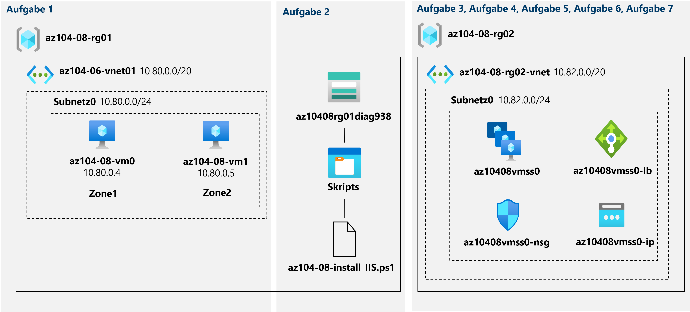

---
lab:
  title: '08: Verwalten von VMs'
  module: Module 08 - Virtual Machines
---

# <a name="lab-08---manage-virtual-machines"></a>Lab 08: Verwalten von VMs
# <a name="student-lab-manual"></a>Lab-Handbuch für Kursteilnehmer

## <a name="lab-scenario"></a>Labszenario

You were tasked with identifying different options for deploying and configuring Azure virtual machines. First, you need to determine different compute and storage resiliency and scalability options you can implement when using Azure virtual machines. Next, you need to investigate compute and storage resiliency and scalability options that are available when using Azure virtual machine scale sets. You also want to explore the ability to automatically configure virtual machines and virtual machine scale sets by using the Azure Virtual Machine Custom Script extension.

## <a name="objectives"></a>Ziele

Dieses Lab deckt Folgendes ab:

+ Aufgabe 1: Bereitstellen zonenresilienter VMs mithilfe des Azure-Portals und einer Azure Resource Manager-Vorlage
+ Aufgabe 2: Konfigurieren von Azure-VMs mithilfe von VM-Erweiterungen
+ Aufgabe 3: Skalieren von Compute und Speicher für Azure-VMs
+ Aufgabe 4: Registrieren der Microsoft.Insights- und Microsoft.AlertsManagement-Ressourcenanbieter.
+ Aufgabe 5: Bereitstellen zonenresilienter Azure-VM-Skalierungsgruppen mithilfe des Azure-Portals
+ Aufgabe 6: Konfigurieren von Azure-VM-Skalierungsgruppen mithilfe von VM-Erweiterungen
+ Aufgabe 7: Skalieren von Compute und Speicher für Azure-VM-Skalierungsgruppen (optional)

## <a name="estimated-timing-50-minutes"></a>Geschätzte Zeit: 50 Minuten

## <a name="architecture-diagram"></a>Architekturdiagramm




## <a name="instructions"></a>Anweisungen

### <a name="exercise-1"></a>Übung 1

#### <a name="task-1-deploy-zone-resilient-azure-virtual-machines-by-using-the-azure-portal-and-an-azure-resource-manager-template"></a>Aufgabe 1: Bereitstellen zonenresilienter VMs mithilfe des Azure-Portals und einer Azure Resource Manager-Vorlage

In dieser Aufgabe stellen Sie Azure-VMs in verschiedenen Verfügbarkeitszonen bereit, indem Sie das Azure-Portal und eine Azure Resource Manager-Vorlage verwenden.

1. Melden Sie sich beim [Azure-Portal](http://portal.azure.com) an.

1. Suchen Sie im Azure-Portal nach **Virtuelle Computer**, und wählen Sie diese Option aus. Klicken Sie auf dem Blatt **Virtuelle Computer** auf **+ Erstellen** und dann auf **+ Virtueller Azure-Computer**.

1. Geben Sie auf dem Blatt **Virtuellen Computer erstellen** auf der Registerkarte **Grundeinstellungen** die folgenden Einstellungen an (übernehmen Sie die Standardwerte für andere Einstellungen):

    | Einstellung | Wert |
    | --- | --- |
    | Subscription | Der Name des Azure-Abonnements, das Sie in diesem Lab verwenden. |
    | Resource group | Der Name einer neuen Ressourcengruppe **az104-08-rg01**. |
    | Name des virtuellen Computers | **az104-08-vm0** |
    | Region | Wählen Sie eine der Regionen aus, die Verfügbarkeitszonen unterstützen und in der Sie Azure-VMs bereitstellen können. |
    | Verfügbarkeitsoptionen | **Verfügbarkeitszone** |
    | Verfügbarkeitszone | **Zone 1** |
    | Image | **Windows Server 2019 Datacenter, Gen1/Gen2** |
    | Azure Spot-Instanz | **Nein** |
    | Size | **Standard D2s v3** |
    | Username | **Kursteilnehmer** |
    | Kennwort | **Bereitstellen eines sicheren Kennworts** |
    | Öffentliche Eingangsports | **None** |
    | Möchten Sie eine vorhandene Windows Server-Lizenz verwenden? | **Nicht aktiviert** |

1. Klicken Sie auf **Weiter: Datenträger >** , und geben Sie auf der Registerkarte **Datenträger** des Blatts **Virtuellen Computer erstellen** die folgenden Einstellungen an (übernehmen Sie die Standardwerte für andere Einstellungen):

    | Einstellung | Wert |
    | --- | --- |
    | Typ des Betriebssystemdatenträgers | **SSD Premium** |
    | Ultra Disks-Kompatibilität aktivieren | **Nicht aktiviert** |

1. Klicken Sie auf **Weiter: Netzwerk >** , und klicken Sie auf der Registerkarte **Netzwerk** des Blatts **Virtuellen Computer erstellen** unter dem Textfeld **Virtuelles Netzwerk** auf die Option **Neu erstellen**.

1. Geben Sie auf dem Blatt **Neues Netzwerk erstellen** die folgenden Einstellungen an (übernehmen Sie die Standardwerte für andere Einstellungen):

    | Einstellung | Wert |
    | --- | --- |
    | Name | **az104-08-rg01-vnet** |
    | Adressbereich | **10.80.0.0/20** |
    | Subnetzname | **subnet0** |
    | Subnetzbereich | **10.80.0.0/24** |

1. Klicken Sie auf **OK**, und geben Sie auf der Registerkarte **Netzwerk** des Blatts **Virtuellen Computer erstellen** die folgenden Einstellungen an (übernehmen Sie die Standardwerte für andere Einstellungen):

    | Einstellung | Wert |
    | --- | --- |
    | Subnet | **subnet0** |
    | Öffentliche IP-Adresse | **default** |
    | NIC-Netzwerksicherheitsgruppe | **basic** |
    | Öffentliche Eingangsports | **None** |
    | Beschleunigte Netzwerke | **Deaktiviert**
    | Diese VM hinter einer vorhandenen Lastenausgleichslösung platzieren? | **Nicht aktiviert** |

1. Klicken Sie auf **Weiter: Verwaltung >** , und geben Sie dann auf der Registerkarte **Verwaltung** des Blatts **Virtuellen Computer erstellen** die folgenden Einstellungen an (übernehmen Sie die Standardwerte für andere Einstellungen):

    | Einstellung | Wert |
    | --- | --- |
    | Startdiagnose | **Mit benutzerdefiniertem Speicherkonto aktivieren** |
    | Diagnosespeicherkonto | Akzeptieren Sie den Standardwert. |
    | Optionen zur Patchorchestrierung | **Manuelle Updates** |  

    ><bpt id="p1">**</bpt>Note<ept id="p1">**</ept>: If necessary, select an existing storage account in the dropdown list or create a new storage account. Record the name of the storage account. You will use it in the next task.

1. Klicken Sie auf **Weiter: Erweitert >** , und überprüfen Sie auf der Registerkarte **Erweitert** des Blatts **Virtuellen Computer erstellen** die verfügbaren Einstellungen, ohne sie zu ändern, und klicken Sie dann auf **Überprüfen und erstellen**.

1. Klicken Sie auf dem Blatt **Überprüfen und erstellen** auf **Erstellen**.

1. Klicken Sie auf dem Blatt „Bereitstellung“ auf **Vorlage**.

1. Überprüfen Sie die Vorlage, die die aktuelle Bereitstellung darstellt, und klicken Sie auf **Bereitstellen**.

    >**Hinweis**: Sie verwenden diese Option, um die zweite VM mit übereinstimmenden Konfigurationen mit Ausnahme der Verfügbarkeitszone bereitzustellen.

1. Geben Sie auf dem Blatt **Benutzerdefinierte Bereitstellung** die folgenden Einstellungen an (übernehmen Sie die Standardwerte für andere Einstellungen):

    | Einstellung | Wert |
    | --- | --- |
    | Ressourcengruppe | **az104-08-rg01** |
    | Name der Netzwerkschnittstelle | **az104-08-vm1-nic1** |
    | Öffentliche IP-Adresse | **az104-08-vm1-ip** |
    | Name des virtuellen Computers, Name1 des virtuellen Computers, Computername des virtuellen Computers   | **az104-08-vm1** |
    | Ressourcengruppe des virtuellen Computers | **az104-08-rg01** |    
    | Administratorbenutzername | **Kursteilnehmer** |
    | Administratorkennwort | **Bereitstellen eines sicheren Kennworts**  |
    | Hotpatching aktivieren | **false** |
    | Zone | **2** |

    >**Hinweis**: Sie müssen Parameter ändern, die den Eigenschaften der unterschiedlichen Ressourcen entsprechen, die Sie mithilfe der Vorlage bereitstellen, einschließlich der VM und ihrer Netzwerkschnittstelle.

1. Klicken Sie auf **Überprüfen und erstellen**, und klicken Sie dann auf dem Blatt **Überprüfen und erstellen** auf **Erstellen**.

    ><bpt id="p1">**</bpt>Note<ept id="p1">**</ept>: Wait for both deployments to complete before you proceed to the next task. This might take about 5 minutes.

#### <a name="task-2-configure-azure-virtual-machines-by-using-virtual-machine-extensions"></a>Aufgabe 2: Konfigurieren von Azure-VMs mithilfe von VM-Erweiterungen

In dieser Aufgabe installieren Sie die Webserverrolle von Windows Server auf den beiden Azure-VMs, die Sie in der vorherigen Aufgabe bereitgestellt haben, indem Sie die benutzerdefinierte Azure Virtual Machine-Skripterweiterung verwenden.

1. Suchen Sie im Azure-Portal nach der Option **Speicherkonten**, und wählen Sie sie aus. Klicken Sie auf dem Blatt **Speicherkonten** auf den Eintrag, der das Diagnosespeicherkonto darstellt, das Sie in der vorherigen Aufgabe erstellt haben.

1. Klicken Sie auf dem Blatt „Speicherkonto“ im Abschnitt **Datenspeicher** auf **Container** und dann auf **+ Container**.

1. Geben Sie auf dem Blatt **Neuer Container** die folgenden Einstellungen an (übernehmen Sie die Standardwerte für andere Einstellungen), und klicken Sie dann auf **Erstellen**:

    | Einstellung | Wert |
    | --- | --- |
    | Name | **Skripts** |
    | Öffentliche Zugriffsebene | **Privat (kein anonymer Zugriff**) |

1. Klicken Sie auf dem Blatt „Speicherkonto“, auf dem die Liste der Container angezeigt wird, auf **Skripts**.

1. Klicken Sie auf dem Blatt **Skripts** auf **Hochladen**.

1. Klicken Sie auf dem Blatt **Blob hochladen** auf das Ordnersymbol, navigieren Sie im Dialogfeld **Öffnen** zum Ordner **\\Allfiles\\Labs\\08**, wählen Sie **az104-08-install_IIS.ps1** aus, klicken Sie auf **Öffnen**, und klicken Sie auf dem Blatt **Blob hochladen** auf **Hochladen**.

1. Suchen Sie im Azure-Portal nach **Virtuelle Computer**, und wählen Sie diese Option aus. Klicken Sie dann auf dem Blatt **Virtuelle Computer** auf **az104-08-vm0**.

1. Klicken Sie auf dem Blatt der VM **az104-08-vm0** im Abschnitt **Einstellungen** auf **Erweiterungen und Anwendungen** und dann auf **+ Hinzufügen**.

1. Klicken Sie auf dem Blatt **Erweiterung installieren** auf **Benutzerdefinierte Skripterweiterung** und dann auf **Weiter**.

1. Klicken Sie auf dem Blatt **Benutzerdefinierte Skripterweiterung konfigurieren** auf **Durchsuchen**.

1. Klicken Sie auf dem Blatt **Speicherkonten** auf den Namen des Speicherkontos, in das Sie das Skript **az104-08-install_IIS.ps1** hochgeladen haben, klicken Sie auf dem Blatt **Container** auf **Skripts**, klicken Sie auf dem Blatt **Skripts** auf **az104-08-install_IIS.ps1**, und klicken Sie dann auf **Auswählen**.

1. Klicken Sie auf dem Blatt **Erweiterung installieren** auf **Überprüfen und erstellen** und dann auf dem Blatt **Überprüfen und erstellen** auf **Erstellen**.

1. Suchen Sie im Azure-Portal nach **Virtuelle Computer**, und wählen Sie diese Option aus. Klicken Sie dann auf dem Blatt **Virtuelle Computer** auf **az104-08-vm1**.

1. Klicken Sie auf dem Blatt **az104-08-vm1** im Abschnitt **Automatisierung** auf **Vorlage exportieren**.

1. Klicken Sie auf dem Blatt **az104-08-vm1 - Vorlage exportieren** auf **Bereitstellen**.

1. Klicken Sie auf dem Blatt **Benutzerdefinierte Bereitstellung** auf **Vorlage bearbeiten**.

    ><bpt id="p1">**</bpt>Note<ept id="p1">**</ept>: Disregard the message stating <bpt id="p2">**</bpt>The resource group is in a location that is not supported by one or more resources in the template. Please choose a different resource group<ept id="p2">**</ept>. This is expected and can be ignored in this case.

1. Fügen Sie auf dem Blatt **Vorlage bearbeiten** in dem Abschnitt, in dem der Inhalt der Vorlage angezeigt wird, den folgenden Code ab Zeile **20** ein (direkt unterhalb der Zeile `"resources": [`):

   ><bpt id="p1">**</bpt>Note<ept id="p1">**</ept>: If you are using a tool that pastes the code in line by line intellisense may add extra brackets causing validation errors. You may want to paste the code into notepad first and then paste it into line 20.

   ```json
        {
            "type": "Microsoft.Compute/virtualMachines/extensions",
            "name": "az104-08-vm1/customScriptExtension",
            "apiVersion": "2018-06-01",
            "location": "[resourceGroup().location]",
            "dependsOn": [
                "az104-08-vm1"
            ],
            "properties": {
                "publisher": "Microsoft.Compute",
                "type": "CustomScriptExtension",
                "typeHandlerVersion": "1.7",
                "autoUpgradeMinorVersion": true,
                "settings": {
                    "commandToExecute": "powershell.exe Install-WindowsFeature -name Web-Server -IncludeManagementTools && powershell.exe remove-item 'C:\\inetpub\\wwwroot\\iisstart.htm' && powershell.exe Add-Content -Path 'C:\\inetpub\\wwwroot\\iisstart.htm' -Value $('Hello World from ' + $env:computername)"
              }
            }
        },

   ```

   >**Hinweis**: In diesem Abschnitt der Vorlage wird die gleiche benutzerdefinierte Azure Virtual Machine-Skripterweiterung definiert, die Sie zuvor auf der ersten VM über Azure PowerShell bereitgestellt haben.

1. Klicken Sie auf **Speichern** und dann auf dem Blatt **Benutzerdefinierte Vorlage** auf **Überprüfen und erstellen**, und klicken Sie auf dem Blatt **Überprüfen und erstellen** auf **Erstellen**.

    >Sie wurden damit beauftragt, verschiedene Optionen zum Bereitstellen und Konfigurieren von Azure-VMs zu identifizieren.

1. Um zu überprüfen, ob die auf der benutzerdefinierten Skripterweiterung basierende Konfiguration erfolgreich war, navigieren Sie zurück zum Blatt von **az104-08-vm1**, klicken Sie im Abschnitt **Vorgänge** auf **Befehl ausführen**, und klicken Sie in der Liste der Befehle auf **RunPowerShellScript**.

1. Geben Sie auf dem Blatt **Skriptausführung** Folgendes ein, und klicken Sie auf **Ausführen**, um auf die Website zuzugreifen, die unter **az104-08-vm0** gehostet wird:

   ```powershell
   Invoke-WebRequest -URI http://10.80.0.4 -UseBasicParsing
   ```

    >**Hinweis**: Der Parameter **-UseBasicParsing** ist erforderlich, um eine Abhängigkeit von Internet Explorer zu beseitigen und die Ausführung des Cmdlets abzuschließen.

    >**Hinweis**: Sie können auch eine Verbindung mit **az104-08-vm0** herstellen und `Invoke-WebRequest -URI http://10.80.0.5 -UseBasicParsing` ausführen, um auf die unter **az104-08-vm1** gehostete Website zuzugreifen.

#### <a name="task-3-scale-compute-and-storage-for-azure-virtual-machines"></a>Aufgabe 3: Skalieren von Compute und Speicher für Azure-VMs

In dieser Aufgabe skalieren Sie Computeressourcen für Azure-VMs, indem Sie ihre Größe ändern und ihren Speicher skalieren, indem Sie ihre Datenträger anfügen und konfigurieren.

1. Suchen Sie im Azure-Portal nach **Virtuelle Computer**, und wählen Sie diese Option aus. Klicken Sie dann auf dem Blatt **Virtuelle Computer** auf **az104-08-vm0**.

1. Klicken Sie auf dem Blatt der VM **az104-08-vm0** auf **Größe**, und legen Sie die Größe der VM auf **Standard DS1_v2** fest. Klicken Sie anschließend auf **Größe ändern**.

    >**Hinweis**: Wählen Sie eine andere Größe aus, wenn **Standard DS1_v2** nicht verfügbar ist.

1. Klicken Sie auf dem Blatt der VM **az104-08-vm0** auf **Datenträger**, und klicken Sie unter **Datenträger** auf **+ Neuen Datenträger erstellen und anfügen**.

1. Erstellen Sie einen verwalteten Datenträger mit den folgenden Einstellungen (übernehmen Sie für andere Einstellungen die Standardwerte):

    | Einstellung | Wert |
    | --- | --- |
    | Name des Datenträgers | **az104-08-vm0-datadisk-0** |
    | Speichertyp | **SSD Premium** |
    | Größe (GiB| **1024** |

1. Klicken Sie auf dem Blatt **az104-08-vm0 - Datenträger** unter **Datenträger** auf **+ Neuen Datenträger erstellen und anfügen**.

1. Erstellen Sie einen verwalteten Datenträger mit den folgenden Einstellungen (übernehmen Sie für andere Einstellungen die Standardwerte), und speichern Sie die Änderungen:

    | Einstellung | Wert |
    | --- | --- |
    | Name des Datenträgers | **az104-08-vm0-datadisk-1** |
    | Speichertyp | **SSD Premium** |
    | Größe (GiB)| **1024 GiB** |

1. Klicken Sie auf **dem Blatt az104-08-vm0 - Datenträger** auf **Speichern**.

1. Klicken Sie auf dem Blatt **az104-08-vm0** im Abschnitt **Vorgänge** auf **Skriptausführung**, und klicken Sie in der Liste der Befehle **auf RunPowerShellScript**.

1. Geben Sie auf dem Blatt **Skriptausführung** Folgendes ein, und klicken Sie auf **Ausführen**, um ein Laufwerk „Z:“ zu erstellen, das aus den beiden neu angefügten Datenträgern mit dem einfachen Layout und der festen Bereitstellung besteht:

   ```powershell
   New-StoragePool -FriendlyName storagepool1 -StorageSubsystemFriendlyName "Windows Storage*" -PhysicalDisks (Get-PhysicalDisk -CanPool $true)

   New-VirtualDisk -StoragePoolFriendlyName storagepool1 -FriendlyName virtualdisk1 -Size 2046GB -ResiliencySettingName Simple -ProvisioningType Fixed

   Initialize-Disk -VirtualDisk (Get-VirtualDisk -FriendlyName virtualdisk1)

   New-Partition -DiskNumber 4 -UseMaximumSize -DriveLetter Z
   ```

    > **Hinweis**: Warten Sie auf die Bestätigung, dass die Befehle erfolgreich abgeschlossen wurden.

1. Suchen Sie im Azure-Portal nach **Virtuelle Computer**, und wählen Sie diese Option aus. Klicken Sie dann auf dem Blatt **Virtuelle Computer** auf **az104-08-vm1**.

1. Klicken Sie auf dem Blatt **az104-08-vm1** im Abschnitt **Automatisierung** auf **Vorlage exportieren**.

1. Klicken Sie auf dem Blatt **az104-08-vm1 - Vorlage exportieren** auf **Bereitstellen**.

1. Klicken Sie auf dem Blatt **Benutzerdefinierte Bereitstellung** auf **Vorlage bearbeiten**.

    >Zunächst müssen Sie verschiedene Compute- und Speicherresilienz- sowie Skalierbarkeitsoptionen ermitteln, die Sie bei der Verwendung von Azure-VMs implementieren können.

1. Ersetzen Sie auf dem Blatt **Vorlage bearbeiten** in dem Abschnitt, in dem der Inhalt der Vorlage angezeigt wird, die Zeile **30** `"vmSize": "Standard_D2s_v3"` durch die folgende Zeile ):

   ```json
                    "vmSize": "Standard_DS1_v2"

   ```

    >**Hinweis**: In diesem Abschnitt der Vorlage wird die gleiche Azure-VM-Größe wie für die erste VM über das Azure-Portal definiert.

1. Ersetzen Sie auf dem Blatt **Vorlage bearbeiten** im Abschnitt mit dem Inhalt der Vorlage die Zeile **51** (Zeile `"dataDisks": [ ]`) durch den folgenden Code:

   ```json
                    "dataDisks": [
                      {
                        "lun": 0,
                        "name": "az104-08-vm1-datadisk0",
                        "diskSizeGB": "1024",
                        "caching": "ReadOnly",
                        "createOption": "Empty"
                      },
                      {
                        "lun": 1,
                        "name": "az104-08-vm1-datadisk1",
                        "diskSizeGB": "1024",
                        "caching": "ReadOnly",
                        "createOption": "Empty"
                      }
                    ]
   ```

    >Im nächsten Schritt müssen Sie Compute-, Speicherresilienz- und Skalierbarkeitsoptionen untersuchen, die bei Verwendung von Azure-VM-Skalierungsgruppen verfügbar sind.

    >**Hinweis**: In diesem Abschnitt der Vorlage werden zwei verwaltete Datenträger erstellt und an **az104-08-vm1** angefügt. Dies ähnelt der Speicherkonfiguration der ersten VM über das Azure-Portal.


1. Klicken Sie auf **Speichern** und dann auf dem Blatt **Benutzerdefinierte Bereitstellung** auf **Überprüfen und erstellen**. Klicken Sie dann auf dem Blatt **Überprüfen und erstellen** auf **Erstellen**.

    >Sie möchten auch die Möglichkeit untersuchen, VMs und VM-Skalierungsgruppen automatisch zu konfigurieren, indem Sie die benutzerdefinierte Azure Virtual Machine-Skripterweiterung verwenden.

1. Klicken Sie auf dem Blatt **az104-08-vm1** im Abschnitt **Vorgänge** auf **Skriptausführung**, und klicken Sie in der Liste der Befehle **auf RunPowerShellScript**.

1. Geben Sie auf dem Blatt **Skriptausführung** Folgendes ein, und klicken Sie auf **Ausführen**, um ein Laufwerk „Z:“ zu erstellen, das aus den beiden neu angefügten Datenträgern mit dem einfachen Layout und der festen Bereitstellung besteht:

   ```powershell
   New-StoragePool -FriendlyName storagepool1 -StorageSubsystemFriendlyName "Windows Storage*" -PhysicalDisks (Get-PhysicalDisk -CanPool $true)

   New-VirtualDisk -StoragePoolFriendlyName storagepool1 -FriendlyName virtualdisk1 -Size 2046GB -ResiliencySettingName Simple -ProvisioningType Fixed

   Initialize-Disk -VirtualDisk (Get-VirtualDisk -FriendlyName virtualdisk1)

   New-Partition -DiskNumber 4 -UseMaximumSize -DriveLetter Z
   ```

    > **Hinweis**: Warten Sie auf die Bestätigung, dass die Befehle erfolgreich abgeschlossen wurden.

#### <a name="task-4-register-the-microsoftinsights-and-microsoftalertsmanagement-resource-providers"></a>Aufgabe 4: Registrieren der Microsoft.Insights- und Microsoft.AlertsManagement-Ressourcenanbieter.

1. Öffnen Sie **Azure Cloud Shell** im Azure-Portal, indem Sie oben rechts im Azure-Portal auf das entsprechende Symbol klicken.

1. Wenn Sie aufgefordert werden, entweder **Bash** oder **PowerShell** auszuwählen, wählen Sie **PowerShell** aus.

    >**Hinweis**: Wenn Sie **Cloud Shell** zum ersten Mal starten und die Meldung **Für Sie wurde kein Speicher bereitgestellt** angezeigt wird, wählen Sie das Abonnement aus, das Sie in diesem Lab verwenden, und klicken Sie dann auf **Speicher erstellen**.

1. Führen Sie im Cloud Shell-Bereich Folgendes aus, um die Microsoft.Insights- und Microsoft.AlertsManagement-Ressourcenanbieter zu registrieren.

   ```powershell
   Register-AzResourceProvider -ProviderNamespace Microsoft.Insights

   Register-AzResourceProvider -ProviderNamespace Microsoft.AlertsManagement
   ```

#### <a name="task-5-deploy-zone-resilient-azure-virtual-machine-scale-sets-by-using-the-azure-portal"></a>Aufgabe 5: Bereitstellen zonenresilienter Azure-VM-Skalierungsgruppen mithilfe des Azure-Portals

In dieser Aufgabe stellen Sie eine Azure-VM-Skalierungsgruppe über Verfügbarkeitszonen hinweg mithilfe des Azure-Portals bereit.

1. Suchen Sie im Azure-Portal nach **VM-Skalierungsgruppen**, und wählen Sie diese Option aus. Klicken Sie auf dem Blatt **VM-Skalierungsgruppen** auf **+ Hinzufügen** (oder auf **+ Erstellen**).

1. Geben Sie auf der Registerkarte **Grundeinstellungen** des Blatts **VM-Skalierungsgruppe erstellen** die folgenden Einstellungen an (übernehmen Sie die Standardwerte für andere Einstellungen), und klicken Sie auf **Weiter: Datenträger >** :

    | Einstellung | Wert |
    | --- | --- |
    | Subscription | Der Name des Azure-Abonnements, das Sie in diesem Lab verwenden. |
    | Resource group | Der Name einer neuen Ressourcengruppe **az104-08-rg02**. |
    | Name der VM-Skalierungsgruppe | **az10408vmss0** |
    | Region | Wählen Sie eine der Regionen aus, die Verfügbarkeitszonen unterstützen und in denen Sie Azure-VMs bereitstellen können, die sich von der Region unterscheidet, in der Sie zuvor in diesem Lab VMs bereitgestellt haben. |
    | Verfügbarkeitszone | **Zonen 1, 2, 3** |
    | Image | **Windows Server 2019 Datacenter, Gen2** |
    | Azure Spot-Instanz | **Nein** |
    | Size | **Standard D2s_v3** |
    | Username | **Kursteilnehmer** |
    | Kennwort | **Bereitstellen eines sicheren Kennworts**  |
    | Sie verfügen bereits über eine Windows Server-Lizenz? | **Nicht aktiviert** |

    >**Hinweis**: Eine Liste der Azure-Regionen, die die Bereitstellung von Windows-VMs in Verfügbarkeitszonen unterstützen, finden Sie unter [Was sind Verfügbarkeitszonen in Azure?](https://docs.microsoft.com/en-us/azure/availability-zones/az-overview)

1. Übernehmen Sie auf der Registerkarte **Datenträger** des Blatts **VM-Skalierung gruppe erstellen** die Standardwerte, und klicken Sie auf **Weiter: Netzwerk >** .

1. Klicken Sie auf der Registerkarte **Netzwerk** des Blatts **VM-Skalierungsgruppe erstellen** auf den Link **Virtuelles Netzwerk erstellen** unter dem Textfeld **Virtuelles Netzwerk**, und erstellen Sie ein neues virtuelles Netzwerk mit den folgenden Einstellungen (übernehmen Sie die Standardwerte für andere Einstellungen):

    | Einstellung | Wert |
    | --- | --- |
    | Name | **az104-08-rg02-vnet** |
    | Adressbereich | **10.82.0.0/20** |
    | Subnetzname | **subnet0** |
    | Subnetzbereich | **10.82.0.0/24** |

    >**Hinweis**: Nachdem Sie ein neues virtuelles Netzwerk erstellt haben und zur Registerkarte **Netzwerke** des Blatts **VM-Skalierungsgruppe erstellen** zurückkehren, wird der Wert **Virtuelles Netzwerk** automatisch auf **az104-08-rg02-vnet** festgelegt.

1. Klicken Sie auf der Registerkarte **Netzwerk** des Blatts **VM-Skalierung gruppe erstellen** rechts neben dem Eintrag für die Netzwerkschnittstelle auf das Symbol **Netzwerkschnittstelle bearbeiten**.

1. Klicken Sie auf dem Blatt **Netzwerkschnittstelle bearbeiten** im Abschnitt **NIC-Netzwerksicherheitsgruppe** auf **Erweitert**, und klicken Sie unte der Dropdownliste **Netzwerksicherheitsgruppe konfigurieren** auf **Neu erstellen**.

1. Geben Sie auf dem Blatt **Netzwerksicherheitsgruppe erstellen** die folgenden Einstellungen an (übernehmen Sie die Standardwerte für andere Einstellungen):

    | Einstellung | Wert |
    | --- | --- |
    | Name | **az10408vmss0-nsg** |

1. Klicken Sie auf **Eingangsregel hinzufügen**, und fügen Sie eine Sicherheitsregel für eingehenden Datenverkehr mit den folgenden Einstellungen hinzu (übernehmen Sie für andere Einstellungen die Standardwerte):

    | Einstellung | Wert |
    | --- | --- |
    | `Source` | **Alle** |
    | Source port ranges | **\*** |
    | Destination | **Alle** |
    | Zielportbereiche | **80** |
    | Protokoll | **TCP** |
    | Aktion | **Zulassen** |
    | Priorität | **1010** |
    | Name | **custom-allow-http** |

1. Klicken Sie auf **Hinzufügen**, und klicken Sie auf dem Blatt **Netzwerksicherheitsgruppe erstellen** auf **OK**.

1. Klicken Sie auf dem **Blatt Netzwerkschnittstelle bearbeiten** im Abschnitt **Öffentliche IP-Adresse** auf **Aktiviert**, und klicken Sie dann auf **OK**.

1. Stellen Sie auf der Registerkarte **Netzwerk** des Blatts **VM-Skalierungsgruppe erstellen** unter dem Abschnitt **Lastenausgleich** sicher, dass der Eintrag **Lastenausgleich verwenden** ausgewählt ist, und legen Sie die folgenden **Lastenausgleichseinstellungen** fest (übernehmen Sie die Standardwerte für andere Einstellungen), und klicken Sie auf **Weiter: Skalierung >** :

    | Einstellung | Wert |
    | --- | --- |
    | Optionen für den Lastenausgleich | **Azure Load Balancer** |
    | Wählen Sie einen Lastenausgleich aus. | **(neu) az10408vmss0-lb** |
    | Wählen Sie einen Back-End-Pool aus. | **(neu) bepool** |

1. Geben Sie auf der Registerkarte **Skalierung** des Blatts **VM-Skalierungsgruppe erstellen** die folgenden Einstellungen an (übernehmen Sie die Standardwerte für andere Einstellungen), und klicken Sie auf **Weiter: Verwaltung >** :

    | Einstellung | Wert |
    | --- | --- |
    | Anfängliche Anzahl der Instanzen | **2** |
    | Skalierungsrichtlinie | **Manuell** |

1. Geben Sie auf der Registerkarte **Verwaltung** des Blatts **VM-Skalierungsgruppe erstellen** die folgenden Einstellungen an (übernehmen Sie die Standardwerte für andere Einstellungen):

    | Einstellung | Wert |
    | --- | --- |
    | Startdiagnose | **Mit benutzerdefiniertem Speicherkonto aktivieren** |
    | Diagnosespeicherkonto | Akzeptieren Sie den Standardwert. |

    >**Hinweis**: Sie benötigen den Namen dieses Speicherkontos in der nächsten Aufgabe.

   Klicken Sie auf **Weiter > Integrität >** :

1. Überprüfen Sie auf der Registerkarte **Integrität** des Blatts **VM-Skalierungsgruppe erstellen** die Standardeinstellungen, ohne Änderungen vorzunehmen, und klicken Sie auf **Weiter: Erweitert >** .

1. Geben Sie auf der Registerkarte **Erweitert** des Blatts **VM-Skalierungsgruppe erstellen** die folgenden Einstellungen an (übernehmen Sie die Standardwerte für andere Einstellungen), und klicken Sie auf **Überprüfen und erstellen**.

    | Einstellung | Wert |
    | --- | --- |
    | Zuweisungsalgorithmus | **Feste Zuweisung (bei Zonen nicht empfohlen)** |

    >**Hinweis**: Die **Einstellung Maximale Zuweisung** ist derzeit nicht funktionsfähig.

1. Stellen Sie auf der Registerkarte **Überprüfen und erstellen** des Blatts **VM-Skalierung gruppe erstellen** sicher, dass die Überprüfung erfolgreich war, und klicken Sie auf **Erstellen**.

    ><bpt id="p1">**</bpt>Note<ept id="p1">**</ept>: Wait for the virtual machine scale set deployment to complete. This should take about 5 minutes.

#### <a name="task-6-configure-azure-virtual-machine-scale-sets-by-using-virtual-machine-extensions"></a>Aufgabe 6: Konfigurieren von Azure-VM-Skalierungsgruppen mithilfe von VM-Erweiterungen

In dieser Aufgabe installieren Sie die Webserverrolle von Windows Server für die Instanzen der Azure-VM-Skalierungsgruppe, die Sie in der vorherigen Aufgabe bereitgestellt haben, indem Sie die benutzerdefinierte Azure Virtual Machine-Skripterweiterung verwenden.

1. Suchen Sie im Azure-Portal nach der Option **Speicherkonten**, und wählen Sie sie aus. Klicken Sie auf dem Blatt **Speicherkonten** auf den Eintrag, der das Diagnosespeicherkonto darstellt, das Sie in der vorherigen Aufgabe erstellt haben.

1. Klicken Sie auf dem Blatt „Speicherkonto“ im Abschnitt **Datenspeicher** auf **Container** und dann auf **+ Container**.

1. Geben Sie auf dem Blatt **Neuer Container** die folgenden Einstellungen an (übernehmen Sie die Standardwerte für andere Einstellungen), und klicken Sie dann auf **Erstellen**:

    | Einstellung | Wert |
    | --- | --- |
    | Name | **Skripts** |
    | Öffentliche Zugriffsebene | **Privat (kein anonymer Zugriff**) |

1. Klicken Sie auf dem Blatt „Speicherkonto“, auf dem die Liste der Container angezeigt wird, auf **Skripts**.

1. Klicken Sie auf dem Blatt **Skripts** auf **Hochladen**.

1. Klicken Sie auf dem Blatt **Blob hochladen** auf das Ordnersymbol, navigieren Sie im Dialogfeld **Öffnen** zum Ordner **\\Allfiles\\Labs\\08**, wählen Sie **az104-08-install_IIS.ps1** aus, klicken Sie auf **Öffnen**, und klicken Sie auf dem Blatt **Blob hochladen** auf **Hochladen**.

1. Navigieren Sie im Azure-Portal zurück zum Blatt **VM-Skalierungsgruppen**, und klicken Sie auf **az10408vmss0**.

1. Klicken Sie auf dem Blatt **az10408vmss0** im Abschnitt **Einstellungen** auf **Erweiterungen** und dann auf **+ Hinzufügen**.

1. Klicken Sie auf dem Blatt **Neue Ressource** auf **Benutzerdefinierte Skripterweiterung** und dann auf **Weiter**.

1. **Navigieren** Sie auf dem Blatt **Erweiterung installieren** zum Skript **az104-08-install_IIS.ps1**, das zuvor in dieser Aufgabe in den Container **Skripts** im Speicherkonto hochgeladen wurde. **Wählen** Sie es aus, und klicken Sie dann auf **Erstellen**.

    >**Hinweis**: Warten Sie, bis die Installation der Erweiterung abgeschlossen wurde, bevor Sie mit dem nächsten Schritt fortfahren.

1. Klicken Sie im Abschnitt **Einstellungen** des Blatts **az10408vmss0** auf **Instanzen**, aktivieren Sie die Kontrollkästchen neben den beiden Instanzen der VM-Skalierungsgruppe, klicken Sie auf **Upgrade**, und klicken Sie dann, wenn Sie zur Bestätigung aufgefordert werden, auf **Ja**.

    >**Hinweis**: Warten Sie, bis das Upgrade abgeschlossen wurde, bevor Sie mit dem nächsten Schritt fortfahren.

1. Suchen Sie im Azure-Portal nach **Lastenausgleich**, und wählen Sie diese Option aus. Klicken Sie in der Liste der Lastenausgleichsmodule auf **az10408vmss0-lb**.

1. Verwenden Sie aus dem Blatt **az10408vmss0-lb** den Wert für die **Öffentliche IP-Adresse**, die dem Front-End des Lastenausgleichs zugewiesen ist, öffnen Sie eine neue Browserregisterkarte, und navigieren Sie zu dieser IP-Adresse.

    >**Hinweis**: Stellen Sie sicher, dass auf der Browserseite der Name einer der Instanzen der Azure-VM-Skalierungsgruppe **az10408vmss0** angezeigt wird.

#### <a name="task-7-scale-compute-and-storage-for-azure-virtual-machine-scale-sets"></a>Aufgabe 7: Skalieren von Compute und Speicher für Azure-VM-Skalierungsgruppen

In dieser Aufgabe ändern Sie die Größe der Instanzen der VM-Skalierungsgruppen, konfigurieren deren Einstellungen für automatische Skalierung und fügen Datenträger an diese an.

1. Suchen Sie im Azure-Portal nach nach**VM-Skalierungsgruppe**, und wählen Sie diese Option aus. Wählen Sie dann die Skalierungsgruppe **az10408vmss0** aus.

1. Klicken Sie auf dem Blatt **az10408vmss0** im Abschnitt **Einstellungen** auf **Größe**.

1. Wählen Sie in der Liste der verfügbaren Größen **Standard DS1_v2** aus, und klicken Sie auf **Größe ändern**.

1. Klicken Sie im Abschnitt **Einstellungen** auf **Instanzen**, aktivieren Sie die Kontrollkästchen neben den beiden Instanzen der VM-Skalierungsgruppe, klicken Sie auf **Upgrade**, und klicken Sie dann, wenn Sie zur Bestätigung aufgefordert werden, auf **Ja**.

1. Klicken Sie in der Liste der Instanzen auf den Eintrag, der die erste Instanz darstellt, und notieren Sie sich aus dem Blatt „Skalierungssatzinstanz“ den **Standort** (es sollte eine der Zonen in der Azure-Zielregion sein, in der Sie die Azure-VM-Skalierungsgruppe bereitgestellt haben).

1. Klicken Sie zum Blatt **az10408vmss0 - Instanzen** zurück, klicken Sie in der Liste der Instanzen auf den Eintrag, der die zweite Instanz darstellt, und notieren Sie sich den **Standort** (es sollte eine der anderen zwei Zonen in der Azure-Zielregion sein, in der Sie die Azure-VM-Skalierungsgruppe bereitgestellt haben).

1. Kehren Sie zum Blatt **az10408vmss0 - Instanzen** zurück, und klicken Sie im Abschnitt **Einstellungen** auf **Skalierung**.

1. Wählen Sie auf dem Blatt **az10408vmss0 - Skalierung** die Option **Benutzerdefinierte automatische Skalierung** aus, und konfigurieren Sie die automatische Skalierung mit den folgenden Einstellungen (übernehmen Sie die Standardwerte für andere Einstellungen):

    | Einstellung | Wert |
    | --- |--- |
    | Skalierungsmodus | **Skalierung basierend auf einer Metrik** |

1. Klicken Sie auf den Link **+ Regel hinzufügen**, und geben Sie auf dem Blatt **Skalierungsregel** die folgenden Einstellungen an (übernehmen Sie die Standardwerte für andere Einstellungen):

    | Einstellung | Wert |
    | --- |--- |
    | Metrikquelle | **Aktuelle Ressource (az10480vmss0)** |
    | Zeitaggregation | **Average** |
    | Metriknamespace | **Host für virtuelle Computer** |
    | Metrikname | **Eingehender Netzwerkverkehr gesamt** |
    | Betreiber | **Größer als** |
    | Metrikschwellenwert zum Auslösen der Skalierungsaktion | **10** |
    | Dauer (in Minuten) | **1** |
    | Statistik zum Aggregationsintervall | **Average** |
    | Vorgang | **Anzahl erhöhen um** |
    | Anzahl von Instanzen | **1** |
    | Abkühlen (Minuten) | **5** |

    >**Hinweis**: Diese Werte stellen natürlich keine realistische Konfiguration dar, da es ihr Zweck ist, automatische Skalierung so schnell wie möglich ohne längere Wartezeit auszulösen.

1. Klicken Sie auf **Hinzufügen**, und geben Sie auf dem Blatt **az10408vmss0 - Skalierung** die folgenden Einstellungen an (übernehmen Sie die Standardwerte für andere Einstellungen):

    | Einstellung | Wert |
    | --- |--- |
    | Instanzgrenzwerte Minimum | **1** |
    | Instanzgrenzwerte Maximum | **3** |
    | Instanzgrenzwerte Standardeinstellung | **1** |

1. Klicken Sie auf **Speichern**.

1. Öffnen Sie **Azure Cloud Shell** im Azure-Portal, indem Sie oben rechts im Azure-Portal auf das entsprechende Symbol klicken.

1. Wenn Sie aufgefordert werden, entweder **Bash** oder **PowerShell** auszuwählen, wählen Sie **PowerShell** aus.

1. Führen Sie im Cloud Shell-Bereich Folgendes aus, um die öffentliche IP-Adresse des Lastenausgleichs vor der Azure-VM-Skalierungsgruppe **az10408vmss0** zu identifizieren.

   ```powershell
   $rgName = 'az104-08-rg02'

   $lbpipName = 'az10408vmss0-ip'

   $pip = (Get-AzPublicIpAddress -ResourceGroupName $rgName -Name $lbpipName).IpAddress
   ```

1. Führen Sie im Cloud Shell-Bereich Folgendes aus, um eine Endlosschleife zu starten, die die HTTP-Anforderungen an die Websites sendet, die in den Instanzen der Azure-VM-Skalierungsgruppe **az10408vmss0** gehostet werden.

   ```powershell
   while ($true) { Invoke-WebRequest -Uri "http://$pip" }
   ```

1. Minimieren Sie den Cloud Shell-Bereich, schließen Sie ihn jedoch nicht. Wechseln Sie zurück zum Blatt **az10408vmss0 - Instanzen**, und überwachen Sie die Anzahl der Instanzen.

    >**Hinweis**: Möglicherweise müssen Sie einige Minuten warten und auf **Aktualisieren** klicken.

1. Nachdem die dritte Instanz bereitgestellt wurde, navigieren Sie zu ihrem Blatt, um ihren **Standort** zu bestimmen (er sollte sich von den ersten beiden Zonen unterscheiden, die Sie zuvor in dieser Aufgabe identifiziert haben).

1. Schließen Sie den Cloud Shell-Bereich.

1. Klicken Sie auf dem Blatt **az10408vmss0** im **Abschnitt Einstellungen** auf **Datenträger**, klicken Sie auf **+ Neuen Datenträger erstellen und anfügen**, und fügen Sie einen neuen verwalteten Datenträger mit den folgenden Einstellungen an (übernehmen Sie für andere Einstellungen die Standardwerte):

    | Einstellung | Wert |
    | --- | --- |
    | LUN | **0** |
    | Speichertyp | **HDD Standard** |
    | Größe (GiB) | **32** |

1. Speichern Sie die Änderung, und klicken Sie im Abschnitt **Einstellungen** des Blatts **az10408vmss0** auf **Instanzen**, aktivieren Sie die Kontrollkästchen neben den Instanzen der VM-Skalierungsgruppe, klicken Sie auf **Upgrade**, und klicken Sie dann, wenn Sie zur Bestätigung aufgefordert werden, auf **Ja**.

    ><bpt id="p1">**</bpt>Note<ept id="p1">**</ept>: The disk attached in the previous step is a raw disk. Before it can be used, it is necessary to create a partition, create a filesystem, and mount it. To accomplish this, you will use Azure virtual machine Custom Script extension. First, you will need to remove the existing Custom Script Extension.

1. Klicken Sie im Abschnitt **Einstellungen** Abschnitt des Blatts **az10408vmss0** auf **Erweiterungen**, klicken Sie auf **CustomScriptExtension** und dann auf **Deinstallieren**.

    >**Hinweis**: Warten Sie, bis die Deinstallation abgeschlossen ist.

1. Öffnen Sie **Azure Cloud Shell** im Azure-Portal, indem Sie oben rechts im Azure-Portal auf das entsprechende Symbol klicken.

1. Wenn Sie aufgefordert werden, entweder **Bash** oder **PowerShell** auszuwählen, wählen Sie **PowerShell** aus.

1. Klicken Sie auf der Symbolleiste des Cloud Shell-Bereichs auf das Symbol **Dateien hochladen/herunterladen**, klicken Sie im Dropdownmenü auf **Hochladen**, und laden Sie die Datei **\\Allfiles\\Labs\\08\\az104-08-configure_VMSS_disks.ps1** in das Cloud Shell-Basisverzeichnis hoch.

1. Führen Sie im Cloud Shell-Bereich Folgendes aus, um den Inhalt des Skripts anzuzeigen:

   ```powershell
   Set-Location -Path $HOME

   Get-Content -Path ./az104-08-configure_VMSS_disks.ps1
   ```

    >**Hinweis**: Das Skript installiert eine benutzerdefinierte Skripterweiterung, die den angefügten Datenträger konfiguriert.

1. Führen Sie im Cloud Shell-Bereich Folgendes aus, um das Skript auszuführen und Datenträger der Azure-VM-Skalierungsgruppe zu konfigurieren:

   ```powershell
   ./az104-08-configure_VMSS_disks.ps1
   ```

1. Schließen Sie den Cloud Shell-Bereich.

1. Klicken Sie im Abschnitt **Einstellungen** des Blatts **az10408vmss0** auf **Instanzen**, aktivieren Sie die Kontrollkästchen neben den Instanzen der VM-Skalierungsgruppe, klicken Sie auf **Upgrade**, und klicken Sie dann, wenn Sie zur Bestätigung aufgefordert werden, auf **Ja**.

#### <a name="clean-up-resources"></a>Bereinigen von Ressourcen

><bpt id="p1">**</bpt>Note<ept id="p1">**</ept>: Remember to remove any newly created Azure resources that you no longer use. Removing unused resources ensures you will not see unexpected charges.

><bpt id="p1">**</bpt>Note<ept id="p1">**</ept>:  Don't worry if the lab resources cannot be immediately removed. Sometimes resources have dependencies and take a longer time to delete. It is a common Administrator task to monitor resource usage, so just periodically review your resources in the Portal to see how the cleanup is going. 
1. Öffnen Sie im Azure-Portal im Bereich **Cloud Shell** die **PowerShell**-Sitzung.

1. Entfernen Sie „az104-08-configure_VMSS_disks.ps1“, indem Sie den folgenden Befehl ausführen:

   ```powershell
   rm ~\az104-08*
   ```

1. Listen Sie alle Ressourcengruppen auf, die während der Labs in diesem Modul erstellt wurden, indem Sie den folgenden Befehl ausführen:

   ```powershell
   Get-AzResourceGroup -Name 'az104-08*'
   ```

1. Löschen Sie alle Ressourcengruppen, die Sie während der praktischen Übungen in diesem Modul erstellt haben, indem Sie den folgenden Befehl ausführen:

   ```powershell
   Get-AzResourceGroup -Name 'az104-08*' | Remove-AzResourceGroup -Force -AsJob
   ```

    >**Hinweis**: Der Befehl wird (wie über den Parameter „-AsJob“ festgelegt) asynchron ausgeführt. Dies bedeutet, dass Sie zwar direkt im Anschluss einen weiteren PowerShell-Befehl in derselben PowerShell-Sitzung ausführen können, es jedoch einige Minuten dauert, bis die Ressourcengruppen tatsächlich entfernt werden.

#### <a name="review"></a>Überprüfung

In diesem Lab haben Sie die folgenden Aufgaben ausgeführt:

+ Bereitstellen zonenresilienter VMs mithilfe des Azure-Portals und einer Azure Resource Manager-Vorlage
+ Konfigurieren von Azure-VMs mithilfe von VM-Erweiterungen
+ Skalieren von Compute und Speicher für Azure-VMs
+ Bereitstellen zonenresilienter Azure-VM-Skalierungsgruppen mithilfe des Azure-Portals
+ Konfigurieren von Azure-VM-Skalierungsgruppen mithilfe von VM-Erweiterungen
+ Skalieren von Compute und Speicher für Azure-VM-Skalierungsgruppen
