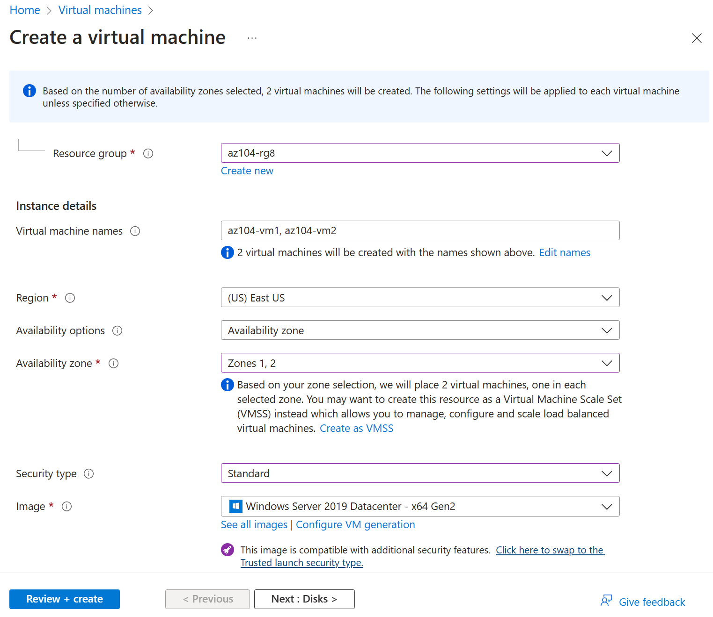

---
lab:
  title: "Lab\_08: Verwalten virtueller Computer"
  module: Administer Virtual Machines
---

# Lab 08: Verwalten von VMs

## Einführung in das Lab

In dieser Übung erstellen und vergleichen Sie VMs mit VM-Skalierungsgruppen. Sie erfahren, wie Sie eine einzelne VM erstellen, konfigurieren und die Größe ändern. Sie erfahren, wie Sie eine VM-Skalierungsgruppe erstellen und die automatische Skalierung konfigurieren.

Für dieses Lab wird ein Azure-Abonnement benötigt. Ihr Abonnementtyp kann sich auf die Verfügbarkeit von Features in diesem Lab auswirken. Die Region kann geändert werden. In den Schritten wird allerdings die Region **USA, Osten** verwendet.

## Geschätzte Zeit: 50 Minuten

## Labszenario

Ihre Organisation möchte die Bereitstellung und Konfiguration von Azure-VMs untersuchen. Zunächst implementieren Sie eine Azure-VM mit manueller Skalierung. Als Nächstes implementieren Sie eine VMSS und erkunden die automatische Skalierung.

## Interaktive Labsimulationen

Für dieses Thema stehen hilfreiche interaktive Labsimulationen zur Verfügung. In der Simulation können Sie sich in Ihrem eigenen Tempo durch ein ähnliches Szenario klicken. Es gibt zwar Unterschiede zwischen der interaktiven Simulation und diesem Lab, aber viele der Kernkonzepte sind identisch. Ein Azure-Abonnement ist nicht erforderlich.

+ [Erstellen einer VM im Portal](https://mslearn.cloudguides.com/en-us/guides/AZ-900%20Exam%20Guide%20-%20Azure%20Fundamentals%20Exercise%201). Erstellen Sie eine VM, stellen Sie eine Verbindung her, und installieren Sie die Webserverrolle.

+ [Bereitstellen einer VM mit einer Vorlage](https://mslearn.cloudguides.com/en-us/guides/AZ-900%20Exam%20Guide%20-%20Azure%20Fundamentals%20Exercise%209). Erkunden Sie den Schnellstartkatalog, und suchen Sie nach einer Vorlage für virtuelle Maschinen. Stellen Sie die Vorlage bereit, und überprüfen Sie die Bereitstellung.

+ [Erstellen einer VM mit PowerShell](https://mslearn.cloudguides.com/en-us/guides/AZ-900%20Exam%20Guide%20-%20Azure%20Fundamentals%20Exercise%2010). Verwenden Sie Azure PowerShell, um eine VM bereitzustellen. Überprüfen Sie Azure Advisor-Empfehlungen.

+ [Erstellen einer VM mit der Befehlszeilenschnittstelle](https://mslearn.cloudguides.com/en-us/guides/AZ-900%20Exam%20Guide%20-%20Azure%20Fundamentals%20Exercise%2011). Verwenden Sie die Befehlszeilenschnittstelle, um eine VM bereitzustellen. Überprüfen Sie Azure Advisor-Empfehlungen.

## Stellenqualifikationen

+ Aufgabe 1: Bereitstellen von zonenresilienten Azure-VMs mithilfe des Azure-Portals.
+ Aufgabe 2: Verwalten der Compute- und Speicherskalierung für VMs.
+ Aufgabe 3: Erstellen und Konfigurieren von Azure Virtual Machine Scale Sets.
+ Aufgabe 4: Skalieren von Azure Virtual Machine Scale Sets.
+ Aufgabe 5: Erstellen einer VM mit Azure PowerShell (optional 1).
+ Aufgabe 6: Erstellen einer VM mit der Befehlszeilenschnittstelle (optional 2).

## Architekturdiagramm für Azure Virtual Machines


## Aufgabe 1: Bereitstellen von zonenresilienten Azure-VMs mithilfe des Azure-Portals

In dieser Aufgabe stellen Sie zwei Azure-VMs mithilfe des Azure-Portals in verschiedenen Verfügbarkeitszonen bereit. Verfügbarkeitszonen bieten mit 99,99 % die höchste Uptime-SLA für VMs. Um diese SLA zu erreichen, müssen Sie mindestens zwei VMs in verschiedenen Verfügbarkeitszonen bereitstellen.

1. Melden Sie sich beim Azure-Portal an – `https://portal.azure.com`.

1. Suchen Sie nach `Virtual machines` und wählen Sie es aus, klicken Sie auf dem Blatt **VM** auf **+ Erstellen**, und wählen Sie dann in der Dropdownliste **+ Azure-VM** aus. Es gibt weitere Optionen.

1. Aktivieren Sie auf der Registerkarte **Grundlagen** im Dropdownmenü **Verfügbarkeitszone** das Kontrollkästchen neben **Zone 2**. Dies sollte sowohl **Zone 1** als auch **Zone 2** auswählen.

    >**Hinweis:** Dadurch werden zwei VMs in der ausgewählten Region bereitgestellt, eine in jeder Zone. Sie erreichen die SLA für die Uptime von 99,99 %, da Sie über mindestens zwei VMs verfügen, die über mindestens zwei Zonen verteilt sind. In dem Szenario, in dem Sie möglicherweise nur einen VM benötigen, ist es eine bewährte Methode, die VM trotzdem in einer anderen Zone bereitzustellen.

1. Fahren Sie auf der Registerkarte „Grundlagen“ mit dem Abschließen der Konfiguration fort:

    | Einstellung | Wert |
    | --- | --- |
    | Abonnement | der Name Ihres Azure-Abonnements |
    | Resource group |  **az104-rg8** (Klicken Sie bei Bedarf auf **Neu erstellen**) |
    | Namen virtueller Computer | `az104-vm1` und `az104-vm2` (Nachdem Sie beide Verfügbarkeitszonen ausgewählt haben, wählen Sie **Namen bearbeiten** unter dem Feld „VM-Name“ aus.) |
    | Region | **USA, Osten** |
    | Verfügbarkeitsoptionen | **Verfügbarkeitszone** |
    | Verfügbarkeitszone | **Zone 1, 2** (Lesen Sie die Notiz zur Verwendung von VM-Skalierungsgruppen) |
    | Sicherheitstyp | **Standard** |
    | Image | **Windows Server 2019 Rechenzentrum – x64 Gen2** |
    | Azure Spot-Instanz | **unchecked** |
    | Size | **Standard D2s v3** |
    | Benutzername | `localadmin` |
    | Kennwort | **Bereitstellen eines sicheren Kennworts** |
    | Öffentliche Eingangsports | **None** |
    | Möchten Sie eine vorhandene Windows Server-Lizenz verwenden? | **Nicht aktiviert** |

    

1. Klicken Sie auf **Next: Datenträger >**, geben Sie nun die folgenden Einstellungen an (belassen Sie andere auf ihren Standardwerten):

    | Einstellung | Wert |
    | --- | --- |
    | Typ des Betriebssystemdatenträgers | **SSD Premium** |
    | Mit virtuellem Computer löschen | **aktiviert** (Standard) |
    | Ultra Disks-Kompatibilität aktivieren | **Nicht aktiviert** |

1. Klicken Sie auf **Next: Netzwerk>**, übernehmen Sie die Standardwerte, aber stellen Sie keinen Lastenausgleich bereit.

    | Einstellung | Wert |
    | --- | --- |
    | Öffentliche IP-Adresse und NIC löschen, wenn die VM gelöscht wird | **Überprüft** |
    | Optionen für den Lastenausgleich | **Keine** |


1. Klicken Sie auf **Next: Verwaltung >** und geben Sie die folgenden Einstellungen an (belassen Sie andere auf ihren Standardwerten):

    | Einstellung | Wert |
    | --- | --- |
    | Optionen zur Patchorchestrierung | **Azure-orchestriert** |  

1. Klicken Sie auf **Next: Überwachen >** und geben Sie die folgenden Einstellungen an (belassen Sie andere auf ihren Standardwerten):

    | Einstellung | Wert |
    | --- | --- |
    | Startdiagnose | **Deaktivieren** |

1. Klicken Sie auf **Next: Erweitert >**, übernehmen Sie die Standardwerte, und klicken Sie dann auf **Überprüfen und Erstellen**.

1. Klicken Sie nach der Überprüfung auf **Erstellen**.

    >**Hinweis:** Beachten Sie, dass während der Bereitstellung der NIC durch die VM der Datenträger und die öffentliche IP-Adresse (sofern konfiguriert) unabhängig erstellt werden und verwaltete Ressourcen sind.

1. Warten Sie, bis die Bereitstellung abgeschlossen ist, und wählen Sie dann **Zur Ressource wechseln** aus.

   >**Hinweis:** Überwachen sie die **Benachrichtigungsmeldungen**.

## Aufgabe 2: Verwalten der Compute- und Speicherskalierung für VMs

In dieser Aufgabe werden Sie eine VM skalieren, indem Sie ihre Größe an eine andere SKU anpassen. Azure bietet Flexibilität bei der Auswahl der VM-Größe, sodass Sie eine VM für Zeiträume anpassen können, wenn mehr (oder weniger) Compute und Arbeitsspeicher zugewiesen werden müssen. Dieses Konzept wird auf Datenträger erweitert, wo Sie die Leistung des Datenträgers ändern oder die zugeordnete Kapazität erhöhen können.

1. Wählen Sie auf der VM **az104-vm1** im Blatt **Verfügbarkeit + Skalierung** die Option **Größe** aus.

1. Legen Sie die Größe der VM auf **DS1_v2** fest, und klicken Sie auf **Größe ändern**. Bestätigen Sie die Änderung, wenn Sie dazu aufgefordert werden.

    >**Hinweis**: Wählen Sie eine andere Größe aus, wenn **Standard DS1_v2** nicht verfügbar ist. Die Größenänderung wird auch als vertikale Skalierung bezeichnet, nach oben oder nach unten.

    

1. Wählen Sie im Bereich **Einstellungen** die Option **Datenträger** aus.

1. Wählen Sie unter **Datenträger** die Option **+ Neuen Datenträger erstellen und anfügen** aus. Konfigurieren Sie die Einstellungen (behalten Sie andere Einstellungen auf ihren Standardwerten bei).

    | Einstellung | Wert |
    | --- | --- |
    | Name des Datenträgers | `vm1-disk1` |
    | Speichertyp | **HDD Standard** |
    | Größe (GiB) | `32` |

1. Klicken Sie auf **Anwenden**.

1. Nachdem der Datenträger erstellt wurde, klicken Sie auf **Trennen** (falls erforderlich, scrollen Sie nach rechts, um das Trennsymbol anzuzeigen), und klicken Sie dann auf **Übernehmen**.

    >**Hinweis:** Das Trennen entfernt den Datenträger aus der VM, behält ihn jedoch zur späteren Verwendung im Speicher.

1. Suchen Sie nach `Disks`, und wählen Sie diese Option aus. Wählen Sie in der Liste der Datenträger das Objekt **vm1-disk1** aus.

    >**Hinweis:** Das Blatt **Übersicht** enthält auch Leistungs- und Verbrauchsinformationen für den Datenträger.

1. Wählen Sie im Blatt **Einstellungen** die Option **Größe+ Leistung** aus.

1. Legen Sie den Speichertyp auf **SSD Standard** fest, und klicken Sie dann auf **Speichern**.

1. Navigieren Sie zurück zur VM **az104-vm1**, und wählen Sie **Datenträger** aus.

1. Wählen Sie im Abschnitt **Datenträger** **Vorhandene Datenträger anfügen** aus.

1. Wählen Sie in der Dropdownliste **Datenträgername** **VM1-DISK1** aus. 

1. Überprüfen Sie, ob der Datenträger jetzt **SSD Standard** ist.

1. Wählen Sie **Übernehmen** aus, um die Änderungen zu speichern. 

    >**Hinweis:** Sie haben nun eine VM erstellt, die SKU und die Datenträgergröße skaliert. In der nächsten Aufgabe verwenden wir Virtual Machine Scale Sets, um den Skalierungsprozess zu automatisieren.

## Architekturdiagramm für Azure Virtual Machine Scale Sets


## Aufgabe 3: Erstellen und Konfigurieren von Azure Virtual Machine Scale Sets

In dieser Aufgabe werden Sie eine Azure VM-Skalierungsgruppe über Verfügbarkeitszonen hinweg bereitstellen. VM Scale Sets reduzieren den verwaltungstechnischen Aufwand der Automatisierung, indem Sie Metriken oder Bedingungen konfigurieren können, mit denen die Skalierungsgruppe horizontal skaliert, abskaliert oder aufskaliert werden kann.

1. Suchen Sie im Azure-Portal nach `Virtual machine scale sets` und wählen Sie es aus, und klicken Sie auf dem Blatt **VM-Skalierungsgruppen** auf **+ Erstellen**.

1. Geben Sie auf der Registerkarte **Grundlagen** des Blatts **VM-Skalierungsgruppe erstellen** die folgenden Einstellungen an (belassen Sie andere auf ihren Standardwerten), und klicken Sie auf **Weiter : Spot >** aus:

    | Einstellung | Wert |
    | --- | --- |
    | Abonnement | der Name Ihres Azure-Abonnements  |
    | Resource group | **az104-rg8**  |
    | Name der VM-Skalierungsgruppe | `vmss1` |
    | Region | **(USA) USA, Osten** |
    | Verfügbarkeitszone | **Zonen 1, 2, 3** |
    | Orchestrierungsmodus | **Uniform** |
    | Sicherheitstyp | **Standard** |
    | Image | **Windows Server 2019 Rechenzentrum – x64 Gen2** |
    | Mit Azure Spot-Rabatt ausführen | **Nicht aktiviert** |
    | Größe | **Standard D2s_v3** |
    | Benutzername | `localadmin` |
    | Kennwort | **Bereitstellen eines sicheren Kennworts**  |
    | Sie verfügen bereits über eine Windows Server-Lizenz? | **Nicht aktiviert** |

    >**Hinweis**: Eine Liste der Azure-Regionen, die die Bereitstellung von Windows-VMs in Verfügbarkeitszonen unterstützen, finden Sie unter [Was sind Verfügbarkeitszonen in Azure?](https://docs.microsoft.com/en-us/azure/availability-zones/az-overview)

    

1. Übernehmen Sie auf der Registerkarte **Spot** die Standardwerte, und wählen Sie **Weiter: Datenträger >**.

1. Übernehmen Sie auf der Registerkarte **Datenträger** die Standardwerte, und wählen Sie **Weiter : Netzwerk >** aus.

1. Klicken Sie auf der Seite **Netzwerk** auf den Link **Virtuelles Netzwerk erstellen** unter dem Textfeld **Virtuelles Netzwerk**, und erstellen Sie ein neues virtuelles Netzwerk mit den folgenden Einstellungen (belassen Sie andere auf ihren Standardwerten).  Wenn Sie fertig sind, wählen Sie **OK** aus.

    | Einstellung | Wert |
    | --- | --- |
    | Name | `vmss-vnet` |
    | Adressbereich | `10.82.0.0/20` (ändern, was da ist) |
    | Subnetzname | `subnet0` |
    | Subnetzbereich | `10.82.0.0/24` |

1. Klicken Sie auf der Registerkarte **Netzwerk** auf das Symbol **Netzwerkschnittstelle bearbeiten** rechts neben dem Netzwerkschnittstelleneintrag.

1. Wählen Sie für den Abschnitt **NIC-Netzwerksicherheitsgruppe** die Option **Erweitert** aus, und klicken Sie dann unter der Dropdownliste **Netzwerksicherheitsgruppe konfigurieren** auf **Neu erstellen**.

1. Geben Sie auf dem Blatt **Netzwerksicherheitsgruppe erstellen** die folgenden Einstellungen an (übernehmen Sie die Standardwerte für andere Einstellungen):

    | Einstellung | Wert |
    | --- | --- |
    | Name | **vmss1-nsg** |

1. Klicken Sie auf **Eingangsregel hinzufügen**, und fügen Sie eine Sicherheitsregel für eingehenden Datenverkehr mit den folgenden Einstellungen hinzu (übernehmen Sie für andere Einstellungen die Standardwerte):

    | Einstellung | Wert |
    | --- | --- |
    | Quelle | **Alle** |
    | Quellportbereiche | * |
    | Destination | **Alle** |
    | Dienst | **HTTP** |
    | Aktion | **Zulassen** |
    | Priorität | **1010** |
    | Name | `allow-http` |

1. Klicken Sie auf **Hinzufügen**, und klicken Sie auf dem Blatt **Netzwerksicherheitsgruppe erstellen** auf **OK**.

1. Klicken Sie auf dem Blatt **Netzwerkschnittstelle bearbeiten** im Abschnitt **Öffentliche IP-Adresse** auf **Aktiviert**, und klicken Sie dann auf **OK**.

1. Geben Sie auf der Registerkarte **Netzwerk** unter dem Abschnitt **Lastenausgleich** Folgendes an (belassen Sie andere auf ihren Standardwerten).

    | Einstellung | Wert |
    | --- | --- |
    | Optionen für den Lastenausgleich | **Azure Load Balancer** |
    | Wählen Sie einen Lastenausgleich aus. | **Erstellen eines Lastenausgleichs** |

1. Geben Sie auf der Seite **Lastenausgleich erstellen** den Namen des Lastenausgleichs an, und übernehmen Sie die Standardwerte. Klicken Sie auf **Erstellen**, wenn Sie fertig sind, und klicken Sie dann auf **Weiter: Skalierung >** .

    | Einstellung | Wert |
    | --- | --- |
    | Name des Lastenausgleichs | `vmss-lb` |

    >**Hinweis:** Nehmen Sie sich eine Minute Zeit, und überprüfen Sie, was Sie getan haben. An diesem Punkt haben Sie die VM-Skalierungsgruppe mit Datenträgern und Netzwerken konfiguriert. In der Netzwerkkonfiguration haben Sie eine Netzwerksicherheitsgruppe erstellt und HTTP zugelassen. Sie haben auch einen Lastenausgleich mit einer öffentlichen IP-Adresse erstellt.

1. Geben Sie auf der Registerkarte **Skalierung** die folgenden Einstellungen an (belassen Sie andere auf ihren Standardwerten), und klicken Sie auf **Weiter : Verwaltung >**:

    | Einstellung | Wert |
    | --- | --- |
    | Anfängliche Anzahl der Instanzen | `2` |
    | Skalierungsrichtlinie | **Manuell** |

1. Geben Sie auf der Registerkarte **Verwaltung** die folgenden Einstellungen an (belassen Sie andere auf ihren Standardwerten):

    | Einstellung | Wert |
    | --- | --- |
    | Startdiagnose | **Deaktivieren** |

1. Klicken Sie unten auf der Seite auf **Weiter: Integrität >**.

1. Überprüfen Sie auf der Registerkarte **Integrität** die Standardeinstellungen, ohne Änderungen vorzunehmen, und klicken Sie auf **Weiter : Erweitert >**.

1. Klicken Sie auf der Registerkarte **Erweitert** auf **Überprüfen + Erstellen**.

1. Stellen Sie auf der Registerkarte **Überprüfen + Erstellen** sicher, dass die Validierung erfolgreich war, und klicken Sie auf **Erstellen**.

    >**Hinweis**: Warten Sie, bis die Bereitstellung der VM-Skalierungsgruppe abgeschlossen wurde. Dies sollte ungefähr 5 Minuten in Anspruch nehmen. Während Sie warten, lesen Sie die [Dokumentation](https://learn.microsoft.com/azure/virtual-machine-scale-sets/overview).

## Aufgabe 4: Skalieren von Azure Virtual Machine Scale Sets

In dieser Aufgabe skalieren Sie die VM-Skalierungsgruppe mithilfe einer benutzerdefinierten Skalierungsregel.

1. Wählen Sie **Gehe zu Ressource ** aus, oder suchen Sie nach der **vmss1**-Skalierungsgruppe und wählen diese aus.

1. Wählen Sie auf der linken Seite des Fensters „Skalierungsgruppe“ im Menü **Skalierung** aus.

>**Schon gewusst?** Sie können **manuell skalieren** oder die **benutzerdefinierte Autoskalierung** verwenden. Bei Skalierungsgruppen mit einer kleinen Anzahl von VM-Instanzen kann das Erhöhen oder Verringern der Instanzenanzahl (manuelle Skalierung) die beste Lösung sein. Bei Skalierungsgruppen mit einer großen Anzahl von VM-Instanzen kann die Skalierung basierend auf Metriken (benutzerdefinierte Autoskalierung) besser geeignet sein.

### Regel zum Aufskalieren

1. Wählen Sie **Benutzerdefinierte Autoskalierung** aus. ändern Sie dann den **Skalierungsmodus** auf **Skalieren basierend auf Metriken**. Und klicken Sie dann auf **Regel Hinzufügen**.

1. Lassen Sie uns ein Regel erstellen, welche die Anzahl der VM-Instanzen automatisch erhöht. Diese Regel wird aufskalieren, wenn die durchschnittliche CPU-Last über einen Zeitraum von 10 Minuten größer als 70 % ist. Wenn die Regel ausgelöst wird, wird die Anzahl von VM-Instanzen um 20% erhöht.

    | Einstellung | Wert |
    | --- | --- |
    | Metrikquelle | **Aktuelle Ressource (vmss1)** |
    | Metriknamespace | **Host für virtuelle Computer** |
    | Metrikname | **Prozentuale CPU** (überprüfen Sie Ihre anderen Auswahlmöglichkeiten) |
    | Operator | **Größer als** |
    | Metrikschwellenwert zum Auslösen der Skalierungsaktion | **70** |
    | Dauer (Minuten) | **10** |
    | Statistik zum Aggregationsintervall | **Average** |
    | Vorgang | **Prozent erhöhen um** (überprüfen Sie andere Auswahlmöglichkeiten) |
    | Abkühlen (Minuten) | **5** |
    | Percentage | **20** |

    

1. Klicken Sie auf **Speichern**, um die Änderungen zu speichern.

### Regel zum Abskalieren

1. An Abenden oder Wochenenden kann die Nachfrage sinken, sodass es wichtig ist, eine Regel zum Abskalieren zu erstellen.

1. Lassen Sie uns eine Regel erstellen, welche die Anzahl der VM-Instanzen in einer Skalierungsgruppe verringert. Die Anzahl der Instanzen sollte sinken, wenn die durchschnittliche CPU-Last über einen Zeitraum von 10 Minuten unter 30 % sinkt. Wenn die Regel ausgelöst wird, wird die Anzahl von VM-Instanzen um 20% verringert.

1. Wählen Sie **Regel hinzufügen** aus, passen Sie die Einstellungen an, und wählen Sie dann **Hinzufügen** aus.

    | Einstellung | Wert |
    | --- | --- |
    | Operator | **Kleiner als** |
    | Schwellenwert | **30** |
    | Vorgang | **Prozentsatz verkleinern um** (überprüfen Sie Ihre anderen Auswahlmöglichkeiten) |
    | Percentage | **20** |

1. Klicken Sie auf **Speichern**, um die Änderungen zu speichern.

### Festlegen der Instanzgrenzwerte

1. Bei Anwendung Ihrer Regeln für die automatische Skalierung stellen diese Instanzgrenzwerte sicher, dass kein Aufskalieren über die Höchstanzahl von Instanzen hinaus oder kein Abskalieren über die Mindestanzahl von Instanzen hinaus erfolgt.

1. **Instanzgrenzwerte** werden auf der Seite **Skalierung** nach den Regeln angezeigt.

    | Einstellung | Wert |
    | --- | --- |
    | Minimum | **2** |
    | Maximum | **10** |
    | Standard | **2** |

1. Denken Sie daran, Ihre Änderungen zu **speichern**

1. Wählen Sie auf der Seite **vmss1** die Option **Instanzen** aus. Hier würden Sie die Anzahl der VM-Instanzen überwachen.

    >**Hinweis:** Wenn Sie Azure PowerShell zum Erstellen von VMs verwenden möchten, probieren Sie Task 5 aus. Wenn Sie die CLI zum Erstellen von VMs verwenden möchten, probieren Sie Task 6 aus.

## Aufgabe 5: Erstellen einer VM mit Azure PowerShell (Option 1)

1. Verwenden Sie das Symbol (oben rechts), um eine **Cloud Shell**-Sitzung zu starten. Navigieren Sie alternativ direkt zu `https://shell.azure.com`.

1. Stellen Sie sicher, dass Sie **PowerShell** auswählen. Verwenden Sie bei Bedarf die Option **Erweiterten Einstellungen anzeigen** und konfigurieren Sie den Shellspeicher.

1. Führen Sie den folgenden Befehl aus, um eine VM zu erstellen. Geben Sie einen Benutzernamen und ein Kennwort für die VM an, wenn Sie aufgefordert werden. Während Sie warten, schauen Sie sich in der [New-AzVM](https://learn.microsoft.com/powershell/module/az.compute/new-azvm?view=azps-11.1.0)-Befehlsreferenz alle Parameter an, die dem Erstellen einer VM zugeordnet sind.

    ```powershell
    New-AzVm `
    -ResourceGroupName 'az104-rg8' `
    -Name 'myPSVM' `
    -Location 'East US' `
    -Image 'Win2019Datacenter' `
    -Zone '1' `
    -Size 'Standard_D2s_v3' ` 
    -Credential (Get-Credential)
    ```

1. Nachdem der Befehl abgeschlossen ist, verwenden Sie **Get-AzVM**, um die VMs in Ihrer Ressourcengruppe aufzulisten.

    ```powershell
    Get-AzVM `
    -ResourceGroupName 'az104-rg8' `
    -Status
    ```

1. Überprüfen Sie, ob Ihre neue VM aufgelistet ist und der **Status** **Wird ausgeführt** lautet.

1. Verwenden Sie **Stop-AzVM**, um die Zuordnung Ihrer VM aufzuheben. Geben Sie **Ja** ein, um dies zu bestätigen.

    ```powershell
    Stop-AzVM `
    -ResourceGroupName 'az104-rg8' `
    -Name 'myPSVM' 
    ```

1. Verwenden Sie **Get-AzVM** mit dem Parameter **Status**, um zu überprüfen, dass für den Computer **die Zuordnung aufgehoben ist**.

    >**Schon gewusst?** Wenn Sie Azure verwenden, um Ihre VM zu beenden, wird der Status auf *Zuordnung aufgehoben* geändert. Dies bedeutet, dass alle nicht statischen öffentlichen IP-Adressen freigegeben werden, und Sie beenden das Bezahlen für die Computekosten der VM.

## Aufgabe 6: Erstellen einer VM mithilfe der CLI (Option 2)

1. Verwenden Sie das Symbol (oben rechts), um eine **Cloud Shell**-Sitzung zu starten. Navigieren Sie alternativ direkt zu `https://shell.azure.com`.

1. Stellen Sie sicher, dass Sie **Bash** auswählen. Verwenden Sie bei Bedarf die Option **Erweiterten Einstellungen anzeigen** und konfigurieren Sie den Shellspeicher.

1. Führen Sie den folgenden Befehl aus, um eine VM zu erstellen. Geben Sie einen Benutzernamen und ein Kennwort für die VM an, wenn Sie aufgefordert werden. Während Sie warten, schauen Sie sich in der [az vm create](https://learn.microsoft.com/cli/azure/vm?view=azure-cli-latest#az-vm-create)-Befehlsreferenz alle Parameter an, die dem Erstellen einer VM zugeordnet sind.

    ```sh
    az vm create --name myCLIVM --resource-group az104-rg8 --image Ubuntu2204 --admin-username localadmin --generate-ssh-keys
    ```

1. Nachdem der Befehl abgeschlossen ist, verwenden Sie **az vm show**, um zu überprüfen, ob Ihr Computer erstellt wurde.

    ```sh
    az vm show --name  myCLIVM --resource-group az104-rg8 --show-details
    ```

1. Überprüfen Sie, ob der **powerState** den Status **VM wird ausgeführt** anzeigt.

1. Verwenden Sie **az vm deallocate**, um die Zuordnung Ihrer VM aufzuheben. Geben Sie **Ja** ein, um dies zu bestätigen.

    ```sh
    az vm deallocate --resource-group az104-rg8 --name myCLIVM
    ```

1. Verwenden Sie **az vm show**, um sicherzustellen, dass **powerState** den Status **Zuordnung der VM ist aufgehoben** anzeigt.

    >**Schon gewusst?** Wenn Sie Azure verwenden, um Ihre VM zu beenden, wird der Status auf *Zuordnung aufgehoben* geändert. Dies bedeutet, dass alle nicht statischen öffentlichen IP-Adressen freigegeben werden, und Sie beenden das Bezahlen für die Computekosten der VM.

## Bereinigen Ihrer Ressourcen

Wenn Sie mit **Ihrem eigenen Abonnement** arbeiten, nehmen Sie sich eine Minute Zeit, um die Labressourcen zu löschen. Dadurch wird sichergestellt, dass Ressourcen freigegeben und Kosten minimiert werden. Die einfachste Möglichkeit zum Löschen der Labressourcen besteht darin, die Ressourcengruppe des Labs zu löschen. 

+ Wählen Sie im Azure-Portal die Ressourcengruppe und dann **Ressourcengruppe löschen** aus, **geben Sie den Ressourcengruppennamen ein**, und klicken Sie dann auf **Löschen**.
+ Bei Verwendung von Azure PowerShell: `Remove-AzResourceGroup -Name resourceGroupName`.
+ Bei Verwendung der Befehlszeilenschnittstelle: `az group delete --name resourceGroupName`.


## Wichtige Erkenntnisse

Herzlichen Glückwunsch zum erfolgreichen Abschluss des Labs. Hier sind die wichtigsten Erkenntnisse für dieses Lab.

+ Azure-VMs sind bedarfsabhängige skalierbare Computingressourcen.
+ Azure-VMs bieten Optionen sowohl für die vertikale wie die horizontale Skalierung.
+ Das Konfigurieren von Azure-VMs umfasst die Auswahl eines Betriebssystems, der Größe, des Speichers und der Netzwerkeinstellungen.
+ Mit Azure Virtual Machine Scale Sets können Sie eine Gruppe von VMs mit Lastenausgleich erstellen und verwalten.
+ Die VMs in einer VMSS werden aus demselben Image und derselben Konfiguration erstellt.
+ Die Anzahl von VM-Instanzen in einer VMSS kann als Reaktion auf die Nachfrage oder auf einen definierten Zeitplan automatisch erhöht oder verringert werden.

## Weiterlernen im eigenen Tempo

+ [Erstellen einer Windows-VM in Azure](https://learn.microsoft.com/training/modules/create-windows-virtual-machine-in-azure/). Erstellen eines virtuellen Windows-Computers über das Azure-Portal Herstellen einer Verbindung mit einem aktuell ausgeführten virtuellen Computer mithilfe von Remotedesktop
+ [Erstellen einer skalierbaren Anwendung mit Virtual Machine Scale Sets](https://learn.microsoft.com/training/modules/build-app-with-scale-sets/). Aktivieren Sie die automatische Anpassung Ihrer Anwendung an Auslastungsänderungen, und reduzieren Sie gleichzeitig die Kosten mithilfe von Virtual Machine Scale Sets.
+ [Herstellen einer Verbindung mit virtuellen Computern über das Azure-Portal mithilfe von Azure Bastion](https://learn.microsoft.com/en-us/training/modules/connect-vm-with-azure-bastion/). Stellen Sie Azure Bastion bereit, um direkt im Azure-Portal eine sichere Verbindung mit Azure-VMs herzustellen und so eine vorhandene Jumpbox-Lösung effektiv zu ersetzen, Remotesitzungen mithilfe von Diagnoseprotokollen zu überprüfen und Remotesitzungen zu verwalten, indem Sie eine Benutzersitzung trennen.
  
