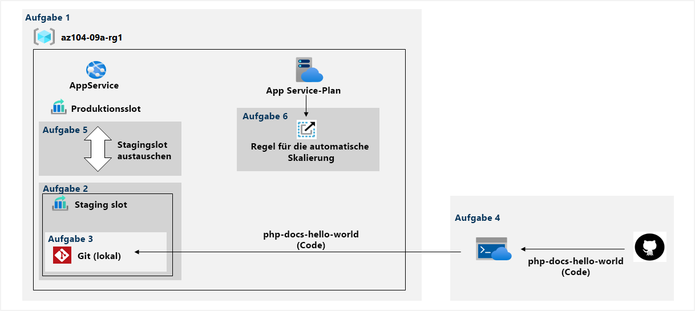

---
lab:
  title: "Lab\_09a: Implementieren von Web-Apps"
  module: Administer PaaS Compute Options
---

# Lab 09a – Implementieren von Web-Apps
# Lab-Handbuch für Kursteilnehmer

## Labszenario

Sie müssen die Verwendung von Azure-Web-Apps zum Hosten der Websites von Contoso bewerten, die derzeit in den lokalen Rechenzentren des Unternehmens gehostet werden. Die Websites werden mithilfe des PHP-Runtimestapels auf Windows-Servern ausgeführt. Außerdem müssen Sie bestimmen, wie Sie DevOps-Verfahren durch die Nutzung von Bereitstellungsslots für Web-Apps in Azure implementieren können.

                **Hinweis:** Eine **[interaktive Labsimulation](https://mslabs.cloudguides.com/guides/AZ-104%20Exam%20Guide%20-%20Microsoft%20Azure%20Administrator%20Exercise%2013)** ist verfügbar, mit der Sie dieses Lab in Ihrem eigenen Tempo durcharbeiten können. Möglicherweise liegen geringfügige Unterschiede zwischen der interaktiven Simulation und dem gehosteten Lab vor, aber die dargestellten Kernkonzepte und Ideen sind identisch. 

## Ziele

Dieses Lab deckt Folgendes ab:

+ Aufgabe 1: Erstellen einer Azure-Web-App
+ Aufgabe 2: Erstellen eines Stagingbereitstellungsslots
+ Aufgabe 3: Konfigurieren von Web-App-Bereitstellungseinstellungen
+ Aufgabe 4: Bereitstellen von Code im Stagingbereitstellungsslot
+ Aufgabe 5: Austauschen der Stagingslots
+ Aufgabe 6: Konfigurieren und Testen der Autoskalierung der Azure-Web-App

## Geschätzte Zeit: 30 Minuten

## Architekturdiagramm



### Anweisungen

## Übung 1

## Aufgabe 1: Erstellen einer Azure-Web-App

In dieser Aufgabe erstellen Sie eine Azure-Web-App.

1. Melden Sie sich am [**Azure-Portal**](http://portal.azure.com) an.

1. Suchen Sie im Azure-Portal nach **App-Dienste**, wählen Sie diese Option aus, und klicken Sie dann auf dem Blatt **App-Dienste** auf **+ Erstellen**.

1. Geben Sie auf der Registerkarte **Grundlagen** des Blatts **Web-App erstellen** die folgenden Einstellungen an (übernehmen Sie für andere Einstellungen die Standardwerte):

    | Einstellung | Wert |
    | --- | ---|
    | Subscription | Der Name des Azure-Abonnements, das Sie in diesem Lab verwenden. |
    | Resource group | Der Name einer neuen Ressourcengruppe **az104-09a-rg1** |
    | Web-App-Name | Ein global eindeutiger Name |
    | Veröffentlichen | **Code** |
    | Laufzeitstapel | **PHP 8.2** |
    | Betriebssystem | **Linux** |
    | Region | Der Name einer Azure-Region, in der Sie Azure-Web-Apps bereitstellen können |
    | Tarife | Standardkonfiguration übernehmen |

1. Klicken Sie auf **Überprüfen + erstellen**. Stellen Sie auf der Registerkarte **Überprüfen + erstellen** des Blatts **Web-App erstellen** sicher, dass die Überprüfung erfolgreich war, und klicken Sie auf **Erstellen**.

    >**Hinweis**: Warten Sie, bis die Web-App erstellt wurde, bevor Sie mit der nächsten Aufgabe fortfahren. Dieser Vorgang dauert etwa eine Minute.

1. Klicken Sie auf dem Blatt „Bereitstellung“ auf **Zu Ressource wechseln**.

## Aufgabe 2: Erstellen eines Stagingbereitstellungsslots

In dieser Aufgabe erstellen Sie einen Stagingbereitstellungsslot.

1. Klicken Sie auf dem Blatt der neu bereitgestellten Web-App auf den Link **Standarddomäne**, um die Standardwebseite auf einer neuen Browserregisterkarte anzuzeigen.

1. Schließen Sie die neue Browserregisterkarte. Zurück im Azure-Portal klicken Sie im Abschnitt **Bereitstellung** des Blatts der Web-App auf **Bereitstellungsslots**.

    >**Hinweis**: Die Web-App verfügt zu diesem Zeitpunkt über einen einzigen Bereitstellungsslot mit der Bezeichnung **PRODUKTION**.

1. Klicken Sie auf **+ Slot hinzufügen**, und fügen Sie einen neuen Slot mit den folgenden Einstellungen hinzu:

    | Einstellung | Wert |
    | --- | ---|
    | Name | **staging** |
    | Einstellungen klonen von: | **Einstellungen nicht klonen**|

1. Klicken Sie zurück auf dem Blatt **Bereitstellungsslots** der Web-App auf den Eintrag, der den neu erstellten Stagingslot repräsentiert.

    >**Hinweis**: Auf diese Weise wird das Blatt geöffnet, das die Eigenschaften des Stagingslots zeigt.

1. Überprüfen Sie das Blatt des Stagingslots, und beachten Sie, dass sich die zugehörige URL von der URL unterscheidet, die dem Produktionsslot zugewiesen ist.

## Aufgabe 3: Konfigurieren von Web-App-Bereitstellungseinstellungen

In dieser Aufgabe konfigurieren Sie Einstellungen für die Web-App-Bereitstellung.

1. Klicken Sie auf dem Blatt des Stagingbereitstellungsslots im Abschnitt **Bereitstellung** auf **Bereitstellungscenter**, und wählen Sie dann die Registerkarte **Einstellungen** aus.

    >**Hinweis**: Vergewissern Sie sich, dass Sie sich auf dem Blatt für den Stagingslot (und nicht auf dem für den Produktionsslot) befinden.
    
1. Wählen Sie auf der Registerkarte **Einstellungen** in der Dropdownliste **Quelle** die Option **Git (lokal)** aus, und klicken Sie auf die Schaltfläche **Speichern**.

1. Kopieren Sie auf dem Blatt **Bereitstellungscenter** den Wert der **Git-Klon-URI** in den Windows-Editor.

    >**Hinweis**: Sie benötigen den Wert der Git-Klon-URI in der nächsten Aufgabe dieses Labs.

1. Wählen Sie auf dem Blatt **Bereitstellungscenter** die Registerkarte **Git (lokal)/FTPS-Anmeldeinformationen** aus, geben Sie im Abschnitt **Benutzerbereich** die folgenden Einstellungen an, und klicken Sie auf **Speichern**.

    | Einstellung | Wert |
    | --- | ---|
    | Benutzername | ein global eindeutiger Name (siehe Hinweis)  |
    | Kennwort | ein Kennwort, das die Komplexitätsanforderungen erfüllt (siehe Hinweis) |

    >**Hinweis:** Kopieren Sie diese Anmeldeinformationen in den Editor. Diese werden später benötigt werden.
    
    >**Hinweis:** Diese Anmeldeinformationen werden über den URI übergeben. Geben Sie keine Sonderzeichen ein, die sich auf die Interpretation des URI auswirken. Zum Beispiel @, $ oder #. Ein Sternchen oder Pluszeichen (in der Mitte der Zeichenfolge) würde funktionieren.
    
## Aufgabe 4: Bereitstellen von Code im Stagingbereitstellungsslot

In dieser Aufgabe stellen Sie Code im Stagingbereitstellungsslot bereit.

1. Öffnen Sie **Azure Cloud Shell** im Azure-Portal, indem Sie oben rechts im Azure-Portal auf das entsprechende Symbol klicken.

1. Wenn Sie aufgefordert werden, entweder **Bash** oder **PowerShell** auszuwählen, wählen Sie **PowerShell** aus.

    >**Hinweis**: Wenn Sie **Cloud Shell** zum ersten Mal starten und die Meldung **Für Sie wurde kein Speicher bereitgestellt** angezeigt wird, wählen Sie das in diesem Lab verwendete Abonnement aus, und klicken Sie dann auf **Speicher erstellen**.

1. Führen Sie im Cloud Shell-Bereich den folgenden Befehl aus, um das Remoterepository zu klonen, das den Code für die Web-App enthält.

   ```powershell
   git clone https://github.com/Azure-Samples/php-docs-hello-world
   ```

1. Führen Sie im Cloud Shell-Bereich den folgenden Befehl aus, um den aktuellen Speicherort auf den neu erstellten Klon des lokalen Repositorys festzulegen, das den Beispiel-Web-App-Code enthält.

   ```powershell
   Set-Location -Path $HOME/php-docs-hello-world/
   ```

1. Führen Sie im Cloud Shell-Bereich den folgenden Befehl aus, um das Git-Remoterepository hinzuzufügen (ersetzen Sie die Platzhalter `[deployment_user_name]` und `[git_clone_uri]` jeweils durch den Benutzernamen für **Anmeldeinformationen für die Bereitstellung** und den Wert der **Git-Klon-URI**, den Sie in der vorherigen Aufgabe ermittelt haben):

   ```powershell
   git remote add [deployment_user_name] [git_clone_uri]
   ```

    >**Hinweis**: Der Wert nach `git remote add` muss nicht mit dem Benutzernamen für **Anmeldeinformationen für die Bereitstellung** übereinstimmen, muss aber eindeutig sein.

1. Führen Sie im Cloud Shell-Bereich den folgenden Befehl aus, um den Code der Beispiel-Web-App aus dem lokalen Repository in den Stagingbereitstellungsslot der Web-App zu verschieben (stellen Sie sicher, dass Sie die Platzhalterwerte durch den Wert des Benutzernamens und des Kennworts sowie den App-Namen für **Anmeldeinformationen für die Bereitstellung** ersetzen, die Sie in der vorherigen Aufgabe ermittelt haben):

   ```powershell
    git push https://<deployment-username>:<deployment-password>@<app-name>-staging.scm.azurewebsites.net/<app-name>.git master
   ```

1. Schließen Sie den Cloud Shell-Bereich.

1. Klicken Sie auf dem Blatt des Stagingslots auf **Übersicht** und dann auf den Link **Standarddomäne**, um die Standardwebseite auf einer neuen Browserregisterkarte anzuzeigen.

1. Vergewissern Sie sich, dass auf der Browserseite die Meldung **Hello World!** angezeigt wird, und schließen Sie die neue Registerkarte.

## Aufgabe 5: Austauschen der Stagingslots

In dieser Aufgabe tauschen Sie den Stagingslot mit dem Produktionsslot.

1. Navigieren Sie zurück zum Blatt, das den Produktionsslot der Web-App anzeigt.

1. Klicken Sie im Abschnitt **Bereitstellung** auf **Bereitstellungsslots**, und klicken Sie dann in der Symbolleiste auf das Symbol **Austauschen**.

1. Überprüfen Sie auf dem Blatt **Austauschen** die Standardeinstellungen, und klicken Sie auf **Austauschen**.

1. Klicken Sie auf dem Blatt des Produktionsslots der Web-App auf **Übersicht** und dann auf den Link **Standarddomäne**, um die Startseite der Website auf einer neuen Browserregisterkarte anzuzeigen.

1. Vergewissern Sie sich, dass die Standardwebseite durch die Seite **Hello World!** ersetzt wurde .

## Aufgabe 6: Konfigurieren und Testen der Autoskalierung der Azure-Web-App

In dieser Aufgabe konfigurieren und testen Sie die automatische Skalierung der Azure-Web-App.

1. Klicken Sie auf dem Blatt mit dem Produktionsslot der Web-App im Abschnitt **Einstellungen** auf **Horizontal hochskalieren (App Service-Plan)**.

1. Wählen Sie im Abschnitt **Skalierung** die Option **Regelbasiert** aus, und klicken Sie dann auf den Link **Regelbasierte Skalierung verwalten**.

1. Klicken Sie auf **Benutzerdefinierte Autoskalierung**.

    >**Hinweis**: Sie können die Web-App auch manuell skalieren.

1. Wählen Sie **Basierend auf einer Metrik skalieren** und dann **+ Regel hinzufügen** aus.

1. Geben Sie auf dem Blatt **Skalierungsregel** die folgenden Einstellungen an (übernehmen Sie die Standardwerte für andere Einstellungen):

    | Einstellung | Wert |
    | --- |--- |
    | Metrikquelle | **Aktuelle Ressource** |
    | Metriknamespace | **Standardmetriken** |
    | Metrikname | **CPU-Prozentsatz** |
    | Betreiber | **Größer als** |
    | Metrikschwellenwert zum Auslösen der Skalierungsaktion | **10** |
    | Dauer (in Minuten) | **1** |
    | Statistik zum Aggregationsintervall | **Maximum** |
    | Zeitaggregation | **Maximum** |
    | Vorgang | **Anzahl erhöhen um** |
    | Anzahl von Instanzen | **1** |
    | Abkühlen (Minuten) | **5** |

    >**Hinweis**: Diese Werte stellen keine realistische Konfiguration dar, da ihr Zweck darin besteht, die automatische Skalierung so schnell wie möglich und ohne längere Wartezeit auszulösen.

1. Klicken Sie auf **Hinzufügen**, und geben Sie zurück auf dem Blatt für die Skalierung des App Service-Plans die folgenden Einstellungen an (übernehmen Sie die Standardwerte für andere Einstellungen):

    | Einstellung | Wert |
    | --- |--- |
    | Instanzgrenzwerte Minimum | **1** |
    | Instanzgrenzwerte: Maximum | **2** |
    | Instanzgrenzwerte: Standardeinstellung | **1** |

1. Klicken Sie auf **Speichern**.

    >**Hinweis**: Wenn Sie die Fehlermeldung erhalten, dass der Ressourcenanbieter „microsoft.insights“ nicht registriert ist, führen Sie in Ihrer Cloud Shell-Instanz `az provider register --namespace 'Microsoft.Insights'` aus, und versuchen Sie erneut, Ihre Regeln für die automatische Skalierung zu speichern.

1. Öffnen Sie **Azure Cloud Shell** im Azure-Portal, indem Sie auf das Symbol oben rechts im Azure-Portal klicken.

1. Wenn Sie aufgefordert werden, entweder **Bash** oder **PowerShell** auszuwählen, wählen Sie **PowerShell** aus.

1. Führen Sie im Cloud Shell-Bereich den folgenden Befehl aus, um die URL der Azure-Web-App zu identifizieren.

   ```powershell
   $rgName = 'az104-09a-rg1'

   $webapp = Get-AzWebApp -ResourceGroupName $rgName
   ```

1. Führen Sie im Cloud Shell-Bereich den folgenden Befehl aus, um eine Endlosschleife zu starten, die HTTP-Anforderungen an die Web-App sendet:

   ```powershell
   while ($true) { Invoke-WebRequest -Uri $webapp.DefaultHostName }
   ```

1. Minimieren Sie den Cloud Shell-Bereich (nicht schließen), und klicken Sie auf dem Blatt der Web-App im Abschnitt „Einstellungen“ auf **Aufskalieren (App Service-Plan)** .

1. Wählen Sie **Einstellungen für die automatische Skalierung** und dann die Registerkarte **Ausführungsverlauf** aus. Wählen Sie unter **Anzeigen von Daten der letzten** die Option **1 Stunde** aus und überprüfen Sie die **Anzahl der beobachteten Ressourcen-Instanzen**.

1. Überwachen Sie die Auslastung und die Anzahl von Instanzen für ein paar Minuten. 

    >**Hinweis**: Möglicherweise müssen Sie die Seite **aktualisieren**.

1. Sobald Sie feststellen, dass sich die Anzahl von Instanzen auf 2 erhöht hat, öffnen Sie das Cloud Shell-Fenster erneut und beenden das Skript durch Drücken von **STRG+C**.

1. Schließen Sie den Cloud Shell-Bereich.

## Bereinigen von Ressourcen

>**Hinweis**: Denken Sie daran, alle neu erstellten Azure-Ressourcen zu entfernen, die Sie nicht mehr verwenden. Durch das Entfernen nicht verwendeter Ressourcen wird sichergestellt, dass keine unerwarteten Kosten anfallen.

>**Hinweis**: Machen Sie sich keine Sorgen, wenn die Labressourcen nicht sofort entfernt werden können. Mitunter haben Ressourcen Abhängigkeiten, sodass der Löschvorgang lange dauert. Es gehört zu den üblichen Administratoraufgaben, die Ressourcennutzung zu überwachen. Überprüfen Sie also regelmäßig Ihre Ressourcen im Portal darauf, wie es um die Bereinigung bestellt ist. 

1. Öffnen Sie im Azure-Portal im Bereich **Cloud Shell** die **PowerShell**-Sitzung.

1. Listen Sie alle Ressourcengruppen auf, die während der Labs in diesem Modul erstellt wurden, indem Sie den folgenden Befehl ausführen:

   ```powershell
   Get-AzResourceGroup -Name 'az104-09a*'
   ```

1. Löschen Sie alle Ressourcengruppen, die Sie während der praktischen Übungen in diesem Modul erstellt haben, indem Sie den folgenden Befehl ausführen:

   ```powershell
   Get-AzResourceGroup -Name 'az104-09a*' | Remove-AzResourceGroup -Force -AsJob
   ```

    >**Hinweis**: Der Befehl wird (wie über den Parameter „-AsJob“ festgelegt) asynchron ausgeführt. Dies bedeutet, dass Sie zwar direkt im Anschluss einen weiteren PowerShell-Befehl in derselben PowerShell-Sitzung ausführen können, es jedoch einige Minuten dauert, bis die Ressourcengruppen tatsächlich entfernt werden.

## Überprüfung

In diesem Lab haben Sie die folgenden Aufgaben ausgeführt:

+ Erstellen einer Azure-Web-App
+ Erstellen eines Stagingbereitstellungsslots
+ Konfigurieren von Web-App-Bereitstellungseinstellungen
+ Bereitstellen von Code im Stagingbereitstellungsslot
+ Austauschen der Stagingslots
+ Konfigurieren und Testen der Autoskalierung der Azure-Web-App
