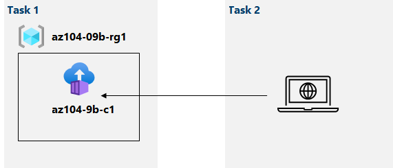

---
lab:
  title: 'Lab 09b: Implementieren von Azure Container Instances'
  module: Administer PaaS Compute Options
---

# Lab 09b – Implementieren von Azure Container Instances
# Lab-Handbuch für Kursteilnehmer

## Labszenario

Contoso möchte eine neue Plattform für virtualisierte Workloads finden. Sie haben eine Reihe von Containerimages identifiziert, die genutzt werden können, um dieses Ziel zu erreichen. Da Sie die Containerverwaltung auf ein Mindestmaß begrenzen möchten, möchten Sie die Verwendung von Azure Container Instances zur Bereitstellung von Docker-Images auswerten.

**Hinweis:** Eine **[interaktive Labsimulation](https://mslabs.cloudguides.com/guides/AZ-104%20Exam%20Guide%20-%20Microsoft%20Azure%20Administrator%20Exercise%2014)** ist verfügbar, mit der Sie dieses Lab in Ihrem eigenen Tempo durcharbeiten können. Möglicherweise liegen geringfügige Unterschiede zwischen der interaktiven Simulation und dem gehosteten Lab vor, aber die dargestellten Kernkonzepte und Ideen sind identisch. 

## Ziele

Dieses Lab deckt Folgendes ab:

- Aufgabe 1: Bereitstellen einer Azure Container Instances-Instanz mithilfe eines Docker-Images
- Aufgabe 2: Überprüfen der Funktionalität der Azure Container Instances-Instanz

## Geschätzte Zeit: 20 Minuten

## Architekturdiagramm



### Anweisungen

## Übung 1

## Aufgabe 1: Bereitstellen einer Azure Container Instances-Instanz mithilfe eines Docker-Images

In dieser Aufgabe erstellen Sie eine neue Containerinstanz für die Webanwendung.

1. Melden Sie sich beim [Azure-Portal](https://portal.azure.com) an.

1. Suchen Sie im Azure-Portal nach **Containerinstanzen**, und klicken Sie dann auf dem Blatt **Containerinstanzen** auf **+ Erstellen**.

1. Geben Sie auf der Registerkarte **Grundeinstellungen** des Blatts **Containerinstanz erstellen** die folgenden Einstellungen an (und übernehmen Sie die Standardwerte für die übrigen Einstellungen):

    | Einstellung | Wert |
    | ---- | ---- |
    | Subscription | Der Name des Azure-Abonnements, das Sie in diesem Lab verwenden. |
    | Resource group | Der Name einer neuen Ressourcengruppe **az104-09b-rg1** |
    | Containername | **az104-9b-c1** |
    | Region | Der Name einer Region, in der Sie Azure-Containerinstanzen bereitstellen können |
    | Imagequelle | **Schnellstartimages** |
    | Image | **mcr.microsoft.com/azuredocs/aci-helloworld:latest (Linux)** |

1. Klicken Sie auf **Weiter: Netzwerk >** , und geben Sie auf dem Blatt **Containerinstanz erstellen** auf der Registerkarte **Netzwerk** die folgenden Einstellungen an (und übernehmen Sie die Standardwerte für die übrigen Einstellungen):

    | Einstellung | Wert |
    | --- | --- |
    | DNS-Namensbezeichnung | Beliebiger gültiger, global eindeutiger DNS-Hostname |

    >**Hinweis**: Ihr Container ist unter „dns-name-label.region.azurecontainer.io“ öffentlich erreichbar. Falls die Fehlermeldung **DNS-Namensbezeichnung ist nicht verfügbar** angezeigt wird, geben Sie einen anderen Wert an.

1. Klicken Sie auf **Weiter: Erweitert >** , und prüfen Sie auf dem Blatt **Containerinstanz erstellen** die Einstellungen auf der Registerkarte **Erweitert**, ohne Änderungen vorzunehmen. Klicken Sie auf **Überprüfen + erstellen**, stellen Sie sicher, dass die Überprüfung erfolgreich ist, und klicken Sie dann auf **Erstellen**.

    >**Hinweis**: Warten Sie, bis die Bereitstellung abgeschlossen ist. Dieser Vorgang dauert etwa drei Minuten.

    >**Hinweis**: Während Sie warten, möchten Sie sich vielleicht den [Code hinter der Beispielanwendung](https://github.com/Azure-Samples/aci-helloworld) ansehen. Durchsuchen Sie dazu den Ordner „\\app“.

## Aufgabe 2: Überprüfen der Funktionalität der Azure Container Instances-Instanz

In dieser Aufgabe überprüfen Sie die Bereitstellung der Containerinstanz.

1. Klicken Sie auf dem Blatt „Bereitstellung“ auf **Zu Ressource wechseln**.

1. Stellen Sie auf dem Blatt **Übersicht** der Containerinstanz sicher, dass der **Status** als **Wird ausgeführt** gemeldet wird.

1. Kopieren Sie den Wert **FQDN** der Containerinstanz, öffnen Sie eine neue Browserregisterkarte, und wechseln Sie zu der entsprechenden URL.

1. Stellen Sie sicher, dass die Seite **Willkommen bei Azure Container Instances** angezeigt wird.

1. Schließen Sie die neue Browserregisterkarte. Klicken Sie im Azure-Portal auf dem Blatt der Containerinstanz im Abschnitt **Einstellungen** auf **Container**, und klicken Sie dann auf **Protokolle**.

1. Stellen Sie sicher, dass die Protokolleinträge für die generierte HTTP GET-Anforderung angezeigt werden, indem Sie die Anwendung im Browser anzeigen.

## Bereinigen von Ressourcen

>**Hinweis**: Denken Sie daran, alle neu erstellten Azure-Ressourcen zu entfernen, die Sie nicht mehr verwenden. Durch das Entfernen nicht verwendeter Ressourcen wird sichergestellt, dass keine unerwarteten Kosten anfallen.

>**Hinweis**: Machen Sie sich keine Sorgen, wenn die Labressourcen nicht sofort entfernt werden können. Mitunter haben Ressourcen Abhängigkeiten, sodass der Löschvorgang lange dauert. Es gehört zu den üblichen Administratoraufgaben, die Ressourcennutzung zu überwachen. Überprüfen Sie also regelmäßig Ihre Ressourcen im Portal darauf, wie es um die Bereinigung bestellt ist. 

1. Öffnen Sie im Azure-Portal im Bereich **Cloud Shell** die **PowerShell**-Sitzung.

    >**Hinweis**: Cloud Shell-Speicher muss erstellt werden, damit diese Befehle funktionieren. 

1. Listen Sie alle Ressourcengruppen auf, die während der Labs in diesem Modul erstellt wurden, indem Sie den folgenden Befehl ausführen:

   ```powershell
   Get-AzResourceGroup -Name 'az104-09b*'
   ```

1. Löschen Sie alle Ressourcengruppen, die Sie während der praktischen Übungen in diesem Modul erstellt haben, indem Sie den folgenden Befehl ausführen:

   ```powershell
   Get-AzResourceGroup -Name 'az104-09b*' | Remove-AzResourceGroup -Force -AsJob
   ```

    >**Hinweis**: Der Befehl wird (wie über den Parameter „-AsJob“ festgelegt) asynchron ausgeführt. Dies bedeutet, dass Sie zwar direkt im Anschluss einen weiteren PowerShell-Befehl in derselben PowerShell-Sitzung ausführen können, es jedoch einige Minuten dauert, bis die Ressourcengruppen tatsächlich entfernt werden.

## Überprüfung

In diesem Lab haben Sie die folgenden Aufgaben ausgeführt:

- Bereitstellen eines Docker-Images mithilfe von Azure Container Instances
- Überprüfen der Funktionalität der Azure Container Instances-Instanz
