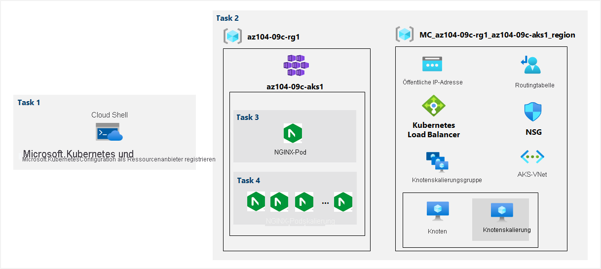

---
lab:
  title: 09c – Implementieren von Azure Kubernetes Service
  module: Administer Serverless Computing
---

# <a name="lab-09c---implement-azure-kubernetes-service"></a>Übung 09c – Implementieren von Azure Kubernetes Service
# <a name="student-lab-manual"></a>Lab-Handbuch für Kursteilnehmer

## <a name="lab-scenario"></a>Labszenario

Contoso has a number of multi-tier applications that are not suitable to run by using Azure Container Instances. In order to determine whether they can be run as containerized workloads, you want to evaluate using Kubernetes as the container orchestrator. To further minimize management overhead, you want to test Azure Kubernetes Service, including its simplified deployment experience and scaling capabilities.

Um eine Vorschau dieses Labs im interaktiven Format anzuzeigen, **[klicken Sie hier](https://mslabs.cloudguides.com/en-us/guides/AZ-104%20Exam%20Guide%20-%20Microsoft%20Azure%20Administrator%20Exercise%2015)** .

## <a name="objectives"></a>Ziele

Dieses Lab deckt Folgendes ab:

+ Aufgabe 1: Registrieren der Ressourcenanbieter „Microsoft.Kubernetes“ und „Microsoft.KubernetesConfiguration“
+ Aufgabe 2: Bereitstellen eines Azure Kubernetes Service-Clusters
+ Aufgabe 3: Bereitstellen von Pods im Azure Kubernetes Service-Cluster
+ Aufgabe 4: Skalieren von Containerworkloads im Azure Kubernetes Service-Cluster

## <a name="estimated-timing-40-minutes"></a>Geschätzte Zeit: 40 Minuten

## <a name="architecture-diagram"></a>Architekturdiagramm



## <a name="instructions"></a>Anweisungen

### <a name="exercise-1"></a>Übung 1

#### <a name="task-1-register-the-microsoftkubernetes-and-microsoftkubernetesconfiguration-resource-providers"></a>Aufgabe 1: Registrieren der Ressourcenanbieter „Microsoft.Kubernetes“ und „Microsoft.KubernetesConfiguration“

In dieser Aufgabe registrieren Sie Ressourcenanbieter, die zum Bereitstellen eines Azure Kubernetes Services-Clusters erforderlich sind.

1. Melden Sie sich beim [Azure-Portal](https://portal.azure.com) an.

1. Öffnen Sie **Azure Cloud Shell** im Azure-Portal, indem Sie auf das Symbol oben rechts im Azure-Portal klicken.

1. Wenn Sie aufgefordert werden, entweder **Bash** oder **PowerShell** auszuwählen, wählen Sie **PowerShell** aus.

    >**Hinweis**: Wenn Sie **Cloud Shell** zum ersten Mal starten und die Meldung **Für Sie wurde kein Speicher bereitgestellt** angezeigt wird, wählen Sie das Abonnement aus, das Sie in diesem Lab verwenden, und klicken Sie dann auf **Speicher erstellen**.

1. Führen Sie im Cloud Shell-Bereich den folgenden Befehl aus, um die Ressourcenanbieter „Microsoft.Kubernetes“ und „Microsoft.KubernetesConfiguration“ zu registrieren.

   ```powershell
   Register-AzResourceProvider -ProviderNamespace Microsoft.Kubernetes

   Register-AzResourceProvider -ProviderNamespace Microsoft.KubernetesConfiguration
   ```

1. Schließen Sie den Cloud Shell-Bereich.

#### <a name="task-2-deploy-an-azure-kubernetes-service-cluster"></a>Aufgabe 2: Bereitstellen eines Azure Kubernetes Service-Clusters

In dieser Aufgabe stellen Sie einen Azure Kubernetes Services-Cluster über das Azure-Portal bereit.

1. Suchen Sie im Azure-Portal nach **Kubernetes-Dienste**, und klicken Sie dann auf dem Blatt **Kubernetes-Dienste** auf **+ Erstellen** und dann auf **+ Kubernetes-Cluster erstellen**.

1. Geben Sie auf der Registerkarte **Grundeinstellungen** des Blatts **Kubernetes-Cluster erstellen** die folgenden Einstellungen an (und übernehmen Sie die Standardwerte für die übrigen Einstellungen):

    | Einstellung | Wert |
    | ---- | ---- |
    | Subscription | Der Name des Azure-Abonnements, das Sie in diesem Lab verwenden |
    | Resource group | Der Name einer neuen Ressourcengruppe **az104-09c-rg1** |
    | Voreingestellte Clusterkonfiguration | **Dev/Test ($)** |
    | Kubernetes-Clustername | **az104-9c-aks1** |
    | Region | Der Name einer Region, in der Sie einen Kubernetes-Cluster bereitstellen können |
    | Verfügbarkeitszonen | **Keine** (alle Kontrollkästchen deaktivieren) |
    | Kubernetes-Version | Standardwert übernehmen |
    | API-Serververfügbarkeit | Standardwert übernehmen |
    | Knotengröße | Standardwert übernehmen |
    | Skalierungsmethode | **Manuell** |
    | Anzahl der Knoten | **1** |

1. Klicken Sie auf **Weiter: Knotenpools >** , und geben Sie auf dem Blatt **Kubernetes-Cluster erstellen** auf der Registerkarte **Knotenpools** die folgenden Einstellungen an (und übernehmen Sie die Standardwerte für die übrigen Einstellungen):

    | Einstellung | Wert |
    | ---- | ---- |
    | Aktivieren von virtuellen Knoten | **Deaktiviert** (Standardeinstellung) |

1. Klicken Sie auf **Next: Zugriff >** , und geben Sie auf der Registerkarte **Zugriff**des Blatts **Kubernetes-Cluster erstellen** die folgenden Einstellungen an (behalten Sie bei den anderen Einstellungen deren Standardwerte bei):

    | Einstellung | Wert |
    | ---- | ---- |
    | Authentifizierungsmethode | **Systemseitig zugewiesene verwaltete Identität** (Standardeinstellung – keine Änderung) | 
    | Rollenbasierte Zugriffssteuerung (Role-Based Access Control, RBAC) | **Aktiviert** |

1. Klicken Sie auf **Weiter: Netzwerk >** , und geben Sie auf dem Blatt **Kubernetes-Cluster erstellen** auf der Registerkarte **Netzwerk** die folgenden Einstellungen an (und übernehmen Sie die Standardwerte für die übrigen Einstellungen):

    | Einstellung | Wert |
    | ---- | ---- |
    | Netzwerkkonfiguration | **kubenet** |
    | DNS-Namenspräfix | Jedes gültige, global eindeutige DNS-Präfix|

1. Klicken Sie auf **Weiter: Integrationen >** . Legen Sie auf dem Blatt **Kubernetes-Cluster erstellen** auf der Registerkarte **Integrationen** die **Containerüberwachung** auf **Deaktiviert** fest, und klicken Sie auf **Überprüfen + erstellen**. Stellen Sie sicher, dass die Überprüfung erfolgreich war, und klicken Sie auf **Erstellen**.

    ><bpt id="p1">**</bpt>Note<ept id="p1">**</ept>: In production scenarios, you would want to enable monitoring. Monitoring is disabled in this case since it is not covered in the lab.

    ><bpt id="p1">**</bpt>Note<ept id="p1">**</ept>: Wait for the deployment to complete. This should take about 10 minutes.

#### <a name="task-3-deploy-pods-into-the-azure-kubernetes-service-cluster"></a>Aufgabe 3: Bereitstellen von Pods im Azure Kubernetes Service-Cluster

In dieser Aufgabe stellen Sie einen Pod im Azure Kubernetes Service-Cluster bereit.

1. Klicken Sie auf dem Blatt „Bereitstellung“ auf **Zu Ressource wechseln**.

1. Klicken Sie auf dem Kubernetes Service-Blatt **az104-9c-aks1** im Abschnitt **Einstellungen** auf **Knotenpools**.

1. Stellen Sie auf dem Blatt **az104-9c-aks1 – Knotenpools** sicher, dass der Cluster aus einem einzigen Pool mit einem Knoten besteht.

1. Öffnen Sie **Azure Cloud Shell** im Azure-Portal, indem Sie oben rechts im Azure-Portal auf das entsprechende Symbol klicken.

1. Stellen Sie **Azure Cloud Shell** auf **Bash** um (schwarzer Hintergrund).

1. Führen Sie im Cloud Shell-Bereich die folgenden Befehle aus, um die Anmeldeinformationen für den Zugriff auf den AKS-Cluster abzurufen:

    ```sh
    RESOURCE_GROUP='az104-09c-rg1'

    AKS_CLUSTER='az104-9c-aks1'

    az aks get-credentials --resource-group $RESOURCE_GROUP --name $AKS_CLUSTER
    ```

1. Führen Sie im **Cloud Shell**-Bereich die folgenden Befehle aus, um die Konnektivität mit dem AKS-Cluster zu überprüfen:

    ```sh
    kubectl get nodes
    ```

1. Überprüfen Sie die Ausgabe im**Cloud Shell**-Bereich, und vergewissern Sie sich, dass der Knoten, aus dem der Cluster besteht, zu diesem Zeitpunkt den Status **Bereit** meldet.

1. Führen Sie im **Cloud Shell**-Bereich folgenden Befehl aus, um das **nginx**-Image aus Docker Hub bereitzustellen:

    ```sh
    kubectl create deployment nginx-deployment --image=nginx
    ```

    > **Hinweis**: Achten Sie darauf, bei der Eingabe des Bereitstellungsnamens (nginx-deployment) Kleinbuchstaben zu verwenden.

1. Führen Sie im **Cloud Shell**-Bereich den folgenden Befehl aus, um zu überprüfen, ob ein Kubernetes-Pod erstellt wurde:

    ```sh
    kubectl get pods
    ```

1. Führen Sie im **Cloud Shell**-Bereich den folgenden Befehl aus, um den Status der Bereitstellung zu identifizieren:

    ```sh
    kubectl get deployment
    ```

1. Führen Sie im **Cloud Shell**-Bereich den folgenden Befehl aus, um den Pod über das Internet verfügbar zu machen:

    ```sh
    kubectl expose deployment nginx-deployment --port=80 --type=LoadBalancer
    ```

1. Führen Sie im **Cloud Shell**-Bereich folgenden Befehl aus, um zu ermitteln, ob eine öffentliche IP-Adresse bereitgestellt wurde:

    ```sh
    kubectl get service
    ```

1. Re-run the command until the value in the <bpt id="p1">**</bpt>EXTERNAL-IP<ept id="p1">**</ept> column for the <bpt id="p2">**</bpt>nginx-deployment<ept id="p2">**</ept> entry changes from <bpt id="p3">**</bpt><ph id="ph1">\&lt;pending\&gt;</ph><ept id="p3">**</ept> to a public IP address. Note the public IP address in the <bpt id="p1">**</bpt>EXTERNAL-IP<ept id="p1">**</ept> column for <bpt id="p2">**</bpt>nginx-deployment<ept id="p2">**</ept>.

1. Open a browser window and navigate to the IP address you obtained in the previous step. Verify that the browser page displays the <bpt id="p1">**</bpt>Welcome to nginx!<ept id="p1">**</ept> message.

#### <a name="task-4-scale-containerized-workloads-in-the-azure-kubernetes-service-cluster"></a>Aufgabe 4: Skalieren von Containerworkloads im Azure Kubernetes Service-Cluster

In dieser Aufgabe skalieren Sie die Anzahl der Pods und dann die Anzahl der Clusterknoten horizontal hoch.

1. Führen Sie im **Cloud Shell**-Bereich den folgenden Befehl aus, um die Bereitstellung durch Erhöhen der Anzahl von Pods auf 2 zu skalieren:

    ```sh
    kubectl scale --replicas=2 deployment/nginx-deployment
    ```

1. Führen Sie im **Cloud Shell**-Bereich den folgenden Befehl aus, um das Ergebnis der Bereitstellungsskalierung zu überprüfen:

    ```sh
    kubectl get pods
    ```

    > **Hinweis**: Überprüfen Sie die Ausgabe des Befehls, und stellen Sie sicher, dass die Anzahl der Pods auf 2 erhöht wurde.

1. Führen Sie im **Cloud Shell**-Bereich den folgenden Befehl aus, um den Cluster aufzuskalieren, indem Sie die Anzahl der Knoten auf 2 erhöhen:

    ```sh
    RESOURCE_GROUP='az104-09c-rg1'

    AKS_CLUSTER='az104-9c-aks1'

    az aks scale --resource-group $RESOURCE_GROUP --name $AKS_CLUSTER --node-count 2
    ```

    > Contoso verfügt über eine Reihe von Anwendungen mit mehreren Ebenen, die nicht für die Ausführung über Azure Container Instances geeignet sind.

1. Führen Sie im **Cloud Shell**-Bereich den folgenden Befehl aus, um das Ergebnis der Clusterskalierung zu überprüfen:

    ```sh
    kubectl get nodes
    ```

    > **Hinweis**: Überprüfen Sie die Ausgabe des Befehls, und stellen Sie sicher, dass die Anzahl der Knoten auf 2 erhöht wurde.

1. Führen Sie im **Cloud Shell**-Bereich den folgenden Befehl aus, um die Bereitstellung zu skalieren:

    ```sh
    kubectl scale --replicas=10 deployment/nginx-deployment
    ```

1. Führen Sie im **Cloud Shell**-Bereich den folgenden Befehl aus, um das Ergebnis der Bereitstellungsskalierung zu überprüfen:

    ```sh
    kubectl get pods
    ```

    > **Hinweis**: Überprüfen Sie die Ausgabe des Befehls, und stellen Sie sicher, dass die Anzahl der Pods auf 10 erhöht wurde.

1. Führen Sie im **Cloud Shell**-Bereich den folgenden Befehl aus, um die Podverteilung über die Clusterknoten zu überprüfen:

    ```sh
    kubectl get pod -o=custom-columns=NODE:.spec.nodeName,POD:.metadata.name
    ```

    > **Hinweis**: Überprüfen Sie die Ausgabe des Befehls, und stellen Sie sicher, dass die Pods auf beide Knoten verteilt sind.

1. Führen Sie im **Cloud Shell**-Bereich den folgenden Befehl aus, um die Bereitstellung zu löschen:

    ```sh
    kubectl delete deployment nginx-deployment
    ```

1. Schließen Sie den **Cloud Shell**-Bereich.

#### <a name="clean-up-resources"></a>Bereinigen von Ressourcen

>Um zu ermitteln, ob sie als Containerworkloads ausgeführt werden können, möchten Sie Kubernetes als Containerorchestrator für die Auswertung verwenden.

>Um den Verwaltungsaufwand weiter zu verringern, möchten Sie Azure Kubernetes Service testen, einschließlich der Funktion zur vereinfachten Bereitstellung und der Skalierungsfunktionen. 

1. Öffnen Sie im Azure-Portal im **Cloud Shell**-Bereich die **Bash**-Sitzung.

1. Listen Sie alle Ressourcengruppen auf, die während der Labs in diesem Modul erstellt wurden, indem Sie den folgenden Befehl ausführen:

   ```sh
   az group list --query "[?starts_with(name,'az104-09c')].name" --output tsv
   ```

1. Löschen Sie alle Ressourcengruppen, die Sie während der praktischen Übungen in diesem Modul erstellt haben, indem Sie den folgenden Befehl ausführen:

   ```sh
   az group list --query "[?starts_with(name,'az104-09c')].[name]" --output tsv | xargs -L1 bash -c 'az group delete --name $0 --no-wait --yes'
   ```

    >**Hinweis**: Der Befehl wird (dem --nowait-Parameter entsprechend) asynchron ausgeführt. Dies bedeutet, dass Sie zwar einen weiteren Azure CLI-Befehl in derselben Bash-Sitzung direkt im Anschluss ausführen können, es jedoch einige Minuten dauert, bis die Ressourcengruppen tatsächlich entfernt werden.

#### <a name="review"></a>Überprüfung

In diesem Lab haben Sie die folgenden Aufgaben ausgeführt:

+ Bereitstellen eines Azure Kubernetes Service-Clusters
+ Bereitstellen von Pods im Azure Kubernetes Service-Cluster
+ Skalieren von Containerworkloads im Azure Kubernetes Service-Cluster
