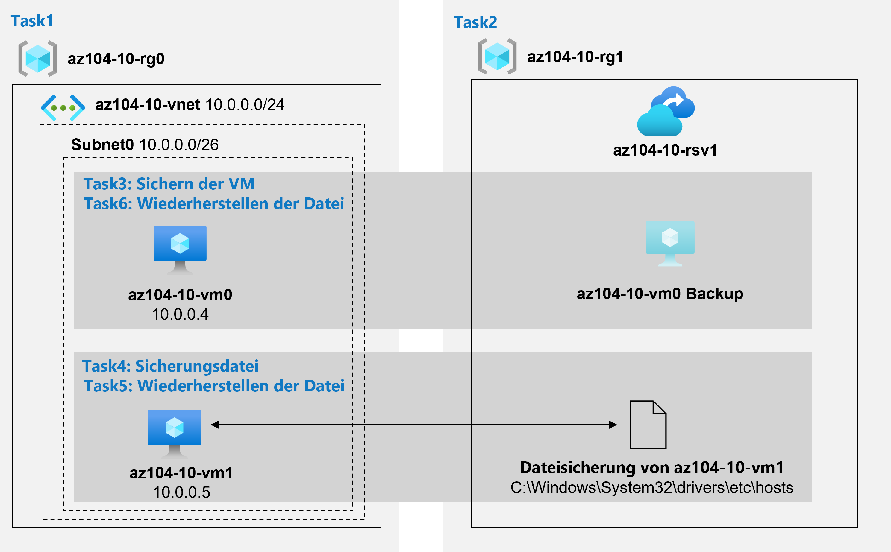

---
lab:
  title: 'Lab 10: Implementieren des Schutzes von Daten'
  module: Administer Data Protection
---

# Lab 10: Sichern von VMs
# Lab-Handbuch für Kursteilnehmer

## Labszenario

Sie wurden damit beauftragt, die Verwendung von Azure Recovery Services für die Sicherung und Wiederherstellung von Dateien, die auf Azure-VMs und lokalen Computern gehostet werden, auszuwerten. Darüber hinaus möchten Sie Methoden zum Schutz der im Recovery Services-Tresor gespeicherten Daten vor versehentlichem oder böswilligem Datenverlust identifizieren.

                **Hinweis:** Eine **[interaktive Labsimulation](https://mslabs.cloudguides.com/guides/AZ-104%20Exam%20Guide%20-%20Microsoft%20Azure%20Administrator%20Exercise%2016)** ist verfügbar, mit der Sie dieses Lab in Ihrem eigenen Tempo durcharbeiten können. Möglicherweise liegen geringfügige Unterschiede zwischen der interaktiven Simulation und dem gehosteten Lab vor, aber die dargestellten Kernkonzepte und Ideen sind identisch. 

## Ziele

Dieses Lab deckt Folgendes ab:

+ Aufgabe 1: Bereitstellen der Laborumgebung
+ Aufgabe 2: Erstellen eines Recovery Services-Tresors
+ Aufgabe 3: Implementieren der Azure-Sicherung auf VM-Ebene
+ Aufgabe 4: Implementieren der Datei- und Ordnersicherung
+ Aufgabe 5: Ausführen von Dateiwiederherstellung mithilfe des Azure Recovery Services-Agents
+ Aufgabe 6: Ausführen von Dateiwiederherstellung mithilfe von Momentaufnahmen von Azure-VMs (optional)
+ Aufgabe 7: Überprüfen der Azure Recovery Services-Funktion für vorläufiges Löschen (optional)

## Geschätzte Zeit: 50 Minuten

## Architekturdiagramm



### Anweisungen

## Übung 1

## Aufgabe 1: Bereitstellen der Laborumgebung

In dieser Aufgabe stellen Sie zwei VMs zum Testen verschiedener Sicherungsszenarien bereit.

1. Melden Sie sich beim [Azure-Portal](https://portal.azure.com) an.

1. Öffnen Sie **Azure Cloud Shell** im Azure-Portal, indem Sie oben rechts im Azure-Portal auf das entsprechende Symbol klicken.

1. Wenn Sie aufgefordert werden, entweder **Bash** oder **PowerShell** auszuwählen, wählen Sie **PowerShell** aus.

    >**Hinweis**: Wenn Sie **Cloud Shell** zum ersten Mal starten und die Meldung **Für Sie wurde kein Speicher bereitgestellt** angezeigt wird, wählen Sie das Abonnement aus, das Sie in diesem Lab verwenden, und klicken Sie dann auf **Speicher erstellen**.

1. Klicken Sie in der Symbolleiste des Cloud Shell-Bereichs auf das Symbol **Dateien hochladen/herunterladen**, klicken Sie im Dropdownmenü auf **Hochladen**, und laden Sie die Dateien **\\Allfiles\\Labs\\10\\az104-10-vms-edge-template.json** and **\\Allfiles\\Labs\\10\\az104-10-vms-edge-parameters.json** in das Cloud Shell-Basisverzeichnis hoch.

1. Führen Sie im Cloud Shell-Bereich Folgendes aus, um die Ressourcengruppe zu erstellen, die die VMs hostet (ersetzen Sie den Platzhalter `[Azure_region]` durch den Namen einer Azure-Region, in der Sie Azure-VMs bereitstellen möchten). Geben Sie jede Befehlszeile separat ein, und führen Sie sie separat aus:

   ```powershell
   $location = '[Azure_region]'
    ```
    
   ```powershell
   $rgName = 'az104-10-rg0'
    ```
    
   ```powershell
   New-AzResourceGroup -Name $rgName -Location $location
   ```

1. Führen Sie im Cloud Shell-Bereich Folgendes aus, um das erste virtuelle Netzwerk zu erstellen und mithilfe der hochgeladenen Vorlagen- und Parameterdateien eine VM darin bereitzustellen:
    >**Hinweis**: Sie werden aufgefordert, ein Administratorkennwort anzugeben.
    
   ```powershell
   New-AzResourceGroupDeployment `
      -ResourceGroupName $rgName `
      -TemplateFile $HOME/az104-10-vms-edge-template.json `
      -TemplateParameterFile $HOME/az104-10-vms-edge-parameters.json `
      -AsJob
   ```

1. Minimieren Sie Cloud Shell (schließen Sie die Shell jedoch nicht).

    >**Hinweis**: Warten Sie nicht, bis die Bereitstellung abgeschlossen ist, sondern fahren Sie stattdessen mit der nächsten Aufgabe fort. Die Bereitstellung sollte ungefähr fünf Minuten dauern.

## Aufgabe 2: Erstellen eines Recovery Services-Tresors

In dieser Aufgabe erstellen Sie einen Recovery Services-Tresor.

1. Suchen Sie im Azure-Portal nach **Recovery Services-Tresore**, und wählen Sie diese Option aus. Klicken Sie auf dem Blatt **Recovery Services-Tresore** auf **+ Erstellen**.

1. Geben Sie auf dem Blatt **Recovery Services-Tresor erstellen** die folgenden Einstellungen an:

    | Einstellungen | Wert |
    | --- | --- |
    | Subscription | Der Name des Azure-Abonnements, das Sie in diesem Lab verwenden. |
    | Resource group | Der Name einer neuen Ressourcengruppe **az104-10-rg1**. |
    | Tresorname | **az104-10-rsv1** |
    | Region | Der Name einer Region, in der Sie die beiden VMs in der vorherigen Aufgabe bereitgestellt haben. |

    >**Hinweis**: Stellen Sie sicher, dass Sie dieselbe Region angeben, in der Sie in der vorherigen Aufgabe VMs bereitgestellt haben.

1. Klicken Sie auf **Überprüfen und erstellen**, stellen Sie sicher, dass die Überprüfung erfolgreich war, und klicken Sie auf **Erstellen**.

    >**Hinweis**: Warten Sie, bis die Bereitstellung abgeschlossen ist. Die Bereitstellung sollte nicht länger als eine Minute dauern.

1. Klicken Sie nach Abschluss der Bereitstellung auf **Zu Ressource wechseln**.

1. Klicken Sie auf dem Blatt des Recovery Services-Tresors **az104-10-rsv1** im Abschnitt **Einstellungen** auf **Eigenschaften**.

1. Klicken Sie **auf dem Blatt az104-10-rsv1 - Eigenschaften** unter der Bezeichnung **Sicherungskonfiguration** auf den Link **Aktualisieren**.

1. Überprüfen Sie im Bereich **Sicherungskonfiguration** die Auswahl für **Speicherreplikationstyp**. Übernehmen Sie die Standardeinstellung **Georedundant**, und schließen Sie das Blatt.

    >**Hinweis**: Diese Einstellung kann nur konfiguriert werden, wenn keine Sicherungselemente vorhanden sind.

1. Klicken Sie auf dem Blatt **az104-10-rsv1 - Eigenschaften** unter der Bezeichnung **Sicherungseinstellungen** auf den Link **Aktualisieren**.

1. Beachten Sie auf dem Blatt **Sicherheitseinstellungen**, dass **Vorläufiges Löschen (für Workloads, die in Azure ausgeführt werden)** auf **Aktiviert** festgelegt ist.

1. Schließen Sie das Blatt **Sicherheitseinstellungen**, und klicken Sie auf dem Blatt des Tresors **az104-10-rsv1** auf **Übersicht**.

## Aufgabe 3: Implementieren der Azure-Sicherung auf VM-Ebene

In dieser Aufgabe implementieren Sie Sicherung auf Azure-VM-Ebene.

   >**Hinweis**: Bevor Sie mit dieser Aufgabe beginnen, stellen Sie sicher, dass die Bereitstellung, die Sie in der ersten Aufgabe dieses Labs initiiert haben, erfolgreich abgeschlossen wurde.

1. Klicken Sie auf dem Blatt des Recovery Services-Tresors **az104-10-rsv1** auf **Übersicht** und dann auf **+ Sichern**.

1. Geben Sie auf dem Blatt **Sicherungsziel** die folgenden Einstellungen an:

    | Einstellungen | Wert |
    | --- | --- |
    | Wo wird Ihre Workload ausgeführt? | **Azure** |
    | Was möchten Sie sichern? | **Virtueller Computer** |

1. Klicken Sie auf dem Blatt **Sicherungsziel** auf **Sicherung**.

1. Überprüfen Sie in der **Sicherungsrichtlinie** die **DefaultPolicy**-Einstellungen, und wählen Sie **Neue Richtlinie erstellen** aus.

1. Definieren Sie eine neue Sicherungsrichtlinie mit den folgenden Einstellungen (übernehmen Sie für andere Einstellungen die Standardwerte):

    | Einstellung | Wert |
    | ---- | ---- |
    | Richtlinienname | **az104-10-backup-policy** |
    | Häufigkeit | **Täglich** |
    | Time | **24:00 Uhr** |
    | Zeitzone | Der Name Ihrer lokalen Zeitzone. |
    | Momentaufnahmen für sofortige Wiederherstellung beibehalten für | **2** Tag(e) |

1. Klicken Sie auf **OK**, um die Richtlinie zu erstellen, und wählen Sie dann im Abschnitt **Virtual Machines** die Option **Hinzufügen** aus.

1. Wählen Sie auf dem Blatt **Virtuelle Computer auswählen** die VM **az-104-10-vm0** aus, klicken Sie auf **OK**,und klicken Sie dann auf dem Blatt **Sicherung** auf **Sicherung aktivieren**.

    >**Hinweis**: Warten Sie, bis die Sicherung aktiviert wurde. Dieser Vorgang dauert etwa zwei Minuten.

1. Navigieren Sie zurück zum Blatt des Recovery Services-Tresors **az104-10-rsv1**, klicken Sie im Abschnitt **Geschützte Elemente** auf **Sicherungselemente** und dann auf den Eintrag **Virtueller Azure-Computer**.

1. Wählen Sie auf dem Blatt **Sicherungselemente (Azure-VM)** den Link **Details anzeigen** für **az104-10-vm0** aus, und überprüfen Sie die Werte der Einträge **Sicherungsvorüberprüfung** und **Status der letzten Sicherung**.

1. Klicken Sie auf dem Blatt des Sicherungselements **az104-10-vm0** auf **Jetzt sichern**, übernehmen Sie den Standardwert in der Dropdownliste **Sicherung beibehalten bis**, und klicken Sie dann auf **OK**.

    >**Hinweis**: Warten Sie nicht, bis die Sicherung abgeschlossen ist, sondern fahren Sie stattdessen mit der nächsten Aufgabe fort.

## Aufgabe 4: Implementieren der Datei- und Ordnersicherung

In dieser Aufgabe implementieren Sie die Datei- und Ordnersicherung mithilfe von Azure Recovery Services.

1. Suchen Sie im Azure-Portal nach **Virtuelle Computer**, und wählen Sie diese Option aus. Klicken Sie dann auf dem Blatt **Virtuelle Computer** auf **az104-10-vm1**.

1. Klicken Sie auf dem Blatt von **az104-10-vm1** auf **Verbinden**, klicken Sie im Dropdownmenü auf **RDP**, klicken Sie auf dem Blatt **Verbinden mit RDP** auf **RDP-Datei herunterladen**, und befolgen Sie die Anweisungen, um die Remotedesktopsitzung zu starten.

    >**Hinweis**: Dieser Schritt bezieht sich auf das Herstellen einer Verbindung über Remotedesktop von einem Windows-Computer aus. Auf einem Mac können Sie einen Remotedesktopclient aus dem Mac App Store verwenden. Auf Linux-Computern können Sie Open-Source-RDP-Clientsoftware verwenden.

    >**Hinweis**: Sie können Warnungseingabeaufforderungen ignorieren, wenn Sie eine Verbindung mit den Ziel-VMs herstellen.

1. Wenn Sie dazu aufgefordert werden, melden Sie sich mit dem Benutzernamen **Student** und dem Kennwort in der Parameterdatei an.

    >**Hinweis**: Da das Azure-Portal IE11 nicht mehr unterstützt, müssen Sie für diese Aufgabe den Microsoft Edge-Browser verwenden.

1. Starten Sie in der Remotedesktopsitzung mit der Azure-VM **az104-10-vm1** den Edge-Webbrowser, navigieren Sie zum [Azure-Portal](https://portal.azure.com), und melden Sie sich mit Ihren Anmeldeinformationen an.

1. Suchen Sie im Azure-Portal nach **Recovery Services-Tresore**, und wählen Sie diese Option aus. Klicken Sie auf dem Blatt **Recovery Services-Tresore** auf **az104-10-rsv1**.

1. Klicken Sie auf dem Blatt des Recovery Services-Tresors **az104-10-rsv1** auf **+ Sichern**.

1. Geben Sie auf dem Blatt **Sicherungsziel** die folgenden Einstellungen an:

    | Einstellungen | Wert |
    | --- | --- |
    | Wo wird Ihre Workload ausgeführt? | **Lokal** |
    | Was möchten Sie sichern? | **Dateien und Ordner** |

    >**Hinweis**: Obwohl die VM, die Sie in dieser Aufgabe verwenden, in Azure ausgeführt wird, können Sie sie nutzen, um die Sicherungsfunktionen zu bewerten, die für jeden lokalen Computer gelten, auf dem das Betriebssystem Windows Server ausgeführt wird.

1. Klicken Sie auf dem Blatt **Sicherungsziel** auf **Vorbereiten der Infrastruktur**.

1. Klicken Sie auf dem Blatt **Vorbereiten der Infrastruktur** auf den Link **Agent für Windows Server oder Windows-Client herunterladen**.

1. Wenn Sie dazu aufgefordert werden, klicken Sie auf **Ausführen**, um die Installation von **MARSAgentInstaller.exe** mit den Standardeinstellungen zu starten.

    >**Hinweis**: Wählen Sie auf der Seite zum **Abonnieren von Microsoft Update** des **Setup-Assistenten für den Microsoft Azure Recovery Services-Agent** die Installationsoption **Ich möchte Microsoft Update nicht verwenden** aus.

1. Klicken Sie auf der Seite **Installation** des **Setup-Assistenten für den Microsoft Azure Recovery Services-Agent** auf **Mit Registrierung fortfahren**. Der **Assistent zum Registrieren von Servern** wird geöffnet.

1. Wechseln Sie zum Webbrowserfenster, in dem das Azure-Portal angezeigt wird. Aktivieren Sie auf dem Blatt **Vorbereiten der Infrastruktur** das Kontrollkästchen **Bereits heruntergeladen oder neuester Recovery Server-Agent wird verwendet**, und klicken Sie auf **Herunterladen**.

1. Wenn Sie dazu gefragt werden, ob Sie die Datei mit den Tresoranmeldeinformationen öffnen oder speichern möchten, klicken Sie auf **Speichern**. Dadurch wird die Datei mit den Tresoranmeldeinformationen im lokalen Ordner „Downloads“ gespeichert.

1. Wechseln Sie zurück zum Fenster **Assistent zum Registrieren von Servern**, und klicken Sie auf der Seite **Tresoridentifikation** auf **Durchsuchen**.

1. Navigieren Sie im Dialogfeld **Tresoranmeldeinformationen auswählen** zum Ordner **Downloads**, klicken Sie auf die Datei mit den Tresoranmeldeinformationen, die Sie heruntergeladen haben, und klicken Sie auf **Öffnen**.

1. Klicken Sie auf der Seite **Tresoridentifikation** auf **Weiter**.

1. Stellen Sie sicher, dass **Passphrase sicher in Azure Key Vault speichern** nicht aktiviert ist. 

1. Klicken Sie auf der Seite **Verschlüsselungseinstellung** des **Assistenten zum Registrieren von Servern** auf **Passphrase generieren**.

1. Klicken Sie auf der Seite **Verschlüsselungseinstellung** des **Assistenten zum Registrieren von Servern** auf die Schaltfläche **Durchsuchen** neben **Geben Sie einen Speicherort zum Speichern der Passphrase ein**.

1. Wählen Sie im Dialogfeld **Ordner suchen** den Ordner **Dokumente** aus, und klicken Sie auf **OK**.

1. Klicken Sie auf **Fertig stellen**, überprüfen Sie die **Microsoft Azure-Sicherungswarnung**, klicken Sie auf **Ja**,und warten Sie, bis die Registrierung abgeschlossen wurde.

    >**Hinweis**: In einer Produktionsumgebung sollten Sie die Passphrasedatei an einem sicheren Speicherort speichern, der nicht der Server ist, der gesichert wird.

1. Überprüfen Sie auf der Seite **Serverregistrierung** des **Assistenten zum Registrieren von Servern** die Warnung in Bezug auf den Speicherort der Passphrasedatei, stellen Sie sicher, dass das Kontrollkästchen **Microsoft Azure Recovery Services-Agent starten** aktiviert ist, und klicken Sie auf **Schließen**. Dadurch wird automatisch die Konsole von **Microsoft Azure Backup** geöffnet.

1. Klicken Sie in der Konsole von **Microsoft Azure Backup** im Bereich **Aktionen** auf **Sicherung planen**.

1. Klicken Sie im **Assistenten zum Planen der Sicherung** auf der Seite **Erste Schritte** auf **Weiter**.

1. Klicken Sie auf der Seite **Elemente für Sicherung auswählen** auf **Elemente hinzufügen**.

1. Erweitern Sie **C:\\Windows\\System32\\drivers\\etc\\** im Dialogfeld **Elemente auswählen**,wählen Sie **hosts** aus, und klicken Sie dann auf **OK**:

1. Klicken Sie auf der Seite **Elemente für Sicherung auswählen** auf **Weiter**.

1. Stellen Sie auf der Seite **Sicherungszeitplan** angeben sicher, dass die Option **Tag** ausgewählt ist. Wählen Sie im ersten Dropdown-Listenfeld unterhalb des Felds **Zu folgenden Zeiten (maximal zulässig ist drei Mal täglich)** die Option **4:30 Uhr** aus, und klicken Sie dann auf **Weiter**.

1. Übernehmen Sie auf der Seite **Aufbewahrungsrichtlinie auswählen** die Standardwerte, und klicken Sie dann auf **Weiter**.

1. Übernehmen Sie auf der Seite **Anfänglichen Sicherungstyp auswählen** die Standardwerte, und klicken Sie dann auf **Weiter**.

1. Klicken Sie auf der Seite **Bestätigung** auf **Fertig stellen**. Nachdem der Sicherungszeitplan erstellt wurde, klicken Sie auf **Schließen**.

1. Klicken Sie in der Konsole von **Microsoft Azure Backup** im Bereich „Aktionen“ auf **Jetzt sichern**.

    >**Hinweis**: Die Option zum Ausführen der Sicherung bei Bedarf wird verfügbar, sobald Sie eine geplante Sicherung erstellen.

1. Stellen Sie im Assistenten für die Option „Jetzt sichern“ auf der Seite **Sicherungselement auswählen** sicher, dass die Option **Dateien und Ordner** aktiviert ist, und klicken Sie auf **Weiter**.

1. Übernehmen Sie auf der Seite **Sicherung beibehalten bis** die Standardeinstellung, und klicken Sie auf **Weiter**.

1. Klicken Sie auf der Seite **Bestätigung** auf **Sichern**.

1. Nachdem die Sicherung abgeschlossen wurde, klicken Sie auf **Schließen**, und schließen Sie dann Microsoft Azure Backup.

1. Wechseln Sie zum Webbrowserfenster, in dem das Azure-Portal angezeigt wird, navigieren Sie zurück zum Blatt **Recovery Services-Tresor** im Abschnitt **Geschützte Elemente**, und klicken Sie auf **Sicherungselemente**.

1. Klicken Sie auf dem Blatt **az104-10-rsv1 - Sicherungselemente** auf **Azure Backup-Agent**.

1. Bestätigen Sie auf dem Blatt **Sicherungselemente (Azure Backup-Agent)** , dass ein Eintrag auf das Laufwerk **C:\\** von **az104-10-vm1.** verweist.

## Aufgabe 5: Ausführen von Dateiwiederherstellung mithilfe des Azure Recovery Services-Agents (optional)

In dieser Aufgabe führen Sie die Dateiwiederherstellung mithilfe des Azure Recovery Services-Agents aus.

1. Öffnen Sie in der Remotedesktopsitzung mit **az104-10-vm1** den Datei-Explorer, navigieren Sie zum Ordner **C:\\Windows\\System32\\drivers\\etc\\** , und löschen Sie die **hosts**-Datei.

1. Öffnen Sie Microsoft Azure Backup, und klicken Sie im Bereich **Aktionen** auf **Daten wiederherstellen**. Dadurch wird der **Assistent zum Wiederherstellen von Daten** gestartet.

1. Stellen Sie auf der Seite **Erste Schritte** des **Assistenten zum Wiederherstellen von Daten** sicher, dass die Option **Dieser Server (az104-10-vm1.)** ausgewählt ist, und klicken Sie auf **Weiter**.

1. Stellen Sie auf der Seite **Wiederherstellungsmodus auswählen** sicher, dass die Option **Einzelne Dateien und Ordner** ausgewählt ist, und klicken Sie auf **Weiter**.

1. Wählen Sie auf der Seite **Volume und Datum auswählen** in der Dropdownliste **Volume auswählen** die Option **C:\\** aus, übernehmen Sie die Standardauswahl der verfügbaren Sicherung, und klicken Sie auf **Einbinden**.

    >**Hinweis**: Warten Sie, bis der Vorgang zum Einbinden abgeschlossen wurde. Dies kann etwa zwei Minuten dauern.

1. Notieren Sie sich auf der Seite **Dateien durchsuchen und wiederherstellen** den Laufwerkbuchstaben des Wiederherstellungsvolumens, und überprüfen Sie den Tipp zur Verwendung von Robocopy.

1. Klicken Sie auf **Start**, erweitern Sie den Ordner **Windows System**, und klicken Sie auf **Eingabeaufforderung**.

1. Führen Sie an der Eingabeaufforderung Folgendes aus, um die wiederhergestellte **hosts**-Datei an den ursprünglichen Speicherort zu kopieren (ersetzen Sie `[recovery_volume]` durch den Laufwerkbuchstaben des zuvor identifizierten Wiederherstellungsvolumens):

   ```sh
   robocopy [recovery_volume]:\Windows\System32\drivers\etc C:\Windows\system32\drivers\etc hosts /r:1 /w:1
   ```

1. Wechseln Sie zurück zum **Assistenten zum Wiederherstellen von Daten**, und klicken Sie unter **Dateien durchsuchen und wiederherstellen** auf **Bereitstellung aufheben**. Klicken Sie auf **Ja**, wenn Sie zur Bestätigung aufgefordert werden.

1. Schließen Sie die Remotedesktopsitzung.

## Aufgabe 6: Ausführen von Dateiwiederherstellung mithilfe von Momentaufnahmen von Azure-VMs (optional)

In dieser Aufgabe stellen Sie eine Datei aus der momentaufnahmebasierten Azure-Sicherung auf VM-Ebene wieder her.

1. Wechseln Sie zum Browserfenster, das auf Ihrem Lab-Computer ausgeführt wird und das Azure-Portal anzeigt.

1. Suchen Sie im Azure-Portal nach **Virtuelle Computer**, und wählen Sie diese Option aus. Klicken Sie dann auf dem Blatt **Virtuelle Computer** auf **az104-10-vm0**.

1. Klicken Sie auf dem Blatt von **az104-10-vm0** auf **Verbinden**, klicken Sie im Dropdownmenü auf **RDP**, klicken Sie auf dem Blatt **Verbinden mit RDP** auf **RDP-Datei herunterladen**, und befolgen Sie die Anweisungen, um die Remotedesktopsitzung zu starten.

    >**Hinweis**: Dieser Schritt bezieht sich auf das Herstellen einer Verbindung über Remotedesktop von einem Windows-Computer aus. Auf einem Mac können Sie einen Remotedesktopclient aus dem Mac App Store verwenden. Auf Linux-Computern können Sie Open-Source-RDP-Clientsoftware verwenden.

    >**Hinweis**: Sie können Warnungseingabeaufforderungen ignorieren, wenn Sie eine Verbindung mit den Ziel-VMs herstellen.

1. Wenn Sie dazu aufgefordert werden, melden Sie sich mit dem Benutzernamen **Student** und dem Kennwort in der Parameterdatei an.

   >**Hinweis**: Da das Azure-Portal IE11 nicht mehr unterstützt, müssen Sie für diese Aufgabe den Microsoft Edge-Browser verwenden.

1. Klicken Sie in der Remotedesktopsitzung mit **az104-10-vm0** auf **Start**, erweitern Sie den Ordner **Windows System**, und klicken Sie auf **Eingabeaufforderung**.

1. Führen Sie an der Eingabeaufforderung Folgendes aus, um die **hosts**-Datei zu löschen:

   ```sh
   del C:\Windows\system32\drivers\etc\hosts
   ```

   >**Hinweis**: Sie stellen diese Datei später in dieser Aufgabe aus der momentaufnahmebasierten Azure-Sicherung auf VM-Ebene wieder her.

1. Starten Sie in der Remotedesktopsitzung mit der Azure-VM **az104-10-vm0** den Edge-Webbrowser, navigieren Sie zum [Azure-Portal](https://portal.azure.com), und melden Sie sich mit Ihren Anmeldeinformationen an.

1. Suchen Sie im Azure-Portal nach **Recovery Services-Tresore**, und wählen Sie diese Option aus. Klicken Sie auf dem Blatt **Recovery Services-Tresore** auf **az104-10-rsv1**.

1. Klicken Sie auf dem Blatt des Recovery Services-Tresors **az104-10-rsv1** im Abschnitt **Geschützte Elemente** auf **Sicherungselemente**.

1. Klicken Sie auf dem Blatt **az104-10-rsv1 - Sicherungselemente** auf **Virtueller Azure-Computer**.

1. Wählen Sie auf dem Blatt **Sicherungselemente (Azure-VM)** die Option **Details anzeigen** für **az104-10-vm0** aus.

1. Klicken Sie auf dem Blatt des Sicherungselements **az104-10-vm0** auf **Dateiwiederherstellung**.

    >**Hinweis**: Sie können die Wiederherstellung basierend auf der anwendungskonsistenten Momentaufnahme kurz nach dem Starten der Sicherung ausführen.

1. Übernehmen Sie auf dem Blatt **Dateiwiederherstellung** den Standardwiederherstellungspunkt, und klicken Sie auf **Ausführbare Datei herunterladen**.

    >**Hinweis**: Das Skript bindet die Datenträger aus dem ausgewählten Wiederherstellungspunkt als lokale Laufwerke innerhalb des Betriebssystems ein, mit dem das Skript ausgeführt wird.

1. Klicken Sie auf **Herunterladen**. Klicken Sie auf **Speichern**, wenn Sie dazu aufgefordert werden, **IaaSVMILRExeForWindows.exe** auszuführen oder zu speichern.

1. Doppelklicken Sie im Fenster des Datei-Explorers auf die neu heruntergeladene Datei.

1. Wenn Sie aufgefordert werden, das Kennwort aus dem Portal bereitzustellen, kopieren Sie das Kennwort aus dem Textfeld **Kennwort zum Ausführen des Skripts** auf dem Blatt **Dateiwiederherstellung**, fügen Sie es in die Eingabeaufforderung ein, und drücken Sie die **EINGABETASTE**.

    >**Hinweis**: Dadurch wird ein Windows PowerShell-Fenster geöffnet, in dem der Fortschritt der Einbindung angezeigt wird.

    >**Hinweis**: Wenn Sie an diesem Punkt eine Fehlermeldung erhalten, aktualisieren Sie das Webbrowserfenster, und wiederholen Sie die letzten drei Schritte.

1. Warten Sie, bis der Bereitstellungsprozess abgeschlossen wurde, überprüfen Sie die Informationsmeldungen im Windows PowerShell-Fenster, notieren Sie sich den Laufwerkbuchstaben, der dem Volume zugewiesen ist, das **Windows** hostet, und starten Sie den Datei-Explorer.

1. Navigieren Sie im Datei-Explorer zum Laufwerkbuchstaben, der die Momentaufnahme des Betriebssystemvolumes hostet, das Sie im vorherigen Schritt identifiziert haben, und überprüfen Sie dessen Inhalt.

1. Wechseln Sie zum **Eingabeaufforderungsfenster**.

1. Führen Sie an der Eingabeaufforderung Folgendes aus, um die wiederhergestellte **hosts**-Datei an den ursprünglichen Speicherort zu kopieren (ersetzen Sie `[os_volume]` durch den Laufwerkbuchstaben des zuvor identifizierten Betriebssystemvolumes):

   ```sh
   robocopy [os_volume]:\Windows\System32\drivers\etc C:\Windows\system32\drivers\etc hosts /r:1 /w:1
   ```

1. Wechseln Sie im Azure-Portal zurück zum Blatt **Dateiwiederherstellung**, und klicken Sie auf **Bereitstellung der Datenträger aufheben**.

1. Schließen Sie die Remotedesktopsitzung.

## Aufgabe 7: Überprüfen der Azure Recovery Services-Funktion für vorläufiges Löschen

1. Suchen Sie auf dem Lab-Computer im Azure-Portal nach **Recovery Services-Tresore**, und wählen Sie diese Option aus. Klicken Sie auf dem Blatt **Recovery Services-Tresore** auf **az104-10-rsv1**.

1. Klicken Sie auf dem Blatt des Recovery Services-Tresors **az104-10-rsv1** im Abschnitt **Geschützte Elemente** auf **Sicherungselemente**.

1. Klicken Sie auf dem Blatt **az104-10-rsv1 - Sicherungselemente** auf **Azure Backup-Agent**.

1. Klicken Sie auf dem Blatt **Sicherungselemente (Azure Backup-Agent)** auf den Eintrag, der die Sicherung von **az104-10-vm1** darstellt.

1. Klicken Sie auf dem Blatt **C:\\ auf az104-10-vm1**. und wählen Sie **Details anzeigen** für **az104-10-vm1** aus .

1. Klicken Sie auf dem Blatt „Details“ auf **az104-10-vm1**.

1. Klicken Sie auf dem Blatt „Geschützte Server“ von **az104-10-vm1.** auf **Löschen**.

1. Geben Sie auf dem Blatt **Löschen** die folgenden Einstellungen an.

    | Einstellungen | Wert |
    | --- | --- |
    | SERVERNAMEN EINGEBEN | **az104-10-vm1.** |
    | `Reason` | **Dev/Test-Server wird neu verwendet** |
    | Kommentare | **az104 10 Lab** |

    >**Hinweis**: Achten Sie darauf, den nachgestellten Punkt bei der Eingabe des Servernamens einzubeziehen.

1. Aktivieren Sie das Kontrollkästchen neben der Bezeichnung **Es gibt Sicherungsdaten von 1 Sicherungselementen, die mit diesem Server verbunden sind. Ich weiß, dass durch Klicken auf "Bestätigen" alle Cloudsicherungsdaten dauerhaft gelöscht werden. Diese Aktion kann nicht rückgängig gemacht werden. Eine Warnung kann an die Administratoren dieses Abonnements gesendet werden, um sie über diese Löschung zu informieren**, und klicken Sie auf **Löschen**.

    >**Hinweis:** Dies wird fehlschlagen, weil das Feature **Vorläufiges Löschen** deaktiviert sein muss.

1. Navigieren Sie zurück zum Blatt **az104-10-rsv1 - Sicherungselemente**, und klicken Sie auf **Virtueller Azure-Computer**.

1. Klicken Sie auf dem Blatt **az104-10-rsv1 - Sicherungselemente** auf **Virtueller Azure-Computer**.

1. Wählen Sie auf dem Blatt **Sicherungselemente (Azure-VM)** die Option **Details anzeigen** für **az104-10-vm0** aus.

1. Klicken Sie auf dem Blatt des Sicherungselements **az104-10-vm0** auf **Sicherung beenden**.

1. Wählen Sie auf dem Blatt **Sicherung beenden** die Option **Sicherungsdaten löschen** aus, und geben Sie dabei die folgenden Einstellungen an. Klicken Sie dann auf **Sicherung beenden**:

    | Einstellungen | Wert |
    | --- | --- |
    | Geben Sie den Namen des Sicherungselements ein. | **az104-10-vm0** |
    | `Reason` | **Andere** |
    | Kommentare | **az104 10 Lab** |

1. Navigieren Sie zurück zum Blatt **az104-10-rsv1 - Sicherungselemente**, und klicken Sie auf **Aktualisieren**.

    >**Hinweis**: Im Eintrag **Virtueller Azure-Computer** wird immer noch **1** Sicherungselement aufgeführt.

1. Klicken Sie auf den Eintrag **Virtueller Azure-Computer**, und klicken Sie auf dem Blatt **Sicherungselemente (Virtueller Azure-Computer)** auf den Eintrag **az104-10-vm0**.

1. Beachten Sie, dass auf dem Blatt des Sicherungselements **az104-10-vm0** die Option besteht, die gelöschte Sicherung **wiederherzustellen**.

    >**Hinweis**: Diese Funktionalität wird durch das Feature für vorläufiges Löschen bereitgestellt, das standardmäßig für Sicherungen von Azure-VMs aktiviert ist.

1. Navigieren Sie zurück zum Blatt des Recovery Services-Tresors **az104-10-rsv1**, und klicken Sie im Abschnitt **Einstellungen** auf **Eigenschaften**.

1. Klicken Sie auf dem Blatt **az104-10-rsv1 - Eigenschaften** unter der Bezeichnung **Sicherungseinstellungen** auf den Link **Aktualisieren**.

1. Deaktivieren Sie auf dem Blatt **Sicherheitseinstellungen** die Option **Vorläufiges Löschen (Für Arbeitslasten, die in Azure ausgeführt werden)** , außerdem **Sicherheitsfeatures (für Arbeitslasten, die lokal ausgeführt werden)** , und klicken Sie auf **Speichern**.

    >**Hinweis**: Dies wirkt sich nicht auf Elemente aus, die sich bereits im Zustand „Vorläufiges Löschen“ befinden.

1. Schließen Sie das Blatt **Sicherheitseinstellungen**, und klicken Sie auf dem Blatt des Tresors **az104-10-rsv1** auf **Übersicht**.

1. Navigieren Sie zurück zum Blatt des Sicherungselements **az104-10-vm0**, und klicken Sie auf **Wiederherstellen**.

1. Klicken Sie auf dem Blatt **az104-10-vm0 wiederherstellen** auf **Wiederherstellen**.

1. Warten Sie, bis der Wiederherstellungsvorgang abgeschlossen ist, aktualisieren Sie ggf. die Webbrowserseite, navigieren Sie zurück zum Blatt des Sicherungselements **az104-10-vm0**, und klicken Sie auf **Sicherungsdaten löschen**.

1. Geben Sie auf dem Blatt **Sicherungsdaten löschen** die folgenden Einstellungen an, und klicken Sie auf **Löschen**:

    | Einstellungen | Wert |
    | --- | --- |
    | Geben Sie den Namen des Sicherungselements ein. | **az104-10-vm0** |
    | `Reason` | **Andere** |
    | Kommentare | **az104 10 Lab** |

1. Wiederholen Sie die Schritte am Anfang dieser Aufgabe zum Löschen der Sicherungselemente für **az104-10-vm1**.

## Bereinigen von Ressourcen

>**Hinweis**: Denken Sie daran, alle neu erstellten Azure-Ressourcen zu entfernen, die Sie nicht mehr verwenden. Durch das Entfernen nicht verwendeter Ressourcen wird sichergestellt, dass keine unerwarteten Kosten anfallen.

>**Hinweis**: Machen Sie sich keine Sorgen, wenn die Labressourcen nicht sofort entfernt werden können. Mitunter haben Ressourcen Abhängigkeiten, sodass der Löschvorgang länger dauert. Es gehört zu den üblichen Administratoraufgaben, die Ressourcennutzung zu überwachen. Überprüfen Sie also regelmäßig Ihre Ressourcen im Portal darauf, wie es um die Bereinigung bestellt ist. 

1. Öffnen Sie im Azure-Portal im Bereich **Cloud Shell** die **PowerShell**-Sitzung.

1. Listen Sie alle Ressourcengruppen auf, die während der Labs in diesem Modul erstellt wurden, indem Sie den folgenden Befehl ausführen:

   ```powershell
   Get-AzResourceGroup -Name 'az104-10*'
   ```

1. Löschen Sie alle Ressourcengruppen, die Sie während der praktischen Übungen in diesem Modul erstellt haben, indem Sie den folgenden Befehl ausführen:

   ```powershell
   Get-AzResourceGroup -Name 'az104-10*' | Remove-AzResourceGroup -Force -AsJob
   ```

   >**Hinweis**: Optional können Sie erwägen, die automatisch generierte Ressourcengruppe mit dem Präfix **AzureBackupRG_** zu löschen (es entstehen keine zusätzlichen Kosten durch ihr Vorhandensein).

    >**Hinweis**: Der Befehl wird (wie über den Parameter „-AsJob“ festgelegt) asynchron ausgeführt. Dies bedeutet, dass Sie zwar direkt im Anschluss einen weiteren PowerShell-Befehl in derselben PowerShell-Sitzung ausführen können, es jedoch einige Minuten dauert, bis die Ressourcengruppen tatsächlich entfernt werden.

## Überprüfung

In diesem Lab haben Sie die folgenden Aufgaben ausgeführt:

+ Bereitstellen der Laborumgebung
+ Erstellen eines Recovery Services-Tresors
+ Implementieren der Azure-Sicherung auf VM-Ebene
+ Implementieren von Datei- und Ordnersicherung
+ Ausführen von Dateiwiederherstellung mithilfe des Azure Recovery Services-Agents
+ Ausführen von Dateiwiederherstellung mithilfe von Momentaufnahmen von Azure-VMs
+ Überprüfen der Azure Recovery Services-Funktion für vorläufiges Löschen
