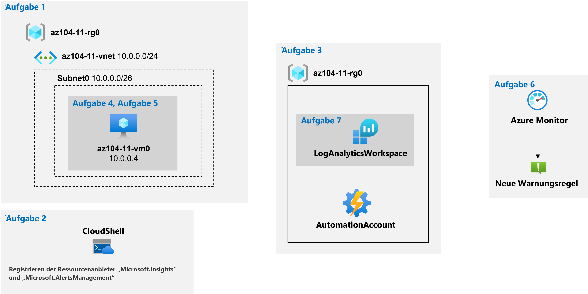

---
lab:
  title: "Lab\_11: Implementieren von Überwachung"
  module: Administer Monitoring
---

# Lab 11: Implementieren von Überwachung
# Lab-Handbuch für Kursteilnehmer

## Labszenario

Sie müssen Azure-Funktionen auswerten, die Einblicke in die Leistung und Konfiguration von Azure-Ressourcen bereitstellen, wobei Sie sich insbesondere auf Azure-VMs konzentrieren. Um dies zu erreichen, möchten Sie die Funktionen von Azure Monitor untersuchen, einschließlich Log Analytics.

                **Hinweis:** Eine **[interaktive Labsimulation](https://mslabs.cloudguides.com/guides/AZ-104%20Exam%20Guide%20-%20Microsoft%20Azure%20Administrator%20Exercise%2017)** ist verfügbar, mit der Sie dieses Lab in Ihrem eigenen Tempo durcharbeiten können. Möglicherweise liegen geringfügige Unterschiede zwischen der interaktiven Simulation und dem gehosteten Lab vor, aber die dargestellten Kernkonzepte und Ideen sind identisch. 

## Ziele

Dieses Lab deckt Folgendes ab:

+ Aufgabe 1: Bereitstellen der Laborumgebung
+ Aufgabe 2: Registrieren der Ressourcenanbieter Microsoft.Insights und Microsoft.AlertsManagement
+ Aufgabe 3: Erstellen und Konfigurieren eines Azure Log Analytics-Arbeitsbereichs und von auf Azure Automation basierenden Lösungen
+ Aufgabe 4: Überprüfen der Standardüberwachungseinstellungen von Azure-VMs
+ Aufgabe 5: Konfigurieren von Diagnoseeinstellungen für Azure-VMs
+ Aufgabe 6: Überprüfen der Azure Monitor-Funktionalität
+ Aufgabe 7: Überprüfen der Azure Log Analytics-Funktionalität

## Geschätzte Zeitdauer: 45 Minuten

## Architekturdiagramm



### Anweisungen

## Übung 1

## Aufgabe 1: Bereitstellen der Laborumgebung

In dieser Aufgabe stellen Sie eine VM bereit, die zum Testen von Überwachungsszenarien verwendet wird.

1. Melden Sie sich beim [Azure-Portal](https://portal.azure.com) an.

1. Öffnen Sie **Azure Cloud Shell** im Azure-Portal, indem Sie oben rechts im Azure-Portal auf das entsprechende Symbol klicken.

1. Wenn Sie aufgefordert werden, entweder **Bash** oder **PowerShell** auszuwählen, wählen Sie **PowerShell** aus.

    >**Hinweis**: Wenn Sie **Cloud Shell** zum ersten Mal starten und die Meldung **You have no storage mounted** (Es ist kein Speicher eingebunden) angezeigt wird, wählen Sie das Abonnement aus, das Sie in diesem Lab verwenden, und klicken Sie dann auf **Create storage** (Speicher erstellen).

1. Klicken Sie in der Symbolleiste des Cloud Shell-Bereichs auf das Symbol **Dateien hochladen/herunterladen**, klicken Sie im Dropdownmenü auf **Hochladen**, und laden Sie die Dateien **\\Allfiles\\Labs\\11\\az104-11-vm-template.json** und **\\Allfiles\\Labs\\11\\az104-11-vm-parameters.json** in das Cloud Shell-Basisverzeichnis hoch.

1. Führen Sie im Cloud Shell-Bereich Folgendes aus, um die Ressourcengruppe zu erstellen, die die VMs hostet (ersetzen Sie den Platzhalter `[Azure_region]` durch den Namen einer Azure-Region, in der Sie Azure-VMs bereitstellen möchten):

    >**Hinweis**: Stellen Sie sicher, dass Sie eine der Regionen auswählen, die in der [Dokumentation zu Arbeitsbereichszuordnungen](https://docs.microsoft.com/en-us/azure/automation/how-to/region-mappings) als **Log Analytics-Arbeitsbereichsregion** aufgeführt werden.

   ```powershell
   $location = '[Azure_region]'

   $rgName = 'az104-11-rg0'

   New-AzResourceGroup -Name $rgName -Location $location
   ```

1. Führen Sie im Cloud Shell-Bereich Folgendes aus, um das erste virtuelle Netzwerk zu erstellen und mithilfe der hochgeladenen Vorlagen- und Parameterdateien eine VM darin bereitzustellen:

    >**Hinweis**: Sie werden aufgefordert, ein Administratorkennwort anzugeben.
    
   ```powershell
   New-AzResourceGroupDeployment `
      -ResourceGroupName $rgName `
      -TemplateFile $HOME/az104-11-vm-template.json `
      -TemplateParameterFile $HOME/az104-11-vm-parameters.json `
      -AsJob
   ```

    >**Hinweis**: Warten Sie nicht, bis die Bereitstellung abgeschlossen ist, sondern fahren Sie stattdessen mit der nächsten Aufgabe fort. Die Bereitstellung sollte ungefähr drei Minuten dauern.

## Aufgabe 2: Registrieren der Microsoft.Insights- und Microsoft.AlertsManagement-Ressourcenanbieter.

1. Führen Sie im Cloud Shell-Bereich Folgendes aus, um die Microsoft.Insights- und Microsoft.AlertsManagement-Ressourcenanbieter zu registrieren.

   ```powershell
   Register-AzResourceProvider -ProviderNamespace Microsoft.Insights

   Register-AzResourceProvider -ProviderNamespace Microsoft.AlertsManagement
   ```

1. Minimieren Sie den Cloud Shell-Bereich (schließen Sie ihn jedoch nicht).

## Aufgabe 3: Erstellen und Konfigurieren eines Azure Log Analytics-Arbeitsbereichs und von auf Azure Automation basierenden Lösungen

In dieser Aufgabe erstellen und konfigurieren Sie einen Azure Log Analytics-Arbeitsbereich und auf Azure Automation basierende Lösungen.

1. Suchen Sie im Azure-Portal nach **Log Analytics-Arbeitsbereiche**, wählen Sie diese Option aus, und klicken Sie auf dem Blatt **Log Analytics-Arbeitsbereiche** auf **+ Erstellen**.

1. Geben Sie auf dem Blatt **Log Analytics-Arbeitsbereich erstellen** auf der Registerkarte **Grundlagen** die folgenden Einstellungen ein, klicken Sie auf **Überprüfen und erstellen** und dann auf **Erstellen**:

    | Einstellungen | Wert |
    | --- | --- |
    | Subscription | Der Name des Azure-Abonnements, das Sie in diesem Lab verwenden. |
    | Resource group | Der Name einer neuen Ressourcengruppe **az104-11-rg1**. |
    | Log Analytics-Arbeitsbereich | Ein beliebiger eindeutiger Name |
    | Region | Der Name der Azure-Region, in der Sie die VM in der vorherigen Aufgabe bereitgestellt haben. |

    >**Hinweis**: Stellen Sie sicher, dass Sie dieselbe Region angeben, in der Sie in der vorherigen Aufgabe VMs bereitgestellt haben.

    >**Hinweis**: Warten Sie, bis die Bereitstellung abgeschlossen ist. Die Bereitstellung sollte ungefähr eine Minuten dauern.

1. Suchen Sie im Azure-Portal nach **Automation-Konten**, wählen Sie diese Option aus, und klicken Sie auf dem Blatt **Automation-Konten** auf **+ Erstellen**.

1. Geben Sie auf dem Blatt **Automation-Konto erstellen** die folgenden Einstellungen an, und klicken Sie auf **Überprüfen und erstellen**. Klicken Sie nach der Überprüfung auf **Erstellen**:

    | Einstellungen | Wert |
    | --- | --- |
    | Name des Automation-Kontos | Ein beliebiger eindeutiger Name |
    | Subscription | Der Name des Azure-Abonnements, das Sie in diesem Lab verwenden. |
    | Resource group | **az104-11-rg1** |
    | Region | Der Name der Azure-Region, der basierend auf der [Dokumentation zu Arbeitsbereichszuordnungen](https://docs.microsoft.com/en-us/azure/automation/how-to/region-mappings) bestimmt wird. |

    >**Hinweis**: Stellen Sie sicher, dass Sie die Azure-Region basierend auf der [Dokumentation zu Arbeitsbereichszuordnungen](https://docs.microsoft.com/en-us/azure/automation/how-to/region-mappings) angeben.

    >**Hinweis**: Warten Sie, bis die Bereitstellung abgeschlossen ist. Die Bereitstellung dauert ungefähr drei Minuten.

1. Klicken Sie auf **Zu Ressource wechseln**.

1. Klicken Sie auf dem Blatt „Automation-Konto“ im Abschnitt **Konfigurationsverwaltung** auf **Bestand**.

1. Wählen Sie im Bereich **Bestand** in der Dropdownliste **Log Analytics-Arbeitsbereich** den Log Analytics-Arbeitsbereich aus, den Sie zuvor in dieser Aufgabe erstellt haben, und klicken Sie dann auf **Aktivieren**.

    >**Hinweis**: Warten Sie, bis die Installation der entsprechenden Log Analytics-Lösung abgeschlossen ist. Dies kann etwa drei Minuten dauern.

    >**Hinweis**: Dadurch wird automatisch auch die Lösung für **Änderungsnachverfolgung** installiert.

1. Klicken Sie auf dem Blatt „Automatisierungskonto“ im Abschnitt **Updateverwaltung** auf **Updateverwaltung** und dann auf **Aktivieren**.

    >**Hinweis**: Warten Sie, bis die Installation abgeschlossen ist. Dies kann etwa fünf Minuten dauern.

## Aufgabe 4: Überprüfen der Standardüberwachungseinstellungen von Azure-VMs

In dieser Aufgabe überprüfen Sie die Standardüberwachungseinstellungen von Azure-VMs.

1. Suchen Sie im Azure-Portal nach **Virtuelle Computer**, und wählen Sie diese Option aus. Klicken Sie dann auf dem Blatt **Virtuelle Computer** auf **az104-11-vm0**.

1. Klicken Sie auf dem Blatt **az104-11-vm0** im Abschnitt **Überwachung** auf **Metriken**.

1. Beachten Sie auf dem Blatt **az104-11-vm0 \| Metriken** im Standarddiagramm, dass der einzige verfügbare **Metriknamespace** **VM-Host** ist.

    >**Hinweis**: Dies ist zu erwarten, da noch keine Diagnoseeinstellungen auf Gastebene konfiguriert wurden. Sie haben jedoch die Möglichkeit, Gastspeichermetriken direkt aus der Dropdownliste **Metriknamespace** zu aktivieren. Sie aktivieren diese Option später in dieser Übung.

1. Überprüfen Sie in der Dropdownliste **Metrik** die Liste der verfügbaren Metriken.

    >**Hinweis**: Die Liste enthält eine Reihe von CPU-, datenträger- und netzwerkbezogenen Metriken, die vom VM-Host erfasst werden können, ohne Zugriff auf Metriken auf Gastebene zu besitzen.

1. Wählen Sie in der Dropdownliste **Metrik** die Option **CPU-Prozentsatz** aus, wählen Sie in der Dropdownliste **Aggregation** die Option **Durchschnitt** aus, und überprüfen Sie das sich ergebende Diagramm.

## Aufgabe 5: Konfigurieren von Diagnoseeinstellungen für Azure-VMs

In dieser Aufgabe konfigurieren Sie Diagnoseeinstellungen für Azure-VMs.

1. Klicken Sie auf dem Blatt **az104-11-vm0** im Abschnitt **Überwachung** auf **Diagnoseeinstellungen**.

1. Wählen Sie auf der Registerkarte **Übersicht** des Blatts **az104-11-vm0\|-Diagnoseeinstellungen** die Option **Diagnosespeicherkonto** aus, und klicken Sie dann auf **Überwachung auf Gastebene aktivieren**.

    >**Hinweis**: Warten Sie, bis die Erweiterung für Diagnoseeinstellungen installiert ist. Dies kann etwa drei Minuten dauern.

1. Wechseln Sie zur Registerkarte **Leistungsindikatoren** auf dem Blatt **az104-11-vm0 \| Diagnoseeinstellungen**, und überprüfen Sie die verfügbaren Leistungsindikatoren.

    >**Hinweis**: Standardmäßig sind CPU-, Arbeitsspeicher-, Datenträger- und Netzwerkleistungsindikatoren aktiviert. Sie können zur **benutzerdefinierten** Ansicht wechseln, um eine ausführlichere Liste anzuzeigen.

1. Wechseln Sie auf dem Blatt **az104-11-vm0 \| Diagnoseeinstellungen** zur Registerkarte **Protokolle**, und überprüfen Sie die verfügbaren Optionen für die Ereignisprotokollsammlung.

    >**Hinweis**: Die Protokollsammlung enthält standardmäßig kritische, Fehler- und Warnungseinträge aus dem Anwendungsprotokoll und dem Systemprotokoll sowie Einträge zu Überwachungsfehlern aus dem Sicherheitsprotokoll. Hier können Sie auch zur **benutzerdefinierten** Ansicht wechseln, um ausführlichere Konfigurationseinstellungen anzuzeigen.

1. Klicken Sie auf dem Blatt **az104-11-vm0** im Abschnitt **Überwachung** auf **Protokolle**, und klicken Sie dann auf **Aktivieren**.

1. Stellen Sie auf dem Blatt **az104-11-vm0 – Protokolle** sicher, dass **Azure Monitor-Agent (Empfohlen)** ausgewählt ist, und klicken Sie dann auf **Konfigurieren**.  

    >**Hinweis**: Warten Sie nicht, bis der Vorgang abgeschlossen ist, sondern fahren Sie mit dem nächsten Schritt fort. Der Vorgang kann etwa fünf Minuten dauern.

1. Klicken Sie auf dem Blatt **az104-11-vm0 \| Protokolle** im Abschnitt **Überwachung** auf **Metriken**.

1. Beachten Sie auf dem Blatt **az104-11-vm0 \| Metriken** im Standarddiagramm, dass die Dropdownliste **Metrikennamespace** zu diesem Zeitpunkt neben dem Eintrag **VM-Host** auch den Eintrag **Gast (klassisch)** enthält.

    >**Hinweis**: Dies ist zu erwarten, da Sie Diagnoseeinstellungen auf Gastebene aktiviert haben. Sie haben auch die Möglichkeit, **neue Gastspeichermetriken zu aktivieren**.

1. Wählen Sie in der Dropdownliste **Metrikennamespace** den Eintrag **Gast (klassisch)** aus.

1. Überprüfen Sie in der Dropdownliste **Metrik** die Liste der verfügbaren Metriken.

    >**Hinweis**: Die Liste enthält zusätzliche Metriken auf Gastebene, die bei ausschließlicher Überwachung auf Hostebene nicht verfügbar sind.

1. Wählen Sie in der Dropdownliste **Metrik** die Option **Speicher\\Verfügbare Bytes** aus, wählen Sie in der Dropdownliste **Aggregation** die Option **Max.** aus, und überprüfen Sie dann das sich ergebende Diagramm.

## Aufgabe 6: Überprüfen der Azure Monitor-Funktionalität

1. Suchen Sie im Azure-Portal nach **Überwachen**, und wählen Sie diese Option aus. Klicken Sie dann auf dem Blatt **Überwachen \| Übersicht** auf **Metriken**.

1. Navigieren Sie auf dem Blatt **Bereich auswählen** auf der Registerkarte **Durchsuchen** zur Ressourcengruppe **az104-11-rg0**, erweitern Sie sie, aktivieren Sie das Kontrollkästchen neben dem VM-Eintrag **az104-11-vm0** innerhalb dieser Ressourcengruppe, und klicken Sie auf **Übernehmen**.

    >**Hinweis**: Dadurch erhalten Sie die gleiche Ansicht und die gleichen Optionen, die auf dem Blatt **az104-11-vm0 - Metriken** verfügbar sind.

1. Wählen Sie in der Dropdownliste **Metrik** die Option **CPU-Prozentsatz** aus, wählen Sie in der Dropdownliste **Aggregation** die Option **Durchschnitt** aus, und überprüfen Sie das sich ergebende Diagramm.

1. Klicken Sie auf dem Blatt **Überwachen \| Metriken** im Bereich **Durchschnittlicher Prozentsatz CPU für az104-11-vm0** auf **Neue Warnungsregel**.

    >**Hinweis**: Das Erstellen einer Warnungsregel aus Metriken wird für Metriken aus dem Metriknamespace „Gast (klassisch)“ nicht unterstützt. Dies kann durch die Verwendung von Azure Resource Manager-Vorlagen erreicht werden, wie im Dokument [Senden von Gastbetriebssystemmetriken an den Azure Monitor-Metrikspeicher unter Verwendung einer Resource Manager-Vorlage für eine Windows-VM](https://docs.microsoft.com/en-us/azure/azure-monitor/platform/collect-custom-metrics-guestos-resource-manager-vm) beschrieben wird.

1. Klicken Sie auf dem Blatt **Warnungsregel erstellen** im Abschnitt **Bedingung** auf den Eintrag für die vorhandene Bedingung.

1. Geben Sie auf dem Blatt **Signallogik konfigurieren** in der Liste der Signale im Abschnitt **Warnungslogik** die folgenden Einstellungen an (übernehmen Sie die Standardwerte für andere Einstellungen), und klicken Sie auf **Fertig**:

    | Einstellungen | Wert |
    | --- | --- |
    | Schwelle | **Statisch** |
    | Betreiber | **Größer als** |
    | Aggregationstyp | **Average** |
    | Schwellenwert | **2** |
    | Aggregationsgranularität (Zeitraum) | **1 Minute** |
    | Häufigkeit der Auswertung | **Jede Minute** |

1. Klicken Sie auf **Weiter: Aktionen >** und dann auf dem Blatt **Warnungsregel erstellen** im Abschnitt **Aktionsgruppe** auf die Schaltfläche **+ Aktionsgruppe erstellen**.

1. Geben Sie auf der Registerkarte **Grundeinstellungen** des Blatts **Aktionsgruppe erstellen** die folgenden Einstellungen an (übernehmen Sie die Standardwerte für andere Einstellungen), und wählen Sie **Weiter: Benachrichtigungen >** aus:

    | Einstellungen | Wert |
    | --- | --- |
    | Subscription | Der Name des Azure-Abonnements, das Sie in diesem Lab verwenden. |
    | Resource group | **az104-11-rg1** |
    | Aktionsgruppenname | **az104-11-ag1** |
    | Anzeigename | **az104-11-ag1** |

1. Wählen Sie auf der Registerkarte **Benachrichtigungen** des Blatts **Aktionsgruppe erstellen** in der Dropdownliste **Benachrichtigungstyp** die Option **E-Mail/SMS/Push/Voice** aus. Geben Sie im Textfeld **Name** die Angabe **Administrator-E-Mail** ein. Klicken Sie auf das Symbol **Details Bearbeiten** (Stiftsymbol).

1. Aktivieren Sie auf dem Blatt **E-Mail/SMS/Push/Voice** das Kontrollkästchen **E-Mail**, geben Sie Ihre E-Mail-Adresse in das Textfeld **E-Mail** ein, übernehmen Sie die Standardwerte für andere Einstellungen, klicken Sie auf **OK**, und klicken Sie auf der Registerkarte **Benachrichtigungen** des Blatts **Aktionsgruppe erstellen** auf **Weiter: Aktionen >** .

1. Überprüfen Sie auf der Registerkarte **Aktionen** des Blatts **Aktionsgruppe erstellen** die in der Dropdownliste **Aktionstyp** verfügbaren Elemente, ohne Änderungen vorzunehmen, und wählen Sie dann **Überprüfen und erstellen** aus.

1. Wählen Sie auf der Registerkarte **Überprüfen und erstellen** des Blatts **Aktionsgruppe erstellen** die Option **Erstellen** aus.

1. Zurück auf dem Blatt **Warnungsregel erstellen** klicken Sie auf **Weiter: Details >** . Legen Sie im Abschnitt **Details zur Warnungsregel** die folgenden Einstellungen fest (übernehmen Sie die Standardwerte für andere Einstellungen):

    | Einstellungen | Wert |
    | --- | --- |
    | Name der Warnungsregel | **CPU-Prozentsatz über dem Testschwellenwert** |
    | Beschreibung der Warnungsregel | **CPU-Prozentsatz über dem Testschwellenwert** |
    | severity | **Schweregrad 3** |
    | Beim Erstellen aktivieren | **Ja** |

1. Klicken Sie auf **Überprüfen und erstellen** und dann auf der Registerkarte **Überprüfen und erstellen** auf **Erstellen**.

    >**Hinweis**: Die Aktivierung einer Metrikwarnungsregel kann bis zu 10 Minuten dauern.

1. Suchen Sie im Azure-Portal nach **Virtuelle Computer**, und wählen Sie diese Option aus. Klicken Sie dann auf dem Blatt **Virtuelle Computer** auf **az104-11-vm0**.

1. Klicken Sie auf dem Blatt von **az104-11-vm0** auf **Verbinden**, klicken Sie im Dropdownmenü auf **RDP**, klicken Sie auf dem Blatt **Verbinden mit RDP** auf **RDP-Datei herunterladen**, und befolgen Sie die Anweisungen, um die Remotedesktopsitzung zu starten.

    >**Hinweis**: Dieser Schritt bezieht sich auf das Herstellen einer Verbindung über Remotedesktop von einem Windows-Computer aus. Auf einem Mac können Sie einen Remotedesktopclient aus dem Mac App Store verwenden. Auf Linux-Computern können Sie Open-Source-RDP-Clientsoftware verwenden.

    >**Hinweis**: Sie können Warnungseingabeaufforderungen ignorieren, wenn Sie eine Verbindung mit den Ziel-VMs herstellen.

1. Wenn Sie dazu aufgefordert werden, melden Sie sich mit dem Benutzernamen **Student** und dem Kennwort in der Parameterdatei an.

1. Klicken Sie in der Remotedesktopsitzung auf **Start**, erweitern Sie den Ordner **Windows System**, und klicken Sie auf **Eingabeaufforderung**.

1. Führen Sie an der Eingabeaufforderung Folgendes aus, um eine erhöhte CPU-Auslastung auf der Azure-VM **az104-11-vm0** auszulösen:

   ```sh
   for /l %a in (0,0,1) do echo a
   ```

    >**Hinweis**: Dadurch wird die Endlosschleife initiiert, die die CPU-Auslastung über den Schwellenwert der neu erstellten Warnungsregel erhöhen soll.

1. Lassen Sie die Remotedesktopsitzung geöffnet, und wechseln Sie zurück zum Browserfenster, in dem das Azure-Portal auf Ihrem Lab-Computer angezeigt wird.

1. Navigieren Sie im Azure-Portal zurück zum Blatt **Überwachen**, und klicken Sie auf **Warnungen**.

1. Notieren Sie sich die Anzahl der Warnungen mit **Schweregrad 3**, und klicken Sie dann auf die Zeile **Schweregrad 3**.

    >**Hinweis**: Möglicherweise müssen Sie einige Minuten warten und auf **Aktualisieren** klicken.

1. Überprüfen Sie auf dem Blatt **Alle Warnungen** die generierten Warnungen.

## Aufgabe 7: Überprüfen der Azure Log Analytics-Funktionalität

1. Navigieren Sie im Azure-Portal zurück zum Blatt **Überwachen**, und klicken Sie auf **Protokolle**.

    >**Hinweis**: Möglicherweise müssen Sie auf **Erste Schritte** klicken, wenn Sie zum ersten Mal auf Log Analytics zugreifen.

1. Klicken Sie bei Bedarf auf **Bereich auswählen**, wählen Sie auf dem Blatt **Bereich auswählen** die Registerkarte **Zuletzt verwendet** aus, wählen Sie **az104-11-vm0** aus, und klicken Sie auf **Übernehmen**.

1. Fügen Sie im Abfragefenster die folgende Abfrage ein, klicken Sie auf **Ausführen**, und überprüfen Sie das sich ergebende Diagramm:

   ```sh
   // Virtual Machine available memory
   // Chart the VM's available memory over the last hour.
   InsightsMetrics
   | where TimeGenerated > ago(1h)
   | where Name == "AvailableMB"
   | project TimeGenerated, Name, Val
   | render timechart
   ```

    > **Hinweis:** Die Abfrage sollte keine Fehler aufweisen (durch rote Blöcke auf der rechten Scrollleiste angegeben). Wenn die Abfrage nicht direkt aus den Anweisungen ohne Fehler eingefügt wird, fügen Sie den Abfragecode in einen Text-Editor wie Editor ein, und kopieren Sie sie von dort in das Abfragefenster.


1. Klicken Sie auf der Symbolleiste auf **Abfragen**. Wechseln Sie im Bereich **Abfragen** zur Kachel **VM-Verfügbarkeit nachverfolgen**. Doppelklicken Sie darauf, um das Abfragefenster auszufüllen. Klicken Sie auf der Kachel auf die Befehlsschaltfläche **Ausführen**, und überprüfen Sie die Ergebnisse.

1. Wählen Sie auf der Registerkarte **Neue Abfrage 1** den Header **Tabellen** aus, und überprüfen Sie die Liste der Tabellen im Abschnitt **Virtuelle Computer**.

    >**Hinweis**: Die Namen mehrerer Tabellen entsprechen den Lösungen, die Sie zuvor in diesem Lab installiert haben.

1. Zeigen Sie mit der Maus auf den Eintrag **VMComputer**, und klicken Sie auf das Symbol **Vorschaudaten anzeigen**.

1. Wenn Daten verfügbar sind, klicken Sie im Bereich **Aktualisieren** auf **Im Editor verwenden**.

    >**Hinweis**: Möglicherweise müssen Sie einige Minuten warten, bis die aktualisierten Daten verfügbar sind.

## Bereinigen von Ressourcen

>**Hinweis**: Denken Sie daran, alle neu erstellten Azure-Ressourcen zu entfernen, die Sie nicht mehr verwenden. Durch das Entfernen nicht verwendeter Ressourcen wird sichergestellt, dass keine unerwarteten Kosten anfallen.

>**Hinweis**: Machen Sie sich keine Sorgen, wenn die Labressourcen nicht sofort entfernt werden können. Mitunter haben Ressourcen Abhängigkeiten, sodass der Löschvorgang länger dauert. Es gehört zu den üblichen Administratoraufgaben, die Ressourcennutzung zu überwachen. Überprüfen Sie also regelmäßig Ihre Ressourcen im Portal darauf, wie es um die Bereinigung bestellt ist. 

1. Öffnen Sie im Azure-Portal im Bereich **Cloud Shell** die **PowerShell**-Sitzung.

1. Listen Sie alle Ressourcengruppen auf, die während der Labs in diesem Modul erstellt wurden, indem Sie den folgenden Befehl ausführen:

   ```powershell
   Get-AzResourceGroup -Name 'az104-11*'
   ```

1. Löschen Sie alle Ressourcengruppen, die Sie während der praktischen Übungen in diesem Modul erstellt haben, indem Sie den folgenden Befehl ausführen:

   ```powershell
   Get-AzResourceGroup -Name 'az104-11*' | Remove-AzResourceGroup -Force -AsJob
   ```

    >**Hinweis**: Der Befehl wird (wie über den Parameter „-AsJob“ festgelegt) asynchron ausgeführt. Dies bedeutet, dass Sie zwar direkt im Anschluss einen weiteren PowerShell-Befehl in derselben PowerShell-Sitzung ausführen können, es jedoch einige Minuten dauert, bis die Ressourcengruppen tatsächlich entfernt werden.

## Überprüfung

In diesem Lab haben Sie die folgenden Aufgaben ausgeführt:

+ Bereitstellen der Laborumgebung
+ Erstellen und Konfigurieren eines Azure Log Analytics-Arbeitsbereichs und von auf Azure Automation basierenden Lösungen
+ Überprüfen der Standardüberwachungseinstellungen von Azure-VMs
+ Konfigurieren von Diagnoseeinstellungen für Azure-VMs
+ Überprüfen der Azure Monitor-Funktionalität
+ Überprüfen der Azure Log Analytics-Funktionalität
